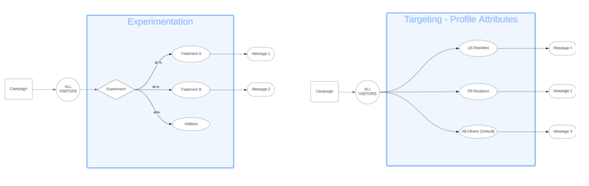
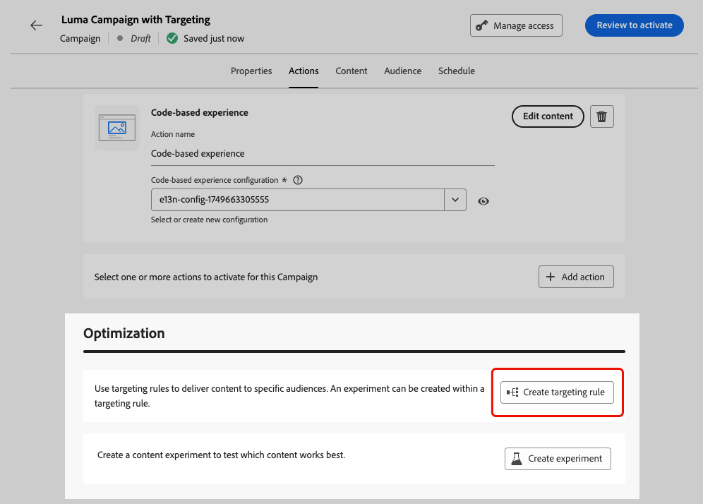
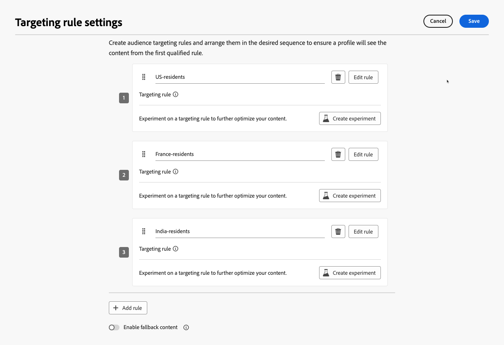
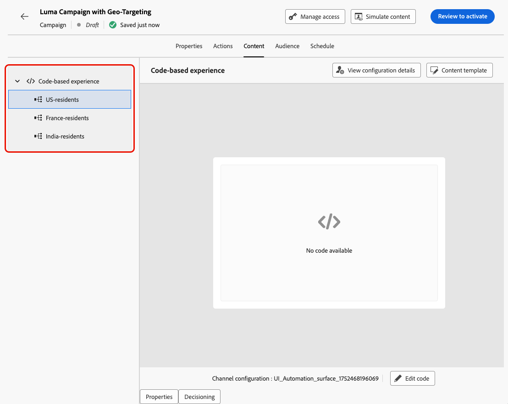
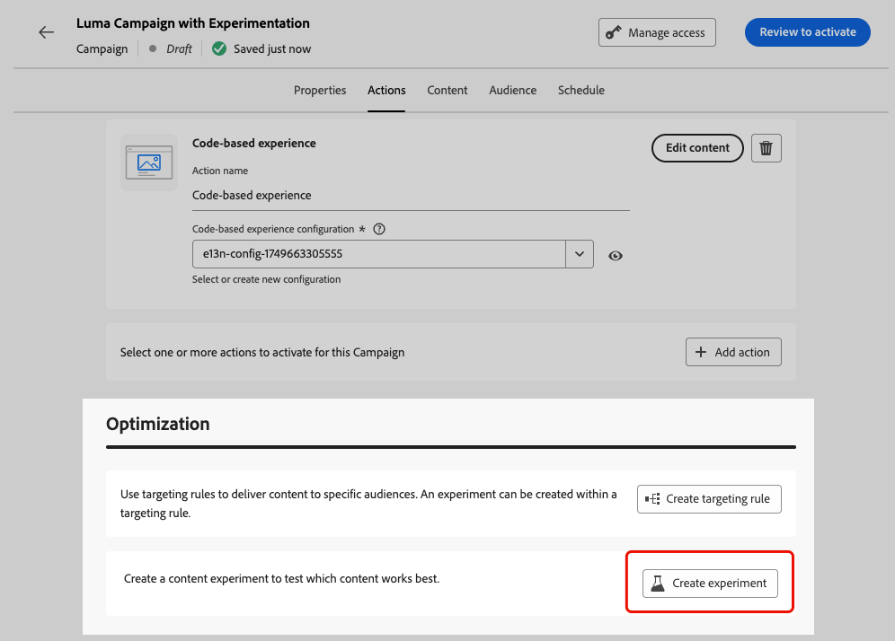
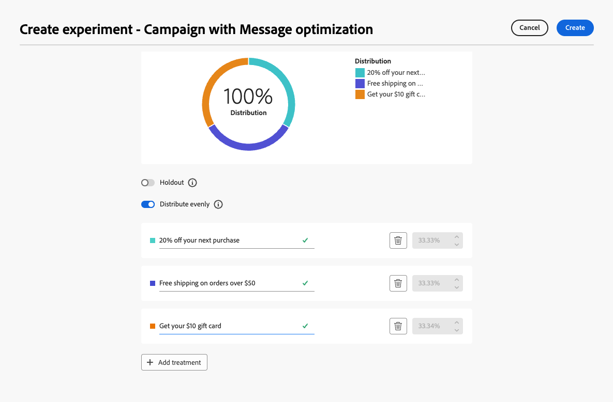
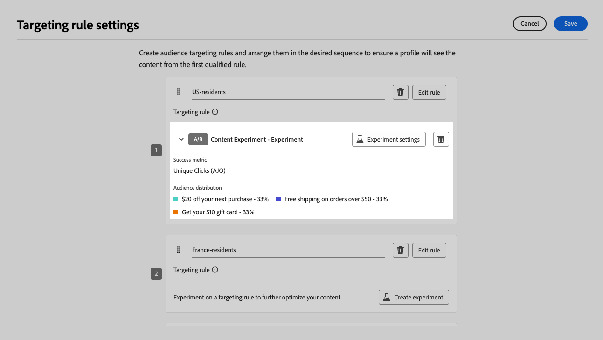
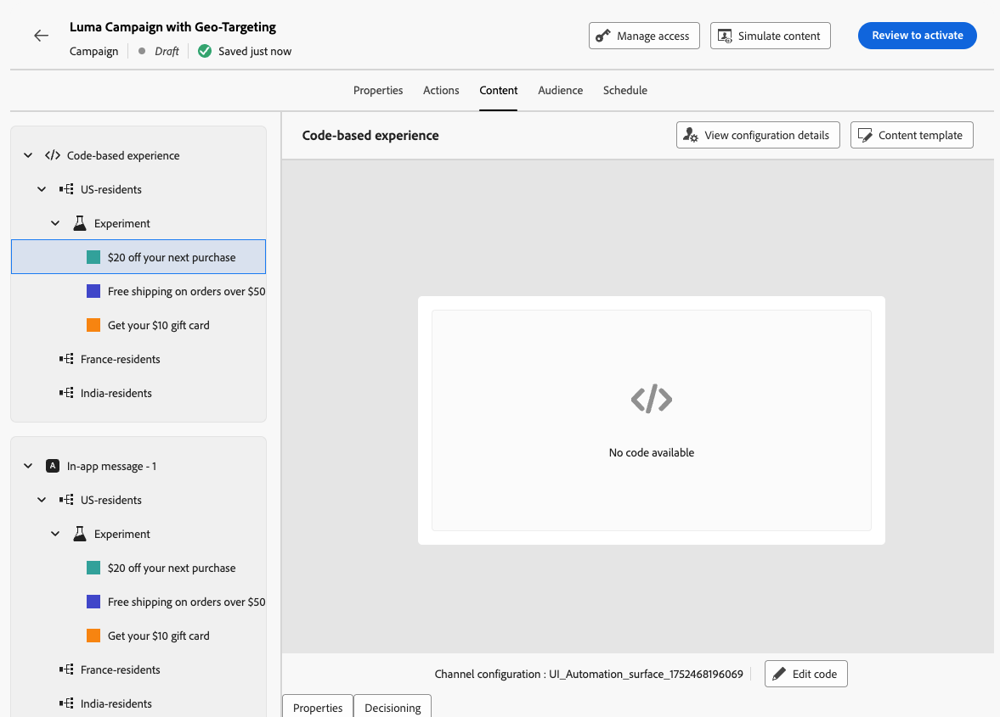

# Optimization in campaigns {#message-optimization}

Optimization empowers you with the tools to deliver personalized and optimized content to your campaigns' audience, <!--based on marketer-defined advanced decision configurations. This ensures that the right message reaches the right audience at the right time in order to maximize the effectiveness of your campaigns. (Removed for now as Decisioning is not yet supported)-->ensuring maximum engagement and success to create highly <!--customized and -->effective campaigns.

With Optimization, you can:

* Leverage [targeting](#targeting) rules
* Run [content experiments](#experimentation)
* Use [advanced combinations](#combination) of both experimentation and targeting within a single campaign

Once the campaign is live, profiles are evaluated against the defined criteria, and based on matching criteria, they are delivered with the appropriate experience or content from the campaign.

The difference between experiments and targeting can be outlined as follows:

* Experimentation consists in a random split in delivering content based on traffic allocation​.
* Targeting uses deterministic techniques to deliver content based on user profile, audience membership, or context-based rules.

{width="110%" zoomable="yes"}
 
## Leverage targeting {#targeting}

Targeting delivers personalized content to specific audience segments based on user profile attributes or contextual attributes.

Unlike experimentation, which is a random assignment of a message's content, targeting is deterministic in terms of delivering the content to the right audience.

With targeting, specific rules can be defined based on:

* **User profile attributes** such as location (eg. geo-targeting), age, or preferences. For example, users in the US see a "Golden Gate" promotion, while users in France see an "Eiffel Tower" promotion.

* **Contextual data** such as device type (eg. device-targeting), time of day, or session details. For example, desktop users receive desktop-optimized content, while mobile users receive mobile-optimized content.

* **Audiences** which can be used to include or exclude profiles that have a particular audience membership.

To set up targeting in a campaign, follow the steps below.

1. Create a campaign. [Learn more](../campaigns/create-campaign.md) <!--Add link to API triggered?-->

1. From the **[!UICONTROL Actions]** tab, select at least one action.

1. In the **[!UICONTROL Message Optimization]** section, select **[!UICONTROL Targeting]**.

    {width=85%}

1. Use the rule builder to define your criteria. For example, define a rule for US residents, a rule for France residents, and a rule for India residents.

    {width=85%}

1. Select the **[!UICONTROL Enable fallback content]** as needed. Fallback content allows your audience to receive a default content when no targeting rules is qualified. If you do not select this option, any audience that doesn't qualify for a targeting rule defined above will not receive content.

1. Save your targeting rule settings.

1. Back in the campaign **[!UICONTROL Actions]** tab, select **[!UICONTROL Edit content]**.

1. Design appropriate content for each group defined by your targeting rule settings.

    {width=85%}

    In this example, design a specific content for US residents, a different content for French residents and another content for India residents.

1. [Activate](review-activate-campaign.md) your campaign.

Once the campaign is live, content tailored for each targeted is sent so that US residents get a specific message, France residents a different message and so on.

<!--Default content:

* If no targeting rules match, default content can be delivered.

* If default content is not enabled, passthrough behavior ensures lower-priority campaigns are evaluated.-->

## Use experimentation {#experimentation}

Experimentation allows you to test multiple versions of content to determine which performs best based on predefined success metrics.

To set up experimentation in a campaign, follow the steps below.

Let's say you want to test the following promotional messages in a campaign:

* **Treatment A**: "20% off your next purchase"
* **Treatment B**: "Free shipping on orders over $50"
* **Treatment C**: "Get your $10 gift card"

To set up experimentation and determine which message drives the most purchases, follow the steps below.

1. Create a campaign. [Learn more](../campaigns/create-campaign.md) <!--Add link to API triggered?-->

1. From the **[!UICONTROL Actions]** tab, select at least two inbound actions, for example [code-based experience](../code-based/get-started-code-based.md) and [In-app](../in-app/get-started-in-app.md).

1. In the **[!UICONTROL Message Optimization]** section, select **[!UICONTROL Experimentation]**.

    {width=85%}

1. Design and configure your content experiment as wanted. [Learn how](../content-management/content-experiment.md)

    {width=85%}

    Once the experiment is defined, it applies to all the actions inserted in that campaign, meaning that the same customers see the same offers across all surfaces.

    >[!NOTE]
    >
    >You can select other actions: the experimentation applies to all actions added to the campaign.

1. [Activate](review-activate-campaign.md) your campaign.

Once the campaign is live, users are randomly assigned the different content variations. [!DNL Journey Optimizer] tracks which variation drives more purchases and provides actionable insights.

Follow the success of your campaign with the [Experimentation campaign report](../reports/campaign-global-report-cja-experimentation.md).
 
## Combine targeting and experimentation {#combination}

Journey Optimizer also allows you to combine targeting and experiments within a single campaign to create more sophisticated strategies.

Indeed, you can use targeting to create several variants, and for each variant, use experimentatation to further optimize each content. This ensures that experiments are specific to each targeting rule and do not span across variants within the campaign.

For example, you can test a '50% off promotion' versus a '$50 gift card' for customers in the USA, and run a different test for customers in Europe, such as 'free shipping on orders over &euro;50' versus '20% off their next purchase'.

To combine both targeting and experiments in a campaign follow the steps below.

1. Create a campaign where you define several targeting rules. [Learn how](#targeting)

    {width=85%}

1. Create an experiment for the first targeting rule.

1. Design and configure your content experiment as wanted. [Learn how](../content-management/content-experiment.md)

    {width=85%}

    Once the experimentation is defined, it applies only to the first targeting rule.

1. Back in the campaign **[!UICONTROL Actions]** tab, select **[!UICONTROL Edit content]**.

1. For the group defined by your first targeting rule, you can define a specific content for each variant of your experiment.

    If you added more than one inbound action to your campaign, the same combination of targeting and experiment applies to each action. However, you need to define a specific content for each variant of each action.

    {width=85%}

1. Proceed similarly for the other targeting rules, and design the corresponding content for each variant.

1. Save your changes and [activate](review-activate-campaign.md) your campaign.

Once the campaign is live, users from each targeted group are randomly assigned the different content variations defined for the group they belong to.

<!--
## Reporting on Message optimization

E.g. explaining how a marketer can look at the report to determine which treatment (e.g. which message content) is performing the best for the targeting audience
-->

