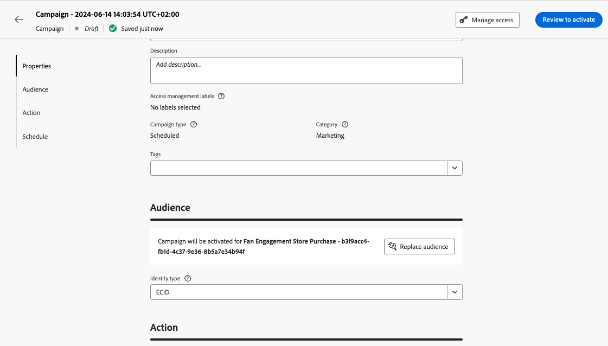

# Create a campaign {#create-campaign}

To create a new campaign, browse to the **[!UICONTROL Campaigns]** menu on the left rail, then click **[!UICONTROL Create campaign]**. You can also duplicate an existing live campaign to create a new one. [Learn how](modify-stop-campaign.md#duplicate).

Before starting, read out the campaign prerequisites in [this page](get-started-with-campaigns.md#before-starting-campaign-prerequisites).

## Select the campaign type {#campaigntype}

>[!CONTEXTUALHELP]
>id="ajo_campaigns_campaign_type"
>title="Campaign type"
>abstract="**Scheduled campaigns** are executed immediately or on a specified date and are meant to send send marketing type messages. **API-triggered** campaigns are executed using an API call. They are aimed at sending either marketing messages (promotional messages which require user consent) or transactional messages (non-commercial messages, that can also be sent to unsubscribed profiles in specific contexts)."

When you create a new campaign, you must first select the type of campaign. Three types of campaigns are available:

1.  **[!UICONTROL Scheduled - Marketing]** - These campaigns are executed immediately or on a specified date. Scheduled campaigns are aimed at sending **marketing** messages, or create inbound actions. They are configured and executed from the user interface.

1.  **[!UICONTROL API-triggered - Marketing]** -  These campaigns are executed using an API call. Select this type of campaign to send personalized marketing communications to targeted audiences.  [Learn how to trigger a campaign using APIs](api-triggered-campaigns.md)

1. **[!UICONTROL API-triggered - Transactional]** - Same as for API-triggered - Marketing campaigns, these campaigns are executed using an API call. API-triggered transactional campaigns are aimed at sending **transactional** messages, i.e. messages sent out following an action performed by an individual: password reset request, cart purchase, etc.  [Learn how to trigger a campaign using APIs](api-triggered-campaigns.md)

    

## Define the campaign properties {#create}

Once the campaign is created, you must define its properties. Follow the steps below:

1. In the **[!UICONTROL Properties]** section, enter the name and a description for your campaign.

    <!--To test the content of your message, toggle the **[!UICONTROL Content experiment]** option on. This allows you to test multiple variables of a delivery on populations samples, in order to define which treatment has the biggest impact on the targeted population.[Learn more about content experiment](../content-management/content-experiment.md).-->

1. (optional) Use the **Tags** field to assign Adobe Experience Platform Unified Tags to your campaign. This allows you to easily classify them and improve search from the campaigns list. [Learn how to work with tags](../start/search-filter-categorize.md#tags).

1. (optional) You can limit the access to this campaign based on access labels. To add an access limitation, browse to the **[!UICONTROL Manage access]** button at the top of this page. Make sure to select only labels you have permission for. [Learn more on Object Level Access Control](../administration/object-based-access.md).
    
## Define the campaign audience {#audience}

Now you can select the audience of your campaign. An audience is a set of people who share similar behaviors and/or characteristics. 

>[!IMPORTANT]
>
>* The use of audiences and attributes from [audience composition](../audience/get-started-audience-orchestration.md) is currently unavailable for use with Healthcare Shield or Privacy and Security Shield.
>
>* For API-triggered campaigns, the audience must be set via API call.

To define the population targeted by a scheduled marketing campaign, follow these steps:
    
1. In the **Audience** section, click the **[!UICONTROL Select audience]** button to display the list of available Adobe Experience Platform audiences. Learn more more about audiences in [this section](../audience/about-audiences.md).

1. In the **[!UICONTROL Identity type]** field, choose the type of key to use to identify the individuals from the selected audience. You can either an existing identity type or create a new one using the Adobe Experience Platform Identity Service. Standard Identity namespaces are listed in [this page](https://experienceleague.adobe.com/en/docs/experience-platform/identity/features/namespaces#standard){target="_blank"}. 

    Only one identity type is allowed per campaign. Individuals belonging to a segment that does not have the selected identity type among their different identities cannot be targeted by the campaign. 

    

     Learn more about identity types and namespaces in the [Adobe Experience Platform documentation](https://experienceleague.adobe.com/docs/experience-platform/identity/home.html){target="_blank"}. 
     
     <!--If you are are creating an API-triggered campaign, the **[!UICONTROL cURL request]** section allows you to retrieve the **[!UICONTROL Campaign ID]** to use in the API call. [Learn more](api-triggered-campaigns.md)-->

## Select the channel {#channel}

You can now select the channel and its configuration. Follow the steps below:

1. In the **[!UICONTROL Action]** section, select the communication channel. 

    The list of available channels depends on your licensing model, and add-ons. For API-triggered campaigns, only Email, SMS, and Push notification channels are available.

1. Select the channel configuration.

    A configuration is defined by a [System Administrator](../start/path/administrator.md). It contains all the technical parameters for sending the message, such as header parameters, subdomain, mobile apps, etc. [Learn more](../configuration/channel-surfaces.md).

    Only channel configurations compatible with the marketing campaign type are listed in the drop-down list.

    

    >[!NOTE]
    >
    >If you are creating a push notification campaign, you can enable the **[!UICONTROL Rapid delivery mode]**, which is a Journey Optimizer add-on that allows very fast push message sending in large volumes. [Learn more](../push/create-push.md#rapid-delivery)

## Edit the content {#content}

You can now define the content of the message, from the **[!UICONTROL Edit content]** button. The content creation process depends on the channel you selected.

Learn detailed steps to create your message content in the following pages:

<table style="table-layout:fixed"><tr style="border: 0;">
<td>

<a href="../email/create-email.md"><strong>Email</strong></a>
</td>
<td>

<a href="../sms/create-sms.md"><strong>SMS</strong></a>
</td>
<td>

<a href="../push/create-push.md"><strong>Push notification</strong></a>
</td>
<td>

<a href="../direct-mail/create-direct-mail.md"><strong>Direct mail</strong></a>
</td>
</tr></table>

<table style="table-layout:fixed"><tr style="border: 0;">
<td>

<a href="../in-app/create-in-app.md"><strong>In-app</strong></a>
</td>
<td>

<a href="../web/create-web.md"><strong>Web</strong></a>
</td>
<td>

<a href="../code-based/create-code-based.md"><strong>Code-based experience</strong></a>
</td>
<td>

<a href="../content-card/create-content-card.md"><strong>Content cards</strong></a>
</td>
</tr></table>

Once your content is defined, use the **[!UICONTROL Simulate content]** button to preview and test your content with test profiles. [Learn more](../content-management/preview-test.md). To browse back to the campaign creation screen, click the left arrow.

In addition to the message content itself, you can configure the following settings:

1. (optional) In the **[!UICONTROL Content experiment]** section, you can use the **[!UICONTROL Create experiment]** button to test out which content works better. Content experimentation capabilities are detailed in [this section](../content-management/content-experiment.md).

1. In the **[!UICONTROL Actions tracking]** section, specify if you want to track how your recipients react to your delivery: you can track clicks and/or opens.
        
    Tracking results are accessible from the campaign report once the campaign has been executed. [Learn more on campaign reports](../reports/campaign-global-report-cja.md)

## Schedule the campaign {#schedule}

>[!CONTEXTUALHELP]
>id="ajo_campaigns_schedule"
>title="Campaign schedule"
>abstract="By default, campaigns start upon manual activation and end immediately after the message is sent once. You have the flexibility to set a specific date and time for the message to be sent. Furthermore, you can specify an end date for recurring or API-triggered campaigns. In the Action triggers, you can also configure the message sending frequency to suit your preferences."

>[!CONTEXTUALHELP]
>id="ajo_campaigns_schedule_start"
>title="Campaign start"
>abstract="Specify a date and time at which the message should be sent."

>[!CONTEXTUALHELP]
>id="ajo_campaigns_schedule_end"
>title="Campaign end"
>abstract="Specify when a recurring campaign should stop being executed."

>[!CONTEXTUALHELP]
>id="ajo_campaigns_schedule_triggers"
>title="Campaign action triggers"
>abstract="Define a frequency at which the campaign's message should be sent."

By default, scheduled campaigns start once they are activated manually, and end as soon as the message has been sent once.

If you do not want to execute your campaign right after its activation, you can specify a date and time at which the message should be sent using the **[!UICONTROL Campaign start]** option. The **[!UICONTROL Campaign end]** option allows you to specify when a campaign should stop being executed.

For Email, SMS, and Push notification campaigns, you can define a frequency at which the campaign's message should be sent. To do this, use the **[!UICONTROL Action triggers]** options in the campaign creation screen to specify if the campaign should be executed daily, weekly, or monthly.

## Other settings {#settings}

Some settings are specific to the communication channel seleted for the campaign, or used for specific use cases. They are detailed below.

* For emails, you can create specific IP warmup plan activation campaigns. Learn more in [this section](../configuration/ip-warmup-campaign.md).
* For web, in-app, and code-based channel, you can assign a priority score to your campaign. Learn more in [this section](../conflict-prioritization/priority-scores.md).
* For content card campaigns, you can enable additional delivery rules to choose the event(s) and criteria which trigger your message. Learn more in [this section](../content-card/create-content-card.md).
* For in-app messages, you can use the **[!UICONTROL Edit triggers]** button to choose the event(s) and criteria which trigger your message. Learn more in [this section](../in-app/create-in-app.md).

## Next steps {#next}

Once your campaign configuration and content are ready, you can review and activate it. [Learn more](review-activate-campaign.md)
