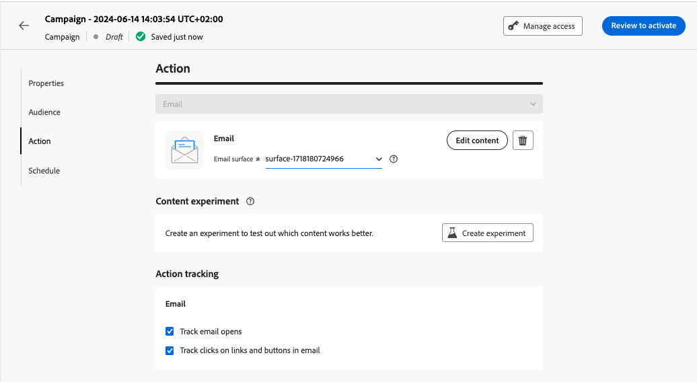
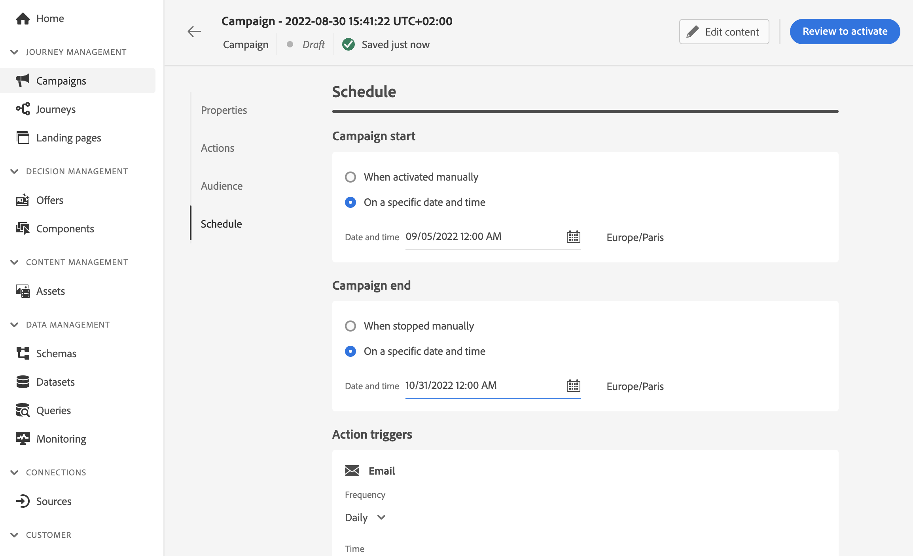

# Create a campaign {#create-campaign}

To create a new campaign, access the **[!UICONTROL Campaigns]** menu, then click **[!UICONTROL Create campaign]**. You can also duplicate an existing live campaign to create a new one. [Learn more](modify-stop-campaign.md#duplicate)

>[!NOTE]
>
>Before creating a new campaign, make sure you have a channel configuration (i.e. message surface) and an Adobe Experience Platform audience ready for use. Learn more in these sections:
>
>* [Create channel configurations](../configuration/channel-surfaces.md) 
>* [Get started with audiences](../audience/about-audiences.md)

## Select the campaign type {#campaigntype}

>[!CONTEXTUALHELP]
>id="ajo_campaigns_campaign_type"
>title="Campaign type"
>abstract="**Scheduled campaigns** are executed immediately or on a specified date and are meant to send send marketing type messages. **API-triggered** campaigns are executed using an API call. They are aimed at sending either marketing messages (promotional messages which require user consent) or transactional messages (non-commercial messages, that can also be sent to unsubscribed profiles in specific contexts)."

1. Select the type of campaign that you want to execute

    * **[!UICONTROL Scheduled - Marketing]**: execute the campaign immediately or on a specified date. Scheduled campaigns are aimed at sending **marketing** messages. They are configured and executed from the user interface.

    * **[!UICONTROL API-triggered - Marketing/Transactional]**: execute the campaign using an API call. API-triggered campaigns are aimed at sending either **marketing**, or **transactional** messages, i.e. messages sent out following an action performed by an individual: password reset, cart purchase etc. [Learn how to trigger a campaign using APIs](api-triggered-campaigns.md)

    

1. Click **[!UICONTROL Create]** to create the campaign.

## Define the campaign properties {#create}

1. In the **[!UICONTROL Properties]** section, enter the name and a description for your campaign.

    <!--To test the content of your message, toggle the **[!UICONTROL Content experiment]** option on. This allows you to test multiple variables of a delivery on populations samples, in order to define which treatment has the biggest impact on the targeted population.[Learn more about content experiment](../content-management/content-experiment.md).-->

1. Use the **Tags** field to assign Adobe Experience Platform Unified Tags to your campaign. This allows you to easily classify them and improve search from the campaigns list. [Learn how to work with tags](../start/search-filter-categorize.md#tags).

1. You can limit the access to this campaign based on access labels. To add an access limitation, browse to the **[!UICONTROL Manage access]** button at the top of this page. Make sure to select only labels you have permission for. [Learn more on Object Level Access Control](../administration/object-based-access.md).
    
## Define the campaign audience {#audience}

An audience is a set of people who share similar behaviors and/or characteristics. To define the population targeted by the campaign, follow these steps:
    
1. In the **Audience** section, click the **[!UICONTROL Select audience]** button to display the list of available Adobe Experience Platform audiences. Learn more more about audiences in [this section](../audience/about-audiences.md).

1. In the **[!UICONTROL Identity type]** field, choose the type of key to use to identify the individuals from the selected audience. You can either an existing identity type or create a new one using the Adobe Experience Platform Identity Service. Standard Identity namespaces are listed in [this page](https://experienceleague.adobe.com/en/docs/experience-platform/identity/features/namespaces#standard){target="_blank"}. 

    Only one identity type is allowed per campaign. Individuals belonging to a segment that does not have the selected identity type among their different identities cannot be targeted by the campaign. 

    

     Learn more about identity types and namespaces in the [Adobe Experience Platform documentation](https://experienceleague.adobe.com/docs/experience-platform/identity/home.html){target="_blank"}. 
     
     <!--If you are are creating an API-triggered campaign, the **[!UICONTROL cURL request]** section allows you to retrieve the **[!UICONTROL Campaign ID]** to use in the API call. [Learn more](api-triggered-campaigns.md)-->

>[!IMPORTANT]
>
>* The use of audiences and attributes from [audience composition](../audience/get-started-audience-orchestration.md) is currently unavailable for use with Healthcare Shield or Privacy and Security Shield.
>
>* For API-triggered campaigns, the audience needs to be set via API call.

## Create the message and configure tracking {#content}

1. In the **[!UICONTROL Actions]** section, select the channel. 

    The list of available channels depends on your licensing model. For API-triggered transactional campaigns, only Email, SMS, and Push notification channels are available.

1. Select the channel configuration.

    A configuration is defined by a [System Administrator](../start/path/administrator.md). It contains all the technical parameters for sending the message, such as header parameters, subdomain, mobile apps, etc. [Learn more](../configuration/channel-surfaces.md).

    Only channel configurations compatible with the marketing campaign type are listed in the drop-down list.

    

    >[!NOTE]
    >
    >If you are creating a push notification campaign, you can enable the **[!UICONTROL Rapid delivery mode]**, which is a Journey Optimizer add-on that allows very fast push message sending in large volumes. [Learn more](../push/create-push.md#rapid-delivery)

1. Click the **[!UICONTROL Edit content]** button to create and design your message. Learn detailed steps to create your message content in the following pages:

    <table style="table-layout:fixed">
    <tr style="border: 0;">
    <td>
    
    
<a href="../email/create-email.md"><strong>Create emails</strong>
    

    

    </td>
    <td>
    
    

    <a href="../push/create-push.md"><strong>Create push notifications</strong></a>
    

    

    </td>
    <td>
    
    

    <a href="../sms/create-sms.md"><strong>Create SMS messages</strong></a>
    

    

    </td>
    </tr>
    </table>

    Once your content is defined, use the **[!UICONTROL Simulate content]** button to preview and test your content with test profiles. [Learn more](../content-management/preview-test.md). To browse back to the campaign creation screen, click the left arrow.

    

1. In the **[!UICONTROL Content experiment]** section, you can use the **[!UICONTROL Create experiment]** button to test out which content works better. Content experimentation capabilities are detailed in [this section](../content-management/content-experiment.md).

1. In the **[!UICONTROL Actions tracking]** section, specify if you want to track how your recipients react to your delivery: you can track clicks and/or opens.
        
    Tracking results will be accessible from the campaign report once the campaign has been executed. [Learn more on campaign reports](../reports/campaign-global-report-cja.md)

## Schedule the campaign {#schedule}

>[!CONTEXTUALHELP]
>id="ajo_campaigns_schedule"
>title="Campaign schedule"
>abstract="By default, campaigns start upon manual activation and end immediately after the message is sent once. You have the flexibility to set a specific date and time for the message to be sent. Furthermore, you can specify an end date for recurring or API-triggered campaigns. In the Action triggers, you can also configure the message sending frequency to suit your preferences."

>[!CONTEXTUALHELP]
>id="ajo_campaigns_schedule_start"
>title="Campaign start"
>abstract="Specify a date and time at which the message should be sent."

>[!CONTEXTUALHELP]
>id="ajo_campaigns_schedule_end"
>title="Campaign end"
>abstract="Specify when a recurring campaign should stop being executed."

>[!CONTEXTUALHELP]
>id="ajo_campaigns_schedule_triggers"
>title="Campaign action triggers"
>abstract="Define a frequency at which the campaign's message should be sent."

By default, campaigns start once they have been activated manually, and end as soon as the message has been sent once.

You can define a frequency at which the campaign's message should be sent. To do this, use the **[!UICONTROL Action triggers]** options in the campaign creation screen to specify if the campaign should be executed daily, weekly, or monthly.

If you do not want to execute your campaign right after its activation, you can specify a date and time at which the message should be sent using the **[!UICONTROL Campaign start]** option. The **[!UICONTROL Campaign end]** option allows you to specify when a recurring campaign should stop being executed.

Once your campaign is ready, you can review and activate it. [Learn more](review-activate-campaign.md)
