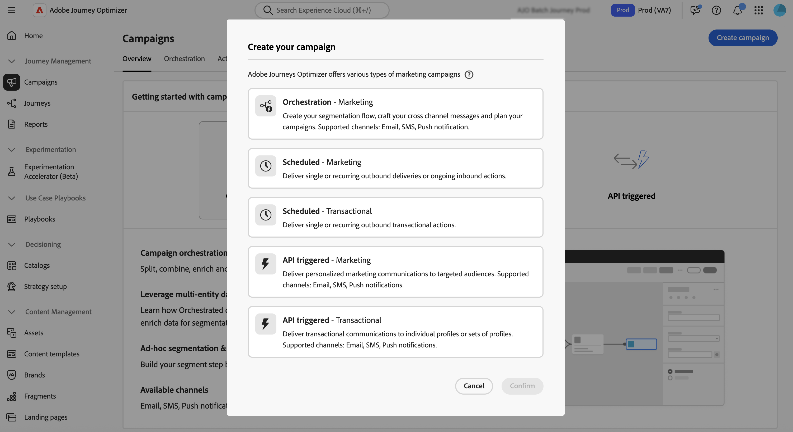

# Get started with campaigns {#get-started-campaigns}

>[!CONTEXTUALHELP]
>id="ajo_campaigns_schedule"
>title="Campaign schedule"
>abstract="By default, campaigns start upon manual activation and end immediately after the message is sent once. You have the flexibility to set a specific date and time for the message to be sent. Furthermore, you can specify an end date for recurring Action campaigns. In the Action triggers, you can also configure the message sending frequency to suit your preferences."

>[!CONTEXTUALHELP]
>id="ajo_campaigns_schedule_start"
>title="Campaign start"
>abstract="Specify a date and time at which the message should be sent."

>[!CONTEXTUALHELP]
>id="ajo_campaigns_schedule_end"
>title="Campaign end"
>abstract="Specify when a recurring campaign should stop being executed."

>[!CONTEXTUALHELP]
>id="ajo_campaigns_schedule_triggers"
>title="Campaign action triggers"
>abstract="Define a frequency at which the campaign's message should be sent."

>[!CONTEXTUALHELP]
>id="ajo_campaigns_throttling"
>title="Rate control"
>abstract="Set Rate control for your campaign by specifying the desired rate limits. This feature is particularly useful for preventing overload on downstream systems, such as landing pages or customer care platforms."

>[!CONTEXTUALHELP]
>id="ajo_homepage_card3"
>title="Create campaigns"
>abstract="Use **Adobe Journey Optimizer** to deliver one-time content to a specific audience using various channels. When using journeys, actions are executed in sequence. With campaigns, actions are performed simultaneously, either immediately, or based on a specified schedule."

>[!CONTEXTUALHELP]
>id="campaigns_list"
>title="Campaigns"
>abstract="Create campaigns to deliver one-time content to a specific audience across various channels. Before creating your campaign, make sure you have a channel configuration and an Adobe Experience Platform audience ready for use."

>[!CONTEXTUALHELP]
>id="ajo_campaigns_campaign_type"
>title="Campaign type"
>abstract="Select the type of campaign. Available channels vary depending on the selected type.  **Scheduled campaigns** (Action campaigns) – Ideal for simple, one-off batch communications that you can schedule to run at a specific time. **API-triggered campaigns** – Activated through an API call, enabling automated, event-based messaging directly from external systems. **Orchestrated campaigns** – Provide a visual, drag-and-drop canvas to design and automate complex, multi-step marketing workflows, from audience segmentation to personalized message delivery across channels."

>[!CONTEXTUALHELP]
>id="ajo_campaigns_create_orchestration"
>title="Campaigns"
>abstract="Create your segmentation flow, craft your cross channel messages and plan your campaigns. Supported channels: Email, SMS, Push notification."

>[!CONTEXTUALHELP]
>id="ajo_campaigns_create_scheduled_marketing"
>title="Campaigns"
>abstract="Deliver single or recurring outbound deliveries or ongoing inbound actions."

>[!CONTEXTUALHELP]
>id="ajo_campaigns_create_scheduled_transactional"
>title="Campaigns"
>abstract="Deliver single or recurring outbound transactional actions."

>[!CONTEXTUALHELP]
>id="ajo_campaigns_create_api_marketing"
>title="Campaigns"
>abstract="Deliver personalized marketing communications to targeted audiences. Supported channels: Email, SMS, Push notifications."

>[!CONTEXTUALHELP]
>id="ajo_campaigns_create_api_transactional"
>title="Campaigns"
>abstract="Deliver transactional communications to individual profiles or sets of profiles. Supported channels: Email, SMS, Push notifications."

Use [!DNL Journey Optimizer] campaigns to deliver one-time content to a specific audience across multiple channels. Unlike journeys, which execute actions step by step, campaigns perform actions simultaneously — either immediately or on a defined schedule.

## Campaign types

[!DNL Journey Optimizer] supports three campaign types. Each type fits different use cases and supports different channels.  

>[!BEGINTABS]

>[!TAB Orchestrated campaigns]

**Orchestrated campaigns** power sophisticated, brand-initiated marketing campaigns across channels, helping you drive engagement, revenue, and customer loyalty at scale.

While cross-channel marketing is essential, Orchestrated campaigns make it seamless. With a visual, drag-and-drop interface, you can design and automate complex marketing workflows, from segmentation to message delivery, across multiple channels. Everything happens in one intuitive environment, built for speed, control, and efficiency.
    
➡️ [Learn how to work with Orchestrated campaigns](../orchestrated/gs-orchestrated-campaigns.md).

>[!TAB Action campaigns (or Scheduled campaigns)]

**Action campaigns**, also known as Scheduled campaigns, allow for simple ad-hoc batch communications.

* **Scheduled - Marketing** - For marketing use cases such as promotional offers, engagement campaigns, announcements, legal notices, or policy updates. Requires recipients to be opted in.
* **Scheduled - Transactional** - Unlike Marketing campaigns, Transactional campaigns do not require recipients to be opted in. Use this category for communications related to disruptions, emergencies, cancellations. Supported channels: email, SMS, push notification.

➡️ [Learn how to work with action campaigns](create-campaign.md)

>[!TAB API triggered campaigns]

**API-triggered campaigns** allow you to trigger the execution of the campaign using an API call. These communications can be sent where the need may involve personalization by not just a password reseting profile attribute but also the real-time context data in the trigger which is a REST API payload.

* **API triggered - Marketing** - Send personalized marketing communications to targeted audiences.
* **API triggered - Transactional** - Send messages following an action performed by an individual such as password reset request, cart purchase, etc.

➡️ [Learn how to work with API-triggered campaigns](api-triggered-campaigns.md)

>[!ENDTABS]

## Supported channels by campaign type {#channels}

The table below shows the availability of each channel across different campaign types, indicating where they are supported.

| Channel              | Action (Marketing) | Action (Transactional) | API-triggered (Marketing) | API-triggered (Transactional) | Orchestrated |
|----------------------|---------------------|-------------------------|----------------------------|--------------------------------|--------------|
| Email                | ✅ | ✅ | ✅ | ✅ | ✅ |
| SMS                  | ✅ | ✅ | ✅ | ✅ | ✅ |
| Push notification    | ✅ | ✅ | ✅ | ✅ | ✅ |
| In-app               | ✅ | — | — | — | — |
| Direct mail          | ✅ | — | — | — | — |
| Web                  | ✅ | — | — | — | — |
| Code-based exp.      | ✅ | — | — | — | — |
| Content cards        | ✅ | — | — | — | — |
| WhatsApp             | ✅ | — | — | — | — |
| Line                 | ✅ | — | — | — | — |

## Prerequisites {#prerequisites}

Before working with campaigns, make sure you have reviewed the prerequisites below. 

* **Audiences** Audiences need to be available before creating the campaign. [Get started with audiences](../audience/about-audiences.md).

* **Channel configurations** - To be able to select a channel, you must have the corresponding channel configuration (i.e preset) created and available. [Learn how to set up channel configurations](../configuration/channel-surfaces.md).

* **Permissions** - Campaigns are only available to users with appropriate permissions listed below. If you are unable to access campaign functionalities, please contact your administrator to request the necessary permissions. [Learn more about Journey Optimizer built-in roles](../administration/ootb-product-profiles.md)

    | Campaign type                  | Permissions                                                                 |
    |----------------------------|----------------------------------------------------------------------------|
    | **Action campaigns**       | Campaign administrator Campaign approver Campaign manager Campaign viewer |
    | **API triggered campaigns**| Campaign administrator Campaign approver Campaign manager Campaign viewer |
    | **Orchestrated campaigns** | Orchestrated Campaign Administrator Orchestrated Campaign Approver Orchestrated Campaign Manager Orchestrated Campaign Viewer |

    +++Learn how to assign campaign related role

    1. To assign a role to a user in the [!DNL Permissions] product, navigate to the **[!UICONTROL Roles]** tab and select one of the built-in campaign related **[!UICONTROL Roles]** detailed above.

    1. From the **[!UICONTROL Users]** tab, click **[!UICONTROL Add user]**.

    1. Type in your user's name or email address or select the user fom the list and click **[!UICONTROL Save]**.

        If the user was not previously created, refer to the [Add users documentation](https://experienceleague.adobe.com/en/docs/experience-platform/access-control/ui/users).

    Your user should then receive an email redirecting to your instance.

    +++

## Let's dive deeper

Now that you have an understanding of campaigns in [!DNL Journey Optimizer], it's time to dive deeper into these documentation sections to start creating your first campaigns. 

<table style="table-layout:fixed"><tr style="border: 0; text-align: center;">
<td> <a href="create-campaign.md">Action campaigns</a></td>
<td> <a href="api-triggered-campaigns.md">API triggered campaigns</a></td>
<td><a href="../orchestrated/gs-orchestrated-campaigns.md">Orchestrated campaigns</a></td>
</tr></table>
