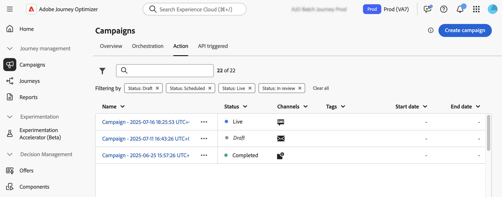
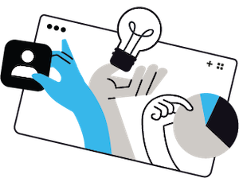

# Get started with campaigns {#get-started-campaigns}

>[!CONTEXTUALHELP]
>id="ajo_campaigns_schedule"
>title="Campaign schedule"
>abstract="By default, campaigns start upon manual activation and end immediately after the message is sent once. You have the flexibility to set a specific date and time for the message to be sent. Furthermore, you can specify an end date for recurring Action campaigns. In the Action triggers, you can also configure the message sending frequency to suit your preferences."

>[!CONTEXTUALHELP]
>id="ajo_campaigns_schedule_start"
>title="Campaign start"
>abstract="Specify a date and time at which the message should be sent."

>[!CONTEXTUALHELP]
>id="ajo_campaigns_schedule_end"
>title="Campaign end"
>abstract="Specify when a recurring campaign should stop being executed."

>[!CONTEXTUALHELP]
>id="ajo_campaigns_schedule_triggers"
>title="Campaign action triggers"
>abstract="Define a frequency at which the campaign's message should be sent."

>[!CONTEXTUALHELP]
>id="ajo_campaigns_throttling"
>title="Throttling rate control"
>abstract="Throttling rate control"

>[!CONTEXTUALHELP]
>id="ajo_homepage_card3"
>title="Create campaigns"
>abstract="Use **Adobe Journey Optimizer** to deliver one-time content to a specific audience using various channels. When using journeys, actions are executed in sequence. With campaigns, actions are performed simultaneously, either immediately, or based on a specified schedule."

>[!CONTEXTUALHELP]
>id="campaigns_list"
>title="Campaigns"
>abstract="Create campaigns to deliver one-time content to a specific audience across various channels. Before creating your campaign, make sure you have a channel configuration and an Adobe Experience Platform audience ready for use."

>[!CONTEXTUALHELP]
>id="ajo_campaigns_campaign_type"
>title="Campaign type"
>abstract="**Scheduled campaigns** are executed immediately or on a specified date and are meant to send send marketing type messages. **API-triggered** campaigns are executed using an API call. They are aimed at sending either marketing messages (promotional messages which require user consent) or transactional messages (non-commercial messages, that can also be sent to unsubscribed profiles in specific contexts)."

Use Journey Optimizer campaigns to deliver one-time content to a specific audience using various channels. When using journeys, actions are executed in sequence. With campaigns, actions are performed simultaneously, either immediately, or based on a specified schedule.

You can create different types of campaigns in Journey Optimizer:

* **Action campaigns**

    Action campaigns (or Scheduled campaigns) allow for simple ad-hoc batch communications for marketing use cases like promotional offers, engagement campaigns, announcements, legal notices, or policy updates.

* **API triggered campaigns**

    API triggered campaigns allow either for marketing communications to reach out to an audience at the right time, or for transactional/operational messages to an individual like a password reset, where the need may involve personalization by not just using profile attribute but also the real-time context data in the trigger which is a REST API payload.

* **Orchestrated campaigns**

    Campaign Orchestration in Adobe Journey Optimizer powers sophisticated, brand-initiated marketing campaigns across channels, helping you drive engagement, revenue, and customer loyalty at scale.

    While cross-channel marketing is essential, Orchestrated campaigns make it seamless. With a visual, drag-and-drop interface, you can design and automate complex marketing workflows, from segmentation to message delivery, across multiple channels. Everything happens in one intuitive environment, built for speed, control, and efficiency.

## Prerequisites {#prerequisites}

Before creating your campaign, make sure you have reviewed prerequisites below. 

### Permissions

Campaigns are only available to users with appropriate permissions listed below. [Learn more about Journey Optimizer built-in roles](../administration/ootb-product-profiles.md)

>[!BEGINTABS]

>[!TAB Action campaigns]

Campaign administrator
Campaign approver
Campaign manager
Campaign viewer

>[!TAB API triggered campaigns]

Campaign administrator
Campaign approver
Campaign manager
Campaign viewer

>[!TAB Orchestrated campaigns]

Orchestrated Campaign Administrator
Orchestrated Campaign Approver
Orchestrated Campaign Manager
Orchestrated Campaign Viewer

>[!ENDTABS]

If you are unable to access campaign functionalities, please contact your administrator to request the necessary permissions.

+++Learn how to assign campaign related role

1. To assign a role to a user in the [!DNL Permissions] product, navigate to the **[!UICONTROL Roles]** tab and select one of the built-in campaign related **[!UICONTROL Roles]** detailed above.

1. From the **[!UICONTROL Users]** tab, click **[!UICONTROL Add user]**.

1. Type in your user's name or email address or select the user fom the list and click **[!UICONTROL Save]**.

    If the user was not previously created, refer to the [Add users documentation](https://experienceleague.adobe.com/en/docs/experience-platform/access-control/ui/users).

Your user should then receive an email redirecting to your instance.

+++

### Audience

Audiences need to be available before creating the campaign. [Get started with audiences](../audience/about-audiences.md).

### Channel configuration

To be able to select a channel, you must have the corresponding channel configuration (i.e preset) created and available. [Learn how to set up channel configurations](../configuration/channel-surfaces.md).

## Let's dive deeper

Now that you have an understanding of campaigns in [!DNL Journey Optimizer], it's time to dive deeper into these documentation sections to start creating your first campaigns. 

<table style="table-layout:fixed"><tr style="border: 0; text-align: center;">
<td> <a href="create-campaign.md">Action campaigns</a></td>
<td> <a href="api-triggered-campaigns.md">API triggered campaigns</a></td>
<td><a href="../orchestrated/gs-orchestrated-campaigns.md">Orchestrated campaigns</a></td>
</tr></table>
