# Access & manage campaigns {#manage-campaigns}

Before starting with campaigns, check the following prerequisites listed [in this section](get-started-with-campaigns.md#permissions). Once these prerequisites are met, you can start creating your campaign: 

* **Access campaigns**. You can access campaigns either from the [campaign list](#access) or from the [campaign calendar](#calendar).

* **Create the campaign**. Creation steps depend on the [type of campaign](get-started-with-campaigns.md#get-started-with-campaigns) you create. Learn how to create an [action campaign](../campaigns/create-campaign.md), an [API-triggered campaign](../campaigns/api-triggered-campaigns.md), or an [orchestrated campaign](../orchestrated/create-orchestrated-campaign.md).

* **Define the campaign properties**. Learn how to set properties for an [action campaign](../campaigns/campaign-properties.md), for an [API-triggered campaign](../campaigns/api-triggered-campaign-properties.md), or an [orchestrated campaign](../orchestrated/create-orchestrated-campaign.md).

* **Define the campaign channels and content**. Learn how to define the content of an [action campaign](../campaigns/campaign-content.md), an [API-triggered campaign](../campaigns/api-triggered-campaign-content.md), or an [orchestrated campaign](../orchestrated/orchestrate-activities.md).

* **Schedule your campaign** - You can check scheduled campaigns [in the campaign calendar](#calendar).

Then start testing, improve and refine your campaign before executing it. Once your campaign is live, you can monitor it and access reports.

See all campaign statuses and alerts [in this section](#statuses).

## Access campaigns {#access}

>[!CONTEXTUALHELP]
>id="ajo_campaigns_view"
>title="Campaigns list and calendar views"
>abstract="In addition to the campaigns list, [!DNL Journey Optimizer] provides a calendar view of your campaigns, offering a clear visual representation of their schedules. You can switch between the list and calendar views at any times using these buttons."

>[!CONTEXTUALHELP]
>id="ajo_targeting_workflow_list"
>title="Orchestrated campaigns inventory"
>abstract="In this screen, you can access the full list of Orchestrated campaigns, check their current status, last/next execution dates, and create a new Orchestrated campaign."

>[!CONTEXTUALHELP]
>id="ajo_orchestration_campaign_action"
>title="Action"
>abstract="This sections lists all the actions used inside the Orchestrated campaign."

Campaigns are accessible from the **[!UICONTROL Campaigns]** menu. 

>[!BEGINTABS]

>[!TAB Action campaigns]

Select the **[!UICONTROL Action]** tab to access the list of Action campaigns.

By default, the list shows all campaigns with the **[!UICONTROL Draft]**, **[!UICONTROL Scheduled]**, and **[!UICONTROL Live]** statuses. To display stopped, completed, and archived campaigns, you need to clear the filter.

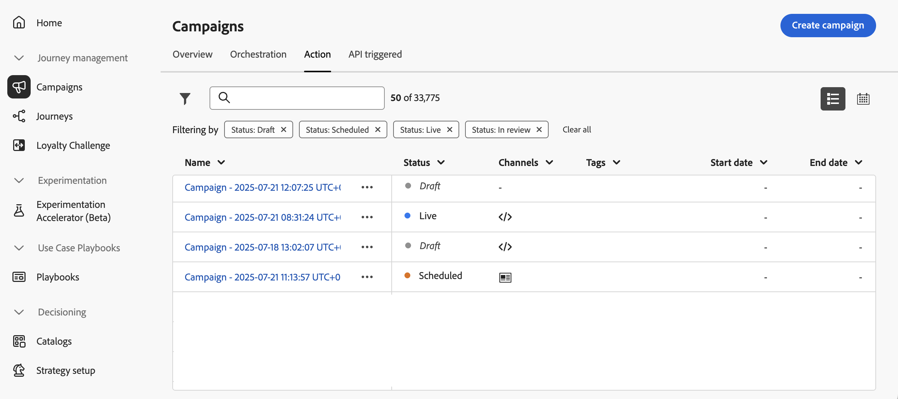

>[!TAB API triggered campaigns]

Select the **[!UICONTROL API triggered]** tab to access the list of API triggered campaigns.

By default, the list shows all campaigns with the **[!UICONTROL Draft]**, **[!UICONTROL Scheduled]**, and **[!UICONTROL Live]** statuses. To display stopped, completed, and archived campaigns, you need to clear the filter.

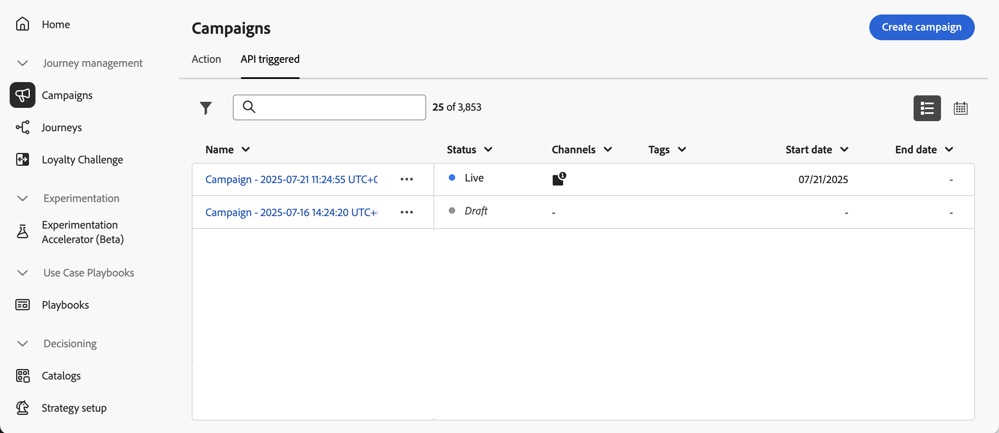

>[!TAB Orchestrated campaigns]

Select the **[!UICONTROL Orchestration]** tab to access the list of Orchestrated campaigns.

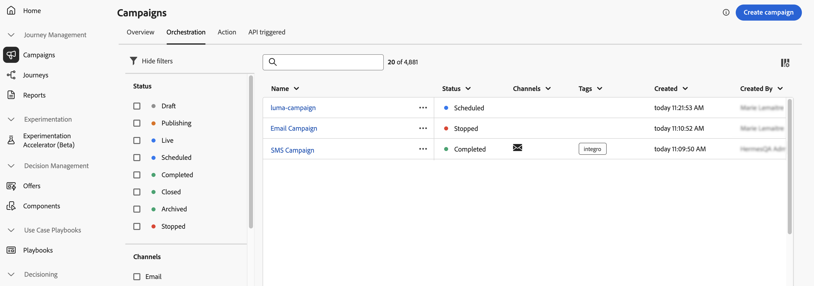{zoomable="yes"}{zoomable="yes"}

Each Orchestrated campaign in the list displays information such as the campaign's  current [status](#status), the associated channel and tags, or the last time it was modified. You can customize the displayed columns by clicking the  button.

>[!ENDTABS]

In addition, a search bar and filters are available to facilitate easy searching within the list. For example, you can filter campaigns to display only those associated to a given channel or tag, or those created during a specific date range.

The  button in the campaigns inventory allows you to perform various operations detailed below.

* **[!UICONTROL View all time report]** / **[!UICONTROL View last 24 hours report]** - Access reports to measure and visualize the impact and performances of your campaigns.
* **[!UICONTROL Edit tags]** - Edit the tags associated to the campaign.
* **[!UICONTROL Duplicate]** - In some cases, you may need to duplicate a campaign, for example to execute an Orchestrated campaign that has been stopped.
* **[!UICONTROL Delete]** - Delete the campaign. This action is available for **[!UICONTROL Draft]** campaigns only.
* **[!UICONTROL Archive]** - Archive the campaign. All archived campaigns are deleted on a rolling reschedule 30 days after their last modified date. This action is available for all campaigns except for **[!UICONTROL Draft]** campaigns.

For Action and API triggered campaigns, the additional actions below are available:

* **[!UICONTROL Add to package]** - Add the campaign to a package in order to export it to another sandbox. [Export objects to another sandbox](../configuration/copy-objects-to-sandbox.md)
* **[!UICONTROL Open draft version]** - If a new version of the campaign has been created and has not been activated yet, you can access its draft version using this action.

## Campaign lifecycle {#statuses}

In Adobe Journey Optimizer, each campaign moves through a lifecycle that is reflected by its status in the interface. The available statuses vary depending on the type of campaign—Action, API-triggered, or Orchestrated. Use the tabs below to explore the lifecycle and statuses specific to each campaign type.

>[!BEGINTABS]

>[!TAB Action campaigns]

* **[!UICONTROL Draft]**: The campaign is being edited, it has not been activated.
* **[!UICONTROL Scheduled]**: The campaign is configured to be activated on a specific start date.
* **[!UICONTROL Live]**: The campaign has been activated.
* **[!UICONTROL In review]**: The campaign has been submitted for approval in order to be published. [Learn how to work with approvals](../test-approve/gs-approval.md)
* **[!UICONTROL Stopped]**: The campaign has been stopped manually. You cannot activate or reuse it anymore. [Learn how to stop a campaign](manage-campaigns.md#stop)
* **[!UICONTROL Completed]**: The campaign is complete. This status is automatically assigned 3 days after a campaign has been activated, or at the campaign's end date if it has a recurring execution.
* **[!UICONTROL Failed]**: The campaign execution has failed. Check the logs to identify the issue.
* **[!UICONTROL Archived]**: The campaign has been archived. [Learn how to archive campaigns](manage-campaigns.md#archive)

>[!NOTE]
>
>The "Open draft version" icon next to a **[!UICONTROL Live]** or **[!UICONTROL Scheduled]** status indicates that a new version of an Action or API triggered campaign has been created and has not been activated yet.

>[!TAB API triggered campaigns]

* **[!UICONTROL Draft]**: The campaign is being edited, it has not been activated.
* **[!UICONTROL Scheduled]**: The campaign is configured to be activated on a specific start date.
* **[!UICONTROL Live]**: The campaign has been activated.
* **[!UICONTROL In review]**: The campaign has been submitted for approval in order to be published. [Learn how to work with approvals](../test-approve/gs-approval.md)
* **[!UICONTROL Stopped]**: The campaign has been stopped manually. You cannot activate or reuse it anymore. [Learn how to stop a campaign](manage-campaigns.md#stop)
* **[!UICONTROL Completed]**: The campaign is complete. This status is automatically assigned 3 days after a campaign has been activated, or at the campaign's end date if it has a recurring execution.
* **[!UICONTROL Failed]**: The campaign execution has failed. Check the logs to identify the issue.
* **[!UICONTROL Archived]**: The campaign has been archived. [Learn how to archive campaigns](manage-campaigns.md#archive)

>[!NOTE]
>
>The "Open draft version" icon next to a **[!UICONTROL Live]** or **[!UICONTROL Scheduled]** status indicates that a new version of an Action or API triggered campaign has been created and has not been activated yet.

>[!TAB Orchestrated campaigns]

* **[!UICONTROL Draft]**: The Orchestrated campaign has been created. It has not been published yet.
* **[!UICONTROL Publishing]**: The Orchestrated campaign is being published.
* **[!UICONTROL Live]**: The Orchestrated campaign has been published and is being executed.
* **[!UICONTROL Scheduled]**: The Orchestrated campaign execution has been scheduled.
* **[!UICONTROL Completed]**: The Orchestrated campaign execution is complete. The Completed status is assigned automatically up to 3 days after a campaign has completed messages sending without error.
* **[!UICONTROL Closed]**: This status displays when a recurring campaign has been closed. The campaign continues its execution until all its activities have been completed, but no more profiles can enter the campaign.
* **[!UICONTROL Archived]**: The Orchestrated campaign has been archived. All archived campaigns are deleted on a rolling reschedule 30 days after last modified date. You may duplicate an archived campaign if necessary to continue working on it.
* **[!UICONTROL Stopped]**: The Orchestrated campaign execution has been stopped. To start the campaign again, you need to duplicate it. 

>[!ENDTABS]

When an error occurs within one of your campaigns, a warning icon appears alongside the campaign's status. Click on it to display information regarding the alert. These alerts may occur in various situations, such as when the campaign message has not been published or if the chosen configuration is incorrect.

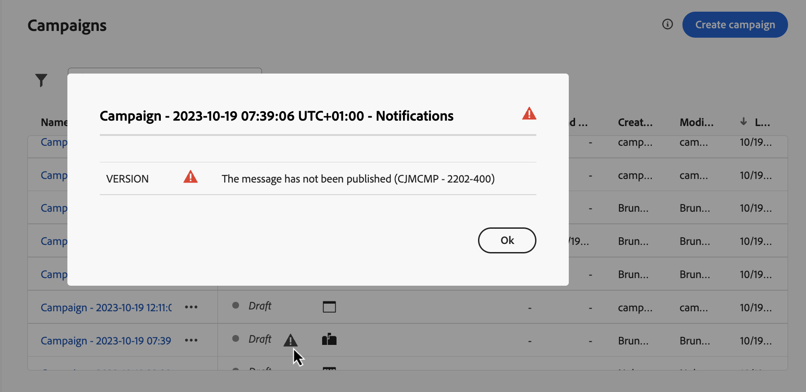

## Campaigns calendar {#calendar}

In addition to the campaigns list, [!DNL Journey Optimizer] provides a calendar view of your campaigns, offering a clear visual representation of their schedules.

How campaigns are represented:

* By default, the calendar grid shows all live and scheduled campaigns for the selected week. Additional filter options can show completed, stopped and finished activations or activations of a certain type or channel.
* Draft campaigns are not displayed.
* Campaigns spanning multiple days appear at the top of the calendar grid.
* If no start time is specified, the closest manual activation time is used to position it in the calendar.
* Campaigns are displayed as 1-hour timespans, but this does not reflect actual send or completion time.

To navigate in your Campaigns calendar:

1. Click the  icon to access your Campaigns calendar.

1. Use the arrow buttons or the date selector above the calendar to move between weeks.

    The calendar displays all campaigns scheduled for the current week. 

    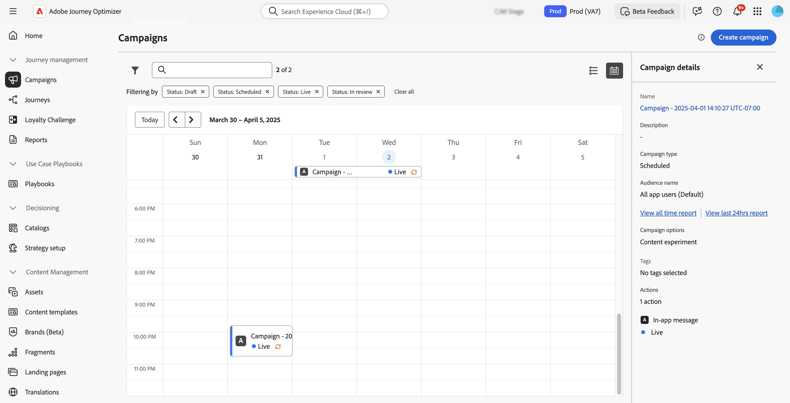

1. Click the  icon to toggle the display of items that span multiple days or weeks.

    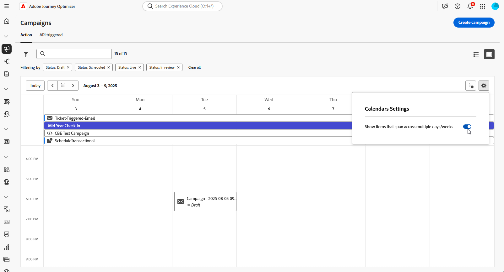

1. Click the  icon to manage and add up to three external calendars.

    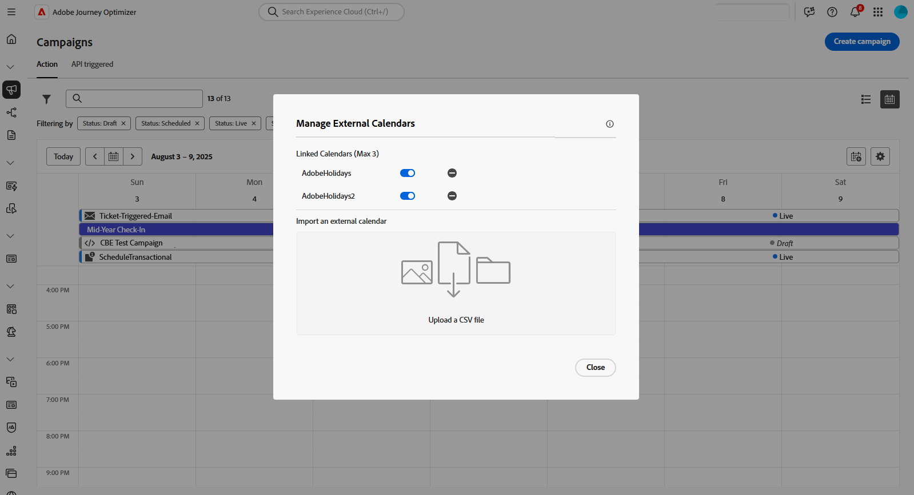

1. Drag and drop your your CSV files containing event names, start dates, and end dates.

    Uploaded events appear for all users in your organization and display on both Journey and Campaign calendars.

    +++CSV format should be as follows:

    | Column1 | Column2 | Column3 |
    |-|-|-|
    | Event name | Start date in mm/dd/yy format | End date in mm/dd/yy format |
    
    +++

1. If needed, you can hide, unhide, or remove added external calendars.

    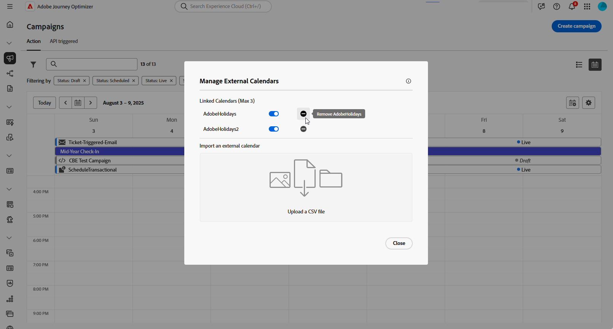

1. For more details on a campaign, click its visual block to open details on it. An information pane will open with various information on the campaign such as its type, access to the reports, or the tags that have been assigned.

    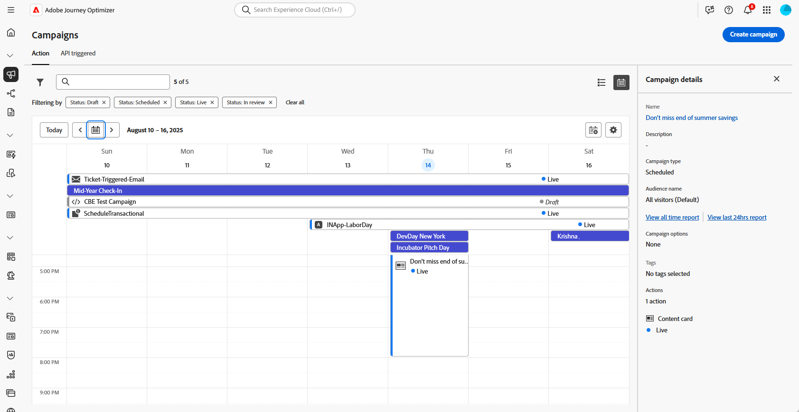

## Modify and stop recurring Action campaigns {#modify}

### Modify an Action campaign

To modify and create a new version of a recurring Action campaign, follow these steps:

1. Open the Action campaign then click the **[!UICONTROL Modify campaign]** button.

1. A new version of the campaign is created. You can check the live version by clicking **[!UICONTROL Open live version]**.

    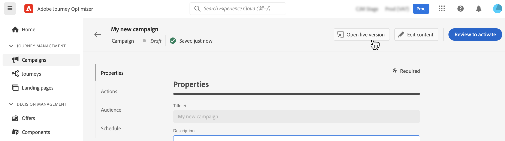

    In the campaigns list, activated campaigns with a draft version in progress display with a specific icon in the **[!UICONTROL Status]** column. Click this icon to open the draft version of the campaign.

    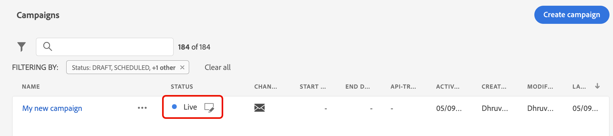

1. Once your changes are ready, you can activate the new version of the campaign (see [Review and activate a campaign](create-campaign.md#review-activate)).

    >[!IMPORTANT]
    >
    >Activating the draft will replace the live version of the campaign.

### Stop an Action campaign {#stop}

To stop a recurring campaign, open it then click the **[!UICONTROL Stop campaign]** button.

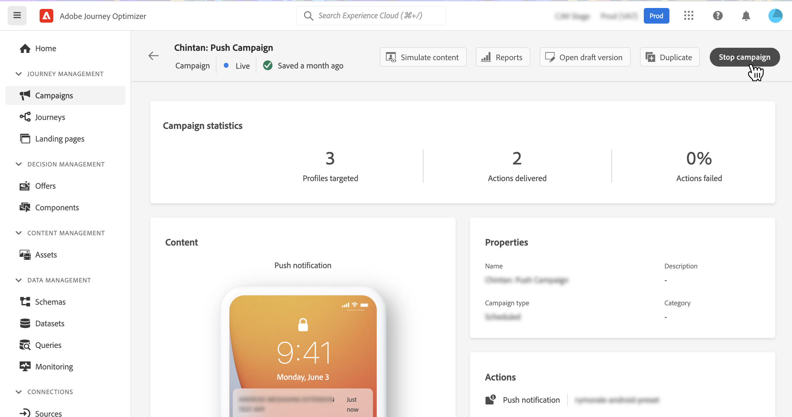

>[!IMPORTANT]
>
>Stopping a campaign will not stop an ongoing sending but it will stop a scheduled sending or the next occurrences if sending is already on going.

## Archive a campaign {#archive}

With time, the list of campaigns keeps growing and eventually makes it more difficult to browse completed and stopped campaigns.

To prevent this, you can archive completed and stopped campaigns that you do not need anymore. To do this, click the ellipsis button then select **[!UICONTROL Archive]**.

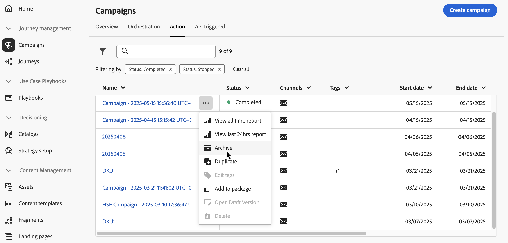

Archived campaigns can then be retrieved using the dedicated filter in the list.
