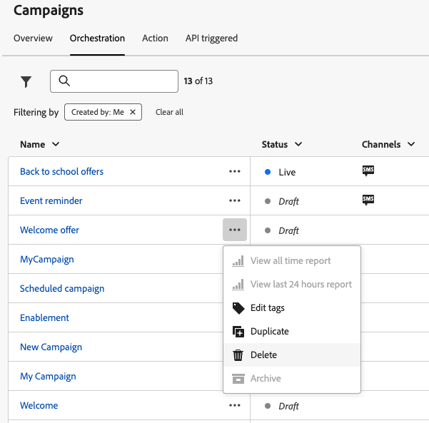

# Access & manage campaigns {#manage-campaigns}

>[!CONTEXTUALHELP]
>id="ajo_targeting_workflow_list"
>title="Orchestrated campaigns inventory"
>abstract="In this screen, you can access the full list of Orchestrated campaigns, check their current status, last/next execution dates, and create a new Orchestrated campaign."

>[!CONTEXTUALHELP]
>id="ajo_orchestration_campaign_action"
>title="Action"
>abstract="This sections lists all the actions used inside the Orchestrated campaign."

Learn how to access, organize, and manage your campaigns in Adobe Journey Optimizer. This guide covers everything from finding campaigns to understanding statuses, performing common operations, and maintaining your campaign workspace.

## Quick start: Common tasks {#quick-tasks}

Jump directly to what you need:

* **Create a new campaign** → [Choose your campaign type](get-started-with-campaigns.md#campaign-types)
  * [Create Action campaign](create-campaign.md)
  * [Create API-triggered campaign](api-triggered-campaigns.md)
  * [Create Orchestrated campaign](../orchestrated/gs-orchestrated-campaigns.md)
* **Find existing campaigns** → [Search and filter](#access)
* **View campaign performance** → [Campaign reports](../reports/campaign-global-report-cja.md)
* **Schedule campaigns** → [Use the calendar](#calendar)
* **Manage conflicts** → [Conflict management guide](../conflict-prioritization/gs-conflict-prioritization.md)

## Access and browse campaigns {#access}

Campaigns are accessible from the **[!UICONTROL Campaigns]** menu. Use the tabs to browse campaigns by type: **Action** campaigns, **API-triggered** campaigns, and **Orchestrated** campaigns. Learn more about the [types of campaigns](get-started-with-campaigns.md#campaign-types). Available types depend on your license agreement and your permissions.

>[!BEGINTABS]

>[!TAB Action campaigns]

Select the **[!UICONTROL Action]** tab to access the list of Action campaigns.

By default, the list shows all campaigns with the **[!UICONTROL Draft]**, **[!UICONTROL Scheduled]**, and **[!UICONTROL Live]** statuses. To display stopped, completed, and archived campaigns, you need to clear the filter.

>[!TAB API triggered campaigns]

Select the **[!UICONTROL API triggered]** tab to access the list of API triggered campaigns.

By default, the list shows all campaigns with the **[!UICONTROL Draft]**, **[!UICONTROL Scheduled]**, and **[!UICONTROL Live]** statuses. To display stopped, completed, and archived campaigns, you need to clear the filter.

>[!TAB Orchestrated campaigns]

Select the **[!UICONTROL Orchestration]** tab to access the list of Orchestrated campaigns.

{zoomable="yes"}

Each Orchestrated campaign in the list displays information such as the campaign's current [status](#statuses), the associated channel and tags, or the last time it was modified. You can customize the displayed columns by clicking the  button.

>[!ENDTABS]

### Search and filter campaigns {#search-filter}

In addition, a search bar and filters are available to facilitate easy searching within the list. For example, you can filter campaigns to display only those associated to a given channel or tag, or those created during a specific date range.

## Campaign operations {#operations}

The  button in the campaigns inventory allows you to perform various operations.

### Available actions

**For all campaign types:**

* **[!UICONTROL View all time report]** / **[!UICONTROL View last 24 hours report]** - Access reports to measure and visualize the impact and performances of your campaigns. [Learn more about campaign reports →](../reports/campaign-global-report-cja.md)
* **[!UICONTROL Edit tags]** - Edit the tags associated to the campaign. [Learn how to use tags →](../start/search-filter-categorize.md#add-tags)
* **[!UICONTROL Duplicate]** - Use this option to duplicate a campaign, for example to execute an Orchestrated campaign that has been stopped. [Learn more about duplicating →](#duplicate-a-campaign)
* **[!UICONTROL Delete]** - Use this option to delete a campaign. [Learn more about deleting →](#delete-a-campaign)
* **[!UICONTROL Archive]** - Archive the campaign. All archived campaigns are deleted on a rolling schedule 30 days after their last modified date. This action is available for all campaigns except for **[!UICONTROL Draft]** campaigns. [Learn more about archiving →](#archive-a-campaign)

**For Action and API triggered campaigns only:**

* **[!UICONTROL Add to package]** - Add the campaign to a package in order to export it to another sandbox. [Learn how to export objects →](../configuration/copy-objects-to-sandbox.md)
* **[!UICONTROL Open draft version]** - If a new version of the campaign has been created and has not been activated yet, you can access its draft version using this action.

## Understanding campaign status {#statuses}

Each campaign moves through a lifecycle that is reflected by its status in the interface. Understanding these statuses helps you know what actions are available and what to do next.

| Status | Action campaigns | API-triggered campaigns | Orchestrated campaigns | What it means | Next actions |
|--------|:----------------:|:-----------------------:|:----------------------:|---------------|--------------|
| **[!UICONTROL Draft]** | ✅ | ✅ | ✅ | Being edited, not activated | Continue editing or [activate campaign](review-activate-campaign.md) |
| **[!UICONTROL Scheduled]** | ✅ | ✅ | ✅ | Configured for specific start date | Wait for launch, [modify if needed](#modify), or [view in calendar](#calendar) |
| **[!UICONTROL Live]** | ✅ | ✅ | ✅ | Activated and running | [Monitor performance](../reports/campaign-global-report-cja.md), [create new version](#modify) if needed |
| **[!UICONTROL In review]** | ✅ | ✅ | — | Submitted for approval | Wait for [approval](../test-approve/gs-approval.md) or modify |
| **[!UICONTROL Stopped]** | ✅ | ✅ | ✅ | Manually stopped, cannot reactivate | [Duplicate to reuse](#duplicate-a-campaign) |
| **[!UICONTROL Completed]** | ✅ | ✅ | ✅ | Execution complete (auto-assigned 3 days after activation or at end date for recurring) | [View reports](../reports/campaign-global-report-cja.md), [archive](#archive-a-campaign), or [duplicate](#duplicate-a-campaign) |
| **[!UICONTROL Failed]** | ✅ | ✅ | — | Execution failed | Check logs, fix issues, [duplicate to retry](#duplicate-a-campaign) |
| **[!UICONTROL Archived]** | ✅ | ✅ | ✅ | Archived (auto-deleted after 30 days) | [Retrieve using filter](#access) if needed |
| **[!UICONTROL Closed]** | — | — | ✅ | Recurring campaign closed, no new entries allowed (continues until all activities complete) | Wait for completion |
| **[!UICONTROL Publishing]** | — | — | ✅ | Being published | Wait for publishing to complete |

>[!NOTE]
>
>For Action and API-triggered campaigns, the "Open draft version" icon next to a **[!UICONTROL Live]** or **[!UICONTROL Scheduled]** status indicates that a new version has been created and has not been activated yet.

### Error indicators

When an error occurs within one of your campaigns, a warning icon appears alongside the campaign's status. Click on it to display information regarding the alert. These alerts may occur in various situations, such as when the campaign message has not been published or if the chosen configuration is incorrect.

>[!NOTE]
>
>Assets/Images are accessible in delivered content for up to 2 years (730 days) since their first publication in any fragment/inline message. Re-publishing is required after this expiry period (any time after 730 days) to keep them accessible for another 2 years. Any re-publication done within 730 days of the first publication will not extend the expiry of assets/images to the next 730 days.

## Campaigns calendar {#calendar}

>[!CONTEXTUALHELP]
>id="ajo_campaigns_view"
>title="Campaigns list and calendar views"
>abstract="In addition to the campaigns list, [!DNL Journey Optimizer] provides a calendar view of your campaigns, offering a clear visual representation of their schedules. You can switch between the list and calendar views at any times using these buttons."

In addition to the campaigns list, [!DNL Journey Optimizer] provides a calendar view of your campaigns, offering a clear visual representation of their schedules.

### How the calendar works

How campaigns are represented:

* By default, the calendar grid shows all live and scheduled campaigns for the selected week. Additional filter options can show completed, stopped and finished activations or activations of a certain type or channel.
* Draft campaigns are not displayed.
* Campaigns spanning multiple days appear at the top of the calendar grid.
* If no start time is specified, the closest manual activation time is used to position it in the calendar.
* Campaigns are displayed as 1-hour timespans, but this does not reflect actual send or completion time.

### Navigate the calendar

1. Click the  icon to access your Campaigns calendar.

1. Use the arrow buttons or the date selector above the calendar to move between weeks.

    The calendar displays all campaigns scheduled for the current week. 

    

1. Click the  icon to toggle the display of items that span multiple days or weeks.

    

1. Click the  icon to manage and add up to three external calendars.

    

1. Drag and drop your CSV files containing event names, start dates, and end dates.

    Uploaded events appear for all users in your organization and display on both Journey and Campaign calendars.

    +++CSV format should be as follows:

    | Column1 | Column2 | Column3 |
    |-|-|-|
    | Event name | Start date in mm/dd/yy format | End date in mm/dd/yy format |
    
    +++

1. If needed, you can hide, unhide, or remove added external calendars.

    

1. For more details on a campaign, click its visual block to open details on it. An information pane will open with various information on the campaign such as its type, access to the reports, or the tags that have been assigned.

    

## Modify and stop recurring Action campaigns {#modify}

### Modify an Action campaign {#modify-an-action-campaign}

To modify and create a new version of a recurring Action campaign, follow these steps:

1. Open the Action campaign then click the **[!UICONTROL Modify campaign]** button.

1. A new version of the campaign is created. You can check the live version by clicking **[!UICONTROL Open live version]**.

    

    In the campaigns list, activated campaigns with a draft version in progress display with a specific icon in the **[!UICONTROL Status]** column. Click this icon to open the draft version of the campaign.

    

1. Once your changes are ready, you can activate the new version of the campaign (see [Review and activate a campaign](review-activate-campaign.md)).

    >[!IMPORTANT]
    >
    >Activating the draft will replace the live version of the campaign.

**Related topics:**
* [Campaign properties](campaign-properties.md)
* [Campaign actions](campaign-action.md)
* [Campaign content](campaign-content.md)
* [Campaign audience](campaign-audience.md)
* [Campaign schedule](campaign-schedule.md)

### Stop an Action campaign {#stop}

To stop a recurring campaign, open it then click the **[!UICONTROL Stop campaign]** button.

>[!IMPORTANT]
>
>Stopping a campaign will not stop an ongoing sending but it will stop a scheduled sending or the next occurrences if sending is already ongoing.

## Archive a campaign {#archive-a-campaign}

With time, the list of campaigns keeps growing and eventually makes it more difficult to browse completed and stopped campaigns.

To prevent this, you can archive completed and stopped campaigns that you do not need anymore. To do this, click the ellipsis button then select **[!UICONTROL Archive]**.

Archived campaigns can then be retrieved using the dedicated filter in the list.

## Delete a campaign {#delete-a-campaign}

To delete a campaign, use the ellipsis  button and select **[!UICONTROL Delete]**.

{width="70%" align="left"}
 
>[!IMPORTANT]
>
>This option is available for **[!UICONTROL Draft]** campaigns only.

## Duplicate a campaign {#duplicate-a-campaign}

To duplicate a campaign, for example if it has been stopped, use the ellipsis  button and select **[!UICONTROL Duplicate]**.
 
Enter the name of the campaign and confirm.

The campaign is created and added to the campaign list.

## Additional resources

* **Getting started** - [Get started with campaigns](get-started-with-campaigns.md) | [Create your first Action campaign](create-campaign.md) | [API-triggered campaigns guide](api-triggered-campaigns.md) | [Orchestrated campaigns guide](../orchestrated/gs-orchestrated-campaigns.md)

* **Campaign configuration** - [Campaign properties](campaign-properties.md) | [Campaign actions and channels](campaign-action.md) | [Campaign content design](campaign-content.md) | [Campaign audience selection](campaign-audience.md) | [Campaign scheduling](campaign-schedule.md)

* **Advanced features** - [Approval workflows](../test-approve/gs-approval.md) | [Conflict management & prioritization](../conflict-prioritization/gs-conflict-prioritization.md) | [Frequency capping by channel](../conflict-prioritization/channel-capping.md) | [Priority scores](../conflict-prioritization/priority-scores.md) | [Export campaigns to other sandboxes](../configuration/copy-objects-to-sandbox.md)

* **Monitoring & optimization** - [Campaign reports (CJA)](../reports/campaign-global-report-cja.md) | [Set up alerts](../reports/alerts.md)

* **Organization** - [Work with tags](../start/search-filter-categorize.md) | [Manage permissions](../administration/ootb-product-profiles.md)
