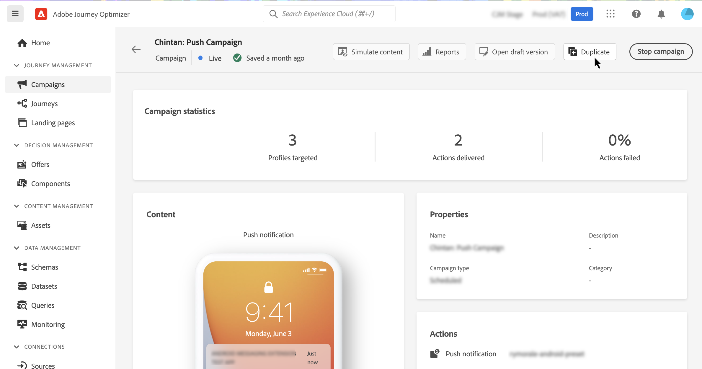

# Manage campaigns {#modify-stop-campaign}

Once a campaign has been activated, you can modify or stop it at any time. These operations are available for campaigns with a recurring execution only. 

Additionally, you can duplicate live campaigns (executed once or with a recurring execution) to create new ones, and archive completed or stopped campaigns.

## Access campaigns {#access}

>[!CONTEXTUALHELP]
>id="ajo_campaigns_view"
>title="Campaigns list and calendar views"
>abstract="In addition to the campaigns list, [!DNL Journey Optimizer] provides a calendar view of your campaigns, offering a clear visual representation of their schedules. You can switch between the list and calendar views at any times using these buttons."

Campaigns are accessible from the **[!UICONTROL Campaigns]** menu.

By default, the list shows all campaigns with the **[!UICONTROL Draft]**, **[!UICONTROL Scheduled]**, and **[!UICONTROL Live]** statuses. To display stopped, completed, and archived campaigns, you need to clear the filter.

You can also filter the list based on the campaign type and channel, or the tags that have been assigned to the campaigns when creating them. [Learn how to assign tags to a campaign](create-campaign.md#create)

## Campaigns calendar {#calendar}

In addition to the campaigns list, [!DNL Journey Optimizer] provides a calendar view of your campaigns, offering a clear visual representation of their schedules.

>[!AVAILABILITY]
>
>Calendar view is currently only available for a set of organizations (Limited Availability). To request access, use [this form](https://forms.cloud.microsoft/r/FC49afuJVi){target=”_blank”}.
>
>This feature is in active development. We welcome your input and requests using the **[!UICONTROL Beta Feedback]** button in the top menu.

The calendar displays all campaigns scheduled for the current week. Use the arrow buttons above the calendar to navigate between weeks.

How campaigns are represented:

* By default, the calendar grid shows all live and scheduled campaigns for the selected week. Additional filter options can show completed, stopped and finished activations or activations of a certain type or channel.
* Draft campaigns are not displayed.
* Campaigns spanning multiple days appear at the top of the calendar grid.
* If no start time is specified, the closest manual activation time is used to position it in the calendar.
* Campaigns are displayed as 1-hour timespans, but this does not reflect actual send or completion time.

For more details on a campaign, click its visual block to open details on it.

To view details for a specific campaign, select it from the list. An information pane will open with various information on the campaign such as its type, access to the reports, or the tags that have been assigned.

## Campaign statuses and alerts {#statuses}

Campaigns can have multiple statuses:

* **[!UICONTROL Draft]**: The campaign is being edited, it has not been activated.
* **[!UICONTROL Activating]**: The campaign is being activated.
* **[!UICONTROL Processing]** *(email campaigns only)*: The audience export is complete, the campaign is in being published.
* **[!UICONTROL Live]**: The campaign has been activated.
* **[!UICONTROL Scheduled]**: The campaign is configured to be activated on a specific start date.
* **[!UICONTROL Stopped]**: The campaign has been stopped manually. You cannot activate or reuse it anymore. [Learn how to stop a campaign](modify-stop-campaign.md#stop)
* **[!UICONTROL Completed]**: The campaign is complete. This status is automatically assigned 3 days after a campaign has been activated, or at the campaign's end date if it has a recurring execution.
* **[!UICONTROL Archived]**: The campaign has been archived. [Learn how to archive campaigns](modify-stop-campaign.md#archive)

>[!NOTE]
>
>The "Open draft version" icon next to a **[!UICONTROL Live]** or **[!UICONTROL Scheduled]** status indicates that a new version of the campaign has been created and has not been activated yet. [Learn more](modify-stop-campaign.md#modify).

When an error occurs within one of your campaigns, a warning icon appears alongside the campaign's status. Click on it to display information regarding the alert. These alerts may occur in various situations, such as when the campaign message has not been published or if the chosen configuration is incorrect.

## Modify a recurring campaign {#modify}

To modify and create a new version of a recurring campaign, follow these steps:

1. Open the campaign then click the **[!UICONTROL Modify campaign]** button.

1. A new version of the campaign is created. You can check the live version by clicking **[!UICONTROL Open live version]**.

    

    In the campaigns list, activated campaigns with a draft version in progress display with a specific icon in the **[!UICONTROL Status]** column. Click this icon to open the draft version of the campaign.

    

1. Once your changes are ready, you can activate the new version of the campaign (see [Review and activate a campaign](create-campaign.md#review-activate)).

    >[!IMPORTANT]
    >
    >Activating the draft will replace the live version of the campaign.

## Stop a recurring campaign {#stop}

To stop a recurring campaign, open it then click the **[!UICONTROL Stop campaign]** button.

>[!IMPORTANT]
>
>Stopping a campaign will not stop an ongoing sending but it will stop a scheduled sending or the next occurrences if sending is already on going.

<!-- inbound campaign (inapp): can stop and resume -->

## Duplicate a campaign {#duplicate}

You can duplicate a live campaign to create a new one. To do this, open the campaign, then click **[!UICONTROL Duplicate]**.

## Archive a campaign {#archive}

With time, the list of campaigns keeps growing and eventually makes it more difficult to browse completed and stopped campaigns.

To prevent this, you can archive completed and stopped campaigns that you do not need anymore. To do this, click the ellipsis button then select **[!UICONTROL Archive]**.

Archived campaigns can then be retrieved using the dedicated filter in the list. [Learn how to access campaigns](get-started-with-campaigns.md#access)
