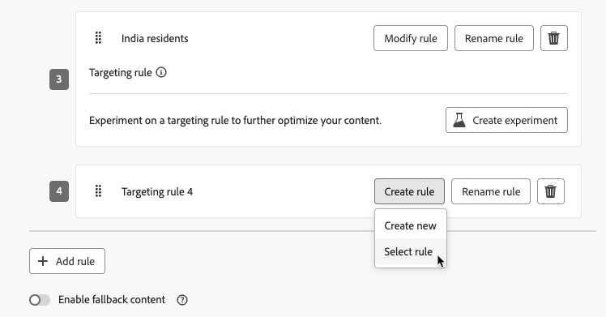
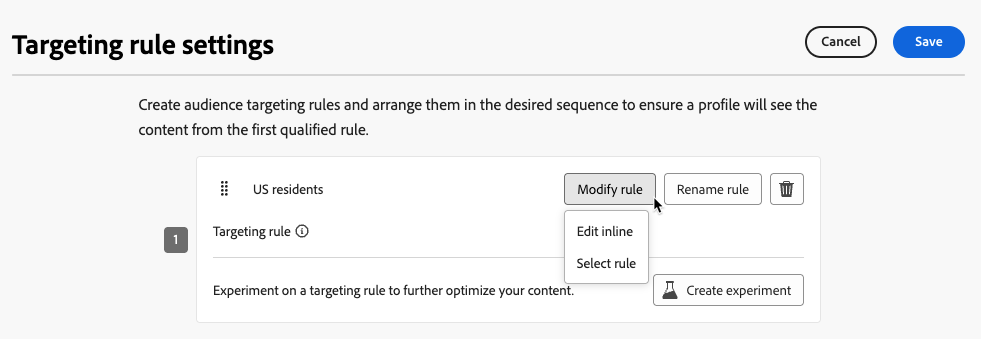

# Use targeting {#targeting}

>[!CONTEXTUALHELP]
>id="ajo_content_targeting_fallback"
>title="What is fallback content?"
>abstract="Fallback content allows your audience to receive a default content when no targeting rule is qualified. If you do not select this option, any audience that doesn't qualify for a targeting rule defined above will not receive content."

Targeting delivers personalized content to specific audience segments based on user profile attributes or contextual attributes.

Unlike experimentation, which is a random assignment of a message's content, targeting is deterministic in terms of delivering the content to the right audience.

With targeting, specific rules can be defined based on:

* **User profile attributes** such as location (eg. geo-targeting), age, or preferences. For example, users in the US see a "Golden Gate" promotion, while users in France see an "Eiffel Tower" promotion.

* **Contextual data** such as device type (eg. device-targeting), time of day, or session details. For example, desktop users receive desktop-optimized content, while mobile users receive mobile-optimized content.

* **Audiences** which can be used to include or exclude profiles that have a particular audience membership.

To set up targeting, follow the steps below.

1. Create a [journey](../building-journeys/journey-gs.md#jo-build) or a [campaign](../campaigns/create-campaign.md).

    >[!NOTE]
    >
    >If you are in a journey, add an **[!UICONTROL Action]** activity, choose a channel activity and select **[!UICONTROL Configure action]**. [Learn more](../building-journeys/journey-action.md#add-action)

1. From the **[!UICONTROL Actions]** tab, select at least one action.

1. In the **[!UICONTROL Optimization]** section, select **[!UICONTROL Create targeting rule]**.

    {width=85%}

1. Click **[!UICONTROL Create rule]** > **[!UICONTROL Create new]** and use the rule builder to define your criteria on the go.

    {width=100%}

    For example, define a rule for US residents, a rule for France residents, and a rule for India residents.

    {width=85%}

1. You can also click **[!UICONTROL Create rule]** > **[!UICONTROL Select rule]** to select an existing targeting rule created from the **[!UICONTROL Rules]** menu. [Learn more](../experience-decisioning/rules.md)

    {width=70%}

    In this case, the formula that makes up the rule is simply copied into the journey or campaign. Any subsequent changes to that rule from the **[!UICONTROL Rules]** menu will not affect the journey or campaign's copy.

    >[!AVAILABILITY]
    >
    >[Creating targeting rules](../experience-decisioning/rules.md#create) from the dedicated [!DNL Journey Optimizer] menu is currently available to organizations that have purchased the Decisioning add-on offering, and they are available on demand for the other organizations (Limited Availability).
    >
    >This capacity will be progressively rolled out to all customers. In the meantime, contact your Adobe representative to gain access.

1. After you added a rule, you can still modify it. Choose **[!UICONTROL Edit inline]** to update it on the go using the rule builder, or **[!UICONTROL Select rule]** to pick up another existing rule.

    {width=100%}

    >[!NOTE]
    >
    >Editing a rule inline does not affect the existing rule it originates from.

1. Select the **[!UICONTROL Enable fallback content]** option as needed. Fallback content allows your audience to receive a default content when no targeting rules are qualified.

    >[!NOTE]
    >
    >If you do not select this option, any audience that doesn't qualify for a targeting rule defined above will not receive content.

1. Save your targeting rule settings.

1. Back in the **[!UICONTROL Actions]** tab, select **[!UICONTROL Edit content]**.

1. Design appropriate content for each group defined by your targeting rule settings.

    {width=85%}

    In this example, design a specific content for US residents, a different content for French residents and another content for India residents.

1. [Activate](review-activate-campaign.md) your journey or campaign.

Once the journey/campaign is live, content tailored for each target is sent so that US residents get a specific message, France residents a different message, and so on.

<!--Default content:

* If no targeting rules match, default content can be delivered.

* If default content is not enabled, passthrough behavior ensures lower-priority campaigns are evaluated.-->

