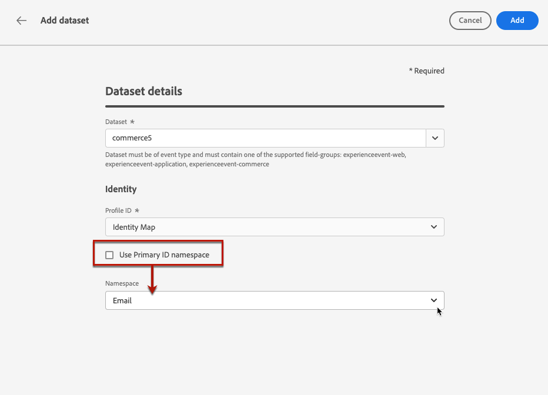

# Reporting configuration {#reporting-configuration}

>[!CONTEXTUALHELP]
>id="ajo_admin_reporting_config"
>title="Set up datasets for reporting"
>abstract="The reporting configuration allows you to retrieve additional metrics that will be used in the Objectives tab of your campaign reports. It must be performed by a technical user."

>[!CONTEXTUALHELP]
>id="ajo_admin_reporting_dataset"
>title="Select a dataset"
>abstract="You can only select an event-type dataset which must contain at least one of the supported field groups: Application Details, Commerce Details, Web Details."

<!--The reporting data source configuration allows you to define a connection to a system in order to retrieve additional information that will be used in your reports.-->

The reporting data source configuration allows you to retrieve additional metrics that will be used in the **[!UICONTROL Objectives]** tab of your campaign reports. [Learn more](content-experiment.md#objectives-global)

>[!NOTE]
>
>The reporting configuration must be performed by a technical user. <!--Rights?-->

For this configuration, you need to add one or more datasets containing the additional elements that you want to use for your reports. To do this, follow the steps [below](#add-datasets).

<!--
➡️ [Discover this feature in video](#video)
-->

## Prerequisites

Before being able to add a dataset to the reporting configuration, you must create that dataset. Learn how in the [Adobe Experience Platform documentation](https://experienceleague.adobe.com/docs/experience-platform/catalog/datasets/user-guide.html?lang=en#create){target="_blank"}.

* You can only add event-type datasets.

* These datasets must contain at least one of the following [field groups](https://experienceleague.adobe.com/docs/experience-platform/xdm/tutorials/create-schema-ui.html#field-group){target="_blank"}: **Application Details**, **Commerce Details**, **Web Details**.

    >[!NOTE]
    >
    >Only these field groups are currently supported.

    For example, if you want to know the impact of an email campaign on commerce data such as purchases or orders, you need to create an experience event dataset with the **Commerce Details** field group.

    Likewise, if you want to report on mobile interactions, you need to create an experience event dataset with the **Application Details** field group.

    The metrics corresponding to each field group are listed [here](#objective-list).

* You can add these field groups to one or several schemas that will be used in one or several datasets.

>[!NOTE]
>
>Learn more on XDM schemas and fields groups in the [XDM System overview documentation](https://experienceleague.adobe.com/docs/experience-platform/xdm/home.html?lang=en){target="_blank"}.

## Objectives corresponding to each field group {#objective-list}

The table below shows which metrics will be added to the **[!UICONTROL Objectives]** tab of your campaign reports for each field group.

| Field group | Objectives |
|--- |--- |
| Commerce Details | Price Total Payment Amount (Unique) Checkouts (Unique) Product List Adds (Unique) Product List Opens (Unique) Product List Removal (Unique) Product List Views (Unique) Product Views (Unique) Purchases (Unique) Save For Laters Product Price Total Product Quantity |
| Application Details | (Unique) App Launches First App Launches (Unique) App Installs (Unique) App Upgrades |
| Web Details | (Unique) Page Views |

## Add datasets {#add-datasets}

1. From the **[!UICONTROL ADMINISTRATION]** menu, select **[!UICONTROL Configurations]**. In the  **[!UICONTROL Reporting]** section, click **[!UICONTROL Manage]**.

    

    The list of datasets that were already added displays.

1. From the **[!UICONTROL Dataset]** tab, click **[!UICONTROL Add dataset]**.

    

    >[!NOTE]
    >
    >If you select the **[!UICONTROL System dataset]** tab, only datasets created by the system are displayed. You will not be able to add other datasets.

1. From the **[!UICONTROL Dataset]** drop-down list, select the dataset that you want to use for your reports.

    >[!CAUTION]
    >
    >You can only select an event-type dataset, which must contain at least one of the supported [field groups](https://experienceleague.adobe.com/docs/experience-platform/xdm/tutorials/create-schema-ui.html#field-group){target="_blank"}: **Application Details**, **Commerce Details**, **Web Details**. If you select a dataset not matching those criteria, you will not be able to save your changes.

    

    Learn more on datasets in the [Adobe Experience Platform documentation](https://experienceleague.adobe.com/docs/experience-platform/catalog/datasets/overview.html){target="_blank"}.

1. From the **[!UICONTROL Profile ID]** drop-down list, select the dataset field attribute that will be used to identify each profile in your reports.

    

    >[!NOTE]
    >
    >Only IDs available for reporting are displayed.

1. The **[!UICONTROL Use Primary ID namespace]** option is enabled by default. If the selected **[!UICONTROL Profile ID]** is **[!UICONTROL Identity Map]**, you can disable this option and choose another namespace from the drop-down list that displays.

    

    Learn more on namespaces in the [Adobe Experience Platform documentation](https://experienceleague.adobe.com/docs/experience-platform/identity/namespaces.html){target="_blank"}.

1. Save your changes to add the selected dataset to the reporting configuration list.

    >[!CAUTION]
    >
    >If you selected a dataset which is not event-type, you will not be able to proceed.

When building your campaign reports, you can now see the metrics corresponding to the field groups used in the datasets you added. Go to the **[!UICONTROL Objectives]** tab and select the metrics of your choice to better fine-tune your reports. [Learn more](content-experiment.md#objectives-global)

>[!NOTE]
>
>If you add several datasets, all data from all datasets will be available for reporting.

<!--
## How-to video {#video}

Understand how to configure Experience Platform reporting data sources.

>[!VIDEO]()
-->
