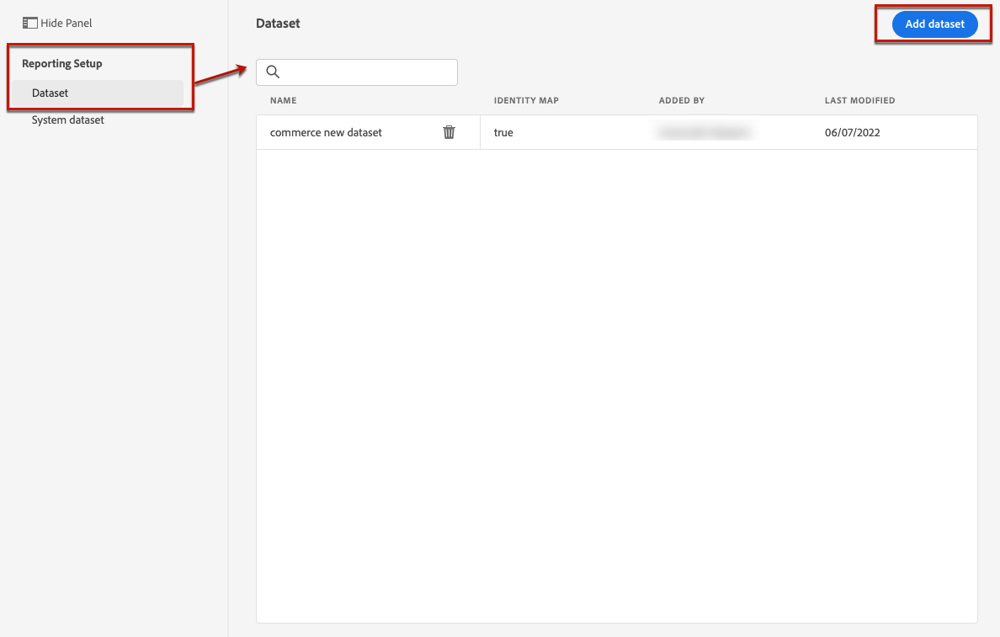
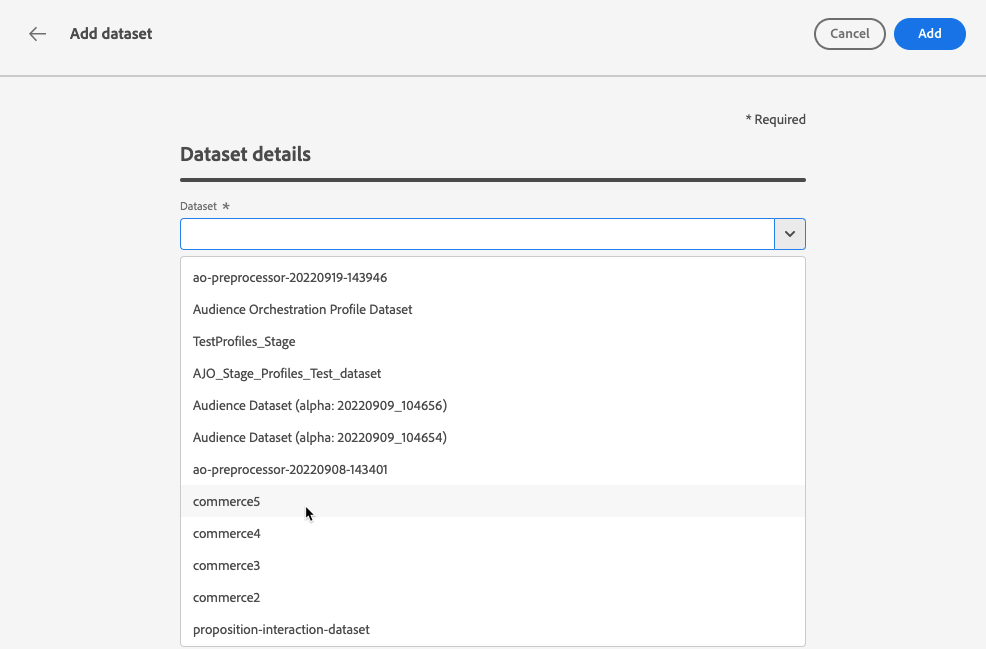
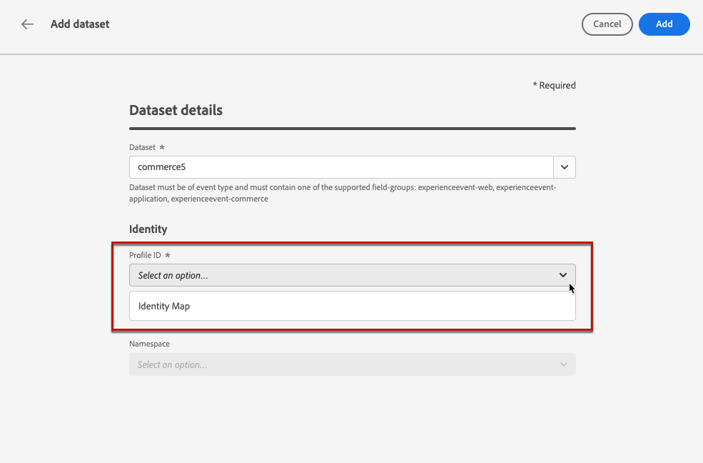

# Reporting configuration {#reporting-configuration}

>[!CONTEXTUALHELP]
>id="ajo_admin_reporting_config"
>title="Set up datasets for reporting"
>abstract="The reporting configuration allows you to define a connection to a system in order to retrieve additional custom information to be used in your reports. It must be performed by a technical user."

>[!CONTEXTUALHELP]
>id="ajo_admin_reporting_dataset"
>title="Select a dataset"
>abstract="You can only select an event-type dataset which must contain at least one of the supported field groups: experienceevent-web, experienceevent-application, experienceevent-commerce."

The reporting data source configuration allows you to define a connection to a system in order to retrieve additional information that will be used in your reports.

>[!NOTE]
>
>The data source configuration must be performed by a technical user. <!--Rights?-->

For this configuration, you need to add one or more datasets containing the attributes that you want to use for your reports. To do this, follow the steps below.

>[!CAUTION]
>
>Before being able to add a dataset to the reporting configuration, you must create it. Learn how in the [Adobe Experience Platform documentation](https://experienceleague.adobe.com/docs/experience-platform/catalog/datasets/user-guide.html?lang=en#create){target="_blank"}.
>
>You can only add event-type datasets, which must contain at least one of the supported [field groups](https://experienceleague.adobe.com/docs/experience-platform/xdm/tutorials/create-schema-ui.html#field-group){target="_blank"}: **experienceevent-web**, **experienceevent-application**, **experienceevent-commerce**.

<!--
➡️ [Discover this feature in video](#video)
-->

For example, if you want to know the impact of an email campaign on commerce data such as purchases or orders, you need to create an experience event dataset with the **experienceevent-commerce** field group. Likewise, if you want to report on mobile interactions, you need to create an experience event dataset with the **experienceevent-application** field group. <!--If you want to report on web interactions then you need to include the web field group.--> You can add these field groups to one or several schemas that will be used in one dataset or in different datasets.

>[!NOTE]
>
>Learn more on XDM schemas and fields groups in the [XDM System overview documentation](https://experienceleague.adobe.com/docs/experience-platform/xdm/home.html?lang=en){target="_blank"}.

1. From the **[!UICONTROL ADMINISTRATION]** menu, select **[!UICONTROL Configurations]**. In the  **[!UICONTROL Reporting]** section, click **[!UICONTROL Manage]**.

    

    The list of datasets that were already added displays.

1. From the **[!UICONTROL Dataset]** tab, click **[!UICONTROL Add dataset]**.

    

    >[!NOTE]
    >
    >If you select the **[!UICONTROL System dataset]** tab, only datasets created by the system are displayed. You will not be able to add other datasets.

1. From the **[!UICONTROL Dataset]** drop-down list, select the dataset that you want to use for your reports.

    >[!CAUTION]
    >
    >You can only select an event-type dataset, which must contain at least one of the supported [field groups](https://experienceleague.adobe.com/docs/experience-platform/xdm/tutorials/create-schema-ui.html#field-group){target="_blank"}: **experienceevent-web**, **experienceevent-application**, **experienceevent-commerce**. If you select a dataset not matching those criteria, you will not be able to save your changes.

    

    Learn more on datasets in the [Adobe Experience Platform documentation](https://experienceleague.adobe.com/docs/experience-platform/catalog/datasets/overview.html){target="_blank"}.

1. From the **[!UICONTROL Profile ID]** drop-down list, select the dataset field attribute that will be used to identify each profile in your reports.

    

    >[!NOTE]
    >
    >Only IDs available for reporting are displayed.

1. The **[!UICONTROL Use Primary ID namespace]** option is enabled by default. If the selected **[!UICONTROL Profile ID]** is **[!UICONTROL Identity Map]**, you can disable this option and choose another namespace from the drop-down list that displays.

    

    Learn more on namespaces in the [Adobe Experience Platform documentation](https://experienceleague.adobe.com/docs/experience-platform/identity/namespaces.html){target="_blank"}.

1. Save your changes to add the selected dataset to the reporting configuration list.

    >[!CAUTION]
    >
    >If you selected a dataset which is not event-type, you will not be able to proceed.

When building your deliveries' reports, you can now use data from this dataset to retrieve additional custom information and better fine-tune your reports. [Learn more](campaign-global-report.md#objectives-global)

>[!NOTE]
>
>If you add several datasets, all data from all datasets will be available for reporting.

<!--
## How-to video {#video}

Understand how to configure Experience Platform reporting data sources.

>[!VIDEO]()
-->
