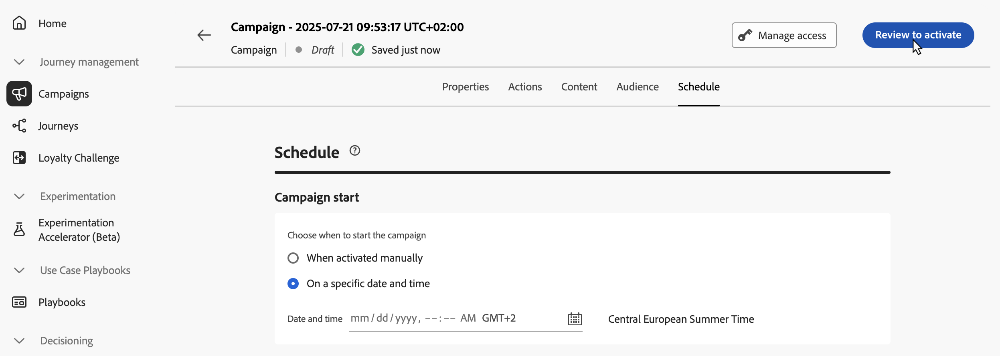
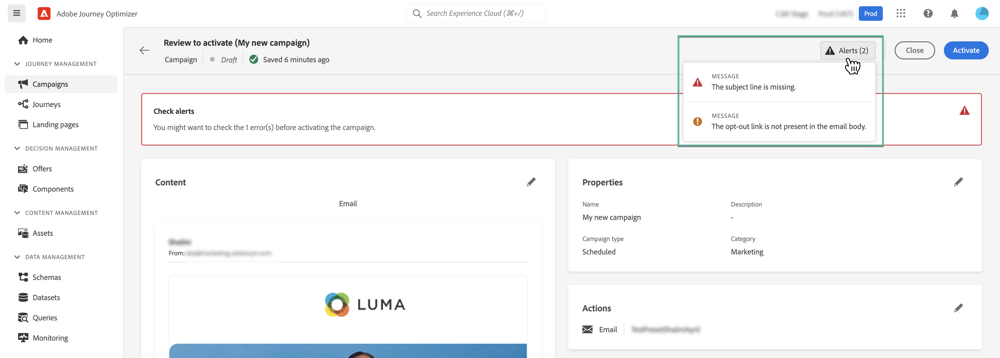
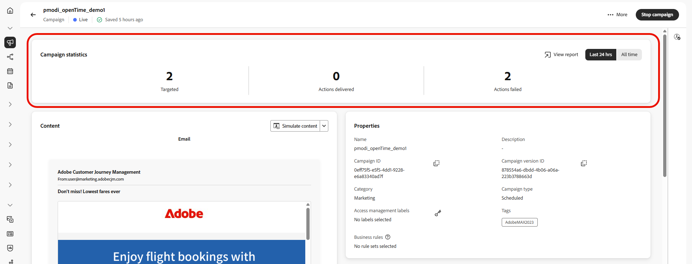

# Review & activate the API triggered campaign {#api-review}

Once your Action campaign has been configured, you need to review its parameter and content before activating it. To do this, follow these steps:

>[!IMPORTANT]
>
> If your campaign is subject to an approval policy, you will need to request approval in order to be able to send your campaign. [Learn more](../test-approve/gs-approval.md)

1. In the campaign configuration screen, click **[!UICONTROL Review to activate]** to display a summary of the campaign.

    

1. A summary of the campaign configuration displays, allowing you to check if any parameter is incorrect or missing and to modify your campaign if necessary.

    In case of errors, you cannot activate the campaign. Resolve the errors before proceeding.

    
    
1. Check that your campaign is correctly configured, then click **[!UICONTROL Activate]**.

1. The campaign is activated. Its status is **[!UICONTROL Live]**, or **[!UICONTROL Scheduled]** if you entered a start date.

    The **[!UICONTROL Completed]** status is automatically assigned to the campaign 3 days after it has been activated or at the campaign's end date if it has a recurring execution. [Learn more about campaigns statuses](get-started-with-campaigns.md#statuses).

    If no end date has been specified, the campaign keeps the **[!UICONTROL Live]** status. To change it, you need to stop the campaign manually. [Learn how to stop a campaign](modify-stop-campaign.md) 

1. Once a campaign has been activated, you can check at any time its information by opening it. The summary allows you to get statistics about number of targeted profiles and delivered and failed actions.

    You can also get additional statistics in dedicated reports by clicking the **[!UICONTROL Reports]** button. [Learn more](../reports/campaign-global-report-cja.md)

    

## Next steps {#next}

Once the API triggered campaign is ready, you can trigger its execution using APIs. [Learn more](trigger-campaigns.md)
