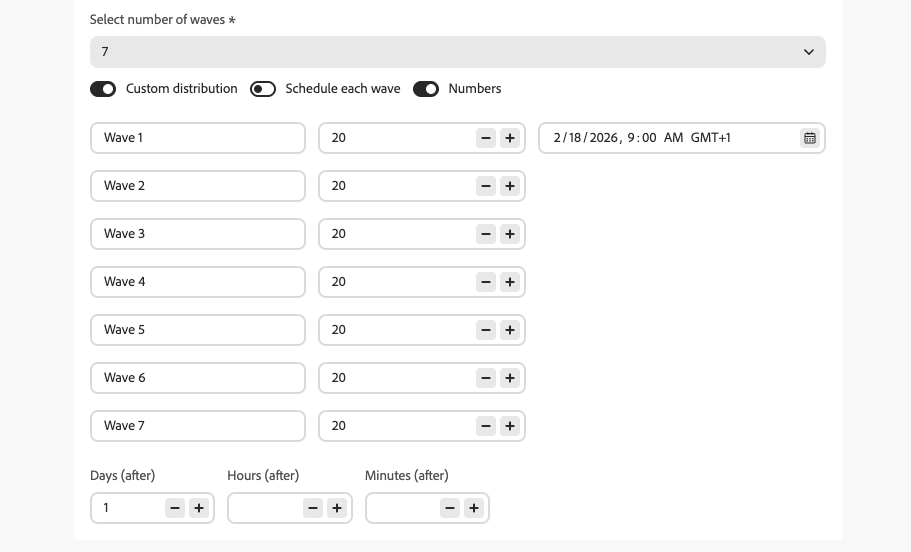
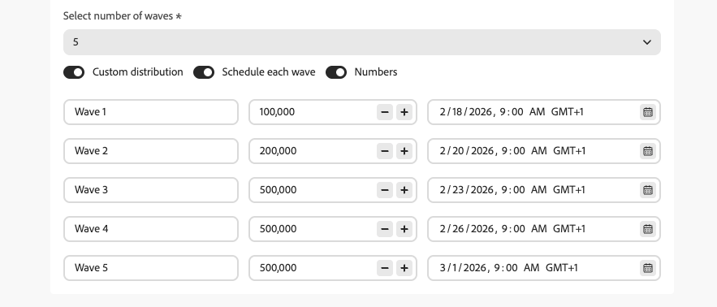
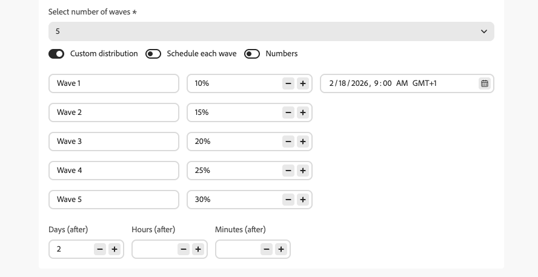

# Send using waves in campaigns {#send-using-waves}

You can divide the delivery of outbound campaign messages into several batches (waves) and schedule them over time. Wave sending helps balance load, avoid overwhelming downstream systems (such as call centers or landing pages), and support deliverability and sender reputation—especially for high-volume sends.

<!--
>[!CAUTION]
>
>Wave sending applies to **outbound** actions only (Email, SMS, Push, Direct mail).-->

Journey Optimizer lets you define the number of waves, their size (as a percentage of the audience or as absolute numbers), and when each wave runs.

## Limitations and guardrails {#limitations-guardrails}

* Wave sending applies to **outbound** actions only (Email, SMS, Push, Direct mail).
* You must define at least **2 waves** and you can add up to **10 waves**.
* The minimum interval between the start of two waves is **30 minutes**.
* A wave start cannot be before the campaign start or in the past.

## Configure wave sending {#configure-wave-sending}

To configure how and when to send waves in a campaign, follow the steps below.

1. Create or open an [Action campaign](create-campaign.md) that contains an outbound action (for example, Email, SMS, Push).

1. In the **[!UICONTROL Schedule]** tab of your campaign, select **[!UICONTROL Deliver campaign actions in waves]**.

    {width="100%"}

   >[!NOTE]
   >
   >The **[!UICONTROL Deliver campaign actions in waves]** option is only displayed when an outbound action is selected in the campaign's **[!UICONTROL Actions]** tab. [Learn more](campaign-action.md)

1. Set the number of waves you want to send (for example, 4).

   >[!NOTE]
   >
   >You must define at least 2 waves and can add up to 10 waves.

1. Choose how to define wave size and timing as detailed below.

### Equal waves {#equal-waves}

By default, the audience is split into waves of equal size. Schedule the time for the first wave and set a fixed interval between the start of each wave (for example, 2 hours).

{width="80%"}

>[!NOTE]
>
>The minimum interval between the start of two waves is **30 minutes**.

The system then schedules subsequent waves automatically (for example, first wave at 9:00 AM, second at 11:00 AM, third at 1:00 PM, fourth at 3:00 PM).

### Custom distribution {#custom-distribution}

Select the **[!UICONTROL Custom distribution]** option to define the size of each wave as a percentage of the total audience (for example, 15%, 20%, 25%, 40%).

{width="80%"}

Select **[!UICONTROL Numbers]** to define the size of each wave as an absolute number of profiles (for example, 10,000; 50,000).

{width="80%"}

>[!NOTE]
>* When using percentages, all waves must total 100%. A warning is displayed if this is not the case.
>* When using numbers, the system does not validate coverage — ensure your wave sizes cover the intended audience. [Learn more](#faq)

### Custom schedule {#custom-schedule}

Select **[!UICONTROL Schedule each wave]** to define a specific start date and time for each wave. Waves do not need to be evenly spaced (for example, 9:00 AM, 11:00 AM, 5:00 PM, 8:30 PM).

{width="80%"}

>[!NOTE]
>
>The minimum interval between the start of two waves is **30 minutes**.

## Use cases {#use-cases}

Wave sending helps you control when and how many messages go out, which can improve deliverability, protect sender reputation, and align sends with your operational capacity. Consider using waves in these scenarios:

* **Call center or response management:** Limit how many messages go out per day or per hour so that downstream teams (e.g., customer care) can handle responses. For example, send 20 messages per day to match call center capacity.

   {width="75%"}

* **High volume and deliverability:** Avoid sending a very large campaign in one shot. Spread delivery over time to help maintain sender reputation and reduce the risk of being flagged as spam.

   {width="75%"}

* **Ramp-up:** When using a new platform or IP, progressively increase volume (for example, 10% in the first wave, then 15%, 20%, and so on) to build reputation gradually.

   {width="75%"}

## Frequently asked questions {#faq}

+++ What happens if the sum of the wave sizes does not equal your total audience?

* If the sum of your wave sizes **exceeds** the audience (for example, you schedule 100,000 in the first wave for an audience of 100,000), the first wave will send to the full audience and the remaining waves will have no one left to send to—they will not execute.
* If the sum **is less** than the audience (for example, you define four waves totaling 40,000 profiles for an audience of 100,000), only the profiles included in those waves will receive the message. The rest of the audience will not receive the communication and will not be retried in later waves.

+++

+++ Can I assign different segments or criteria to individual waves?

You can only define the size and timing of waves. Recipient selection is the same for the whole campaign; you cannot assign different segments or criteria to individual waves.

+++

## Next steps {#next}

* [Schedule the Action campaign](campaign-schedule.md)—set start date, end date, frequency, and rate control.
* [Review and activate the campaign](review-activate-campaign.md)—check the campaign and go live.
