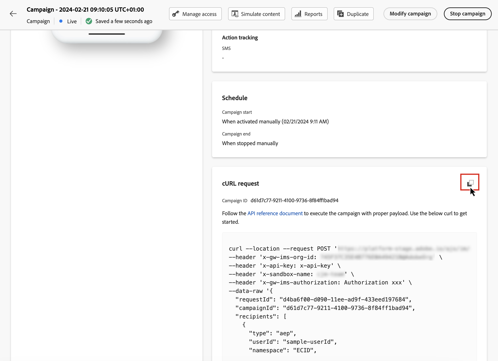

# Execute an API triggered campaign {#execute}

Once your campaign has been activated, you need to retrieve the generated sample cURL request and use it into the API to build your payload and trigger the campaign.

1. Open the campaign, then copy-paste the payload request from the **[!UICONTROL cURL request]** section. This payload includes all personalization (profile and context) variables used in the message. It is available once the campaign is live.

    

1. Use this cURL request into the APIs to build your payload and trigger the campaign. For more information, refer to the [Interactive Message Execution API documentation](https://developer.adobe.com/journey-optimizer-apis/references/messaging/#tag/execution).

    API call examples are also available on [this page](https://developer.adobe.com/journey-optimizer-apis/references/messaging-samples/).

    >[!NOTE]
    >
    >If you have configured a specific start and/or end date when creating the campaign, it will not be executed outside these dates, and API calls will fail.
