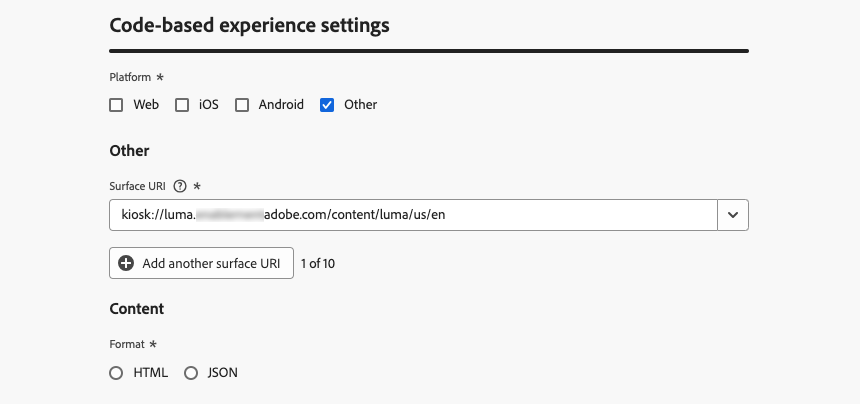

# Configure your code-based experience {#code-based-configuration}

>[!CONTEXTUALHELP]
>id="ajo_code_based_surface"
>title="Define a code-based experience configuration"
>abstract="A code-based configuration defines the path and location inside your application, uniquely identified by an URI in the application implementation, where the content will be delivered and consumed."

Before [building your experience](create-code-based.md), you need to create a code-based experience configuration in which you define where the content will be delivered and consumed inside your application.

A code-based experience configuration must reference the surface, which is basically the location where you want to render your changes. According to the selected platform, you need to enter a location/path, or the full surface URI. [Learn more](#surface-definition)

## Create a code-based experience configuration {#create-code-based-configuration}

>[!CONTEXTUALHELP]
>id="ajo_admin_location"
>title="Indicate the specific location inside your page or app"
>abstract="This field specifies the exact destination inside a page or within the app you want users to access. It can be a particular section inside a web page, or a page deep within the app's navigation structure."

>[!CONTEXTUALHELP]
>id="ajo_admin_default_mobile_url"
>title="Define a URL for content creation and preview"
>abstract="This field ensures that the pages generated or matched by the rule have a designated URL, essential for both creating and previewing content effectively."

To create a code-based experience channel configuration, follow these steps:

1. Access the **[!UICONTROL Channels]** > **[!UICONTROL General settings]** > **[!UICONTROL Channel configurations]** menu, then click **[!UICONTROL Create channel configuration]**.

    

1. Enter a name and a description (optional) for the configuration.

    >[!NOTE]
    >
    > Names must begin with a letter (A-Z). It can only contain alpha-numeric characters. You can also use underscore `_`, dot`.` and hyphen `-` characters.

1. To assign custom or core data usage labels to the configuration, you can select **[!UICONTROL Manage access]**. [Learn more on Object Level Access Control (OLAC)](../administration/object-based-access.md)

1. Select **[!UICONTROL Marketing action]**(s) to associate consent policies to the messages using this configuration. All consent policies associated with the marketing action are leveraged in order to respect the preferences of your customers. [Learn more](../action/consent.md#surface-marketing-actions)

1. Select the **Code-based experience** channel.

    

1. Select the platform for which the code-base experience will be applied:

   * [Web](#web)
   * [iOS and/or Android](#mobile)
   * [Other](#other)

   >[!NOTE]
   >
   >You can select several platforms. When choosing multiple platforms, the content is delivered to all the selected pages or apps.

1. Choose the format expected by the application for this particular location. This will be used when authoring the code-based experience in campaigns and journeys.

    

1. Click **[!UICONTROL Submit]** to save your changes.

You can now select this configuration when [creating a code-based experience](create-code-based.md) in your campaigns and journeys.

>[!NOTE]
>
>Your app implementation team is responsible for making explicit API or SDK calls to fetch content for the surfaces defined in the selected code-based experience configuration. Learn more on the different customer implementations in [this section](code-based-implementation-samples.md).

### Web platforms {#web}

>[!CONTEXTUALHELP]
>id="ajo_admin_default_web_url"
>title="Define a URL for content authoring and preview"
>abstract="This field ensures that the pages generated or matched by the rule have a designated URL, essential for both creating and previewing content effectively."

To define the code-based experience configuration settings for web platforms, follow the steps below.

1. Select one of the following options:

   * **[!UICONTROL Single page]** - If you want to apply the changes to a single page exclusively, enter a **[!UICONTROL Page URL]**.

      

   * **[!UICONTROL Pages matching rule]** - To target multiple URLs matching the same rule, build one or more rules. [Learn more](../web/web-configuration.md#web-page-matching-rule)

       <!--This could be used to apply changes universally across a website, such as updating a hero banner across all pages or adding a top image to display on every product page.-->

       For example, if you want to edit elements that are displayed on all the women product pages of your Luma website, select **[!UICONTROL Domain]** > **[!UICONTROL Starts with]** > `luma` and **[!UICONTROL Page]** > **[!UICONTROL Contains]** > `women`.

       

1. The following applies for the preview URL:

    * If a single page URL is entered, that URL will be used for the preview - no need to enter another URL.
    * If a [pages matching rule](../web/web-configuration.md#web-page-matching-rule) is selected, you must enter a **[!UICONTROL Default authoring and preview URL]** that will be used to preview the experience in a browser. [Learn more](test-code-based.md#preview-on-device)

        

1. The **[!UICONTROL Location on page]** field specifies the exact destination inside the page you want users to access. It can be a particular section on a page within the site's navigation structure, such as 'hero-banner' or 'product-rail'.

    >[!CAUTION]
    >
    >The string or path entered in this field must match the one declared in your app or page implementation. This ensures that the content is delivered to the desired location inside the specified app or page. [Learn more](code-based-surface.md#uri-composition)

    

### Mobile platforms (iOS and Android) {#mobile}

>[!CONTEXTUALHELP]
>id="ajo_admin_app_id"
>title="Provide your app ID"
>abstract="Enter the app ID for accurate identification and configuration within the application's operational environment, ensuring seamless integration and functionality."

>[!CONTEXTUALHELP]
>id="ajo_admin_mobile_url_preview"
>title="Enter the URL for previewing content"
>abstract="This field is essential for enabling the simulation and preview of your content directly on your device within your application."

To define the code-based experience configuration settings for mobile platforms, follow the steps below.

1. Enter your **[!UICONTROL App id]**. This allows for accurate identification and configuration within the app's operational environment, and ensures seamless integration and functionality.
    
1. Provide the **[!UICONTROL Location or path inside the app]**. This field specifies the exact destination within the app you want users to access. It can be a particular section or page deep within the app's navigation structure, such as 'hero-banner' or 'product-rail'.

    

1. Fill in the **[!UICONTROL Preview URL]** field to enable on-device previews. This URL informs the preview service of the specific URL to use when triggering preview on device. [Learn more](test-code-based.md#preview-on-device)

   The preview URL is a deep link configured by the app developer within your app. This ensures that any URLs matching the deep link scheme will open within the app instead of in a mobile web browser. Contact your app developer to obtain the deep link scheme configured for your app.

    +++  The following resources can assist you in configuring deep links for your app implementation

    * For Android:

        * [Create Deep Links to App Context](https://developer.android.com/training/app-links/deep-linking)

    * For iOS: 

        * [Defining a Custom URL Scheme for Your App](https://developer.apple.com/documentation/xcode/defining-a-custom-url-scheme-for-your-app)

        * [Supporting Universal Links in Your App](https://developer.apple.com/documentation/xcode/supporting-universal-links-in-your-app)

    +++

    >[!NOTE]
    >
    >If you encounter issues while previewing the experience, please refer to [this documentation](https://experienceleague.adobe.com/en/docs/experience-platform/assurance/troubleshooting#app-does-not-open-link).

### Other platforms {#other}

To define the code-based experience configuration settings for other platforms (such as video consoles, TV connected devices, smart TVs, kiosks, ATMs, voice assistants, IoT devices, etc.), follow the steps below.

1. Select **[!UICONTROL Other]** as the platform if your implementation is not for Web, iOS or Android, or if you need to target specific URIs.

1. Enter the **[!UICONTROL Surface URI]**. A surface URI is a unique identifier corresponding to the entity where you want to deliver your experience. [Learn more](code-based-surface.md#surface-uri)

    

    >[!CAUTION]
    >
    >Make sure you enter a surface URI that matches the one used in your own implementation. Otherwise, the changes cannot be delivered. [Learn more](code-based-surface.md#uri-composition)

1. **[!UICONTROL Add another surface URI]** if needed. You can add up to 10 URIs.

   >[!NOTE]
   >
   >When adding multiple URIs, the content is delivered to all the listed components.
