# Use editable form fields in code-based experiences {#code-based-form-fields}

For both more flexibility and control over the code-based experiences, [!DNL Journey Optimizer] allows your development team to create JSON or HTML content templates containing specific predefined editable fields.

When creating a code-based experience, non-technical marketers can then directly edit these fields in the interface, without the need to even open the personalization editor, or to touch any other code elements in their journey or campaign.

This capability provides a simplified experience for marketing users while allowing developers more control over the code content, resulting in less room for errors.

## Understand the form field syntax {#form-field-syntax}

To make portions of an HTML or an JSON code payload editable, you must use a specific syntax in the expression editor. This involves declaring a **variable** with a default value that users can override after applying the content template to their code-based experience.

For example, suppose you want to create a content template to apply it to your code-based experiences, and allow users to customize a specific color used in different locations, such as frames or buttons' background colors.

When creating your content template, you need to declare a variable with a **unique ID**, for example "*color*", and call it at the desired locations in the content where you want to apply this color.

When applying the content template to their content, users will be able to customize the color used wherever the variable is referenced.

## Add editable fields to HTML or JSON content templates {#add-editable-fields}

>[!CONTEXTUALHELP]
>id="ajo_cbe_preview_form_fields"
>title="Check your form fields' rendering"
>abstract="In JSON or HTML content templates, you can define specific editable fields  which will enable non-technical users to easily edit content in code-based experiences without the need to manipulate code. Create those fields using the dedicated syntax and preview them using this button."

To make some of your JSON or HTML code editable, start by creating a code-based experience [content template](../content-management/content-templates.md) where you can define specific form fields.

>[!NOTE]
>
>This step is usually performed by a developer persona.

➡️ [Learn how to add editable fields to code-based experience templates in this video](#video)

1. Create a content template and select the **[!UICONTROL Code-based experience]** channel. [Learn how to create templates](../content-management/create-content-templates.md)

1. Select the authoring mode: HTML or JSON.

    >[!CAUTION]
    >
    >Changing the authoring mode will result in losing all of your current code. The code-based experiences based on this template need to use the same authoring mode.

1. Open the [personalization editor](../personalization/personalization-build-expressions.md) to edit your code content. 

1. To define an editable form field<!--To declare the variable you want users to edit-->, navigate to the **[!UICONTROL Helper functions]** menu in the left navigation pane and add the **inline** attribute. The syntax to declare and call the variable is automatically added in your content.
    
    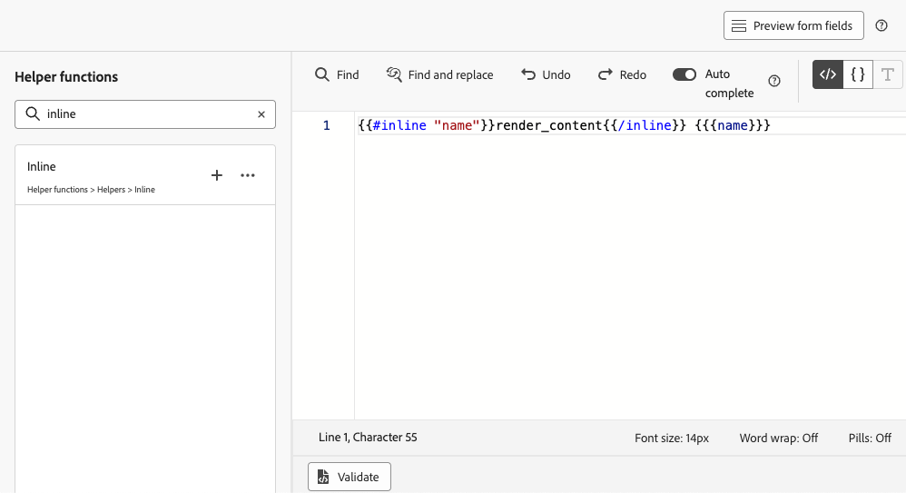{width="85%"}

1. Replace `"name"` with a unique ID to identify the editable field. For example, enter "imgURL".

    >[!NOTE]
    >
    >The field ID must be unique and cannot contain spaces. This ID should be used everywhere in your content where you want to display the variable's value.

1. Adapt the syntax to suit your needs by adding parameters detailed in the table below:

    | Action | Parameter| Example |
    | ------- | ------- | ------- |
    |Declare an editable field with a **default value**. When adding the template to your content, this default value will be used if you don't customize it.|Add the default value between the inline tags.|`{{#inline "editableFieldID"}}default_value{{/inline}}`|
    |Define a **label** for the editable field. This label will display in the code editor when editing the template's fields.|`name="title"`|`{{#inline "editableFieldID" name="title"}}default_value{{/inline}}`|

    <!--
    | Action | Parameter| Example |
    | ------- | ------- | ------- |
    |Declare an editable field containing an **image source** that needs to be published.|`assetType="image"`|`{{#inline "editableFieldID" assetType="image"}}default_value{{/inline}}`|
    |Declare an editable field containing an **URL** that needs to be tracked.br/>Note that out-of-the-box "Mirror page URL" and "Unsubscribe link" predefined blocks cannot become editable fields.>|`assetType="url"`|`{{#inline "editableFieldID" assetType="url"}}default_value{{/inline}}`|
    
-->

1. Click **[!UICONTROL Preview form fields]** to check how the editable form fields will display in the code-based experiences applying this template.

    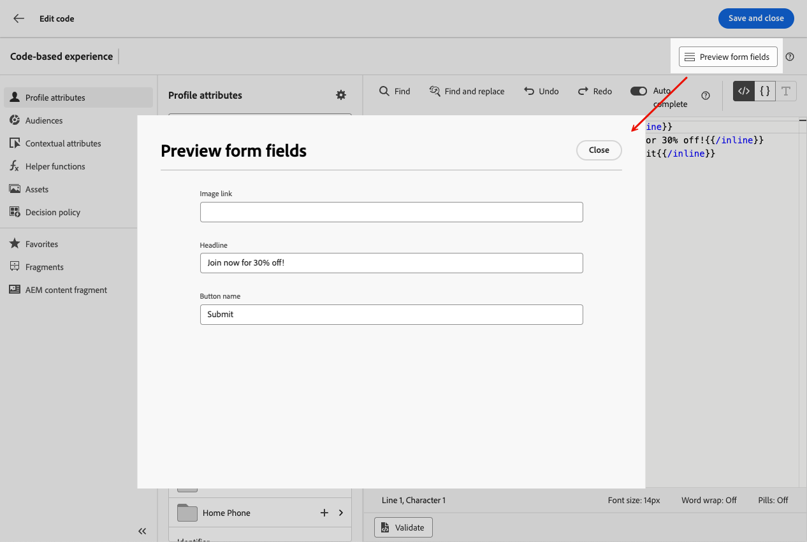{width="85%"}

1. Use the `{{{name}}}` syntax in your code at every place where you want to display the value of the editable field. Replace `name` with the unique ID of the field defined earlier.

    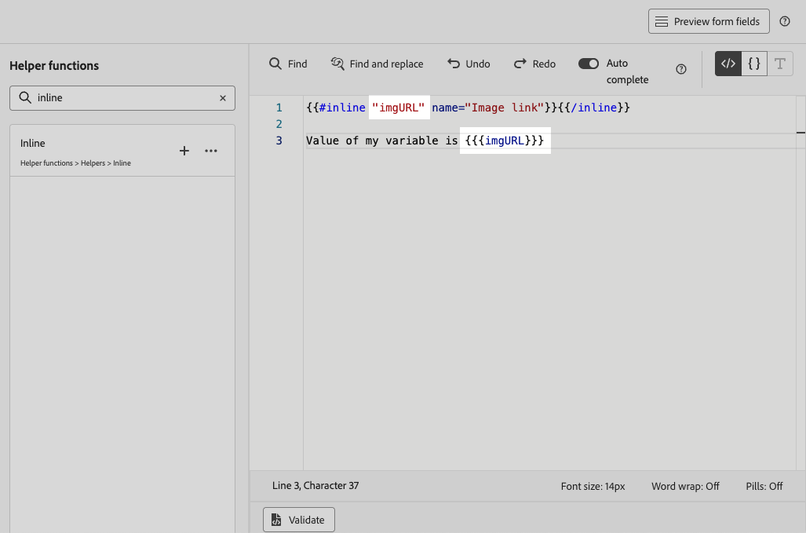{width="85%"}

1. Proceed similarly to add other editable fields, wrapping each of them with the `{{#inline}}` and `{{/inline}}` tags.

1. Edit the rest of your code as needed, including the IDs corresponding to the editable fields you defined. [Learn how](create-code-based.md#edit-code)

    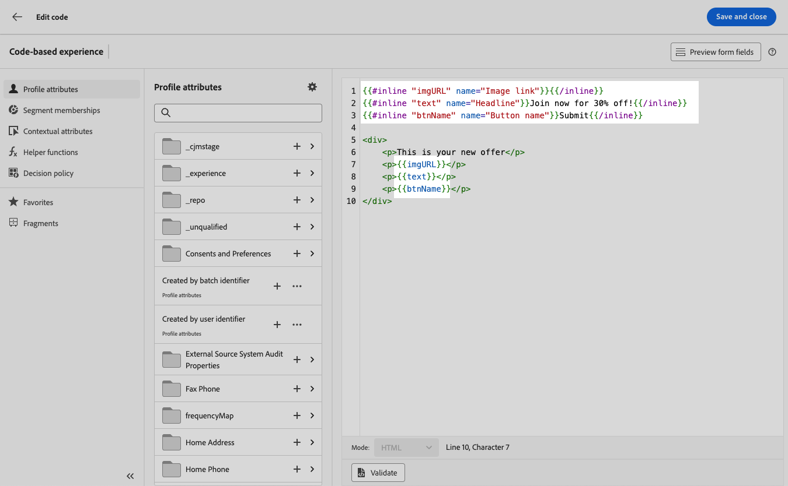

1. Save your template.

### Use decision policies in editable field forms {#decision-policy-in-form-fields}

When creating a code-based experience content template, you can use a decision policy to leverage offers in your editable form fields.

1. Create a code-based experience template as described [above](#add-editable-fields).

1. Click **[!UICONTROL Add decision policy]** either using the **[!UICONTROL Show Decisioning]** icon from the right rail of the edition screen, or in the expression editor from the **[!UICONTROL Decision policy]** section on the left menu.

    Learn how to create a decision policy in [this section](../experience-decisioning/create-decision.md#create-decision).

1. Click the **[!UICONTROL Insert policy]** button. The code corresponding to the decision policy is added.

    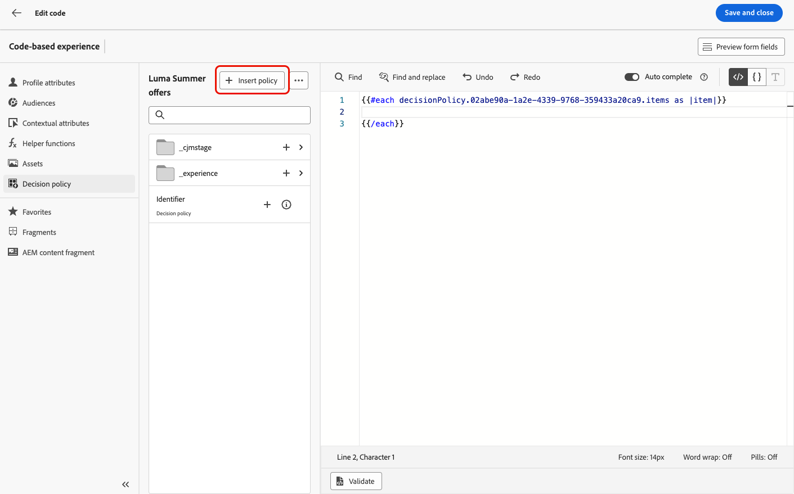

1. After the `{{#each}}` tag, insert the code corresponding to the editable form field(s) that you want to add, using the **inline** syntax described [above](#add-editable-fields). Replace `"name"` with a unique ID to identify your editable field. In this example, use "title".

    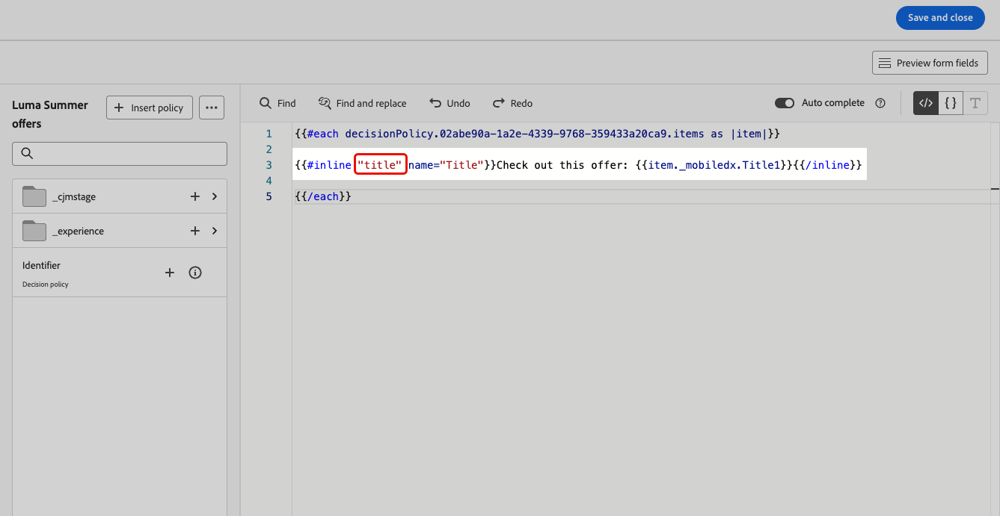{width="90%"}

1. Click **[!UICONTROL Preview form fields]** to check how the editable form fields will display in the code-based experiences applying this template.

    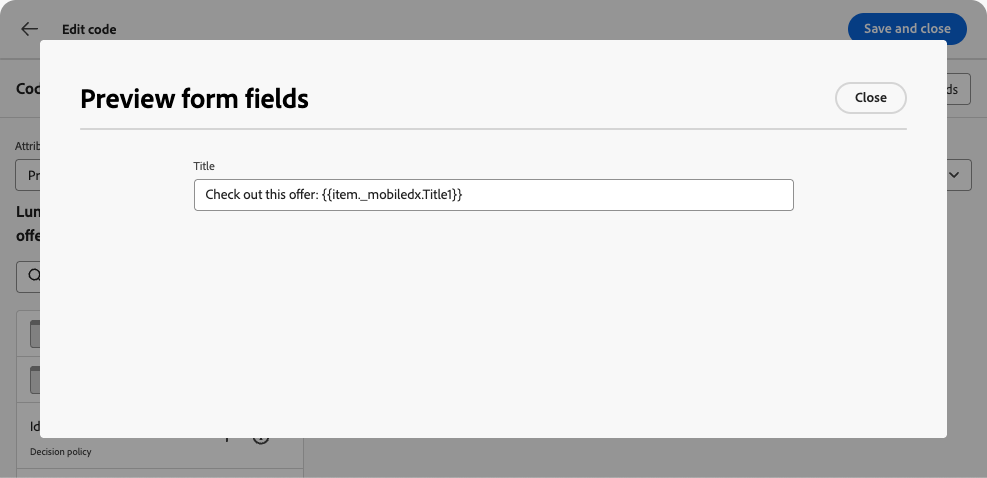{width="70%"}

1. Insert the rest of your code above the `{{/each}}` tag. Use the `{{{name}}}` syntax in your code at every place where you want to display the value of your editable field. In this example, replace `name` with "title".

    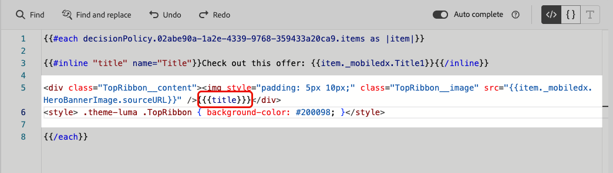{width="85%"}

1. Save your template.

### Code examples {#code-examples}

Below are a few examples of JSON and HTML templates, some of them including decision policies.

**JSON template:**

```
{{#inline "title" name="Title"}}Best gear for winter is here for you!{{/inline}} 
{{#inline "description" name="Description"}}Add description{{/inline}} 
{{#inline "imgURL" name="Image Link"}}Add link{{/inline}} 
{{#inline "number_of_items" name="Number of items"}}23{{/inline}}

{
  "title": "{{{title}}}",
  "description": "{{{description}}}",
  "imageUrl": "{{{imgURL}}}",
  "number_of_items": {{{number_of_items}}}, 
  "code": "DEFAULT"
}
```

>[!NOTE]
>
>When referencing the inline fields in the JSON payload:
>
>* String-type fields must be enclosed in double quotes.
>* Integers or booleans must NOT be enclosed in double quotes. (See the `number_of_items` field in the example above.)

**JSON template with decisioning:**

```
{ 
"offer": [ 
{{#each decisionPolicy.fff709b7-7fef-4e4e-83d7-594fbcf196c1.items as |item|}} 
{{#inline "title" name="Title"}}{{item._mobiledx.Title1}}{{/inline}} {{#inline "description" name="Description"}}{{item._mobiledx.Title2}}{{/inline}} {{#inline "imgURL" name="Image Link"}}https://luma.enablementadobe.com/content/luma/us/en/experience/warming-up/_jcr_content/root/hero_image.coreimg.jpeg{{/inline}} 

{ 
"title": "{{{title}}}", 
"description": "{{{description}}}", 
"imageUrl": "{{{imgURL}}}", 
"link": "https://lumaenablement.adobe.com/web/luma/home", "code": "DEFAULT" 
}, 
{{/each}}
] 
}
```

>[!NOTE]
>
>Inline fields for which you want to use decisioning items need to be placed inside the decision policy block - between the `{{#each}}` and `{{/each}}`tags.

**HTML template:**

```
{{#inline "title" name="Title"}}Please enter title here{{/inline}} 
{{#inline "imgSrc" name="Image link"}}{{/inline}} 

<div class="TopRibbon__content">{{{title}}}</div> 
<style> .theme-luma .TopRibbon { background-color: #200098; }</style>
```

**HTML template with decisioning:**

```
{{#each decisionPolicy.f112884a-5654-43ad-9d6d-dbd32ae23ee6.items as |item|}} 
{{#inline "title" name="Title"}}Title is: {{item._mobiledx.Title1}}{{/inline}} 

<div class="TopRibbon__content">{{{title}}}</div> 
<style> .theme-luma .TopRibbon { background-color: #200098; }</style> 

{{/each}}
```

## Edit form fields in a code-based experience {#edit-form-fields}

>[!CONTEXTUALHELP]
>id="ajo_code_based_form_fields"
>title="What are form fields?"
>abstract="This code-based experience contains form fields that you can easily edit without the need to manipulate code in the personalization editor."

Now that the content template containing predefined editable form fields is created, you can build a code-based experience using this content template.

You will be able to easily edit the form fields from a code-based experience journey or campaign, without opening the personalization editor.

>[!NOTE]
>
>This step is usually performed by a marketer persona.

1. From the journey activity or the campaign edition screen, select the content template containing editable form fields. [Learn how to use content templates](../content-management/use-content-templates.md)

    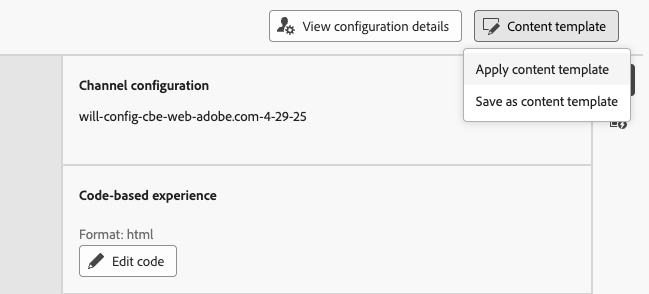{width="60%"}

    >[!CAUTION]
    >
    >The templates available to choose are scoped to either HTML or JSON based on the channel configuration selected beforehand. Only compatible templates are displayed.

1. The fields that were predefined in the selected content template are available on the right pane. <!--The code preview is displayed with the rest of the code.-->

    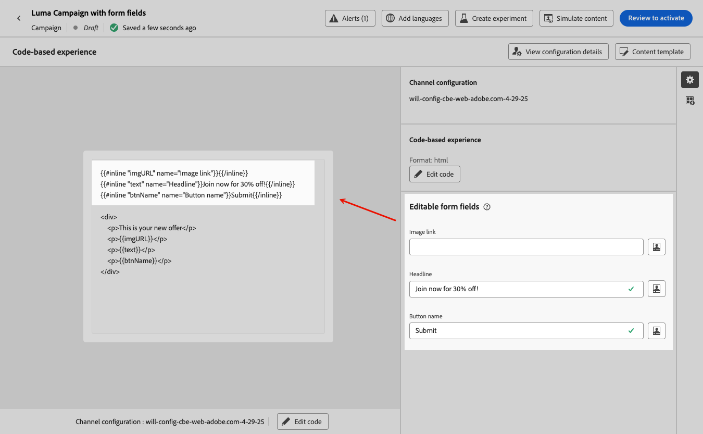

1. From the **[!UICONTROL Editable form fields]** section, you can:

    * Edit each value directly inside the editable fields, without opening the code editor.

    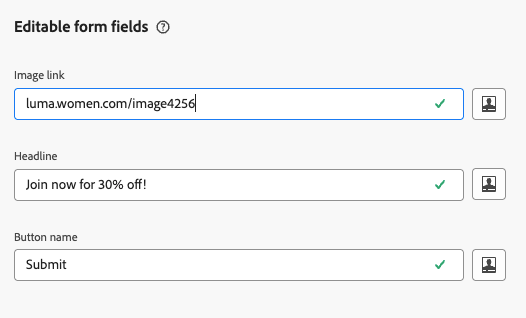{width="60%"}

    * Click the personalization icon to edit each field using the [code editor](../personalization/personalization-build-expressions.md).

    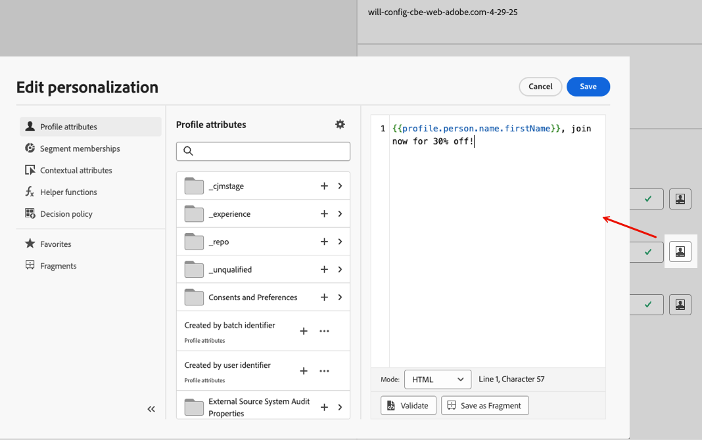{width="70%"}
    
    >[!NOTE]
    >
    >In both cases, you can only edit one field at a time, and you cannot edit the rest of the code-based experience content.

1. If a [decision policy was added](#decision-policy-in-form-fields) to the content template, it comes with all the attributes available in the [offers catalog schema](../experience-decisioning/catalogs.md). You can edit the decision item inline or using the expression editor.

1. To edit the rest of the code, click the **[!UICONTROL Edit code]** button and update your full code-based experience content, including the editable form fields. [Learn more](create-code-based.md#edit-code)

## How-to video {#video}

Learn how to add editable fields to code-based experience channel content templates.

>[!VIDEO](https://video.tv.adobe.com/v/3463990/?learn=on&#x26;enablevpops)
