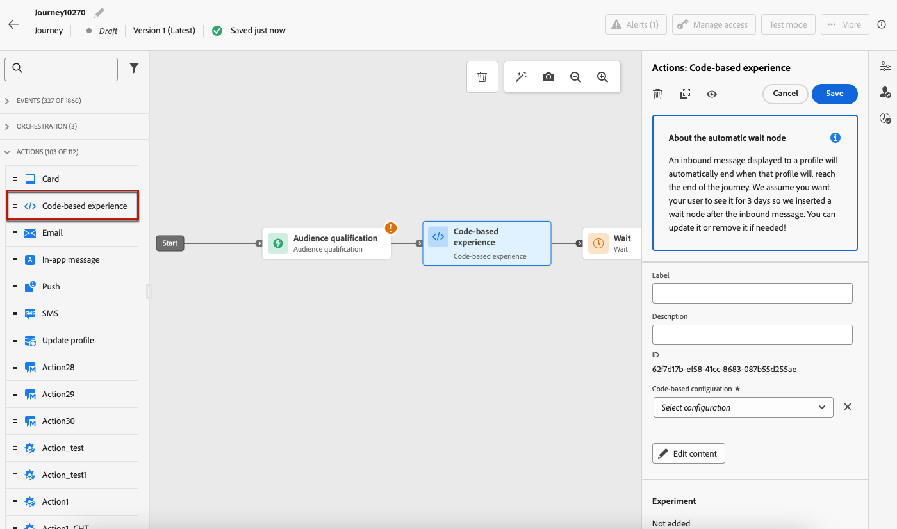

# Create code-based experiences {#create-code-based}

In [!DNL Journey Optimizer], you can create code-based experiences in a journey or a campaign.

## Add a code-based experience through a journey or a campaign {#create-code-based-experience}

To start building your code-based experience through a journey or a campaign, follow the steps below.

>[!BEGINTABS]

>[!TAB Add a code-based experience to a journey]

To add a **code-based experience** activity to a journey, follow these steps:

1. [Create a journey](../building-journeys/journey-gs.md).

1. Start your journey with an [Event](../building-journeys/general-events.md) or a [Read Audience](../building-journeys/read-audience.md) activity.

1. Drag and drop a **[!UICONTROL Code-based experience]** activity from the **[!UICONTROL Actions]** section of the palette.

   

    >[!NOTE]
    >
    >As **Code-based experience** is an inbound message activity, it comes with a 3-days **Wait** activity. [Learn more](../building-journeys/wait-activity.md#auto-wait-node)

1. Enter a **[!UICONTROL Label]** and **[!UICONTROL Description]** for your message.

1. Select or create the [Code-based experience configuration](code-based-configuration.md) to use.

    

1. Select the **[!UICONTROL Edit content]** button and edit your content as desired using the personalization editor. [Learn more](#edit-code)

    You can also use an existing content template as a basis for your code content. Note that the templates available to choose are scoped to either HTML or JSON based on the channel configuration that has been chosen beforehand. [Learn how to use content templates](../content-management/use-content-templates.md)

1. If necessary, complete your journey flow by dragging and dropping additional actions or events. [Learn more](../building-journeys/about-journey-activities.md)

1. Once your code-base experience is ready, finalize the configuration and publish your journey to activate it. [Learn more](../building-journeys/publishing-the-journey.md)

For more information on how to configure a journey, refer to [this page](../building-journeys/journey-gs.md).

>[!TAB Create a code-based experience campaign]

To start building your **code-based experience** through a campaign, follow the steps below.

1. Create a campaign. [Learn more](../campaigns/create-campaign.md)

1. Select the **Scheduled - Marketing** campaign type.

1. Complete the steps to create a campaign, such as the campaign properties, [audience](../audience/about-audiences.md), and [schedule](../campaigns/create-campaign.md#schedule). For more information on how to configure a campaign, refer to [this page](../campaigns/get-started-with-campaigns.md).

1. Select the **[!UICONTROL Code-based experience]** action.

1. Select or create the code-based experience configuration. [Learn more](code-based-configuration.md)

    

1. Edit your content as desired using the personalization editor. [Learn more](#edit-code)

    You can also use an existing content template as a basis for your code content. Note that the templates available to choose are scoped to either HTML or JSON based on the channel configuration that has been chosen beforehand. [Learn how to use content templates](../content-management/use-content-templates.md)

    <!---->

For more information on how to configure a campaign, refer to [this page](../campaigns/get-started-with-campaigns.md).

➡️ [Learn how to create a code-based experience campaign in this video](#video)

>[!ENDTABS]

## Edit the code content {#edit-code}

>[!CONTEXTUALHELP]
>id="ajo_code_based_experience"
>title="Use the personalization editor"
>abstract="Insert and edit the code you want to deliver as part of this code-based experience action."
>additional-url="https://experienceleague.adobe.com/docs/journey-optimizer/using/content-management/personalization/expression-editor/personalization-build-expressions.html" text="Get started with the personalization editor"

1. From the journey activity or the campaign edition screen, select **[!UICONTROL Edit code]**.

    

1. The [personalization editor](../personalization/personalization-build-expressions.md) opens. It is a non-visual experience creation interface which allows you to author your code.

1. You can switch the authoring mode from HTML to JSON, and vice versa.

    

    >[!CAUTION]
    >
    >Changing the authoring mode will result in losing all of your current code, so make sure to switch modes before you start authoring.

1. Enter your code as needed. You can leverage the [!DNL Journey Optimizer] personalization editor with all its personalization and authoring capabilities. [Learn more](../personalization/personalization-build-expressions.md)

1. You can add HTML or JSON expression fragments if needed. [Learn how](../personalization/use-expression-fragments.md)

    You can also save part of your code content as fragment. [Learn how](../content-management/fragments.md#save-as-expression-fragment)

1. With code-based experiences, you can use the Decisioning feature. Select the **[!UICONTROL Decision policy]** icon from the left bar and click **[!UICONTROL Add decision policy]**. [Learn more](../experience-decisioning/create-decision.md)

    

1. Click **[!UICONTROL Save and close]** to confirm your changes.

Now as soon as your developer makes an API or SDK call to fetch content for the surface defined in your channel configuration, the changes will be applied to your web page or app.

## How-to video{#video}

The video below shows how to create a code-based experience campaign, configure its properties, test, and publish it.

>[!VIDEO](https://video.tv.adobe.com/v/3428868/?quality=12&learn=on)
