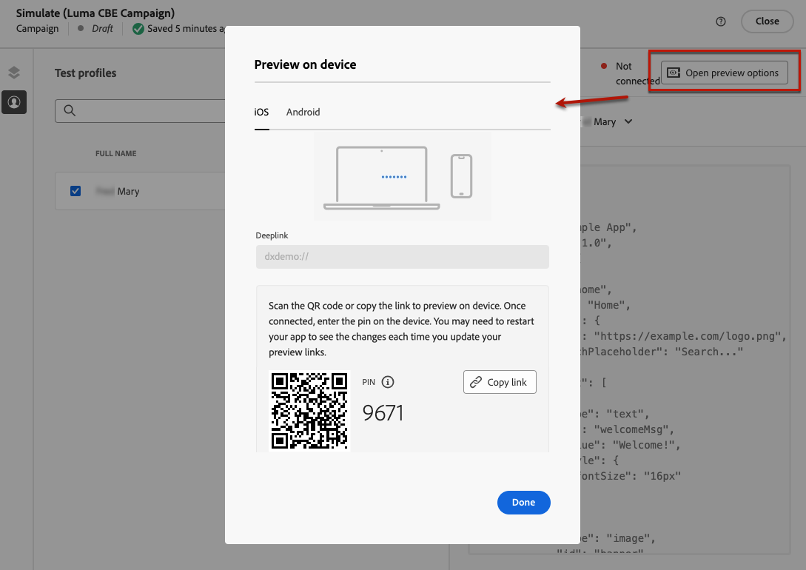

# Create code-based experiences {#create-code-based}

In [!DNL Journey Optimizer], you can create code-based experiences in a journey or a campaign.

Specific guardrails and recommendations for code-based experiences are detailed in [this page](code-based-prerequisites.md).

## Add a code-based experience through a journey or a campaign {#create-code-based-experience}

To start building your code-based experience through a journey or a campaign, follow the steps below.

>[!BEGINTABS]

>[!TAB Add a code-based experience to a journey]

To add a **code-based experience** activity to a journey, follow these steps:

1. [Create a journey](../building-journeys/journey-gs.md).

1. Start your journey with an [Event](../building-journeys/general-events.md) or a [Read Audience](../building-journeys/read-audience.md) activity.

1. Drag and drop a **[!UICONTROL Code-based experience]** activity from the **[!UICONTROL Actions]** section of the palette.

   

    >[!NOTE]
    >
    >As **Code-based experience** is an inbound message activity, it comes with a 3-days **Wait** activity. [Learn more](../building-journeys/wait-activity.md#auto-wait-node)

1. Enter a **[!UICONTROL Label]** and **[!UICONTROL Description]** for your message.

1. Select or create the [Code-based experience configuration](code-based-configuration.md) to use.

    

1. Select the **[!UICONTROL Edit content]** button and edit your content as desired using the personalization editor. [Learn more](#edit-code)

    You can also use an existing content template as a basis for your code content. Note that the templates available to choose are scoped to either HTML or JSON based on the channel configuration that has been chosen beforehand. [Learn how to use content templates](../content-management/use-content-templates.md)

1. If necessary, complete your journey flow by dragging and dropping additional actions or events. [Learn more](../building-journeys/about-journey-activities.md)

1. Once your code-base experience is ready, finalize the configuration and publish your journey to activate it. [Learn more](../building-journeys/publishing-the-journey.md)

For more information on how to configure a journey, refer to [this page](../building-journeys/journey-gs.md).

>[!TAB Create a code-based experience campaign]

To start building your **code-based experience** through a campaign, follow the steps below.

1. Create a campaign. [Learn more](../campaigns/create-campaign.md)

1. Select the type of campaign that you want to execute

    * **[!UICONTROL Scheduled - Marketing]**: execute the campaign immediately or on a specified date. Scheduled campaigns are aimed at sending **marketing** messages. They are configured and executed from the user interface.

    * **[!UICONTROL API-triggered - Marketing/Transactional]**: execute the campaign using an API call. API-triggered campaigns are aimed at sending either **marketing**, or **transactional** messages, i.e. messages sent out following an action performed by an individual: password reset, cart purchase etc. [Learn how to trigger a campaign using APIs](../campaigns/api-triggered-campaigns.md)

1. Complete the steps to create a campaign, such as the campaign properties, [audience](../audience/about-audiences.md), and [schedule](../campaigns/create-campaign.md#schedule). For more information on how to configure a campaign, refer to [this page](../campaigns/get-started-with-campaigns.md).

1. Select the **[!UICONTROL Code-based experience]** action.

1. Select or create the code-based experience configuration. [Learn more](code-based-configuration.md)

    

1. Edit your content as desired using the personalization editor. [Learn more](#edit-code)

    You can also use an existing content template as a basis for your code content. Note that the templates available to choose are scoped to either HTML or JSON based on the channel configuration that has been chosen beforehand. [Learn how to use content templates](../content-management/use-content-templates.md)

    <!---->

For more information on how to configure a campaign, refer to [this page](../campaigns/get-started-with-campaigns.md).

>[!ENDTABS]

## Edit the code content {#edit-code}

>[!CONTEXTUALHELP]
>id="ajo_code_based_experience"
>title="Use the personalization editor"
>abstract="Insert and edit the code you want to deliver as part of this code-based experience action."
>additional-url="https://experienceleague.adobe.com/docs/journey-optimizer/using/content-management/personalization/expression-editor/personalization-build-expressions.html" text="Get started with the personalization editor"

1. From the journey activity or the campaign edition screen, select **[!UICONTROL Edit code]**.

    

1. The [personalization editor](../personalization/personalization-build-expressions.md) opens. It is a non-visual experience creation interface which allows you to author your code.

1. You can switch the authoring mode from HTML to JSON, and vice versa.

    

    >[!CAUTION]
    >
    >Changing the authoring mode will result in losing all of your current code, so make sure to switch modes before you start authoring.

1. Enter your code as needed. You can leverage the [!DNL Journey Optimizer] personalization editor with all its personalization and authoring capabilities. [Learn more](../personalization/personalization-build-expressions.md)

1. You can add HTML or JSON expression fragments if needed. [Learn how](../personalization/use-expression-fragments.md)

    You can also save part of your code content as fragment. [Learn how](../content-management/fragments.md#save-as-expression-fragment)

1. With code-based experiences, you can use the Decisioning feature. Select the **[!UICONTROL Decision policy]** icon from the left bar and click **[!UICONTROL Add decision policy]**. [Learn more](../experience-decisioning/create-decision.md)

    

1. Click **[!UICONTROL Save and close]** to confirm your changes.

Now as soon as your developer makes an API or SDK call to fetch content for the surface defined in your channel configuration, the changes will be applied to your web page or app.

## Test the code-based experience {#test-code-based-experience}

>[!CONTEXTUALHELP]
>id="ajo_code_based_preview"
>title="Preview your code-based experience"
>abstract="Get a simulation of what your code-based experience will look like."

To display a preview of your modified code-based experience, follow the steps below.

>[!CAUTION]
>
>You must have test profiles available to simulate which offers will be delivered to them. Learn how to [create test profiles](../audience/creating-test-profiles.md).

1. In the journey or campaign, from either the personalization editor or edit content screen, select **[!UICONTROL Simulate content]**.

    

1. Click **[!UICONTROL Manage test profiles]** to select one or more test profiles.

1. A preview of your modified code-based experience is displayed.

Detailed information on how to select test profiles and preview your content is available in [this section](../content-management/preview.md).

### Preview on device {#preview-on-device}

>[!CONTEXTUALHELP]
>id="ajo_code_based_preview_device"
>title="Preview your code-based experience on a real device"
>abstract="Get a preview of your personalized experiences right on your browser or on your mobile devices, to see how they look on real devices."

>[!CONTEXTUALHELP]
>id="ajo_code_based_preview_device_web"
>title="Preview your code-based web experience on device"
>abstract="Scan the QR code or copy the link to preview on device."

>[!CONTEXTUALHELP]
>id="ajo_code_based_preview_device_mobile"
>title="Preview your code-based mobile experience on device"
>abstract="Scan the QR code or copy the link to preview on device. Once connected, enter the pin on the device. You may need to restart your app to see the changes each time you update your preview links."

>[!CONTEXTUALHELP]
>id="ajo_code_based_preview_device_refresh"
>title="Refresh the preview link to reflect the current view"
>abstract="The on-device preview will show the content as of when you created or refreshed the preview link. If you've modified the content or selected a different test profile or treatment, refresh the preview to have it reflect the current view."

When building code-based experiences for web pages or mobile apps, you can preview your personalized experiences right on your browser or on your mobile devices, in order to see how these experiences look on real devices.

>[!WARNING]
>
>Preview on device is not available when using [decision policies](../experience-decisioning/create-decision.md) or [personalization](../personalization/personalization-build-expressions.md) contextual attributes.

1. From the **[!UICONTROL Simulate]** screen, click the **[!UICONTROL Open preview options]** button. The preview options depend on the platform selected in your [code-based configuration](code-based-configuration.md#create-code-based-configuration).

1. If you are using a [Web platform](code-based-configuration.md#web) in your code-based configuration, the **[!UICONTROL Device preview URL]** read-only field is pre-filled with the URL entered for the current channel configuration.

    

    You can either:

    * Select the **[!UICONTROL Copy link]** button and paste the link into a browser tab. You can also share the link with your team and stakeholders, who can preview the new experience in any browser before the changes go live.

    * Click **[!UICONTROL Open in new tab]** to open the link in your current browser.

    * Scan the QR code with your mobile device to open the preview link on a mobile browser.

1. If you are using [Mobile platforms](code-based-configuration.md#mobile) (iOS / Android) in your code-based configuration, the **[!UICONTROL Deeplink]** read-only field is pre-filled with the **[!UICONTROL Preview URL]** value entered in the channel configuration for the selected platform.

    Toggle between the **[!UICONTROL iOS]** and **[!DNL Android]** tabs to preview your experience for the platform of your choice.

    

    You can either:

    * Select the **[!UICONTROL Copy link]** button and share the link with your team and stakeholders, who can preview the new experience in any mobile browser before the changes go live.

    * Scan the QR code with your mobile device to open the preview link directly in the mobile application. You must enter the PIN on your device to establish the [Assurance](https://experienceleague.adobe.com/en/docs/experience-platform/assurance/tutorials/implement-assurance){target="_blank"} session.
       
        >[!NOTE]
        >
        >**Adobe Experience Platform Assurance** is a product from Adobe Experience Cloud to help you inspect, proof, simulate, and validate how you collect data or serve experiences in your mobile app. [Learn more](https://experienceleague.adobe.com/en/docs/experience-platform/assurance/home){target="_blank"}

1. Preview links are generated for the selected test profile and, if you are using [Content Experiment](../content-management/content-experiment.md) in your journey or campaign, for the selected treatment.

   <!--If you have modified the content or selected a different treatment or test profile, scroll down to the bottom of the **[!UICONTROL Preview on device]** pop-up and click **[!UICONTROL Refresh preview link]** to reflect the current state.

   -->
   
   <!--When creating a content experiment, you need to select a given treatment and click the **[!UICONTROL Simulate content]** button to obtain the link corresponding to that treatment, then select another treatment, click the **[!UICONTROL Simulate content]** button to obtain a new preview link, and so on.-->

   When updating the content, or selecting a different test profile or treatment, the preview link is automatically refreshed. You can copy the link into different browser tabs, and compare the experiences.

## Make your code-based experience live {#code-based-experience-live}

>[!IMPORTANT]
>
> If your campaign is subject to an approval policy, you will need to request approval in order to be able to activate your code-based experiences. [Learn more](../test-approve/gs-approval.md)

Once you defined your code-based experience and edited your content as desired using the [code-based editor](#edit-code), you can activate your journey or campaign to make your changes visible to your audience.

You can also preview your code-based experience content before making it live. [Learn more](#test-code-based-experience)

>[!NOTE]
>
>If you activate a code-based journey/campaign impacting the same pages as another journey or campaign which is already live, all the changes will be applied to your content.
>
>If multiple code-based journeys or campaigns update the same element(s) of your content, the highest priority journey/campaign takes precedence.

Once your code-based journey or campaign is live, your app implementation team is responsible for making explicit API or SDK calls to fetch content for the surfaces defined in the selected [code-based experience configuration](code-based-configuration.md). Learn more on the different customer implementations in [this section](code-based-implementation-samples.md).

### Publish a code-based journey {#publish-code-based-journey}

To make your code-based experience live from a journey, follow the steps below.

1. Verify that your journey is valid and that there is no error. [Learn more](../building-journeys/troubleshooting.md#checking-for-errors-before-testing)

1. From the journey, select the **[!UICONTROL Publish]** option, located in the top right drop-down menu.

    

    >[!NOTE]
    >
    >Learn more on publishing journeys in [this section](../building-journeys/publishing-the-journey.md).

Your code-based journey takes the **[!UICONTROL Live]** status and is now visible to the selected audience. Each recipient of your journey can see your modifications.

>[!NOTE]
>
>After you click **[!UICONTROL Publish]**, it can take up to 15 minutes for the changes to be available live.

### Activate a code-based campaign {#activate-code-based-campaign}

1. From your code-based campaign, select **[!UICONTROL Review to activate]**.

    

1. Check and edit if needed the content, properties, configuration, audience and schedule.

1. Select **[!UICONTROL Activate]**.

    

    >[!NOTE]
    >
    >Learn more on activating campaigns in [this section](../campaigns/review-activate-campaign.md).

Your code-based campaign takes the **[!UICONTROL Live]** status and is now visible to the selected audience. Each recipient of your campaign can see the modifications you added to your content.

>[!NOTE]
>
>After you click **[!UICONTROL Activate]**, it can take up to 15 minutes for your changes to be available live.
>
>If you defined a schedule for your code-based campaign, it has the **[!UICONTROL Scheduled]** status until the start date and time are reached.

## Stop a code-based journey or campaign {#stop-code-based-experience}

When a code-based experience is live, you can stop it to prevent your audience from seeing your modifications. Follow the steps below.

1. Select a live journey or campaign from the respective list.

1. Perform the relevant action according to your case:

    * From the campaign top menu, select **[!UICONTROL Stop campaign]**.

        

    * From the journey top menu, click the **[!UICONTROL More]** button and select **[!UICONTROL Stop]**.

        

1. The modifications you added will not be visible anymore to the audience you defined.

>[!NOTE]
>
>Once a code-based journey or campaign is stopped, you cannot edit or activate it again. You can only duplicate it and activate the duplicated journey/campaign.

<!--Reporting TBC

## Check the code-based experience reports {#check-code-based-reports}

Once your code-based experience is live, you can check the **[!UICONTROL Code-based]** tab of the  [Journey report](../reports/journey-global-report-cja.md#web-cja) and [Campaign report](../reports/campaign-global-report-cja.md#web) to compare elements such as the number of experiences delivered to your audience, and the number of engagements with your content.-->

<!--## Code-based reports

You can access code-based journey or campaign reports from the summary screen.

Global reports display events that occurred at least two hours ago and cover events over a selected time period. In comparison, Live reports focus on events that took place within the past 24 hours, with a minimum time interval of two minutes from the event occurrence.

### Code-based live report {#live-report-code-based}

From your campaign **[!UICONTROL Live report]**, the **[!UICONTROL Code-based experience]** tab details the main information relative to your apps or web pages. [Learn more on live report](../reports/campaign-live-report.md)

+++Learn more on the different metrics and widgets available for the Code-based experience report.

The **[!UICONTROL Code-based experience performance]** KPIs detail the main information relative to your visitors' engagement with your code-based experiences, such as:

* **[!UICONTROL Impressions]**: total number of experiences delivered to all users.

* **[!UICONTROL Interactions]**:  total number of engagements with your app/page. This includes any actions taken by the users, such as clicks or any other interactions.

The **[!UICONTROL Code-based experience summary]** graph shows the evolution of your experiences (impressions, unique impressions and interactions) for the last 24 hours.

TBC: The **[!UICONTROL Interactions by element]** table details the main information relative to your visitors' engagement with the various elements on your app/pages.
+++

### Code-based global report {#global-report-code-based}

Code-based campaign global report can be accessed directly from your journey or campaign with the **[!UICONTROL View report]** button. [Learn more on global report](../reports/campaign-global-report-cja.md)

From your Campaign **[!UICONTROL Global report]**, the **[!UICONTROL Code-based experience]** tab details the main information relative to your apps or web pages.

Add image TBC

+++Learn more on the different metrics and widgets available for the Code-based experience report.

The **[!UICONTROL Code-based experience performance]** KPIs detail the main information relative to your visitors' engagement with your experiences, such as:

* **[!UICONTROL Unique impressions]**: number of unique users to whom the experience was delivered.

* **[!UICONTROL Impressions]**: total number of experiences delivered to all users.

* **[!UICONTROL Interactions]**: percentage of engagements with your app/page. This includes any actions taken by the users, such as clicks or any other interactions.

The **[!UICONTROL Code-based experience summary]** graph shows the evolution of your experiences (unique impressions, impressions and interactions) for the concerned period.

TBC: The **[!UICONTROL Interactions by element]** table details the main information relative to your visitors' engagement with the various elements on your apps/pages.
+++

TBC video if existing

## How-to video{#video}

The video below shows how to create a code-based campaign, configure its properties, review, and publish it.

>[!VIDEO]()

-->
