# Set up an allowed list {#allow-list}

The allowed list is a sending-safe list you can define at the [sandbox](../administration/sandboxes.md) level. It restricts email sending to specific addresses or domains, ensuring that only explicitly listed recipients can receive messages from a given sandbox.

>[!CAUTION]
>
>This feature only applies to the email channel. It is available on production and non-production sandboxes.

On non-production sandboxes, where accidental sends can occur, the allowed list prevents unwanted messages from reaching real customer addresses, providing a secure environment for testing purposes.

When the allowed list is active but empty, no emails are sent. This makes it a useful emergency brake: if a critical issue arises, you can activate an empty allowed list to halt all outgoing communications from [!DNL Journey Optimizer] until the problem is resolved. Learn more about the [allowed list logic](#logic).

You can also use the Journey Optimizer **Suppression REST API** to manage outgoing messages programmatically through suppression and allow lists. [Learn how to work with the Suppression REST API](https://developer.adobe.com/journey-optimizer-apis/references/suppression/){target="_blank"}

## Access the allowed list {#access-allowed-list}

To access the detailed list of allowed email addresses and domains, go to **[!UICONTROL Administration]** > **[!UICONTROL Channels]** > **[!UICONTROL Email settings]**, and select **[!UICONTROL Allowed list]**.

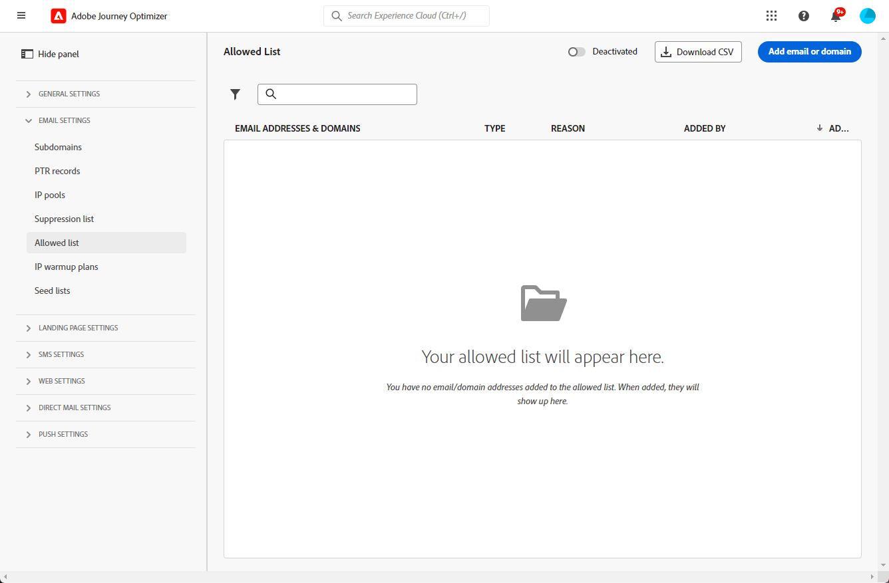

>[!CAUTION]
>
>Permissions to view, export and manage the allowed list are restricted to [Journey Administrators](../administration/ootb-product-profiles.md#journey-administrator). Learn more about managing [!DNL Journey Optimizer] users' access rights in [this section](../administration/permissions-overview.md).

To export the allowed list as a CSV file, select the **[!UICONTROL Download CSV]** button.

Use the **[!UICONTROL Delete]** button to permanently remove an entry.

You can search on the email addresses or domains, and filter on the **[!UICONTROL Address type]**. Once selected, you can clear the filter displayed on top of the list.

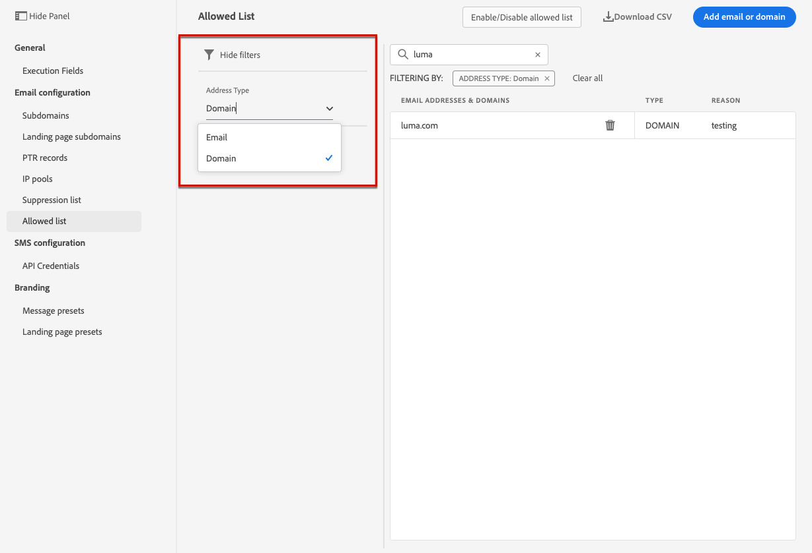

## Activate the allowed list {#enable-allow-list}

To activate the allowed list, follow the steps below.

1. Access the **[!UICONTROL Channels]** > **[!UICONTROL Email configuration]** > **[!UICONTROL Allow list]** menu.

1. Select the toggle button.

    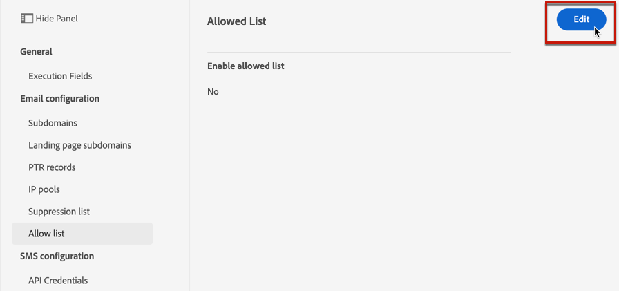

1. Select **[!UICONTROL Activate allowed list]**. The allowed list is now active.

    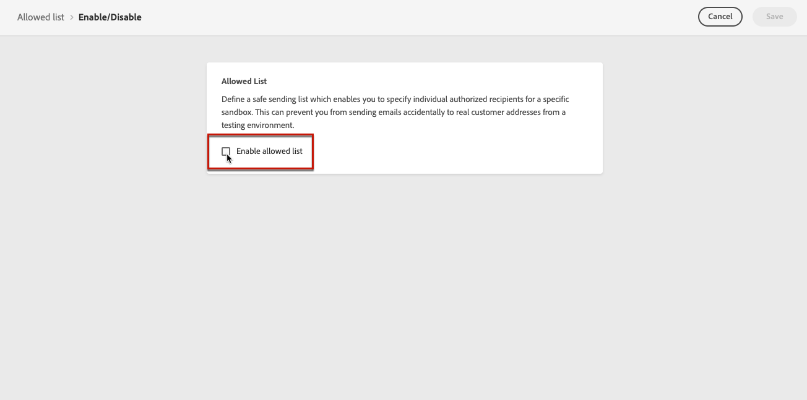

    >[!NOTE]
    >
    >After you activate the allowed list, there is a 10-minute delay before it takes effect in your journeys and campaigns. Similarly, updates to both the allowed list and suppression list can take up to 10 minutes to reflect.

The allowed list logic applies when the feature is active. Learn more in [this section](#logic).

>[!NOTE]
>
>When activated, the allowed list feature is honored when executing journeys, but also when testing messages with [proofs](../content-management/proofs.md) and testing journeys using the [test mode](../building-journeys/testing-the-journey.md).

## Deactivate the allowed list {#deactivate-allow-list}

To deactivate the allowed list, follow the steps below.

1. Access the **[!UICONTROL Channels]** > **[!UICONTROL Email configuration]** > **[!UICONTROL Allow list]** menu.

1. Select the toggle button.

    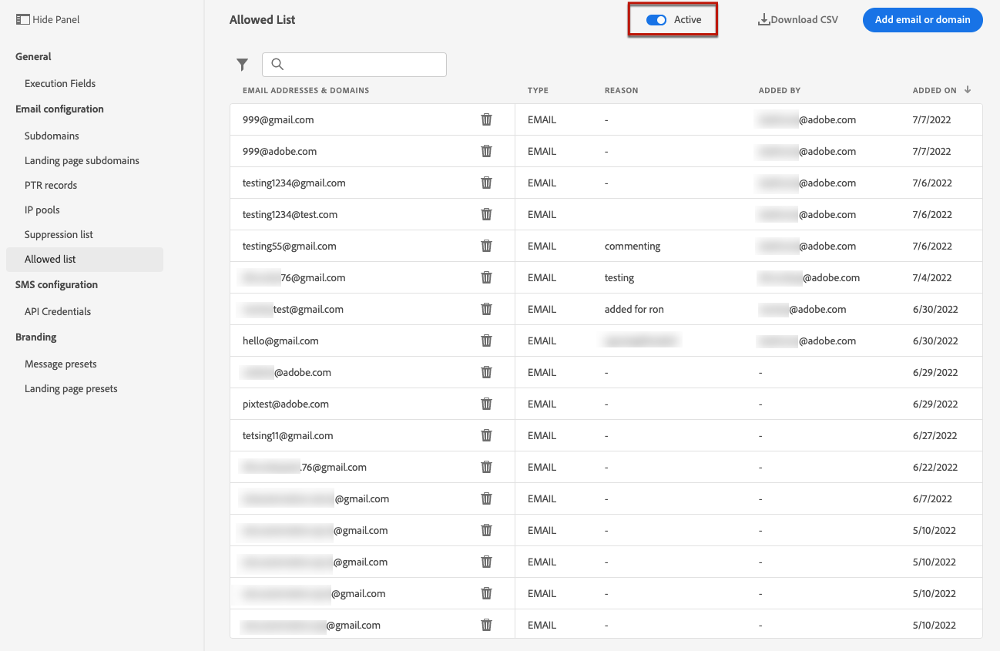

1. Select **[!UICONTROL Deactivate allowed list]**. The allowed list is no longer active.

    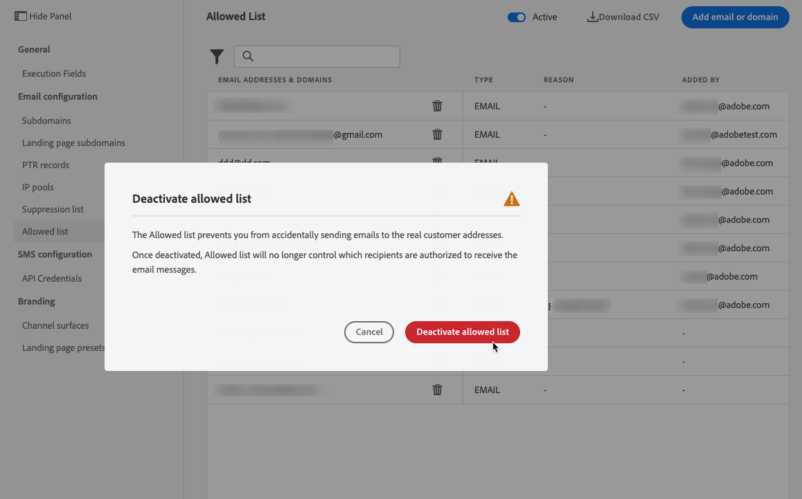

    >[!NOTE]
    >
    >After you deactivate the allowed list, there is a 10-minute delay before it takes effect in your journeys and campaigns. Similarly, updates to both the allowed list and suppression list can take up to 10 minutes to reflect.

The allowed list logic does not apply when the feature is deactivated. Learn more in [this section](#logic).

## Add entities to the allowed list {#add-entities}

To add new email addresses or domains to the allowed list for a specific sandbox, you can either [manually populate the list](#manually-populate-list), or use an [API call](#api-call-allowed-list).

>[!NOTE]
>
>The allowed list can contain up to 1,000 entries.

### Manually populate the allowed list {#manually-populate-list}

>[!CONTEXTUALHELP]
>id="ajo_admin_allowed_list_add_header"
>title="Add addresses or domains to the allowed list"
>abstract="You can manually add new email addresses or domains to the allowed list by selecting them one by one."

>[!CONTEXTUALHELP]
>id="ajo_admin_allowed_list_add"
>title="Add addresses or domains to the allowed list"
>abstract="You can manually add new email addresses or domains to the allowed list by selecting them one by one."

You can manually populate the [!DNL Journey Optimizer] allowed list by adding an email address or a domain through the user interface.

>[!NOTE]
>
>You can only add one email address or domain at a time.

To do this, follow the steps below.

1. Select the **[!UICONTROL Add email or domain]** button.

    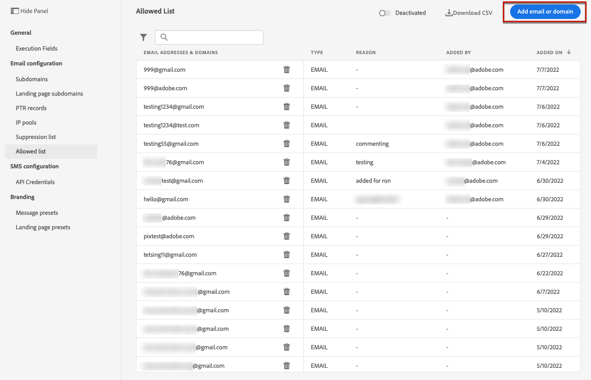

1. Choose the address type: **[!UICONTROL Email address]** or **[!UICONTROL Domain address]**.

1. Enter the email address or domain you want to send emails to.

    >[!NOTE]
    >
    >Make sure you enter a valid email address (such as abc@company.com) or domain (such as abc.company.com).

1. Specify a reason if needed.

    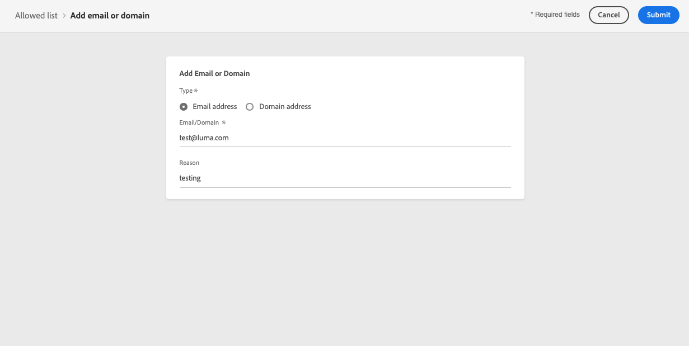

    >[!NOTE]
    >
    >All ASCII characters in the range 32 to 126 are allowed in the **[!UICONTROL Reason]** field. The full list can be found on [this page](https://en.wikipedia.org/wiki/ASCII#Printable_characters){target="_blank"} for example. 

1. Click **[!UICONTROL Submit]**.

### Add entities using an API call {#api-call-allowed-list}

To populate the allowed list, you can also call the suppression API with the `ALLOWED` value for the `listType` attribute. For example:

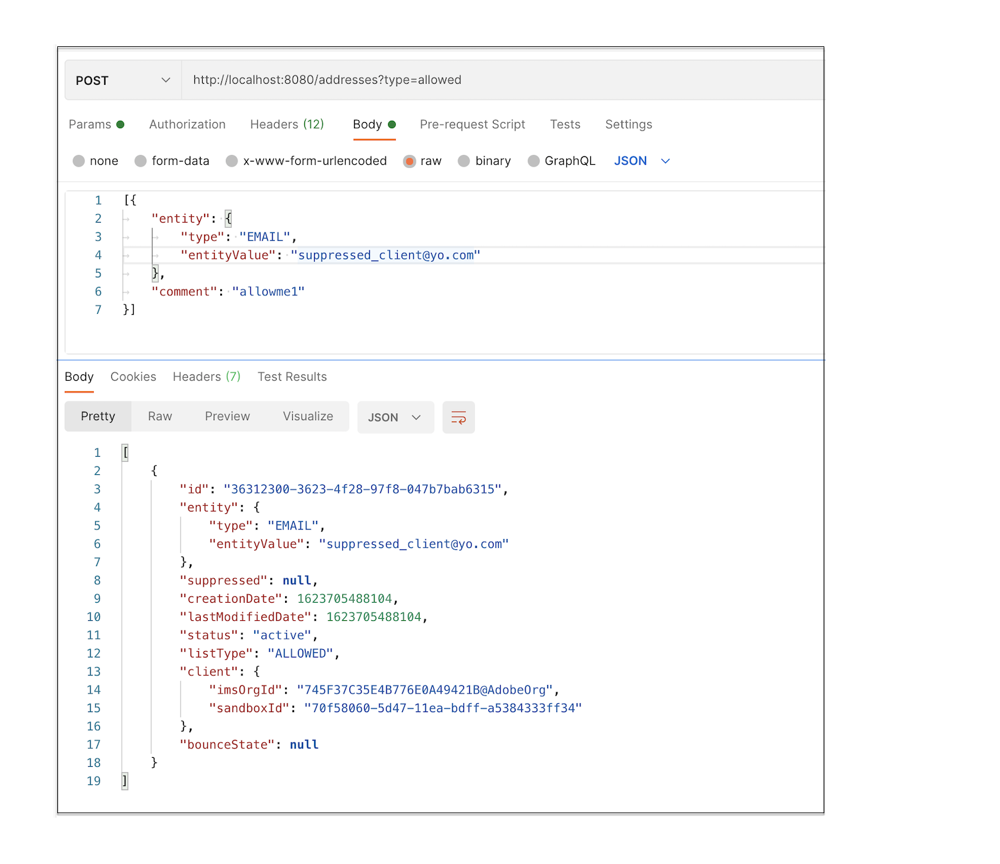

You can perform the **Add**, **Delete** and **Get** operations.

Learn more about making API calls in the [Adobe Experience Platform APIs](https://experienceleague.adobe.com/docs/experience-platform/landing/platform-apis/api-guide.html){target="_blank"} reference documentation.

## Download the allowed list {#download-allowed-list}

To export the allowed list as a CSV file, follow the steps below:

1. Select the **[!UICONTROL Download CSV]** button.

    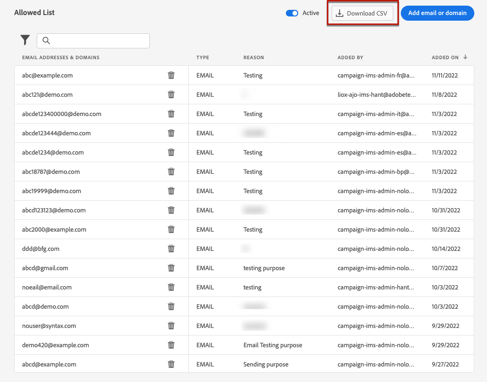

1. Wait until the file is generated.

    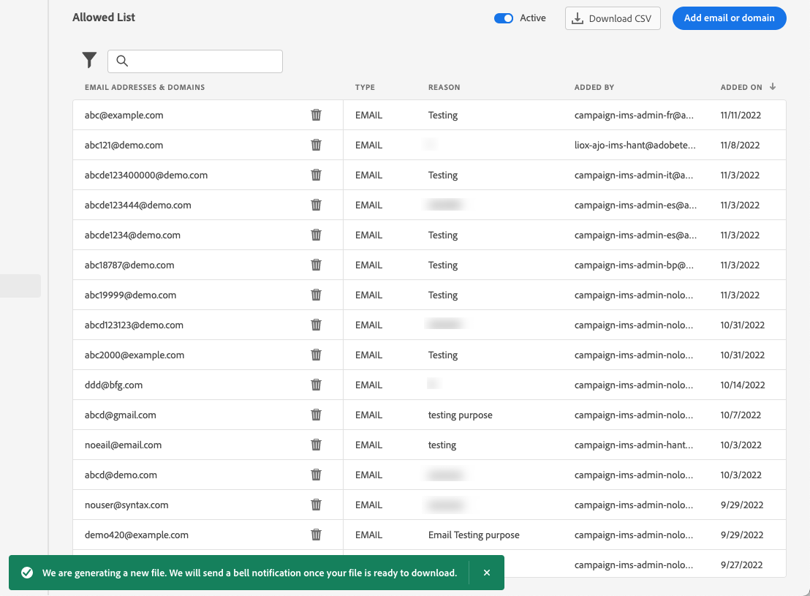

    >[!NOTE]
    >
    >Download time depends on the file size, meaning the number of addresses that are on the allowed list.
    >
    >One download request can be processed at a time for a given sandbox.

1. Once the file is generated, you receive a notification. Click the bell icon on top right of the screen to display it.

1. Click the notification itself to download the file.

    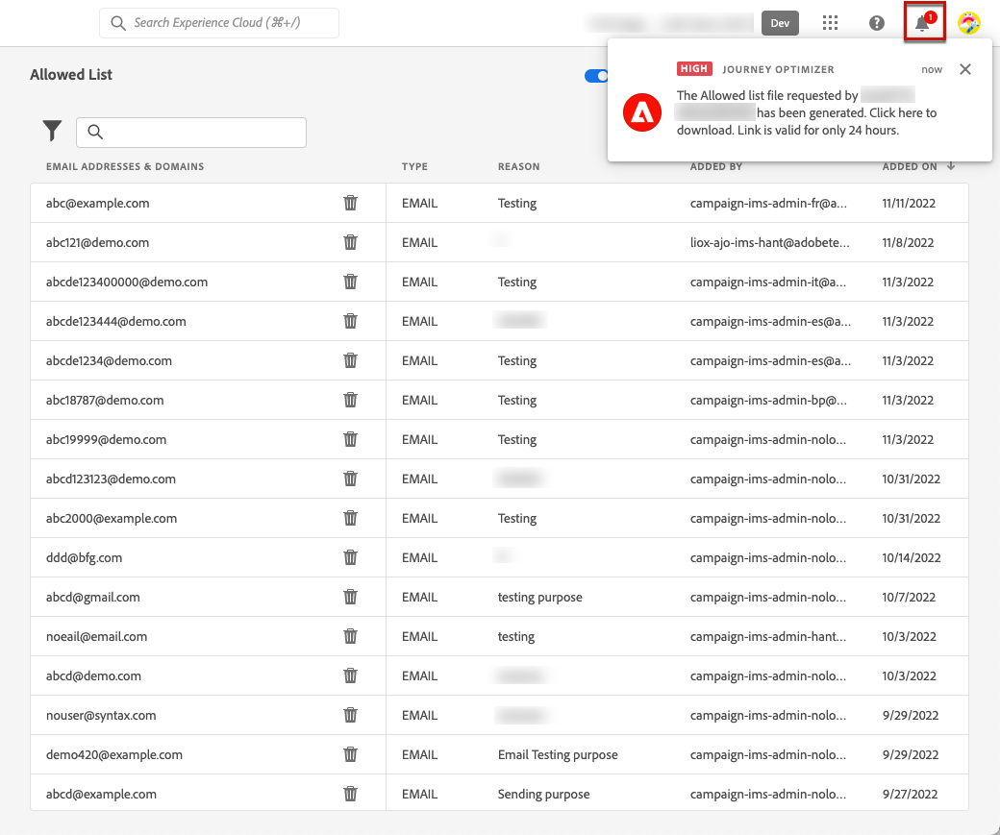

    >[!NOTE]
    >
    >The link is valid for 24 hours.

## Allowed list logic {#logic}

>[!CONTEXTUALHELP]
>id="ajo_admin_allowed_list_logic"
>title="Manage the allowed list"
>abstract="When the allowed list is activated, only the recipients included in the allowed list will receive email messages from this sandbox. When deactivated, all recipients will receive emails."

When the allowed list is [active](#enable-allow-list), the following logic applies:

* If the allowed list is **empty**, no email will be sent out.

* If an entity is **on the allowed list**, and not on the suppression list, the email is sent to the corresponding recipient(s). However, if the entity is also on the [suppression list](../reports/suppression-list.md), the corresponding recipient(s) will not receive the email, the reason being **[!UICONTROL Suppressed]**.

* If an entity is **not on the allowed list** (and not on the suppression list), the corresponding recipient(s) will not receive the email, the reason being **[!UICONTROL Not allowed]**.

>[!NOTE]
>
>The profiles with **[!UICONTROL Not allowed]** status are excluded during the message sending process. Therefore, while the **Journey reports** will show these profiles as having moved through the journey ([Read Audience](../building-journeys/read-audience.md) and [message activities](../building-journeys/journey-action.md)), the **Email reports** will not include them in the **[!UICONTROL Sent]** metrics as they are filtered out prior to email sending.
>
>Learn more about the [Live Report](../reports/live-report.md) and [Customer Journey Analytics report](../reports/report-gs-cja.md).

When the allowed list is [deactivated](#deactivate-allow-list), all the emails that you are sending from the current sandbox are sent out to all recipients (provided they are not on the suppression list), including real customer addresses.

## Exclusion reporting {#reporting}

When the allowed list is active, you can retrieve email addresses or domains that were excluded from a sending because they were not on the allowed list. To do this, you can use the [Adobe Experience Platform Query Service](https://experienceleague.adobe.com/docs/experience-platform/query/api/getting-started.html){target="_blank"} to make the API calls below.

To get the **number of emails** that were not sent because the recipients were not on the allowed list, use the following query:

```sql
SELECT count(distinct _id) from cjm_message_feedback_event_dataset WHERE
_experience.customerJourneyManagement.messageExecution.messageExecutionID = '<MESSAGE_EXECUTION_ID>' AND
_experience.customerJourneyManagement.messageDeliveryfeedback.feedbackStatus = 'exclude' AND
_experience.customerJourneyManagement.messageDeliveryfeedback.messageExclusion.reason = 'EmailNotAllowed'
```

To get the **list of email addresses** that were not sent because the recipients were not on the allowed list, use the following query:

```sql
SELECT distinct(_experience.customerJourneyManagement.emailChannelContext.address) from cjm_message_feedback_event_dataset WHERE
_experience.customerJourneyManagement.messageExecution.messageExecutionID IS NOT NULL AND
_experience.customerJourneyManagement.messageDeliveryfeedback.feedbackStatus = 'exclude' AND
_experience.customerJourneyManagement.messageDeliveryfeedback.messageExclusion.reason = 'EmailNotAllowed'
```
