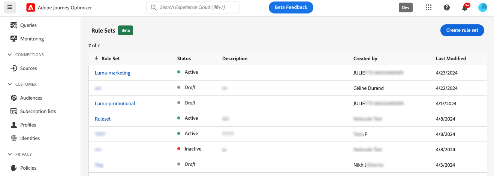
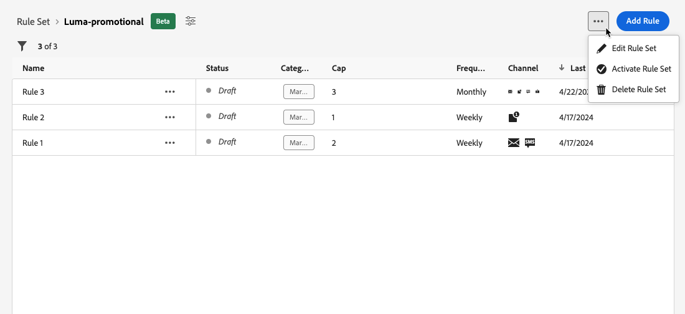
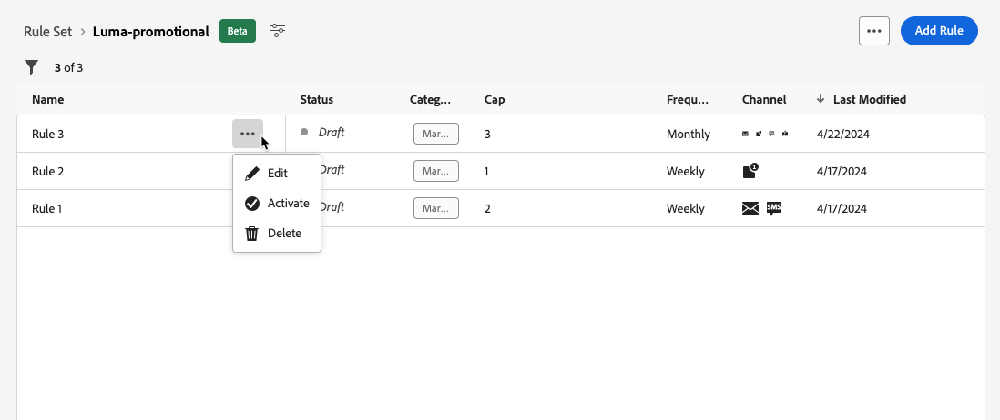
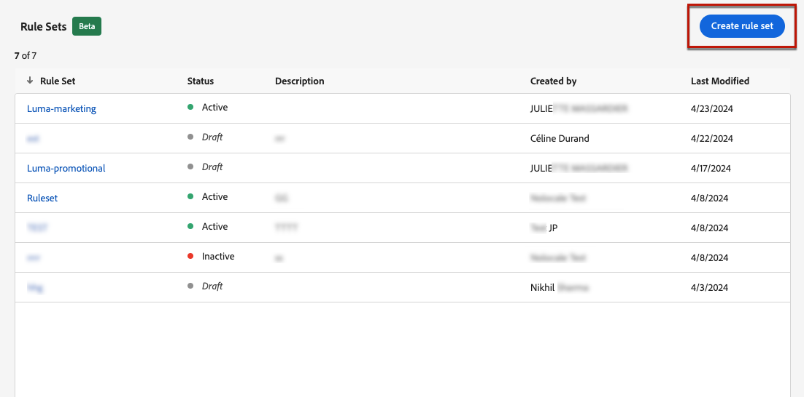
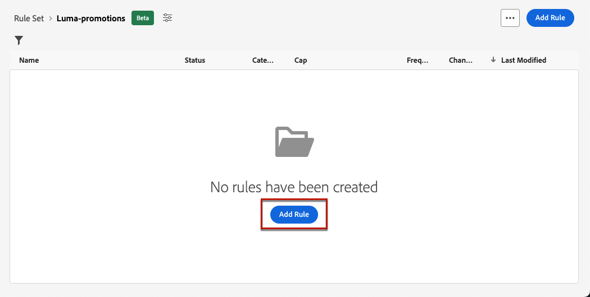
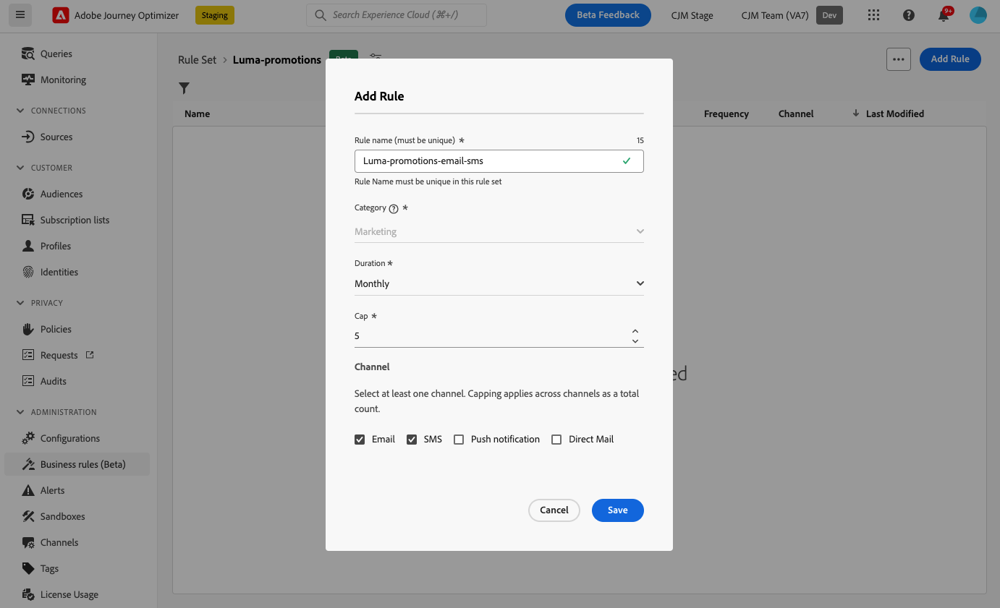
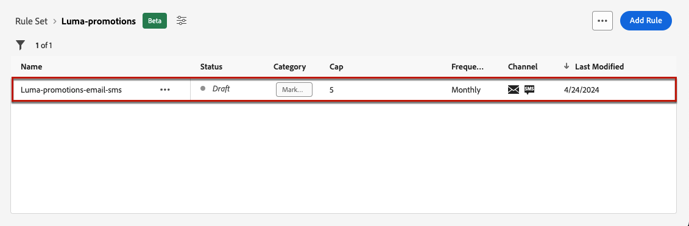
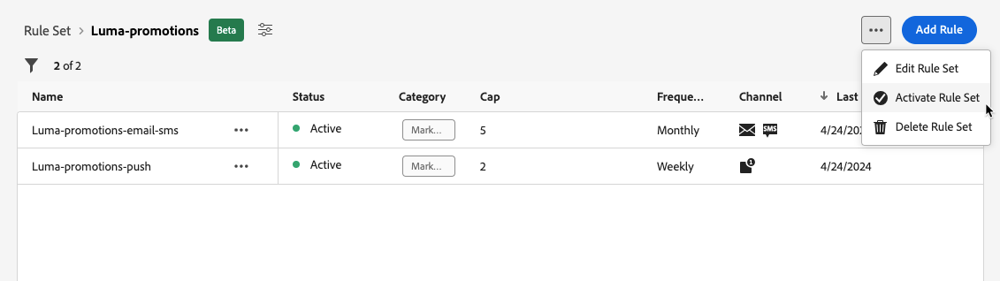

# Business rules {#business-rules}

>[!AVAILABILITY]
>
>Business rules are currently available as a beta to select users only.

[!DNL Journey Optimizer] allows you to control how often users will receive a message by setting cross-channel rules that will automatically exclude over-solicited profiles from messages and actions.

For example, for a brand, a rule could be: to send no more than 4 marketing messages per month to their customers. To do this, you can use a frequency rule which will cap the number of messages sent based on one or more channels during a monthly calendar period.

Through the creation of different rule sets for improved granularity, [!DNL Journey Optimizer] enables you to apply frequency capping to different types of marketing communications. For example, you can create a rule set to limit the number of **promotional communications** sent to your customers, and create another rule set to limit the number of **newsletters** sent to them.

>[!NOTE]
>
>Business rules are different from opt-out management, which allows users to unsubscribe from receiving communications from a brand. [Learn more](../privacy/opt-out.md#opt-out-management)

## Access rule sets {#access-rule-sets}

Rule sets are available from the **[!UICONTROL Administration]** > **[!UICONTROL Business rules (Beta)]** menu. All rules are listed, sorted by creation date.

Click a rule set name to view and edit its content. All rules included in that rule set are listed.

The contextual menu on top right enables you to:

* Edit the name and description of the rule set
* Activate the rule set - [learn more](#activate-rule)
* Delete the rule set

For each rule in the rule set, the **[!UICONTROL More actions]** button enables you to:

* Edit the rule
* Activate the rule [learn more](#activate-rule)
* Delete the rule

<!--### Permissions{#permissions-frequency-rules}

To access, create, edit or delete message frequency rules, you must have the **[!UICONTROL Manage frequency rules]** permission. 

Users with the **[!UICONTROL View frequency rules]** permission are able to view rules, but not to modify or delete them.

Learn more about permissions in [this section](../administration/high-low-permissions.md).-->

## Create a rule set {#create-rule-set}

To create a rule set, follow the steps below.

1. Access the **[!UICONTROL Rules sets]** list, then click **[!UICONTROL Create rule set]**.

    

1. Define the rule set name, add a description if wanted and click **[!UICONTROL Save]**.

   

   >[!NOTE]
   >
   >The rule set name must be unique.

1. Now you can [define the rules](#create-new-rule) you want to add to this rule set, and [activate](#activate-rule) it.

   >[!NOTE]
   >
   >Make sure all the rules you want to apply to your messages are also activated in the rule set.

## Create a rule {#create-new-rule}

>[!CONTEXTUALHELP]
>id="ajo_rule_sets_category"
>title="Select the message rule category"
>abstract="When activated and applied to a message, all the frequency rules matching the selected category will be automatically applied to this message. Currently only the Marketing category is available."

>[!CONTEXTUALHELP]
>id="ajo_rule_sets_capping"
>title="Set the capping for your rule"
>abstract="Specify the maximum number of messages sent to a customer profile within the chosen time frame. The frequency cap will be based on the selected calendar period and will be reset at the beginning of the corresponding time frame."

>[!CONTEXTUALHELP]
>id="ajo_rule_sets_channel"
>title="Define the channel(s) the rule applies to"
>abstract="Select at least one channel. Capping applies across channels as a total count."

To add a rule to a rule set, follow the steps below.

1. From the rule set you just created, click **[!UICONTROL Add rule]**.

    

1. Define the rule name.

   >[!NOTE]
   >
   >The rule set name must be unique.

1. Select the message rule category.

   >[!NOTE]
   >
   >Currently only the **[!UICONTROL Marketing]** category is available.

1. From the **[!UICONTROL Duration]** drop-down list, select a time frame for the capping to be applied. [Learn more](#frequency-cap)

1. Set the capping for your rule, meaning the maximum number of messages that can be sent to an individual user profile each month, week or day - according to your selection above.

1. Select the channel you want to use for this rule: **[!UICONTROL Email]**, **[!UICONTROL SMS]**, **[!UICONTROL Push notification]** or **[!UICONTROL Direct mail]**.

   

   >[!NOTE]
   >
   >You must select at least one channel to be able to create the rule.

1. Select several channels if you want to apply capping across all selected channels as a total count.

   For example, set capping to 5, and select both the email and sms channels. If a profile has already received 3 marketing emails and 2 marketing sms for the selected period, this profile will be excluded from the very next delivery of any marketing email or sms.

1. Click **[!UICONTROL Save]** to confirm the rule creation. Your message is added to the rule set, with the **[!UICONTROL Draft]** status.

   

1. Repeat the steps above to add as many rules as needed to the rule set.

Now you need to activate each rule before it can be applied to any messages. [Learn more](#activate-rule)

>[!NOTE]
>
>Make sure the rule set is also activated to be able to select it in your messages.

### Frequency cap {#frequency-cap}

>[!CONTEXTUALHELP]
>id="ajo_rule_sets_duration"
>title="Select the message rule category"
>abstract="When activated and applied to a message, all the frequency rules matching the selected category will be automatically applied to this message. Currently only the Marketing category is available."

From the **[!UICONTROL Duration]** drop-down list, select if you want the capping to be applied monthly, weekly or daily.

Frequency cap is based on the selected calendar period. It is reset at the beginning of the corresponding time frame.

The expiry of the counter for each period is as follows:

* **[!UICONTROL Monthly]**: The frequency cap is valid until the last day of the month at 23:59:59 UTC. For example, the monthly expiration for January is 01-31 23:59:59 UTC.

* **[!UICONTROL Weekly]**: The frequency cap is valid until Saturday 23:59:59 UTC of that week as the calendar week starts on Sunday. The expiry is irrespective of the rule creation. For example, if the rule is created on Thursday, this rule is valid until Saturday at 23:59:59.

* **[!UICONTROL Daily]**: The daily frequency cap is valid for the day until 23:59:59 UTC and resets to 0 at the start of the next day.

### Daily frequency cap {#daily-frequency-cap}

>[!CAUTION]
>
>To ensure accuracy for daily frequency capping rules, the use of [streaming segmentation](https://experienceleague.adobe.com/docs/experience-platform/segmentation/ui/streaming-segmentation.html){target="_blank"} is mandatory. Learn more on audience evaluation methods in [this section](../audience/about-audiences.md#evaluation-method-in-journey-optimizer).

For any segment size up to the limit of 60 million messages per hour<!--not clear-->, make sure that your campaigns are at least 2 hours apart.

<!-- Journey example:

* If customer sets a Daily rule under the Global Ruleset for email <= 2/day:
   * Journey 123 (scheduled for noon)
   * Journey 456 (scheduled for noon)
   * Journey 789 (scheduled for 1 pm)

   In this example, the Daily Frequency cap will not guarantee <= 2/day. The rule will only be guaranteed when Journeys are at least 2 hours apart:
   * Journey 123 (scheduled for noon)
   * Journey 456 (scheduled for 2 pm)
   * Journey 789 (scheduled for 4 pm)-->

For example, if you set a daily rule under a rule set for the email channel which is less than or equal to 2 days, and if you create the following campaigns:
* Campaign A (scheduled for noon)
* Campaign A (scheduled for 3pm)
* Campaign B (scheduled for 1pm)

This setup will not work for two reasons:
* The daily frequency cap is not guaranteed as the campaigns are not 2 hours apart.
* It is not a best practice to schedule the same campaign multiple times in a day to take advantage of the daily cap.

The example below should be honored by the daily frequency cap:
* Campaign A (scheduled for noon)
* Campaign B (scheduled for 2pm)

<!--* To use the Daily Cap with a Journey, customers can use either an Event Triggered Journey or an Audience Qualified Journey. If customers wish to use the Daily Cap with a Read Audience Journey, they should use a Campaign instead and associate a Local Ruleset with the campaign, following the example given above.-->

## Activate rules and rule sets {#activate-rule}

When created, a rule has the **[!UICONTROL Draft]** status and is not yet impacting any message. To enable it, click the **[!UICONTROL More actions]** button next to the rule and select **[!UICONTROL Activate]**.

   

You must also activate the rule set to be able to access it in campaigns/journeys and apply it to your messages.

   

Activating a rule set will impact any messages it applies to on their next execution. Learn how to [apply a rule set to a message](#apply-rule-set).

>[!NOTE]
>
>It can take up to 10 minutes for a rule or rule set to be fully activated. You do not need to modify messages or republish journeys for a rule to take effect.

<!--Currently, once a rule set is activated, no more rules can be added to that rule set.-->

## Deactivate rules and rule sets {#deactivate-rule}

To deactivate a rule or a rule set, click the **[!UICONTROL More actions]** button next to the desired item and select **[!UICONTROL Deactivate]**.

   
Its status will change to **[!UICONTROL Inactive]** and the rule will not apply to future message executions. Any messages currently in execution will not be affected.

>[!NOTE]
>
>Deactivating a rule or rule set does not affect or reset any counts on individual profiles.

## Apply a frequency rule to a message {#apply-frequency-rule}
 
To apply a frequency rule to a message, follow the steps below.

1. When creating a [campaign](../campaigns/create-campaign.md), select one of the channels you defined for your rule set and edit the content of your message.

1. In the content edition screen, click the **[!UICONTROL Add Business Rule]** button.

1. Select the [rule set you created](#create-rule-set).

   

   >[!NOTE]
   >
   >Only [activated](#activate-rule) rule sets display in the list.

   <!--Messages where the category selected is **[!UICONTROL Transactional]** will not be evaluated against business rules.-->

1. You can view the number of profiles excluded from delivery in the [Global report](../reports/global-report.md), and in the [Live report](../reports/live-report.md), where frequency rules will be listed as a possible reason for users excluded from delivery.

>[!NOTE]
>
>Several rules can apply to the same channel, but once the lower cap is reached, the profile will be excluded from the next deliveries.

<!--
## Example: combine several rules {#frequency-rule-example}

You can combine several message frequency rules, such as described in the example below.

1. [Create a rule](#create-new-rule) called *Overall Marketing Capping*:

   * Select all channels.
   * Set capping to 12 monthly.

   

1. To further restrict the number of marketing-based push notifications that a user is sent, create a second rule called *Push Marketing Cap*:

   * Select Push channel.
   * Set capping to 4 monthly.

   

1. Save and [activate](#activate-rule) the rule.

1. [Create a message](../building-journeys/journeys-message.md) for every channel you want to communicate through and select the **[!UICONTROL Marketing]** category for each message. [Learn how to apply a frequency rule](#apply-frequency-rule)

   

In this scenario, an individual profile:
* can receive up to 12 marketing messages per month;
* but will be excluded from marketing push notifications after they have received 4 push notifications.-->

When testing frequency rules, it is recommended to use a newly created [test profile](../audience/creating-test-profiles.md), because once a profile's frequency cap is reached, there is no way to reset the counter until the next period. Deactivating a rule will allow capped profiles to receive messages, but it will not remove or delete any counter increments.

