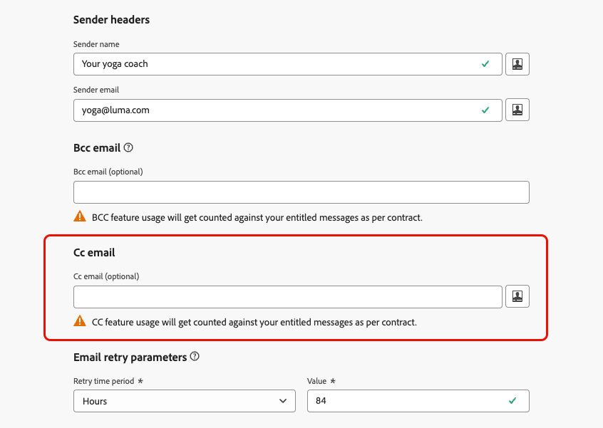

# Add a CC field to emails {#cc-email-field}

>[!CONTEXTUALHELP]
>id="ajo_admin_config_cc"
>title="Define a CC email address"
>abstract="You can add a visible CC (carbon copy) field to emails sent with this channel configuration. Enter a fixed email address or use personalization (profile attribute or context variable). Be aware that CC usage is counted toward your entitled message volume."

>[!AVAILABILITY]
>
>This feature is available for all customers in Limited Availability. Contact your Adobe representative to gain access.

You can add a visible CC (carbon copy) field to emails sent by [!DNL Journey Optimizer] through your journeys and campaigns. This optional feature is configured at the [channel configuration](channel-surfaces.md) level, alongside the email header parameters and BCC email option.

>[!CAUTION]
>
>CC feature usage is counted against the number of messages you are licensed for. Only enable it where you need visible CC recipients. Check your contract for licensed volumes.

Like [BCC](archiving-support.md#bcc-email), the CC field is meant to send a copy of the email to an additional address. However, it differs from BCC in the following ways:

* The CC email address is visible to the primary recipient, so it enables the primary recipient to see who is copied and know whom to contact for follow-up.
* Unlike BCC, the CC email field supports personalization, which enables you to use one channel configuration for many scenarios, and send the copy to the right person per recipient (e.g. their relationship manager). For API-triggered campaigns, this allows you to CC the address relevant to a specific event or transaction.

>[!NOTE]
>
>If you need to keep copies where the address must not be visible to the recipient for archival or compliance purposes, use [BCC](archiving-support.md#bcc-email) instead of CC.

## Enable CC email {#enable-cc}

To enable the **[!UICONTROL CC email]** option, configure the CC field in the [email channel configuration](../email/email-settings.md).

You can specify any external address in correct format, except an email address defined on a subdomain delegated to Adobe. For example, if you delegated the *marketing.luma.com* subdomain to Adobe, any address like *abc@marketing.luma.com* is prohibited.

>[!CAUTION]
>
>You can only define one email address. Make sure the CC address has enough reception capacity to store all the emails that are sent using the current channel configuration.
>
>More recommendations are listed in [this section](#cc-recommendations-limitations).

The **[!UICONTROL CC email]** field accepts three types of values:

* A **hardcoded value**, which can be a fixed email address.

* A **profile attribute**, such as the relationship manager email address available in the profile.

* A **contextual attribute** - this value can **only be used in API-triggered campaigns**. It is retrieved from the API payload which must include the context variable `context.channel.email.ccvalues` with the CC address value.

    >[!WARNING]
    >
    >When CC is set using a **context variable**, it is supported only in **API-triggered campaigns**. If you use that channel configuration in a journey or an action campaign, the email is sent to the primary recipient only; no copy is sent to the CC address.

Any [attachment](../email/pdf-attachments.md) included in the message is sent to both the primary recipient and the CC address.

If the CC value is invalid or missing at send time (e.g. an empty context variable), the CC copy is skipped; the primary recipient still receives the email.

If there are multiple values for the CC field (for example, when using a profile attribute or expression that resolves to several addresses), only the first value is used for sending the email.

## Edit CC email in existing channel configurations {#cc-edit}

If you [edit an email configuration](channel-surfaces.md#edit-channel-surface) and add or change the CC field, you can only use:

* A **hardcoded** CC email address, or  
* A **context variable** (for API-triggered use).

>[!CAUTION]
>
>When editing an existing email channel configuration, you cannot add new [profile attributes](../personalization/personalization-build-expressions.md#sources) to the **[!UICONTROL CC email]** field. You must create a [new channel configuration](channel-surfaces.md#create-channel-surface).

## Recommendations and limitations {#cc-recommendations-limitations}

* **Entitlement:** CC usage is counted toward your entitled message volume. Use CC only where you need visible CC recipients. Check your contract for licensed volumes.

* **Privacy and compliance:** To ensure your privacy compliance, CC emails must be processed by a system capable of storing securely personally identifiable information (PII) when applicable. As messages can contain sensitive or private data, such as PII, make sure the CC address is correct and secure the access to messages.

* **Inbox management:** Your inbox used for CC should be properly managed for space and delivery. If the inbox returns bounces, some emails may not be received.

* **Delivery timing:** Messages may be delivered to the CC email address before the target recipients. CC messages can also be sent even though the original messages may have [bounced](../reports/suppression-list.md#delivery-failures).

* **Reporting:** Opens, clicks, and other engagement from CC recipients are included in email reporting metrics. Thus, any opens or clicks from CC recipients will cause miscalculations in [reports](../reports/report-gs-cja.md).

* **Spam:** Do not mark messages as spam in the CC inbox, as it will impact all the other emails sent to this address.

* **Deliverability:** Use CC in line with your sending practices and recipient expectations. Excessive use of CC can affect deliverability; follow [deliverability best practices](../reports/deliverability.md) and your contract terms.

>[!CAUTION]
>
>Do not click the unsubscribe link in the emails sent to the CC address as you will immediately unsubscribe the **To** recipient of email.
