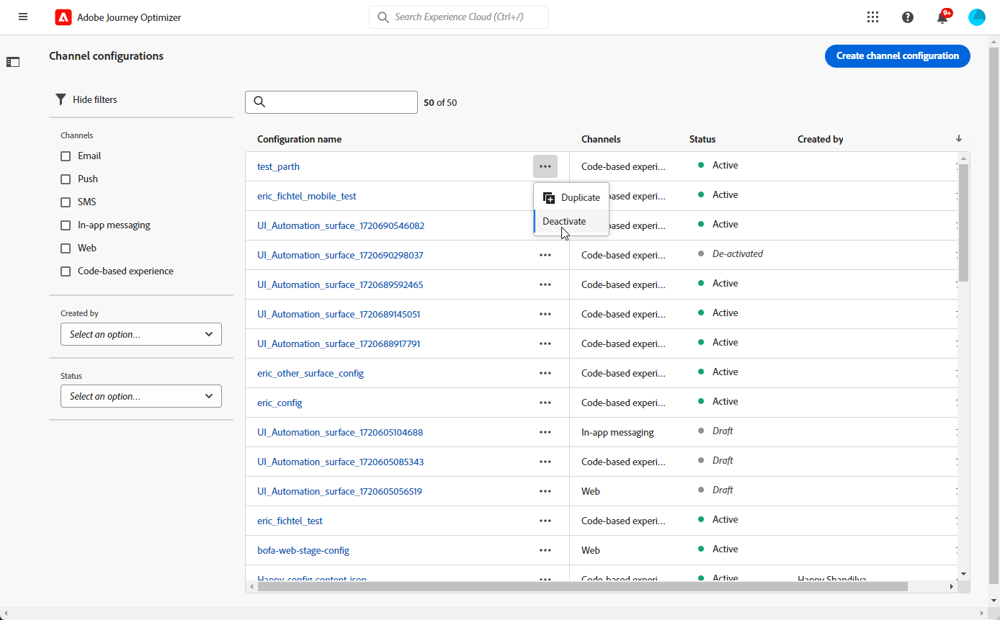
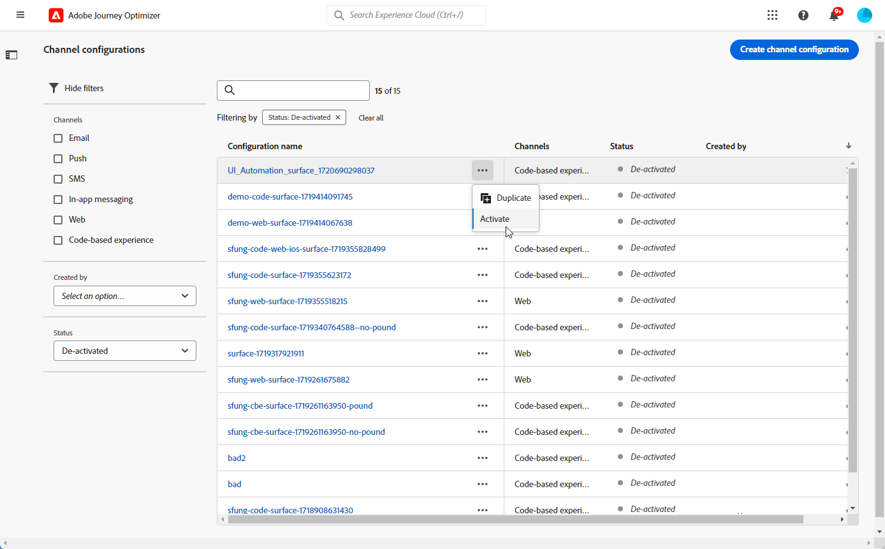

# Set up channel configurations {#set-up-channel-surfaces}

>[!CONTEXTUALHELP]
>id="ajo_admin_channel_surfaces"
>title="Channel configuration"
>abstract="A channel configuration is a configuration which has been defined by a System Administrator. It contains all the technical parameters for sending the message, such as header parameters, subdomain, mobile apps, etc."

>[!CONTEXTUALHELP]
>id="ajo_admin_marketing_action"
>title="Marketing action"
>abstract="Choose the Marketing actions to link consent policies to the messages using this setup. All consent policies connected to the marketing action will be used to honor your customers' preferences."

With [!DNL Journey Optimizer], you can set up channel configurations (i.e. message presets) that define all the technical parameters required for your messages: email type, sender email and name, mobile apps, SMS configuration, and more. 

>[!CAUTION]
>
> * To create, edit and delete channel configurations, you must have the [Manage messages presets](../administration/high-low-permissions.md#administration-permissions) permission.
>
> * You must perform the [Email configuration](../email/get-started-email-config.md), [Push configuration](../push/push-configuration.md), [SMS configuration](../sms/sms-configuration.md), [In-app configuration](../in-app/inapp-configuration.md), [Code-based configuration](../code-based/code-based-configuration.md), [Web configuration](../web/web-configuration.md) and [Direct mail configuration](../direct-mail/direct-mail-configuration.md) steps before creating channel configurations.

Once channel configurations have been configured, you will be able to select them when creating messages from a journey or a campaign.

<!--
➡️ [Learn how to create and use email configurations in this video](#video-presets)
-->

## Create a channel configuration {#create-channel-surface}

>[!CONTEXTUALHELP]
>id="ajo_admin_message_presets_header"
>title="Channel configuration settings"
>abstract="When setting up a channel configuration, select the channel it applies to, and define all the technical parameters required for your sending, such as email type, sender name, mobile apps, SMS configuration, and more."

>[!CONTEXTUALHELP]
>id="ajo_admin_message_presets"
>title="Channel configuration settings"
>abstract="To be able to create actions such as emails from a journey or a campaign, you must first create a channel configuration that defines all the technical settings required for your messages. You must have the Manage messages presets permission to create, edit and delete channel configurations."

>[!CONTEXTUALHELP]
>id="ajo_surface_marketing_action"
>title="Select a marketing action"
>abstract="Choose a marketing action in the configuration in order to associate a consent policy with the message."

To create a channel configuration, follow these steps:

1. Access the **[!UICONTROL Channels]** > **[!UICONTROL General settings]** > **[!UICONTROL Channel configurations]** menu, then click **[!UICONTROL Create channel configuration]**.

    

1. Enter a name and a description (optional) for the configuration, then select the channel to configure.

    

    >[!NOTE]
    >
    > Names must begin with a letter (A-Z). It can only contain alpha-numeric characters. You can also use underscore `_`, dot`.` and hyphen `-` characters.

1. To assign custom or core data usage labels to the configuration, you can select **[!UICONTROL Manage access]**. [Learn more on Object Level Access Control (OLAC)](../administration/object-based-access.md).

1. Select your channel. 

1. Select **[!UICONTROL Marketing action]**(s) to associate consent policies to the messages using this configuration. All consent policies associated with the marketing action are leveraged in order to respect the preferences of your customers. [Learn more](../action/consent.md#surface-marketing-actions)

    >[!NOTE]
    >
    >Consent policies are currently only available for organizations that have purchased the **Healthcare Shield** and **Privacy and Security Shield** add-on offerings.

    

1. Once all the parameters have been configured, click **[!UICONTROL Submit]** to confirm. You can also save the channel configuration as draft and resume its configuration later on.

    

    >[!NOTE]
    >
    >You cannot proceed with email configuration creation while the selected IP pool is under [edition](ip-pools.md#edit-ip-pool) (**[!UICONTROL Processing]** status), and has never been associated with the selected subdomain. [Learn more](#subdomains-and-ip-pools)
    >
    >Save the configuration as draft and wait until the IP pool has the **[!UICONTROL Success]** status to resume configuration creation.
    
1. Once the channel configuration has been created, it displays in the list with the **[!UICONTROL Processing]** status.

    During this step, several checks will be performed to verify that it has been configured properly. <!--The processing time is around **48h-72h**, and can take up to **7-10 business days**.-->

    >[!NOTE]
    > When creating an email configuration for a subdomain, the processing time varies as detailed below:
    >
    > * For **new subdomains**, the process for creating the first channel configuration can take **10 min to 10 days**.
    > * For **non production sandboxes**, or if the selected subdomain is **already used** in another approved channel configuration, the process takes only up to **3 hours**.

    These checks include configuration and technical tests that are performed by the Adobe team:

    * SPF validation
    * DKIM validation
    * MX record validation
    * Check IPs denylisting
    * Helo host check
    * IP pool verification
    * A/PTR record, t/m/res subdomain verification
    * FBL registration (this check will be performed only the first time an email configuration is created for a given subdomain)

    >[!NOTE]
    >
    >If the checks are not successful, learn more on the possible failure reasons in [this section](#monitor-channel-surfaces).  

1. Once the checks are successful, the channel configuration gets the **[!UICONTROL Active]** status. It is ready to be used to deliver messages.

    

## Monitor channel configurations {#monitor-channel-surfaces}

All your channel configurations display in the **[!UICONTROL Channels]** > **[!UICONTROL Channel configurations]** menu. Filters are available to help you browse through the list (channel, user, status).

Once created, channel configurations can have the following statuses:

* **[!UICONTROL Draft]**: The channel configuration has been saved as a draft and has not been submitted yet. Open it to resume the configuration.
* **[!UICONTROL Processing]**: The channel configuration has been submitted and is going through several verifications steps.
* **[!UICONTROL Active]**: The channel configuration has been verified and can be selected to create messages.
* **[!UICONTROL Failed]**: One or several checks have failed during the channel configuration verification.
* **[!UICONTROL Deactivated]**: The channel configuration is deactivated. It cannot be used to create new messages.

In case a channel configuration creation fails, the details on each possible failure reason are described below.

If one of these errors occurs, contact [Adobe Customer Care](https://helpx.adobe.com/enterprise/admin-guide.html/enterprise/using/support-for-experience-cloud.ug.html){target="_blank"} to get assistance.

* **SPF validation failed**: SPF (Sender Policy Framework) is an email authentication protocol that allows to specify authorized IPs that can send emails from a given subdomain. SPF validation failure means that the IP addresses in the SPF record do not match the IP addresses used for sending emails to the mailbox providers. 

* **DKIM validation failed**: DKIM (DomainKeys Identified Mail) allows the recipient server to verify that the received message was sent by the genuine sender of the associated domain and that the content of the original message was not altered on its way. DKIM validation failure means that the receiving mail servers are unable to verify the authenticity of the message content and its association with the sending domain.:

* **MX record validation failed**: MX (Mail eXchange) record validation failure means that the mail servers responsible for accepting inbound emails on behalf of a given subdomain are not correctly configured.

* **Deliverability configurations failed**: Deliverability configurations failure can happen due to any of the following reasons:
    * Blocklisting of the allocated IPs
    * Invalid `helo` name
    * Emails being sent from IPs other than the ones specified in the IP pool of the corresponding configuration
    * Unable to deliver emails to inboxes of major ISPs

## Edit a channel configuration {#edit-channel-surface}

To edit a channel configuration, follow the steps below.

>[!NOTE]
>
>You cannot edit the **[!UICONTROL Push notification settings]**. If a channel configuration is only configured for the Push notification channel, it is not editable.

1. From the list, click a channel configuration name to open it.

    

1. Edit its properties as desired.

    >[!NOTE]
    >
    >If a channel configuration has the **[!UICONTROL Active]** status, the **[!UICONTROL Name]**, **[!UICONTROL Select channel]** and **[!UICONTROL Subdomain]** fields are greyed out and cannot be edited.

1. Click **[!UICONTROL Submit]** to confirm your changes.

    >[!NOTE]
    >
    >You can also save the channel configuration as draft and resume update later on.

Once the changes are submitted, the channel configuration will go through a validation cycle similar to the one in place when [creating a channel configuration](#create-channel-surface). The edition processing time can take up to **3 hours**.

>[!NOTE]
>
>If you only edit the **[!UICONTROL Description]**, **[!UICONTROL Email type]** and/or **[!UICONTROL Email retry parameters]** fields, the update is instantaneous.

### Update details {#update-details}

For channel configurations that have the **[!UICONTROL Active]** status, you can check the details of the update. To do so:

Click the **[!UICONTROL Recent update]** icon that is displayed next to the active configuration name.

<!--You can also access the update details from an active channel configuration while update is in progress.-->

On the **[!UICONTROL Recent update]** screen, you can see information such as the update status, and the list of requested changes.

<!---->

### Update statuses {#update-statuses}

A channel configuration update can have the following statuses:

* **[!UICONTROL Processing]**: The channel configuration update has been submitted and is going through several verifications steps.
* **[!UICONTROL Success]**: The updated channel configuration has been verified and can be selected to create messages.
* **[!UICONTROL Failed]**: One or several checks have failed during the channel configuration update verification.

Each status is detailed below.

#### Processing {#surface-processing}

Several deliverability checks will be performed to verify that the configuration has been updated properly.

>[!NOTE]
>
>If you only edit the **[!UICONTROL Description]**, **[!UICONTROL Email type]** and/or **[!UICONTROL Email retry parameters]** fields, the update is instantaneous.

The processing time can take up to **3 hours**. Learn more on the checks performed during the validation cycle in [this section](#create-channel-surface).

If you edit a configuration that was already active:

* Its status remains **[!UICONTROL Active]** while the validation process is in progress.

* The **[!UICONTROL Recent update]** icon displays next to the name of the configuration in the channel configurations list.

* During the validation process, the messages configured using this configuration are still using the older version of the configuration.

>[!NOTE]
>
>You cannot modify a channel configuration while update is in progress. You can still click its name, but all the fields are greyed out. The changes will not be reflected until the update is successful.

#### Success {#success}

Once the validation process is successful, the new version of the configuration is automatically used in all messages using this configuration. However, you may have to wait:
* a few minutes before it is consumed by the unitary messages,
* until the next batch for the configuration to be effective in batch messages.

#### Failed {#failed}

If the validation process fails, the older version of the configuration will still be used.

Learn more on the possible failure reasons in [this section](#monitor-channel-surfaces).

Upon update failing, the configuration becomes editable again. You can click its name and update the settings that need to be fixed.

## Deactivate a channel configuration {#deactivate-a-surface}

To make an **[!UICONTROL Active]** channel configuration unavailable to create new messages, you can deactivate it. However, journeys' messages currently using this configuration will not be affected and will continue working.

>[!NOTE]
>
>You cannot deactivate a channel configuration while an update is processing. You must wait until the update is successful or has failed. Learn more on [editing channel configurations](#edit-channel-surface) and on the [update statuses](#update-statuses).

1. Access the channel configurations list.

1. For the active configuration of your choice, click the **[!UICONTROL More actions]** button.

1. Select **[!UICONTROL Deactivate]**.

    

>[!NOTE]
>
>Deactivated channel configurations cannot be deleted to avoid any issue in journeys using these configurations to send messages.

You cannot directly edit a deactivated channel configuration. However, you can duplicate it and edit the copy to create a new version that you will use to create new messages. You can also activate it again, and wait until the update is successful to edit it.

<!--
## How-to video{#video-presets}

Learn how to create channel configurations, how to use them and how to delegate a subdomain and create an IP pool.

>[!VIDEO](https://video.tv.adobe.com/v/334343?quality=12)
-->
