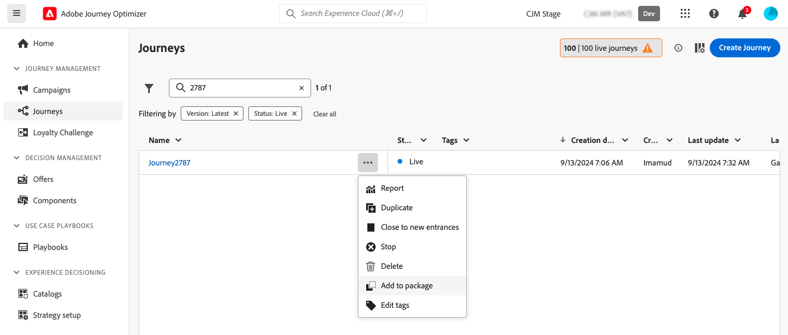
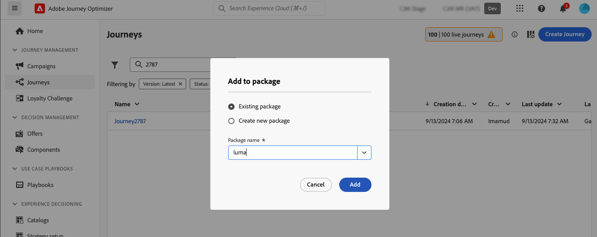
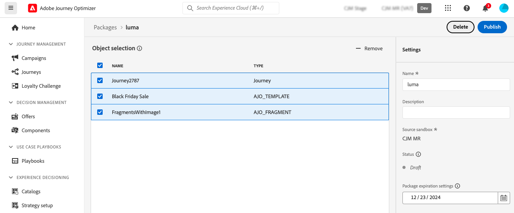
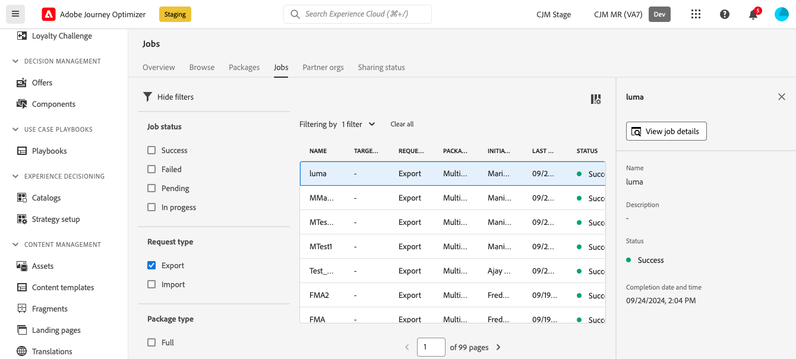
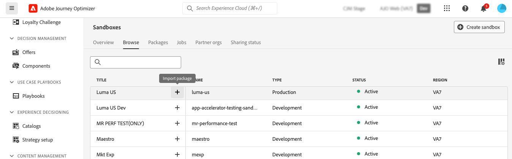
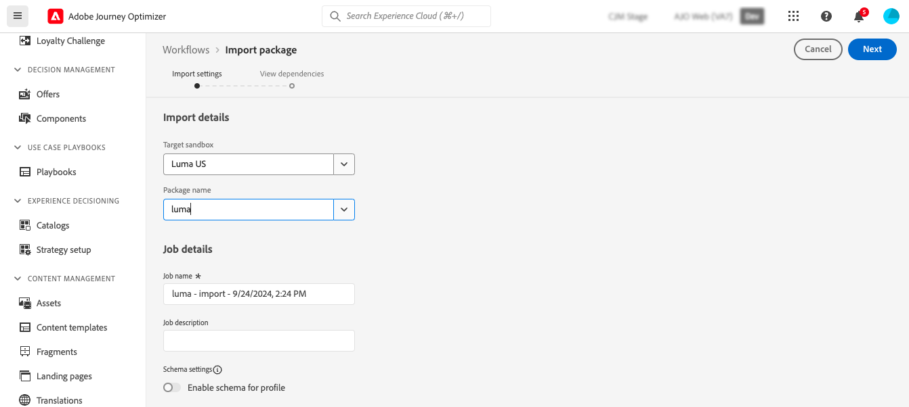
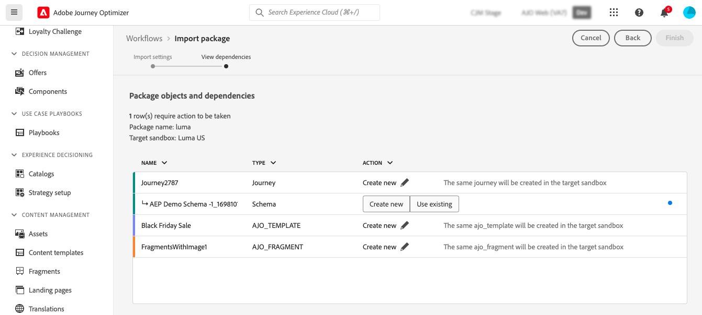
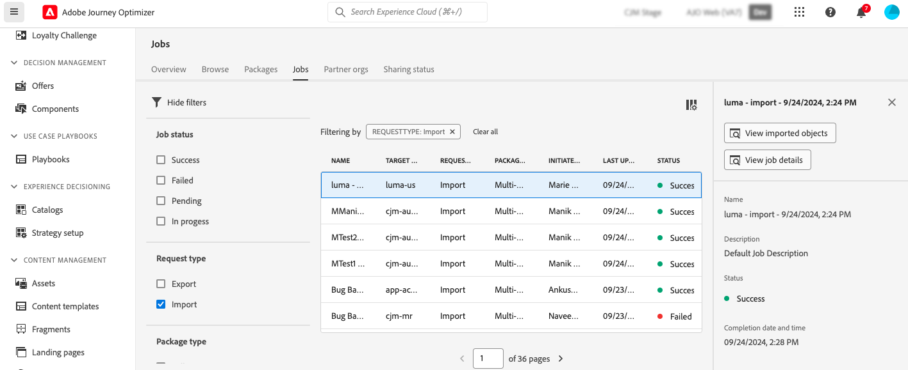

# Export objects to another sandbox {#copy-to-sandbox}

>[!BEGINSHADEBOX]

**On this page:** Learn how to copy Adobe Journey Optimizer objects such as journeys, campaigns, custom actions, content templates, and fragments between sandboxes using package export and import.

>[!ENDSHADEBOX]

You can copy objects such as journeys, campaigns, custom actions, content templates, or fragments, across multiple sandboxes by using package export and import capabilities. A package can consist of a single object or multiple objects. Any objects that are included in a package must be from the same sandbox.

This page describes the Sandbox tooling use case in the context of Journey Optimizer. For more information on the feature itself, refer to the Adobe Experience Platform [Sandbox tooling guide](https://experienceleague.adobe.com/docs/experience-platform/sandbox/ui/sandbox-tooling.html#abobe-journey-optimizer-objects){target="_blank"}.

>[!NOTE]
>
>This feature requires the following permissions from the **Sandbox administration** capability: Manage sandboxes (or View sandboxes) and Manage packages. [Learn more](../administration/ootb-permissions.md)

The copy process is carried via a package export and import between the source and target sandboxes. Here are the general steps to copy a journey from one sandbox to another:

1. [Add the object to export as a package in the source sandbox](#export) 
1. [Publish the package](#publish)
1. [Import the package in the target sandbox](#import)

>[!NOTE]
>
>For migrating Decision management objects to Decisioning, use the dedicated [Decisioning Migration API](../experience-decisioning/decisioning-migration-api.md) which provides automated dependency resolution and rollback capabilities specifically designed for decisioning entity migration.

## Exported objects & best practices {#objects}

Journey Optimizer allows the export of journeys, campaigns (Action, API-triggered, and Orchestrated), custom actions, content templates, fragments, and other objects to another sandbox. The following sections provide information and best practices for each type of object.

### General best practices {#global}

* When copying an object, any dependencies (such as nested fragments, journey audiences, or actions) are correctly updated in the parent object, ensuring proper mapping in the target sandbox.

* If an exported object contains profile personalization, make sure that the appropriate schema exists in the target sandbox to avoid any personalization issue.

* Landing pages are not currently supported for migration between sandboxes. When you copy a journey to another sandbox, any references to landing pages in your journey or email content will still point to the original (source) sandbox landing page IDs. After the migration, you must manually update all landing page references in your journey and email content to use the correct landing page IDs from the target (destination) sandbox. See [Create and publish landing pages](../landing-pages/create-lp.md).

+++ Journeys

* **Copied dependencies** - When exporting a journey, in addition to the journey itself, Journey Optimizer also copies most of the objects the journey depends on: audiences, custom actions, schemas, events and actions. For more details on copied objects, refer to the Adobe Experience Platform [Sandbox tooling guide](https://experienceleague.adobe.com/docs/experience-platform/sandbox/ui/sandbox-tooling.html#abobe-journey-optimizer-objects){target="_blank"}.

* **Manual validation recommended** - We do not guarantee that all linked elements are copied to the destination sandbox. We strongly recommend that you perform a thorough check, for example before publishing a journey. This allows you to identify any potential missing object. 

* **Draft mode and uniqueness** - The copied objects in the target sandbox are unique and there is no risk of overwriting existing elements. Both the journey and any messages inside the journey are brought over in draft mode. This allows you to perform a thorough validation before publication on the target sandbox.

* **Metadata** - The copy process only copies over the metadata about the journey and the objects in that Journey. No profile or dataset data is being copied as part of this process. 

* **Custom actions**

   * When exporting custom actions, URL configuration and payload parameters are copied over. However, for security reasons, authentication parameters are not copied over and, instead, are replaced by "INSERT SECRET HERE". Constant request header & query param values are also replaced by "INSERT SECRET HERE".

      This includes the special-purpose custom actions ([!DNL Adobe Campaign Standard], [!DNL Campaign Classic], [!DNL Marketo Engage]).

   * When copying a journey to another sandbox, if you select "use existing" for a custom action during the import process, the existing custom action you select must be the same as the source custom action (i.e., same configuration, parameters, etc.). Otherwise, the new journey copy will have errors that cannot be resolved in the canvas.

* **Data sources, field groups and events** - When copying a journey that uses events, data sources, or field groups, the import process automatically checks whether components with the same name and type already exist in the target sandbox. For example, a unitary event will be replaced by a unitary event in the target sandbox with the same name. The same applies to business events, custom data sources, and both API-based and schema-based field groups used in journeys. If a unitary event from source sandbox has the same name as a business event destination sandbox, it is not copied nor created - This applies to all other components too.

+++

+++ Action & API triggered campaigns

You can copy **Action** campaigns, **API-triggered** campaigns between sandboxes using package export and import.

These types of campaigns are copied along with all items related to the profile, audience, schema, inline messages, and dependent objects.

However, the following items are not copied:

* Multi-lingual variants and language settings,
* Business rules,
* Tags,
* Data Usage Labelling and Enforcement (DULE) labels.

When copying **Action** or **API-triggered** campaigns, ensure that the object listed below are validated in the target sandbox to avoid misconfigurations:

* **Channel configurations**: Channel configurations are copied along with campaigns. After campaigns are copied, channel configurations must be selected manually in the target sandbox.
* **Experimentation variants and settings**: Experiment variants and settings are included in the campaign copy process. Validate these settings in the target sandbox after import.
* **Unified decisioning**: Decision policies and decision items are supported for export and import. Ensure that decision-related dependencies are correctly mapped in the target sandbox.

+++

+++Orchestrated campaigns

You can copy Orchestrated campaigns between sandboxes using package export and import. Orchestrated campaigns follow the same overall pattern as other objects, but what is included in the package and what you must prepare in the target sandbox differs from Action or API triggered campaigns.

To export an orchestrated campaign, [add it to a sandbox package](#add-objects-as-a-package-export) in the source sandbox (regardless its status), [publish the package](#publish), then [import the package](#import) into the target sandbox.

Before you import into production, keep the following behavior and limitations in mind:

* **Draft copy** - The imported orchestrated campaign is always created in draft in the target sandbox, regardless the status of the source Orchestrated campaign.

* **New object on each import** - Importing a package again creates a new orchestrated campaign. It does not overwrite or update a campaign you imported earlier.

* **Re-exporting the same package is not supported** - Publishing the same package a second time after it was already exported causes activities inside the imported campaign to enter an error state. If this occurs, you must delete the affected activities and recreate them manually. This limitation will be addressed in a future release.

* **Dependencies are not all copied automatically** - Adding only the orchestrated campaign to a package does not include a full dependency chain by itself. Channel configurations, relational store schemas, datasets, and business rules are not included unless you address them explicitly (see the next bullet for more details).

   During [package import](#import), Journey Optimizer lists objects to resolve in the target sandbox. The following rules apply to the most common objects:

   * **Campaign** — Always select **Create new**.
   * **Audiences** — For Adobe Experience Platform audiences, you can select **Create new** or **Use existing**. For Orchestrated campaign audiences, you must select **Use existing** and map to the corresponding audience in the target sandbox.
   * **Merge policies** — Select **Use existing** and map to the appropriate merge policy, or use the default one in the target sandbox.

   After import, use alerts in the orchestrated campaign to find remaining gaps (for example, a profile or targeting resource that does not exist yet in the target sandbox may leave an activity with an empty target until you fix it).

* **What you must add or align separately** - The following are not included with the orchestrated campaign export:

   * **Channel configurations** — They are not exported or imported with the package. For email and other channel activities to work without manual fixes, the target sandbox must already have a channel configuration whose name matches the source exactly (case-sensitive) and that uses the same channel. Otherwise you will see alerts on activities after import. Open each affected activity and select or create the correct channel configuration.

   * **Relational store schemas and datasets** — If your campaign depends on a given data model, plan schema and dataset export/import order so dependencies exist when you need them (exporting a dataset typically pulls related schema needs, exporting a schema alone does not include its dataset). Note that imported datasets are not automatically enabled for Orchestrated Campaigns — you must enable them manually in the target sandbox after import.

   * **Business rules and similar policy objects** — They are not included inside the orchestrated campaign export. If your campaign depends on them, confirm they exist in the target sandbox or recreate them there.

   * **Profile target dimension** — The profile target dimension is not included in the export. If it does not exist in the target sandbox, the corresponding activities in the imported orchestrated campaign will be empty until you configure it manually.

+++

+++ Decisioning

* The objects below must be present in the destination sandbox before copying Decisioning objects:

   * Profile Attributes used across Decisioning objects,
   * The field group of custom Offer Attributes,
   * The schemas of Datastreams used for Context Attributes across Rules, Ranking or Capping.

* Sandbox copy for ranking formulas with AI Models is currently not supported.

* When copying a campaign, decision items (offer items) are not copied along automatically. Make sure you copy them individually using the "Add to Package" option".

* If a Decision Policy has a selection strategy, decision items must be added separately. If it has manual/fallback decision items, they are added as direct dependencies automatically.

* When copying Decisioning entities, make sure you copy decision items **before** any other object. For example, if you copy a collection first, and there are no offers in the new sandbox, then that new collection will remain empty.

* When copying entities with dependencies (e.g., schema, segments), click "Create New" against the entity to unselect it and reveal the "Use Existing" option for dependent artifacts. Additional dependencies may require repeating this step further down the hierarchy.

   Example: While importing a campaign, to reuse a datastream schema in a rule, click "Create New" against DECISIONING_STRATEGY, then again on DECISIONING_RULES, to reveal the "Use Existing" option for the datastream schema.

* For entities dependent on a datastream context schema, ensure the datastream is created beforehand and select an existing schema for that datastream.

* If you directly click "Finish" while importing, all dependencies will be created anew.

+++

+++ Content templates

* When exporting a content template, all nested fragments are also copied along with it.

* Exporting content templates can sometimes result in fragment duplication. For example, if two templates share the same fragment and are copied in separate packages, both templates will need to reuse the same fragment in the target sandbox. To avoid duplication, select the "Use existing" option during the import process. [Learn how to import a package](#import)

* To further avoid duplication, it is recommended to export content templates in a single package. This ensures the system manages deduplication efficiently.

+++

+++ Fragments

* Fragments can have multiple statuses such as Live, Draft and Live with draft in progress. When exporting a fragment, its latest Draft state is copied to the target sandbox.

* When exporting a fragment, all nested Fragments are also copied along with it.

+++

+++ Journey Fragments

* [Journey Fragments](../building-journeys/journey-fragments.md) (reusable sets of journey nodes) are supported for Sandbox tooling. When exporting a journey fragment, its latest Draft state is copied to the target sandbox.

+++

## Add objects as a package {#export}

To copy objects to another sandbox, you first need to add them as a package in the source sandbox. Follow these steps:

1. Navigate to the inventory where the first object you want to copy is stored, such as the journeys list. Click the **More actions** icon (the three dots next to the object name) and click **Add to package**.

   

1. In the **Add to package** window, choose if you want to add the object to an existing package or create a new package:

   

   * **Existing package**: select the package from the drop-down menu.
   * **Create a new package**: type the package name. You can also add a description.

1. Repeat these steps to add all the objects you want to export with your package.

## Publish the package to export {#publish}

Once your package is ready to be exported, follow these steps to publish it:

1. Navigate to the **[!UICONTROL Administration]** > **[!UICONTROL Sandboxes]** menu, select the **Packages** tab.

1. Open the package you want to export, select the objects you want to export and click **Publish**.

   In this example, we want to export a journey, a content template and a fragment.

   

1. To track the status of the package's publication from the **[!UICONTROL Jobs]** tab. For more details on a job, select it from the list and click the **[!UICONTROL View import details]** button.

   

## Import the package in the target sandbox {#import}

Once the package is published, you need to import it into the target sandbox. Follow these steps:

1. Navigate to the **[!UICONTROL Sandboxes]** menu and select the **[!UICONTROL Browse]** tab.

1. Search for the sandbox where you want to import the package, then click the + icon next to its name.

   

   >[!NOTE]
   >
   >Only sandboxes within your organization are available.

1. In the **Target sandbox** field, check that the correct target sandboxes is selected and select the package to import from the **[!UICONTROL Package name]** drop-down list. Click **Next**. 

   

1. Review the package objects and dependencies. This is the list of objects that have been added to the package, along with other objects journeys depend on such as audiences, schemas, events or actions. 

   For each object, you can choose to create a new one or use an existing one in the target sandbox. This allows you, for example, to avoid fragment duplication which may happen when importing content templates using common fragments.

   

1. Click the **Finish** button, in the top-right corner to start copying the package to the target sandbox. The copying process varies based on the complexity of the objects and how many objects need to be copied over. 

1. Click the import job to review the copy result:

   * Click the **View imported objects** button to display each individual object copied. 
   * Click the **View import details** button to check the import results for each object.

   

1. Access your target sandbox and perform a thorough check of all the copied objects.
