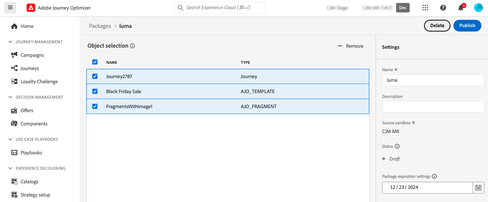

# Copy Journey Optimizer objects to another sandbox {#copy-to-sandbox}

Sandbox Tooling allows you to copy objects such as journeys, content templates, or fragments, across multiple sandboxes by leveraging package export and import. A package can consist of a single object or multiple objects. Any objects that are included in a package must be from the same sandbox. 

This page describes the Sandbox tooling use case in the context of Journey Optimizer. For more information on the feature itself, refer to the [Experience Platform documentation](https://experienceleague.adobe.com/docs/experience-platform/sandbox/ui/sandbox-tooling.html).

>[!NOTE]
>
>This feature requires the following permissions from the **Sandbox administration** capability: Manage sandboxes (or View sandboxes) and Manage packages. [Learn more](../administration/ootb-permissions.md)

The copy process is carried via a package export and import between the source and target sandboxes. Here are the general steps to copy a journey from one sandbox to another:

1. Add the object to export as a package in the source sandbox. 
1. Export the package to the target sandbox.

In addition, you can leverage Journey Optimizer **Object Copy Service REST API** to manage sandboxes' objects. [Learn how to work with the Object Copy Service REST API](https://developer.adobe.com/journey-optimizer-apis/references/sandbox/)

## Exported objects & best practices {#objects}

Journey Optimizer allows the export of journeys, content templates, and fragments to another sandbox. The following sections provide information and best practices for each type of object.

### General best practices {#global}

* When copying an object, any dependencies (such as nested fragments, journey audiences, or actions) are correctly updated in the parent object, ensuring proper mapping in the target sandbox.

* If an exported object contains profile personalization, make sure that the appropriate schema exists in the target sandbox to avoid any personalization issue.

### Journeys {#journeys}

* When exporting a journey, in addition to the journey itself, Journey Optimizer also copies most of the objects the journey depends on: audiences, schemas, events and actions. For more details on copied objects, refer to this [section](https://experienceleague.adobe.com/docs/experience-platform/sandbox/ui/sandbox-tooling.html#abobe-journey-optimizer-objects).

* We do not guarantee that all linked elements are copied to the destination sandbox. We strongly recommend that you perform a thorough check, for example before publishing a journey. This allows you to identify any potential missing object. 

* The copied objects in the target sandbox are unique and there is no risk of overwriting existing elements. Both the journey and any messages inside the journey are brought over in draft mode. This allows you to perform a thorough validation before publication on the target sandbox.

* The copy process only copies over the metadata about the journey and the objects in that Journey. No profile or dataset data is being copied as part of this process. 

### Content templates {#content-templates}

* When exporting a content template, all nested fragments are also copied along with it.

* Exporting content templates can sometimes result in fragment duplication. For example, if two templates share the same fragment and are copied in separate packages, both templates will need to reuse the same fragment in the target sandbox. To avoid duplication, select the "Use existing" option during the import process. [Learn how to import a package](#import)

* To further avoid duplication, it is recommended to export content templates in a single package. This ensures the system manages deduplication efficiently.

### Fragments {#fragments}

* Fragments can have multiple statuses such as Live, Draft and Live with draft in progress. When exporting a fragment, its latest Draft state is copied to the target sandbox.

* When exporting a fragment, all nested Fragments are also copied along with it.

## Add objects as a package{#export}

To copy objects to another sandbox, you first need to add them as a package in the source sandbox. Follow these steps:

1. Navigate to the inventory where the first object you want to copy is stored, such as the journeys list. Click the **More actions** icon (the three dots next to the object name) and click **Add to package**.

   

1. In the **Add to package** window, choose if you want to add the object to an existing package or create a new package:

   

   * **Existing package**: select the package from the drop-down menu.
   * **Create a new package**: type the package name. You can also add a description.

1. Repeat these steps to add all the objects you want to export with your package.

>[!NOTE]
>
>For journeys export, in addition to the journey itself, Journey Optimizer also copies most of the objects the journey depends on: audiences, schemas, events and actions. For more details journeys export, refer to [this section](../building-journeys/copy-to-sandbox.md).

## Publish the package to export {#publish}

Once your package is ready to be exported, follow these steps to publish it:

1. Navigate to the **[!UICONTROL Administration]** > **[!UICONTROL Sandboxes]** menu, select the **Packages** tab.

1. Open the package you want to export, select the objects you want to export and click **Publish**.

   In this example, we want to export a journey, a content template and a fragment.

   

1. To track the status of the package's publication from the **[!UICONTROL Jobs]** tab. For more details on a job, select it from the list and click the **[!UICONTROL View import details]** button.

   

## Import the package in the target sandbox {#import}

Once the package is published, you need to import it into the target sandbox. Follow these steps:

1. Navigate to the **[!UICONTROL Sandboxes]** menu and select the **[!UICONTROL Browse]** tab.

1. Search for the sandbox where you want to import the package, then click the + icon next to its name.

   

   >[!NOTE]
   >
   >Only sandboxes within your organization are available.

1. In the **Target sandbox** field, check that the correct target sandboxes is selected and select the package to import from the **[!UICONTROL Package name]** drop-down list. Click **Next**. 

   

1. Review the package objects and dependencies. This is the list of objects that have been added to the package, along with other objects journeys depend on such as audiences, schemas, events or actions. 

   For each object, you can choose to create a new one or use an existing one in the target sandbox. This allows you, for example, to avoid fragment duplication which may happen when importing content templates using common fragments.

   

1. Click the **Finish** button, in the top-right corner to start copying the package to the target sandbox. The copying process varies based on the complexity of the objects and how many objects need to be copied over. 

1. Click the import job to review the copy result:

   * Click the **View imported objects** button to display each individual object copied. 
   * Click the **View import details** button to check the import results for each object.

   

1. Access your target sandbox and perform a thorough check of all the copied objects.
