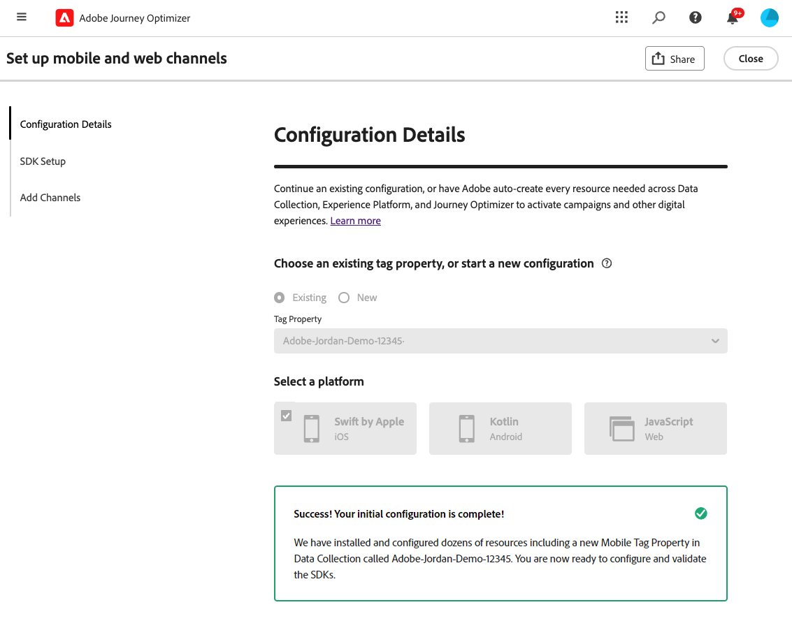
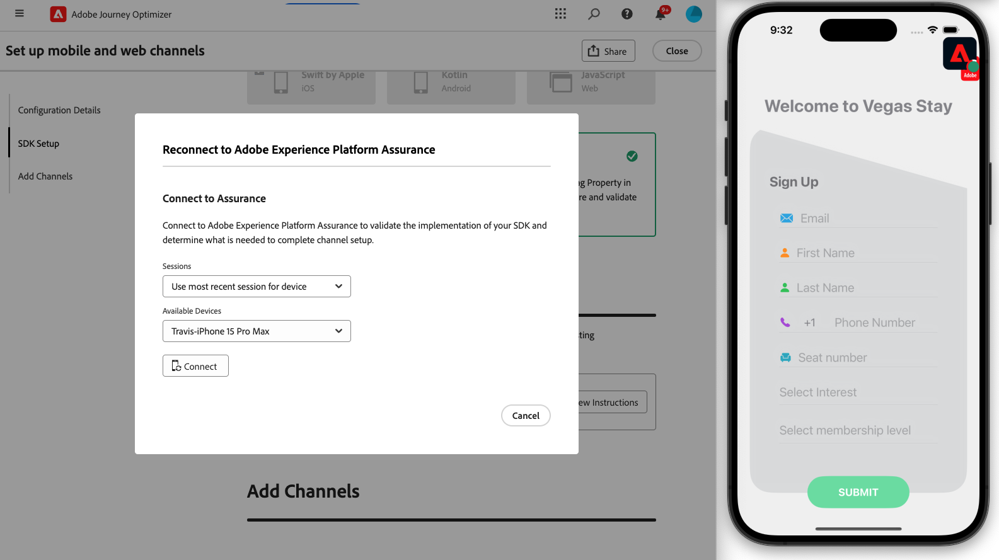

# Create a channel set up {#set-mobile-ios}

>[!CONTEXTUALHELP]
>id="ajo_mobile_web_setup_javascript_code"
>title="Javascript code"
>abstract="The head tag contains essential metadata and resources that are loaded before the main content of your webpage. Placing code in this section ensures it is properly initialized and executed early, allowing your webpage to load and function efficiently. By adding code to the head section, you help enhance the structure, performance, and overall user experience of your site."

>[!CONTEXTUALHELP]
>id="ajo_mobile_web_setup_push_token"
>title="Retrieve the device token"
>abstract="To ensure the device's push token is properly synchronized with your Adobe Experience Platform profile, you need to incorporate the following code into your application. This integration is essential for maintaining up-to-date communication capabilities and ensuring a seamless user experience."

>[!CONTEXTUALHELP]
>id="ajo_mobile_web_setup_push_xcode"
>title="Launch the application from Xcode"
>abstract="To obtain your push token, first, launch your application using Xcode. After the application has started, restart it to ensure the validation process is completed. Adobe will then provide your push token as part of the validation results. This token is essential for enabling push notifications and will be displayed once the setup has been successfully validated."

>[!CONTEXTUALHELP]
>id="ajo_mobile_web_push_certificate_fcm"
>title="Provide a push certificate"
>abstract="Drag and drop your .json private key file. This file contains authentication information required for secure integration and communication between your application and the server."

>[!CONTEXTUALHELP]
>id="ajo_mobile_web_setup_push_certificate"
>title="Provide a push certificate"
>abstract="The .p8 key file contains a private key used to authenticate your app with Apple's servers for secure push notifications. You can acquire this key from the Certificates, Identifiers, and Profiles page in your developer account."

>[!CONTEXTUALHELP]
>id="ajo_mobile_web_setup_push_key_id"
>title="Key ID"
>abstract="The Key ID, a 10-character string assigned during the creation of the p8 authentication key, can be found under the **Keys** tab on the Certificates, Identifiers, and Profiles page in your developer account."

>[!CONTEXTUALHELP]
>id="ajo_mobile_web_setup_push_team_id"
>title="Team ID"
>abstract="The Team ID, a string value used to identify your team, can be located under the **Membership** tab in your developer account."

This setup simplifies the rapid configuration of marketing channels, making all essential resources readily available in the Experience Platform, Journey Optimizer, and Data Collection apps. This allows your marketing team to quickly start creating campaigns and journeys.

1. From Journey Optimizer homepage, click **[!UICONTROL Begin]** from the **[!UICONTROL Set up mobile and web channels]** card.

    

1. Create a **[!UICONTROL New]** configuration.

    If you already have existing configurations, you can choose to select one, or create a new configuration.

    

1. Enter a **[!UICONTROL Name]** for your new configuration and select or create your **[!UICONTROL Datastream]**. This **[!UICONTROL Name]** will be used for every auto-created resources.

1. If your organization has multiple datastreams, please select one from the existing options. If you do not have a Datastream, one will be auto-created for you.

1. Select your platform and click **[!UICONTROL Auto-create resources]**.

1. To streamline the setup process, the necessary resources are automatically created to help you get started. This includes the creation of a new **[!UICONTROL Mobile Tag Property]** and installation of extensions.

    [Learn more on the auto-generated resources](set-mobile-config.md#auto-create-resources)

1. Once resources generation is done, follow the instructions in the user interface to set up and validate your SDKs and channels.

1. After completing the configuration, share the auto-generated **[!UICONTROL Channel Configuration]** with the team members responsible for creating Journeys and Campaigns. 

    {zoomable="yes"}

1. You can now reference the **[!UICONTROL Channel Configuration]** in the Campaigns or Journeys interface, enabling a seamless connection between your setup and the execution of targeted journeys and campaigns for your audience.

## Modify a mobile existing configuration {#reconnect}

After creating your configuration, you can easily revisit it at any time to add additional channels or make further adjustments to suit your needs

1. From Journey Optimizer homepage, click **[!UICONTROL Begin]** from the **[!UICONTROL Set up mobile and web channels]** card.

    

1. Select **[!UICONTROL Existing]** and choose your existing **[!UICONTROL Tag property]** from the drop-down.

    

1. When accessing your existing configuration, you need to reconnect with Adobe Assurance. From the SDK Setup menu, click **[!UICONTROL Reconnect]**.

    

1. Select your device from the **[!UICONTROL Available devices]** drop-down and click **[!UICONTROL Connect]**.

    {zoomable="yes"}

1. You can now update your configuration as needed.
