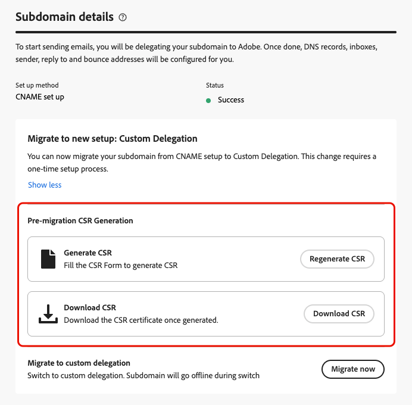
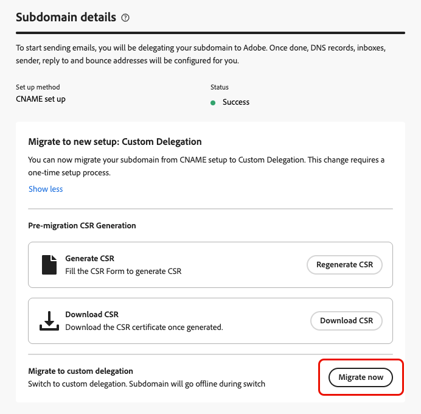
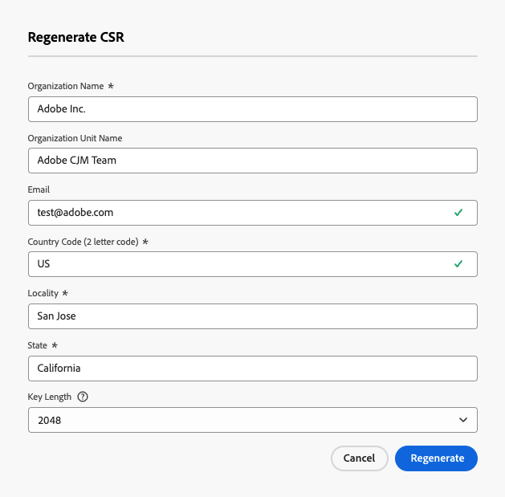
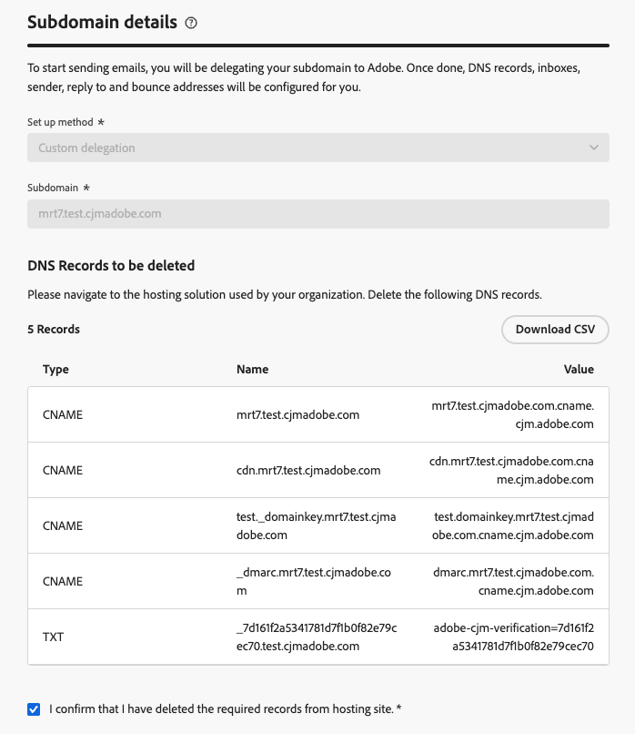
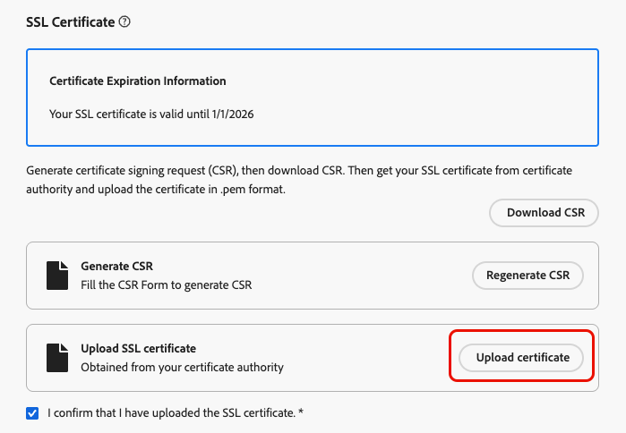
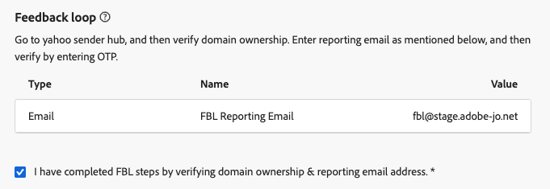
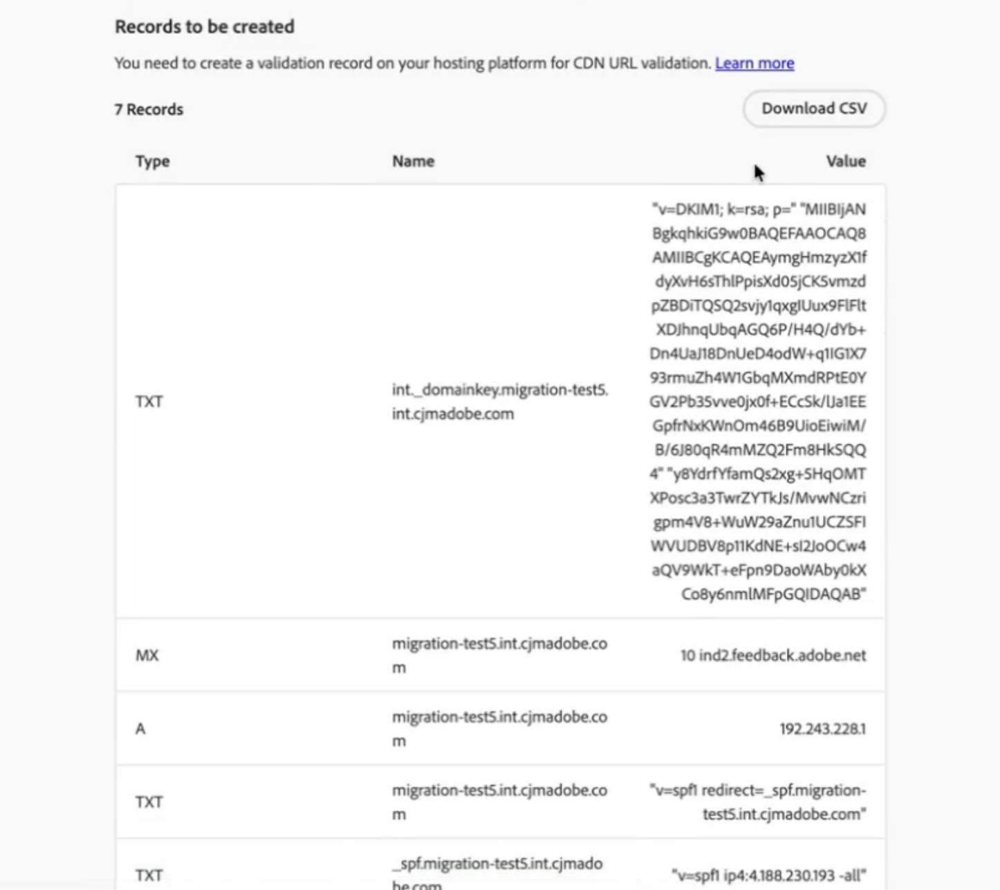

# Migrate an email subdomain from CNAME to custom delegation {#migrate-cname-to-custom}

>[!AVAILABILITY]
>
>This capability is available in Limited Availability. Contact your Adobe representative to gain access.

If your subdomain is currently set up with [CNAMEs](about-subdomain-delegation.md#cname-subdomain-setup), you can migrate it to the **[!UICONTROL Custom delegation]** method to meet your company's security policies. This gives you full ownership and control over your subdomains and certificates within [!DNL Journey Optimizer]. [Learn more on custom subdomains](delegate-custom-subdomain.md)

As part of this process, you need to:

* [Delete the existing DNS records](#delete-dns) from your hosting solution
* [Upload the SSL certificate](#upload-ssl-certificate) obtained from the Certificate Authority
* Complete the [Feedback Loop steps](#feedback-loop) by verifying domain ownership and reporting email address
* [Create a new set of DNS records](#create-dns-records) generated by Adobe into your hosting platform

To migrate your subdomain, follow the steps below.

## Before you begin {#before-you-begin}

Before you start the migration process, review the important information below.

>[!IMPORTANT]
>
>You can only migrate a subdomain set up with the [CNAME method](delegate-subdomain.md#cname-subdomain-setup).

* Make sure that the **Custom delegation method is enabled** for your organization (this capability is currently in Limited Availability—contact your Adobe representative to gain access). [Learn more](delegate-custom-subdomain.md)
* Ensure that no active channel configurations are using this subdomain. The migration process will interrupt their functionality.

    >[!NOTE]
    >
    >If you deactivate a channel configuration before starting the migration, you can change it back to the active state after the migration workflow is completed.

* Ensure that no active campaigns or journeys are using a channel configuration linked to this subdomain as this may cause delivery disruption.
* Be aware that downtime begins as soon as you enter the migration flow. The subdomain moves to **[!UICONTROL Draft]** during the process and is unavailable until setup is complete.
* Consequently, it is recommended to **perform the pre-migration steps before starting the migration process**—in order to have your SSL certificate ready and reduce downtime. [Learn more](#start-migration)

## Start the migration {#start-migration}

Follow the steps below to start migrating a given subdomain.

1. Go to **[!UICONTROL Administration]** > **[!UICONTROL Channels]** > **[!UICONTROL Email settings]** > **[!UICONTROL Subdomains]**.

1. Select a subdomain set up with CNAMEs and open it.

1. You can use the **[!UICONTROL Pre-migration CSR Generation]** section to generate the CSR for sending it to the Certificate Authority and have the SSL certificate ready when the migration process starts. [Learn how](#send-csr-to-ca)

    >[!IMPORTANT]
    >
    >The pre-migration steps are optional at this stage but strongly recommended. Completing them **before** starting the migration reduces downtime and helps ensure a smooth transition.

    {width="70%"}

1. Select **[!UICONTROL Migrate now]** in the dedicated section.

    <!--{width=90%}-->

1. Review the [information displayed](#before-you-begin).

    >[!WARNING]
    >
    >Downtime begins as soon as you enter the migration flow, so make sure it does not impact your active campaigns and journeys. 

1. Click **[!UICONTROL Yes]**. The subdomain moves to **[!UICONTROL Draft]** status and is unavailable until setup is complete.

## Generate and send the CSR to the Certificate Authority {#send-csr-to-ca}

To complete the migration, you need a SSL certificate issued by a Certificate Authority (CA). To receive this SSL certificate, you must first generate a Certificate Signing Request (CSR) and send it to the CA.

Whether you have already started the migration process or not, follow the steps below to generate and send your new CSR.

1. Click **[!UICONTROL Regenerate CSR]**.

1. Fill the form that displays and regenerate the Certificate Signing Request (CSR).

    {width="60%"}

    >[!NOTE]
    >
    >The key length can be 2048 or 4096-bit only. It cannot be changed after the subdomain is submitted.

1. Click **[!UICONTROL Download CSR]** and save the form to your local computer.

1. Send it to the Certificate Authority (CA) to get your SSL certificate. Before submitting this CSR to your CA for signing, there are a few important points to consider:

    * The downloaded CSR from step 3 is only for data.subdomain.com.

    * However, the certificate should cover both data.subdomain.com and cdn.subdomain.com as Subject Alternative Names (SAN) entries within a single certificate. For instance, if you are delegating example.adobe.com, then data.subdomain.com corresponds to data.example.adobe.com, and cdn.subdomain.com corresponds to cdn.example.adobe.com.
    
    * Both Data (data.example.adobe.com) and CDN (cdn.example.adobe.com) subdomains need to be added as peer entries in the same certificate. No additional subdomains should be added to this certificate.

    * Most CAs allow you to add additional SANs (such as the CDN subdomain) during the signing process

        * Through the CA portal (recommended, if available), or
        * By requesting it manually with their support team if the portal option is not available.

    * Once signed, the CA will issue a single certificate covering both the Data domain and the CDN subdomain.

## Delete existing DNS records {#delete-dns}

After starting the migration process, you need to delete the existing DNS records from your hosting solution. Follow the steps below.

1. The list of records currently configured in your DNS servers displays.

1. Navigate to your domain hosting solution and delete the existing CNAME entries from your DNS hosting.

1. Make sure that all the DNS records have been deleted. Once done, check the box "I confirm that I have deleted the required records from hosting site".

    {width="75%"}
    
## Upload the SSL certificate {#upload-ssl-certificate}

In the **[!UICONTROL SSL Certificate]** section, you need to upload a new SSL certificate to [!DNL Journey Optimizer].

Before that, verify the following:

* If you have already sent your CSR to the Certificate Authority as part of the [pre-migration steps](#start-migration), make sure you have received your SSL certificate.

* If you haven't already done so, follow the steps to [generate, download and send the CSR](#send-csr-to-ca).

<!--
    * Click **[!UICONTROL Regenerate CSR]** and fill the form to generate the Certificate Signing Request.

    * Click **[!UICONTROL Download CSR]** to save the form to your local computer.

    * Send the CSR to the Certificate Authority to get your SSL certificate.-->

1. Once you have retrieved your SSL certificate, click **[!UICONTROL Upload certificate]**.

    {width="75%"}

1. Upload the SSL certificate to [!DNL Journey Optimizer] in .pem format with the complete certificate chain. Here is a sample of a .pem file format:

    ```
    -----BEGIN CERTIFICATE-----
    MIIDXTCCAkWgAwIBAgIJALc3... (base64 encoded data)
    -----END CERTIFICATE-----
    ```

1. Check the box "I confirm that I have uploaded the SSL certificate".

## Complete feedback loop {#feedback-loop}

Then, complete the feedback loop steps to verify domain ownership and reporting email address.

{width="75%"}

The process is the same as when setting up a new custom subdomain. Follow the steps detailed on the [Set up a custom subdomain](delegate-custom-subdomain.md#feedback-loop-steps) page.


## Create a new set of DNS records {#create-dns-records}

To complete the migration process, create a new set of DNS records generated by Adobe in your hosting platform.

1. After completing the feedback loop steps, click the **[!UICONTROL Continue]** button at the top right of the screen.

    This step verifies that the previous records were deleted and that the SSL certificate was uploaded correctly. If any errors occur, refer to the [troubleshooting checklist](#troubleshooting).

1. If all validations are successful, the **[!UICONTROL Records to be created]** section displays.

    {width="75%"}

1. Create all the required records in your hosting platform.

1. Once all records are created, click **[!UICONTROL Submit]**.

    >[!NOTE]
    >
    >If all the listed records are not created, an error displays. Make sure to create all the required records.

After submitting, you must wait until Adobe performs the required checks, which can take up to 3 hours. [Learn more](delegate-subdomain.md#submit-subdomain)

Once the subdomain is active again, no changes are needed to existing channel configurations that use it—they continue to work as before.

## Troubleshooting checklist {#troubleshooting}

If errors occur while trying to submit your custom subdomain, perform the troubleshoothing actions listed below.

* _Resource could not be validated. The DNS still exists and need to be deleted._ — Make sure to delete all the records from your hosting solution. [Learn how](#delete-dns)
* _Resource could not be validated. Please upload your SSL certificate and try again._ — The SSL certificate was not uploaded. Make sure to upload it. [Learn how](#upload-ssl-certificate)
* _The certificate contains unexpected domains in its Subject Alternative Names (SAN)._ — Make sure to upload the correct SSL certificate. [Learn how](#upload-ssl-certificate)
* _The certificate is missing the following required domains in its Subject Alternative Names (SAN)._ — Make sure to upload the correct SSL certificate. [Learn how](#upload-ssl-certificate)

**See also**

* [Set up a custom subdomain](delegate-custom-subdomain.md)
* [Subdomain delegation methods](about-subdomain-delegation.md#subdomain-delegation-methods)
