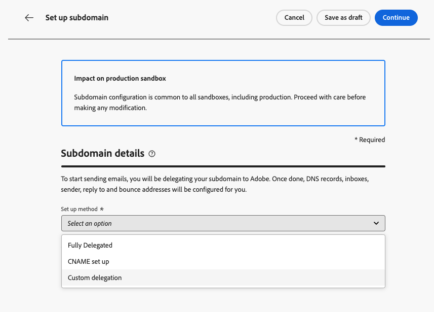
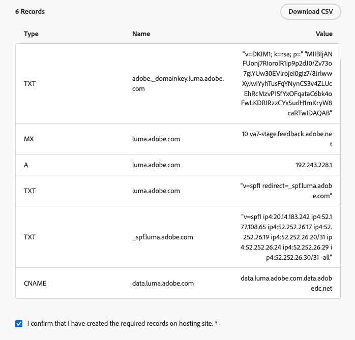
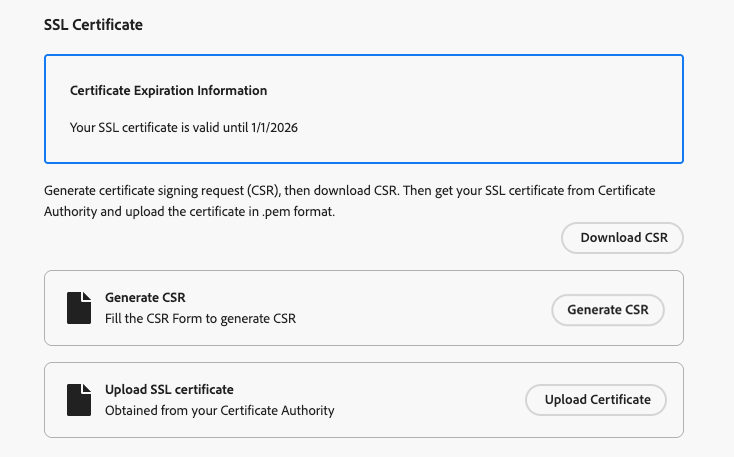
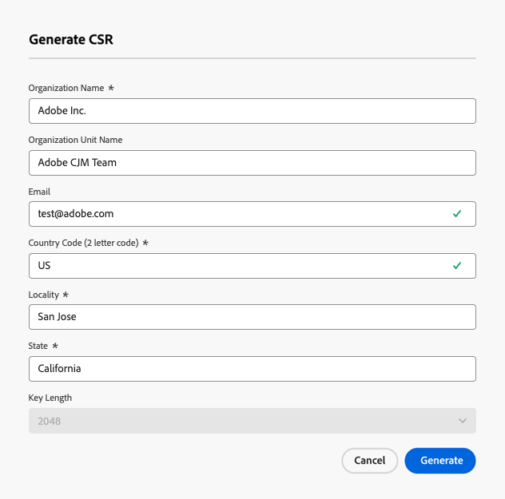
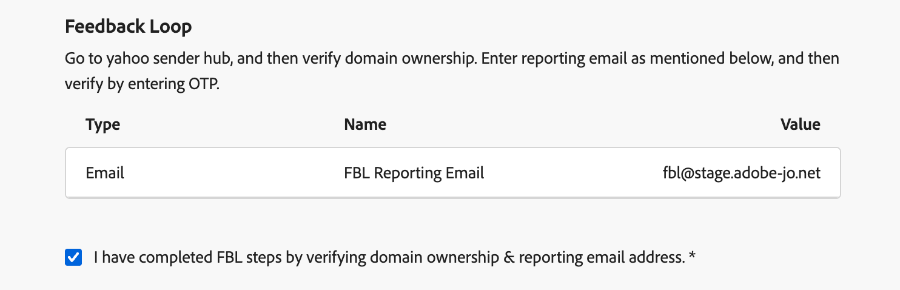

# Set up a custom subdomain {#delegate-custom-subdomain}

>[!AVAILABILITY]
>
>This capability is available in Limited Availability. Contact your Adobe representative to gain access.

As an alternative to the [Fully delegated](about-subdomain-delegation.md#full-subdomain-delegation) and [CNAME set up](about-subdomain-delegation.md#subdomain-delegation-methods) methods, the **Custom delegation** method allows you to take the ownership of your subdomains within Journey Optimizer and to have full control over the generated certificates.

>[!NOTE]
>
>If your subdomain is currently set up with CNAME, you can also migrate it to custom delegation. [Learn more](custom-subdomain-migration.md)

As part of this process, Adobe needs to make sure that your DNS is accordingly configured for delivering, rendering and tracking messages. This is why you will be required to [upload the SSL certificate](#upload-ssl-certificate) obtained from the Certificate Authority and complete the [Feedback Loop steps](#feedback-loop-steps) by verifying domain ownership and reporting email address.

To set up a custom subdomain, follow the steps below.

1. Access the **[!UICONTROL Administration]** > **[!UICONTROL Channels]** > **[!UICONTROL Email settings]** > **[!UICONTROL Subdomains]** menu.

1. Click **[!UICONTROL Set up subdomain]**.

1. From the **[!UICONTROL Set up method]** section, select **[!UICONTROL Custom delegation]**.

    {width=90%}

1. Specify the name of the subdomain to delegate.

    >[!CAUTION]
    >
    >You cannot use the same sending domain to send out messages from [!DNL Adobe Journey Optimizer] and from another product, such as [!DNL Adobe Campaign] or [!DNL Adobe Marketo Engage].

## Create the DNS records {#create-dns-records}

>[!CONTEXTUALHELP]
>id="ajo_admin_subdomain_custom_dns"
>title="Generate the matching DNS records"
>abstract="To delegate a custom subdomain to Adobe, you need to copy-paste the nameserver information displayed in the Journey Optimizer interface into your domain-hosting solution to generate the matching DNS records."

1. The list of records to be placed in your DNS servers displays. Copy these records, either one by one, or by downloading a CSV file.

1. Navigate to your domain hosting solution to generate the matching DNS records.

1. Make sure that all the DNS records have been generated into your domain hosting solution.

1. If everything is configured properly, check the box "I confirm...".

    {width="75%"}

## Upload the SSL Certificate {#upload-ssl-certificate}

>[!CONTEXTUALHELP]
>id="ajo_admin_subdomain_custom-ssl"
>title="Generate the Certificate Signing Request"
>abstract="When setting up a new custom subdomain, you need to generate the Certificate Signing Request (CSR), fill it and send it to the Certificate Authority to get the SSL certificate that you need to upload to Journey Optimizer."

>[!CONTEXTUALHELP]
>id="ajo_admin_subdomain_key_length"
>title="Select a key lenght"
>abstract="The key length can be 2048 or 4096-bit only. It cannot be changed after the subdomain is submitted."

1. In the **[!UICONTROL SSL Certificate]** section, click **[!UICONTROL Generate CSR]**.

    {width="85%"}

    >[!NOTE]
    >
    >Your SSL certificate expiration date is displayed. Once the date is reached, you need to upload a new certificate.
    
1. Fill the form that displays and generate the Certificate Signing Request (CSR).

    {width="70%"}

    >[!NOTE]
    >
    >The key length can be 2048 or 4096-bit only. It cannot be changed after the subdomain is submitted.

1. Click **[!UICONTROL Download CSR]** and save the form to your local computer.

1. Send it to the Certificate Authority (CA) to get your SSL certificate. Before submitting this CSR to your CA for signing, there are a few important points to consider:

    * The downloaded CSR from step 3 is only for data.subdomain.com.

    * However, the certificate should cover both data.subdomain.com and cdn.subdomain.com as Subject Alternative Names (SAN) entries within a single certificate. For instance, if you are delegating example.adobe.com, then data.subdomain.com corresponds to data.example.adobe.com, and cdn.subdomain.com corresponds to cdn.example.adobe.com.
    
    * Both Data (data.example.adobe.com) and CDN (cdn.example.adobe.com) subdomains need to be added as peer entries in the same certificate.

    * Most CAs allow you to add additional SANs (such as the CDN subdomain) during the signing process

        * Through the CA portal (recommended, if available), or
        * By requesting it manually with their support team if the portal option is not available.

    * Once signed, the CA will issue a single certificate covering both the Data domain and the CDN subdomain.

1. Once retrieved, click **[!UICONTROL Upload SSL certificate]** and upload the certificate to [!DNL Journey Optimizer] in .pem format with the complete certificate chain. Here is a sample of a .pem file format:

    -----BEGIN CERTIFICATE-----
    MIIDXTCCAkWgAwIBAgIJALc3... (base64 encoded data)
    -----END CERTIFICATE-----

<!--
>[!CAUTION]
>
>Both Data and CDN subdomains must be included in the same certificate.
-->

## Complete the Feedback Loop steps {#feedback-loop-steps}

>[!CONTEXTUALHELP]
>id="ajo_admin_subdomain_feedback-loop"
>title="Complete the Feedback Loop steps"
>abstract="Go to the Yahoo! Sender Hub and fill in the form to verify domain ownership. Enter the FBL reporting email address listed below, and use the OTP that will be received to verify ownership on the Yahoo! Sender Hub."

1. Go to the [Yahoo! Sender Hub](https://senders.yahooinc.com/) website and fill in the required form to verify your domain ownership.

1. To verify the domain ownership, Yahoo! Sender Hub will require that you provide an email address. Enter the FBL reporting email address listed under **[!UICONTROL Value]**. This is an Adobe-owned email address.

1. When Yahoo! Sender Hub generates a One-Time Password (OTP), it will be sent to this Adobe address.

1. Reach out to the Adobe Deliverability team who will provide you with this OTP. <!--Specify how to reach out + any information that customer should share in the request to deliverability team to get access to the right OTP-->

    >[!CAUTION]
    >
    >The OTP is valid only for 24 hours, so make sure you reach out to Adobe as soon as the OTP is generated. <!--TBC?-->
    >
    >OTP request can only be made on weekdays. There is no support on weekends. <!--Add times + timezone-->

1. Enter the OTP on Yahoo! Sender Hub.

1. Make sure you have completed all the Feedback Loop steps.

1. If everything is configured properly, check the box "I have completed...".

    {width="85%"}

## Copy the SSL CDN URL validation record {#copy-ssl-cdn-url-record}

1. Click **[!UICONTROL Continue]** and wait until Adobe verifies that the records are generated without errors on your hosting solution. This process can take up to 2 minutes.

    >[!NOTE]
    >
    >Make sure that all the records are properly created before proceeding.

1. Adobe generates an SSL CDN URL validation record. Copy this validation record into your hosting platform. If you have properly created this record on your hosting solution, check the box "I confirm...".

1. Click **[!UICONTROL Submit]** to have Adobe perform the required checks. [Learn more](delegate-subdomain.md#submit-subdomain)

## Troubleshooting check list {#check-list}

If errors occur while trying to submit your custom subdomain, perform the troubleshoothing actions listed below.

* Check that all DNS records have properly propagated using DNS lookup tools.

* Verify that your certificate meets all technical requirements before uploading.

* Make sure that your certificate is uploaded in the correct format.
