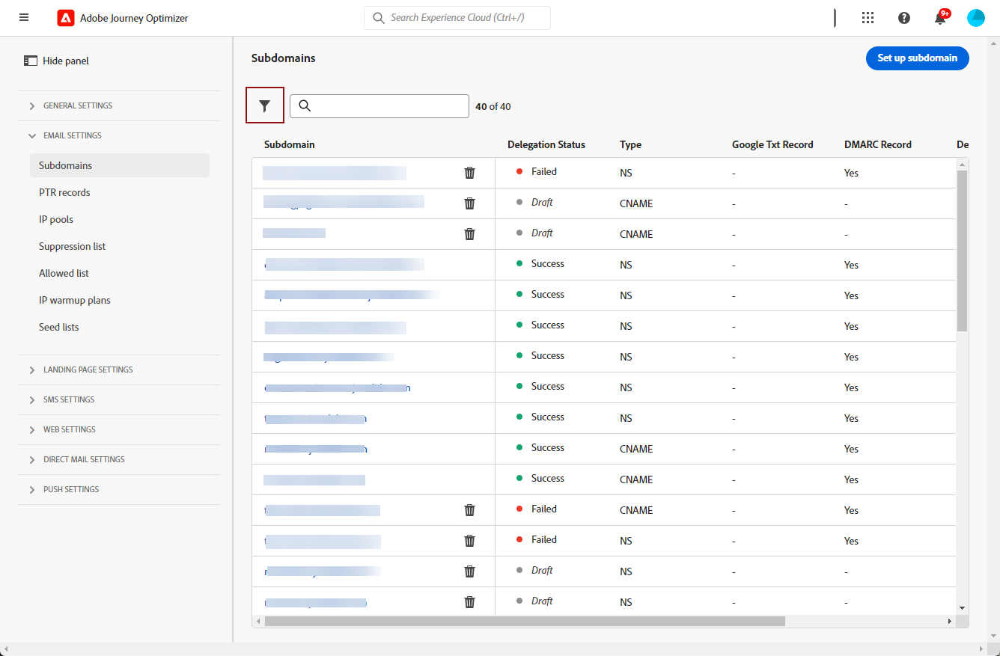
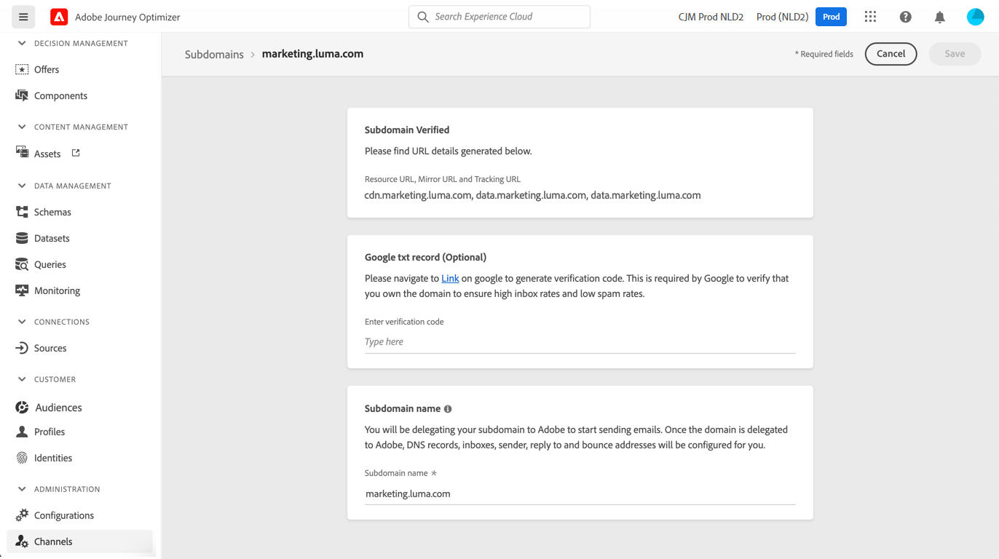
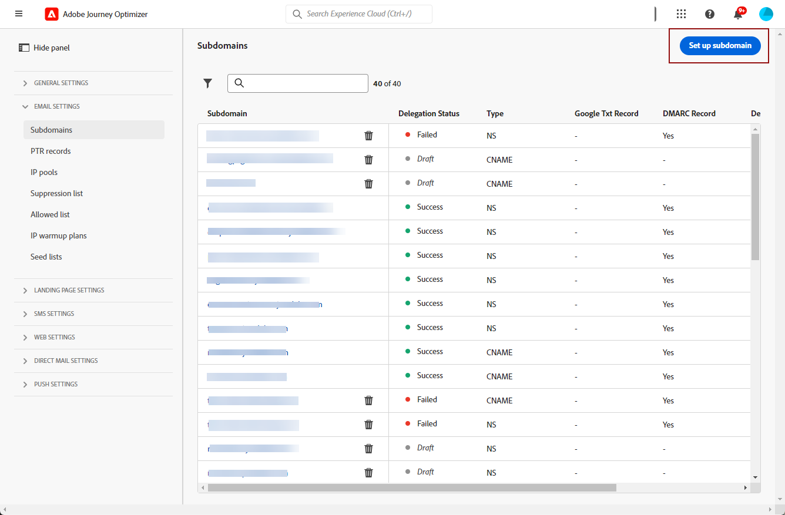
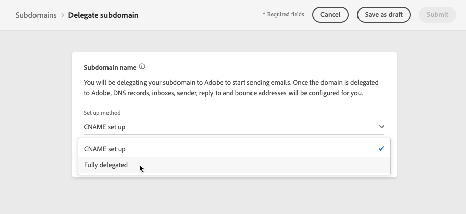
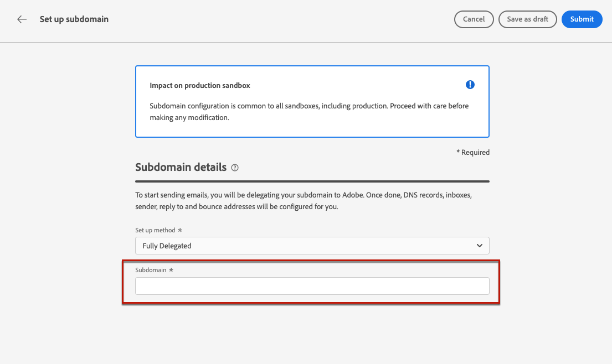
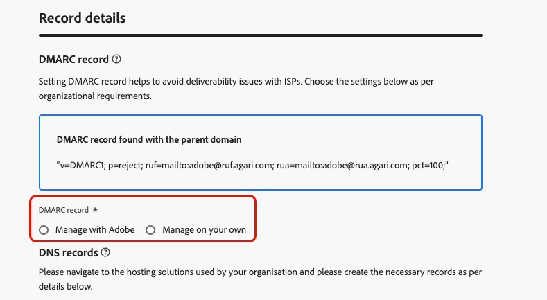
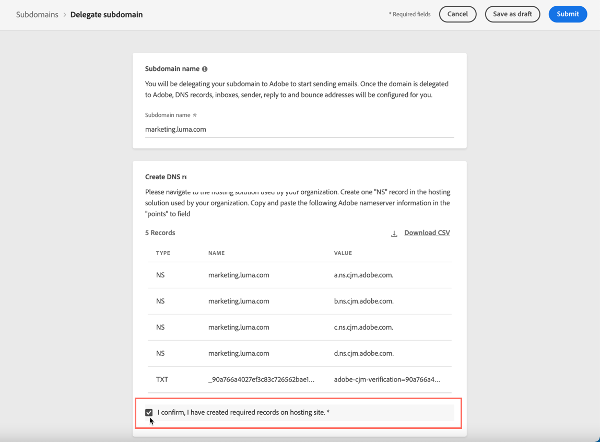
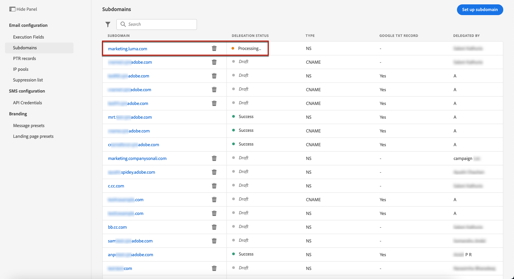

# Delegate a subdomain {#delegate-subdomain}

>[!CONTEXTUALHELP]
>id="ajo_admin_subdomainname"
>title="Subdomain delegation"
>abstract="Journey Optimizer allows you to delegate your subdomains to Adobe. You can fully delegate a subdomain to Adobe, which is the recommended method.  You can also create a subdomain using CNAMEs to point to Adobe-specific records, but this approach requires you to maintain and manage DNS records on your own."
>additional-url="https://experienceleague.adobe.com/en/docs/journey-optimizer/using/configuration/delegate-subdomains/about-subdomain-delegation#subdomain-delegation-methods" text="Subdomain configuration methods"

>[!CONTEXTUALHELP]
>id="ajo_admin_subdomainname_header"
>title="Subdomain delegation"
>abstract="To start sending emails, you will be delegating your subdomain to Adobe. Once done, DNS records, inboxes, sender, reply to and bounce addresses will be configured for you."

Domain name delegation is a method that allows the owner of a domain name (technically: a DNS zone) to delegate a subdivision of it (technically: a DNS zone under it, which can be called a sub-zone) to another entity. Basically, as a customer, if you are handling the "example.com" zone, you can delegate the sub-zone "marketing.example.com" to Adobe.

>[!NOTE]
>
>Learn more about subdomain delegation and the different methods available with [!DNL Journey Optimizer] in [this section](about-subdomain-delegation.md).

You can either:

* Fully delegate a subdomain - [Learn how](#set-up-subdomain)
* Create a subdomain using CNAMEs to point to Adobe-specific records - [Learn how](#set-up-subdomain)
* Delegate a custom subdomain - [Learn how](delegate-custom-subdomain.md)

The **full subdomain delegation** is the recommended method. Learn more about the differences between the different subdomain configuration methods in [this section](about-subdomain-delegation.md#subdomain-delegation-methods).

## Guardrails {#guardrails}

When setting up subdomains in [!DNL Journey Optimizer], follow the guardrails and recommendations outlined below.

* By default, [!DNL Journey Optimizer] allows you to delegate **a maximum of 10 subdomains**. However, depending on your license contract, you may be able to delegate up to 100 subdomains. Reach out to your Adobe contact to learn more about the number of subdomains you are entitled to. 

* Parallel submission of subdomains is not supported in [!DNL Journey Optimizer]. If you try to submit a subdomain for delegation when another one is in the **[!UICONTROL Processing]** status, you get an error message.

* Delegating an invalid subdomain to Adobe is not allowed. Make sure you enter a valid subdomain which is owned by your organization, such as marketing.yourcompany.com.

* You cannot use the same sending domain to send out messages from [!DNL Adobe Journey Optimizer] and from another product, such as [!DNL Adobe Campaign] or [!DNL Adobe Marketo Engage].

* Delegating both a parent and a subdomain is not supported. For example, if you delegated subdomain.domain.com, you cannot delegate email.subdomain.domain.com. Similarly, if you delegated email.subdomain.domain.com, you cannot delegate subdomain.domain.com.

## Access delegated subdomains {#access-delegated-subdomains}

All your delegated subdomains display in the **[!UICONTROL Administration]** > **[!UICONTROL Channels]** > **[!UICONTROL Subdomains]** menu. Filters are available to help you refine the list (delegation date, user or status).

<!---->

The **[!UICONTROL Status]** column provides information on the subdomain delegation process:

* **[!UICONTROL Draft]**: The subdomain delegation has been saved as a draft. Click the subdomain name to resume the delegation process,
* **[!UICONTROL Processing]**: The subdomain is going through several configuration checks before it can be used,
* **[!UICONTROL Success]**: The subdomain has gone through the checks successfully and can be used to deliver messages,
* **[!UICONTROL Failed]**: One or several checks have failed after the subdomain delegation was submitted.

To access detailed information about a subdomain with the **[!UICONTROL Success]** status, open it from the list.

You can:
    
* Retrieve the subdomain name (read-only) configured during the delegation process, as well as the generated URLs (resources, mirror pages, tracking URLs),

* Add a Google site verification TXT record to your subdomain to ensure that it is verified (see [Add a Google TXT record to a subdomain](google-txt.md)). 

>[!CAUTION]
>
>Subdomain configuration is **common to all environments**. Therefore any modification to a subdomain will also impact the production sandboxes.

## Set up a subdomain in Journey Optimizer {#set-up-subdomain}

>[!CONTEXTUALHELP]
>id="ajo_admin_subdomain_dns"
>title="Generate the matching DNS records"
>abstract="To fully delegate a new subdomain to Adobe, you need to copy-paste the Adobe nameserver information displayed in the Journey Optimizer interface into your domain-hosting solution to generate the matching DNS records. To delegate a subdomain using CNAMEs, you also need to copy-paste the SSL CDN URL validation record. Once the checks are successful, the subdomain is ready to be used to deliver messages."

To set up a new subdomain in [!DNL Journey Optimizer], follow the steps below.
<!--
>[!NOTE]
>
>This section describes how to set up a subdomain using the full delegation. The custom delegation method is detailed in [this section](#setup-custom-subdomain).
-->

1. Access the **[!UICONTROL Administration]** > **[!UICONTROL Channels]** > **[!UICONTROL Email settings]** > **[!UICONTROL Subdomains]** menu, then click **[!UICONTROL Set up subdomain]**.

    <!---->

1. From the **[!UICONTROL Set up method]** section, select either:

    * Fully delegated - [Learn more](about-subdomain-delegation.md#full-subdomain-delegation)
    * CNAME set up - [Learn more](about-subdomain-delegation.md#cname-subdomain-setup)
    
        Learn how to set up subdomains with CNAMEs in this [dedicated section](#cname-subdomain-setup)

    * Custom delegation - [Learn more](about-subdomain-delegation.md#custom-subdomain-delegation)

        Learn how to set up custom subdomains in this [dedicated section](delegate-custom-subdomain.md)

    <!---->

1. Specify the name of the subdomain to delegate.

    

<!--
 >[!CAUTION]
    >
    >Delegating an invalid subdomain to Adobe is not allowed. Make sure you enter a valid subdomain which is owned by your organization, such as marketing.yourcompany.com.
    >
    >You cannot use the same sending domain to send out messages from [!DNL Adobe Journey Optimizer] and from another product, such as [!DNL Adobe Campaign] or [!DNL Adobe Marketo Engage].

    Capital letters are not allowed in subdomains. TBC by PM
-->

    >[!NOTE]
    >
    >After creating a new subdomain with your DNS provider, allow 24-48 hours for DNS propagation before attempting delegation to Adobe.

1. Set up **[!UICONTROL DMARC record]** in the dedicated section. If the subdomain has an existing [DMARC record](dmarc-record.md), and if it is fetched by [!DNL Journey Optimizer], you can use the same values or change them as needed. If you do not add any values, the default values will be used. [Learn how to manage DMARC record](dmarc-record.md#set-up-dmarc)

    

1. In the **[!UICONTROL DNS record]** section, the list of records to be placed in your DNS servers is displayed. Copy these records, either one by one, or by downloading a CSV file, then navigate to your domain hosting solution to generate the matching DNS records.

1. Make sure that all the DNS records have been generated into your domain hosting solution. If everything is configured properly, check the box "I confirm...".

    

1. If you are setting up a subdomain with **CNAMEs**, go to [this section](#cname-subdomain-setup).

1. Click **[!UICONTROL Submit]** to have Adobe perform the required checks. [Learn more](#submit-subdomain)

## Set up a subdomain with CNAMEs {#cname-subdomain-setup}

>[!CONTEXTUALHELP]
>id="ajo_admin_subdomain_dns_cname"
>title="Generate the matching DNS and validation records"
>abstract="To delegate a subdomain using CNAMEs, you need to copy-paste the Adobe nameserver information and the SSL CDN URL validation record displayed in the Journey Optimizer interface into your hosting platform. Once the checks are successful, the subdomain is ready to be used to deliver messages."

>[!CONTEXTUALHELP]
>id="ajo_admin_subdomain_cdn_cname"
>title="Copy the validation record"
>abstract="Adobe generates a validation record. You need to create the corresponding record on your hosting platform for CDN URL validation."

When setting up a subdomain, you can use CNAMEs to point to Adobe-specific records. Using this setup, both you and Adobe share responsibility for maintaining DNS.

>[!CAUTION]
>
>The CNAME method is recommended if your organization's policies restrict the full subdomain delegation method. This approach requires you to maintain and manage DNS records on your own.
>
>Adobe will not be able to assist in changing, maintaining or managing DNS for a subdomain configured through the CNAME method.

To set up a subdomain using CNAMEs, follow the steps below.

1. Perform all the steps described in [this section](#set-up-subdomain).

1. Before submitting your subdomain setup, you have one more step to complete - click  **[!UICONTROL Continue]**. Wait until Adobe verifies that the records are generated without errors on your hosting solution. This process can take up to 2 minutes.

    >[!NOTE]
    >
    >Make sure that all the records are properly created before proceeding.

1. Adobe generates an SSL CDN URL validation record. Copy this validation record into your hosting platform. If you have properly created this record on your hosting solution, check the box "I confirm...".

1. Click **[!UICONTROL Submit]** to have Adobe perform the required checks. [Learn more](#submit-subdomain)

➡️ [Learn how to create a subdomain using CNAME to point to Adobe-specific records in this video](#video)

## Submit your subdomain set up {#submit-subdomain}

To complete your subdomain delegation, follow the steps below.

1. Click **[!UICONTROL Submit]**.
<!--
    >[!NOTE]
    >
    >If an error occurs while trying to submit a custom subdomain, refer to [this section](delegate-custom-subdomain.md#check-list).
-->

1. You can create the records and submit the subdomain configuration later on using the **[!UICONTROL Save as draft]** button.

    >[!NOTE]
    >
    >You will then be able to resume the subdomain delegation by opening it from the subdomains list.

1. The subdomain displays in the list with the **[!UICONTROL Processing]** status. For more on subdomains' statuses, refer to [this section](#access-delegated-subdomains).

    <!---->

1. Before being able to use that subdomain to send messages, make sure that all DNS records are properly created, then wait until Adobe performs the required checks, which can take up to 3 hours. [Learn more](#subdomain-validation).

### Subdomain validation {#subdomain-validation}

The checks and actions below are executed until the subdomain is verified and can be used to send messages.
    
These steps are performed by Adobe and can take **up to 3 hours**.

1. **Pre-validate**: Adobe checks whether the subdomain has been delegated to Adobe DNS (NS record, SOA record, Zone setup, ownership record). If the pre-validation step fails, an error is returned along with the corresponding reason, otherwise Adobe proceeds to the next step.

1. **Configure DNS for the domain**:

    * **MX record**: Mail eXchange record - Mail server record that processes inbound emails sent to the subdomain.
    * **SPF record**: Sender Policy Framework record - Lists the mail servers' IPs that can send emails from the subdomain.
    * **DKIM record**: DomainKeys Identified Mail standard record - Uses public-private key encryption to authenticate the message to avoid spoofing.
    * **A**: Default IP mapping.
    * **CNAME**: A Canonical Name or CNAME record is a type of DNS record that maps an alias name to a true or canonical domain name. 

1. **Create tracking and mirror URLs**: if the domain is email.example.com, the tracking/mirror domain will be data.email.example.com. It is secured by installing the SSL certificate.

1. **Provision CDN CloudFront**: if CDN is not setup already, Adobe provisions it for the your organization's ID.

1. **Create CDN domain**: if the domain is email.example.com, the CDN domain will be cdn.email.example.com.
    
1. **Create and attach CDN SSL certificate**: Adobe creates the CDN certificate for the CDN domain and attaches the certificate to the CDN domain.

1. **Create forward DNS**: if this is the first subdomain that you are delegating, Adobe will create the forward DNS which is required to create PTR records - one for each of your IPs.

1. **Create PTR record**: PTR record, also known as reverse DNS record, is required by the ISPs so that they do not mark the emails as spam. Gmail also recommends having PTR records for each IP. Adobe creates PTR records only when you delegate a subdomain for the first time, one for each IP, all IPs pointing that subdomain. For example, if the IP is *192.1.2.1* and the subdomain is *email.example.com*, the PTR record will be: *192.1.2.1  PTR r1.email.example.com*. You can update the PTR record afterwards to point to the new delegated domain. [Learn more about PTR records](ptr-records.md)

Once the checks are successful, the subdomain gets the **[!UICONTROL Success]** status. It is ready to be used to deliver messages.

The subdomain will be marked as **[!UICONTROL Failed]** if you fail to create the validation record on your hosting solution.

Upon validating the record, Adobe automatically creates the PTR record for the subdomain. [Learn more](ptr-records.md)

## Undelegate a subdomain {#undelegate-subdomain}

If you wish to undelegate a subdomain, contact your Adobe representative.

However, you need to perform several steps in the user interface before reaching out to Adobe.

>[!NOTE]
>
>You can only undelegate subdomains with the **[!UICONTROL Success]** status. Subdomains with the **[!UICONTROL Draft]** and **[!UICONTROL Failed]** statuses can simply be deleted from the user interface.

First, perform the following steps in [!DNL Journey Optimizer]:

1. Deactivate all the channel configurations associated with the subdomain. [Learn how](../configuration/channel-surfaces.md#deactivate-a-surface)

1. Undelegate any landing page subdomains, SMS subdomains, and web subdomains associated with this subdomain.

    You need to raise a dedicated request for each [landing page](../landing-pages/lp-subdomains.md#undelegate-subdomain), [SMS](../sms/sms-subdomains.md#undelegate-subdomain), or [web subdomain](../web/web-delegated-subdomains.md#undelegate-subdomain).

1. Stop the active campaigns associated with the subdomains. [Learn how](../campaigns/manage-campaigns.md#stop)

1. Stop the active journeys associated with the subdomains. [Learn how](../building-journeys/end-journey.md#stop-journey)

1. Point the [PTR records](ptr-records.md#edit-ptr-record) linked to the subdomain to another subdomain.

    If this is the only delegated subdomain, you can skip this step.

Once done, reach out to your Adobe representative with the subdomain you want to undelegate.

After you request is handled by Adobe, the undelegated domain is no longer displayed on the subdomain inventory page.

>[!CAUTION]
>
>After a subdomain is undelegated, the following applies:
>
>* You cannot reactivate the channel configurations which were using that subdomain.
>* You cannot delegate the same subdomain again through the user interface. If you want to do so, reach out to your Adobe representative.

## How-to video{#video}

Learn how to create a subdomain using CNAME to point to Adobe-specific records.

>[!VIDEO](https://video.tv.adobe.com/v/339484?quality=12)
