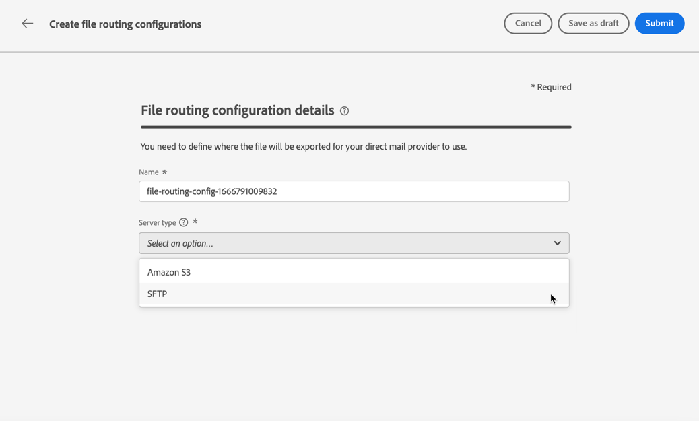
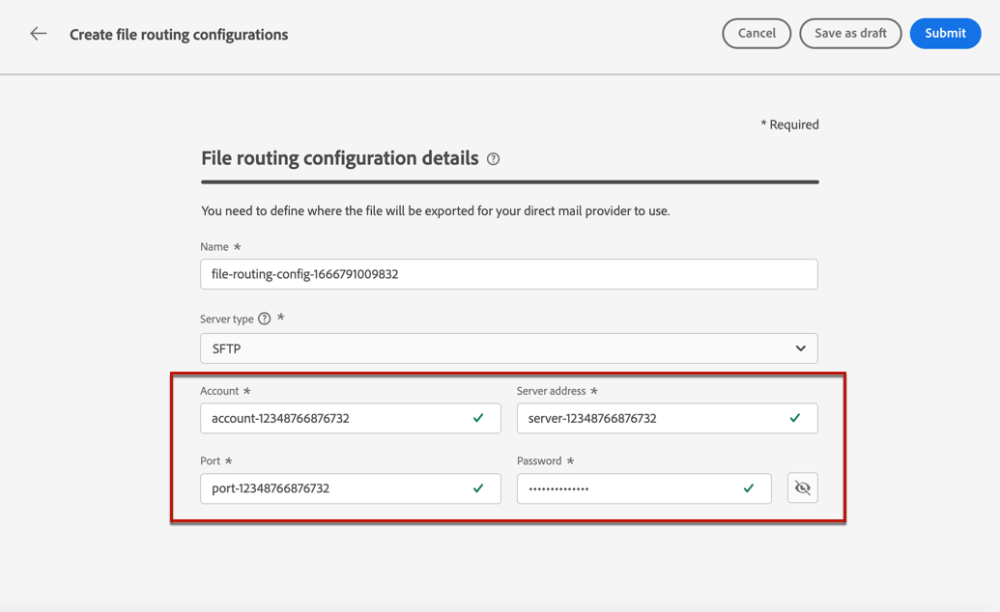
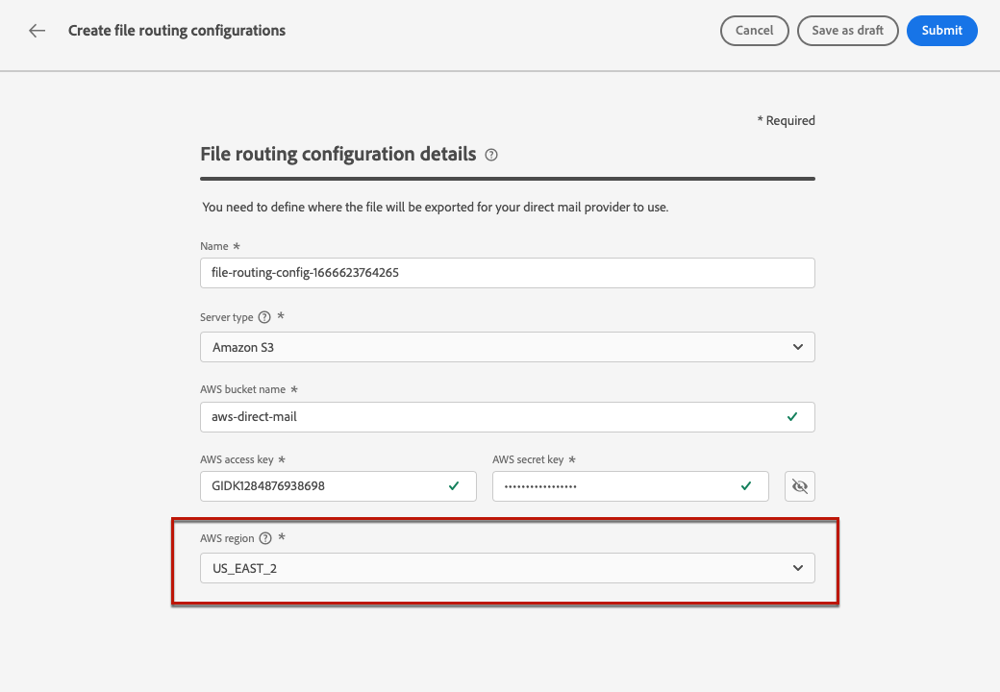
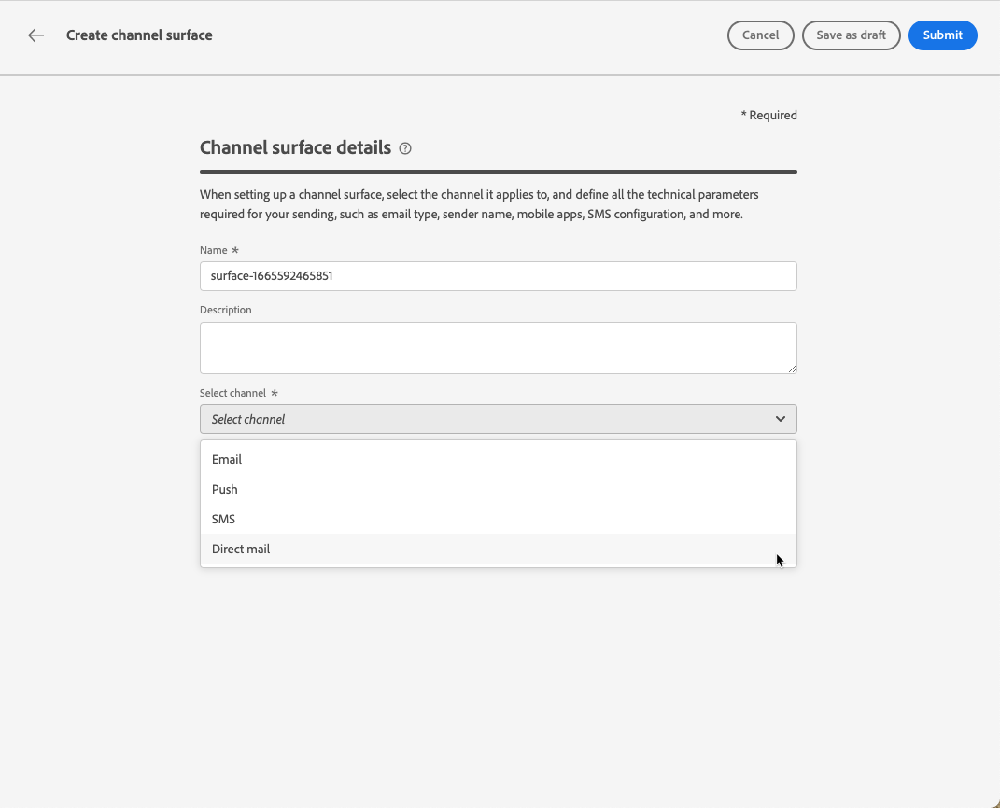
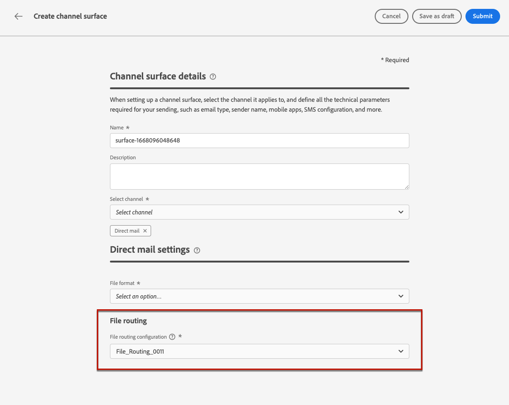

# Direct mail configuration {#direct-mail-configuration}

[!DNL Journey Optimizer] allows you to personalize and generate the files required by direct mail providers to send mail to your customers.

When you prepare a direct mail delivery, [!DNL Journey Optimizer] generates a file including all the targeted profiles and the chosen contact information (postal address for example). You will then be able to send this file to your direct mail provider who will take care of the actual sending.

To send a direct mail message, you need to create a file and upload it to a server. Before being able to do so, you need to create a [file routing configuration](#file-routing-configuration) and a [direct mail surface](#direct-mail-surface) that will reference the file routing configuration.

## Configure file routing {#file-routing-configuration}

>[!CONTEXTUALHELP]
>id="ajo_dm_file_routing_details"
>title="Define the settings of the file routing configuration"
>abstract="You need to define where the file will be exported and uploaded for your direct mail provider to use."

>[!CONTEXTUALHELP]
>id="ajo_dm_file_routing_details_header"
>title="Define the settings of the file routing configuration"
>abstract="When creating the direct mail message, you will generate the file containing all the required profile information. This file needs to be exported and uploaded onto a server so that your direct mail provider can access and use that file for delivering direct mail."

>[!CONTEXTUALHELP]
>id="ajo_dm_select_file_routing"
>title="File routing configuration"
>abstract="Select the file routing configuration of your choice, which defines where the file will be exported and uploaded for your direct mail provider to use."

>[!CONTEXTUALHELP]
>id="ajo_dm_file_routing_type"
>title="Select the server type for your file routing"
>abstract="Select the server that you want to use for uploading and storing the direct mail files."

>[!CONTEXTUALHELP]
>id="ajo_dm_file_routing_aws_region"
>title="Choose the AWS region"
>abstract="Select the server that you want to use for uploading and storing the direct mail files. Currently only Amazon S3  and SFTP are supported."

1. Access the **[!UICONTROL Administration]** > **[!UICONTROL Channels]** > **[!UICONTROL File routing configuration]** > **[!UICONTROL File Routing]** menu, then click **[!UICONTROL Create routing configuration]**.

    

1. Set a name for your configuration.

1. Select the configuration **[!UICONTROL Type]**, i.e. the server that you want to use for uploading and storing the direct mail files.<!--why is it Type and not Server or Server type? asked to PM-->

    

    >[!NOTE]
    >
    >Currently only Amazon S3 and SFTP are available.

    When creating the direct mail message, you will generate the file containing all the required profile information. This file needs to be exported and uploaded onto a server so that your direct mail provider can access and use that file for delivering direct mail.

1. Fill in the details and credentials specific to the selected configuration type, such as server address, access key, etc. <!--need to detail more?-->

    <!---->

    

1. If you selected **[!UICONTROL Amazon S3]**, you can choose the AWS region where you want to export and upload your direct mail files.

    

    >[!NOTE]
    >
    >AWS regions are separate geographic areas distributed around the world that AWS uses to house its infrastructure. For optimal usage, it is recommended to choose the closest region to host your cloud infrastructure.

1. Select **[!UICONTROL Submit]**. The file routing configuration is created with the **[!UICONTROL Active]** status. It is now ready to be used in a direct mail surface to deliver direct mail from [!DNL Journey Optimizer].

    >[!NOTE]
    >
    >You can also select **[!UICONTROL Save as draft]** to create the file routing configuration, but you will not be able to select it in a surface until it is **[!UICONTROL Active]**.

## Create a direct mail surface {#direct-mail-surface}

>[!CONTEXTUALHELP]
>id="ajo_dm_surface_settings"
>title="Define the direct mail settings"
>abstract="A direct mail surface contains the settings related to the formatting of the file containing profile data for direct mail. You can (define the sorting configuration), remove duplicate rows, split records into multiple files and select the file routing configuration."

>[!CONTEXTUALHELP]
>id="ajo_dm_surface_sort"
>title="Define the sort order"
>abstract="If you select this option, the sort will be by profile ID, ascending or descending. If you unselect it, the sorting configuration defined when creating the direct mail message within a journey or a campaign."

>[!CONTEXTUALHELP]
>id="ajo_dm_surface_split"
>title="Define the file split threshold"
>abstract="You must set the maximum number of records for each file containing profile data. After the specified threshold is reached, another file will be created for the remaining records."

Once file routing has been configured, you need to create a channel surface to be able to deliver direct mail from [!DNL Journey Optimizer]. In each surface, you will need to select a file routing configuration.

1. Create a channel surface. [Learn more](channel-surfaces.md)

1. Select the **[!UICONTROL Direct mail]** channel.

    

1. Define the direct mail settings in the dedicated section of the channel surface configuration.

    

1. Select the file format: **[!UICONTROL CSV]** or **[!UICONTROL Text delimited]**.

1. In the **[!UICONTROL Insertion]** section, you can choose to automatically remove duplicate rows.

1. Define the maximum number of records (i.e. rows) for each file containing profile data. After the specified threshold is reached, another file will be created for the remaining records.

    

    For example, if there are 100,000 records in the file and the threshold limit is set to 60,000, the records will be split into two files. The first file will contain 60,000 rows, and the second file will contain the remaining 40,000 rows.

    >[!NOTE]
    >
    >You can set any number between 1 and 200,000 records, meaning each file must contain at least 1 row and no more than 200,000 rows.

1. Finally, select the [file routing configuration](#file-routing-configuration) amongst the ones that you created. This defines where the file will be exported and uploaded for your direct mail provider to use.

    >[!CAUTION]
    >
    >If you have not configured any file routing option, you will not be able to create a direct mail surface. [Learn more](#file-routing-configuration)

    