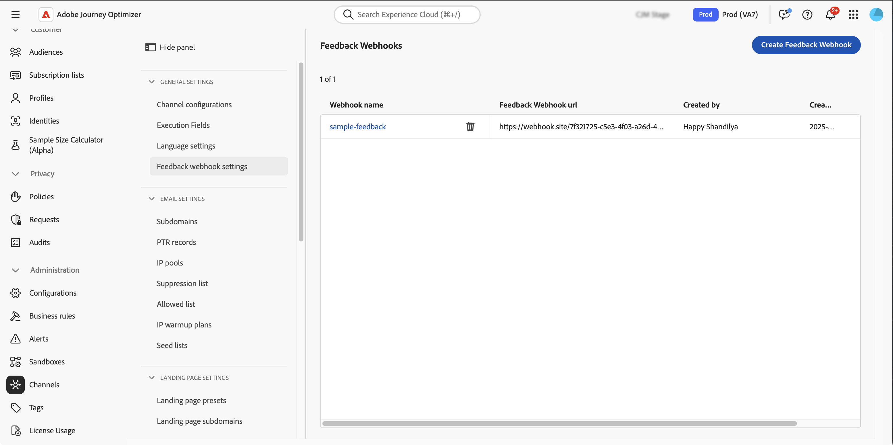
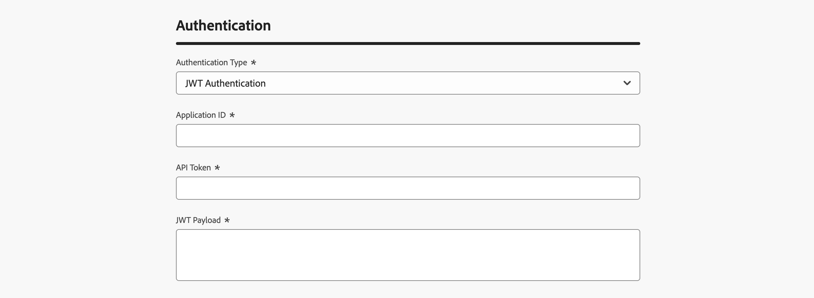

# Create feedback webhooks for API triggered campaigns {#webhooks}

Feedback webhooks allow you to receive real-time status updates for messages sent through transactional API triggered campaigns. By configuring a webhook, you can automatically receive delivery outcomes directly to your systems, enabling monitoring, logging, and automated processing.  

You can manage webhook configurations from the **[!UICONTROL Administration]** / **[!UICONTROL Channels]** / **[!UICONTROL Feedback webhook settings]** menu. 

  

>[!NOTE]
>Only one webhook configuration per **Organization + sandbox** combination is allowed.  

## Create a feedback webhook  

To create a webhook, follow these steps:  

1. Navigate to **[!UICONTROL Administration]** / **[!UICONTROL Channels]** / **[!UICONTROL Feedback webhook settings]**. 

1. Click **Create Feedback Webhook**.

1. In the **[!UICONTROL Basic Configuration]** section, provide the following details:

    

    * **Webhook Name** - Enter a descriptive name to identify the webhook.  
    * **Channels** - Select the channel(s) for which this webhook should receive feedback (Email and/or SMS).  
    * **Webhook URL** - Provide the HTTPS endpoint where feedback events must be delivered.

1. In the **[!UICONTROL Authentication]** section, select the authentication method:  

      

    * **No Authentication** – No authentication headers are added.  
    * **JWT Authentication** – Provide the required details if your endpoint requires JWT authentication.  

1. In the **[!UICONTROL Header Parameters]** section, configure additional custom headers to be sent with each webhook request.

      

1. Click **[!UICONTROL Submit]** to save the configuration.

>[!NOTE]
>
>ou can edit a webhook at any time. To do so, open it from the inventory then click the **[!UICONTROL Edit]** button.

## Webhook payload structure

After a message execution, **[!DNL Journey Optimizer]** sends the following payload to the configured endpoint.

```
{
  "requestId": "8NoByJneShCdCGRnrGS1t1m3CdA73dhR",
  "imsOrg": "myImsOrg",
  "sandbox": {
    "id": "068abf40-575e-11ea-8512-9b1bfdb82603",
    "name": "prod"
  },
  "channel": "email",
  "eventType": "message.feedback",
  "messageExecution": {
    "messageExecutionID": "HUMA-26362805",
    "messageType": "transactional",
    "campaignID": "16f24a15-7e21-477c-848a-d5695ca7f137",
    "campaignVersionID": "2ca10c10-56dd-4505-87cd-fa5da84e7a5d"
  },
  "messageDeliveryFeedback": {
    "feedbackStatus": {
      "value": "bounce"
    },
    "offers": null,
    "messageExclusion": null,
    "messageFailure": {
      "category": "sync",
      "type": "Ignored",
      "code": "25",
      "reason": "Admin Failure"
    },
    "retryCount": 0
  },
  "identityMap": {
    "email": [
      {
        "id": "john.doe@luma.com",
        "primary": true
      }
    ]
  }
}

```

The webhook can capture the following events:

* Sent
* Delivered
* Bounce (see example above)
* Errors

Every incoming request also includes a unique requestId that is sent back to the webhook.

## Next steps {#next}

Once a feedback webhook has been created, you can enable it when configuring a **transactional API triggered campaign** audience. Learn more in this section: [Enable webhooks](../campaigns/api-triggered-campaign-audience.md#webhook)
