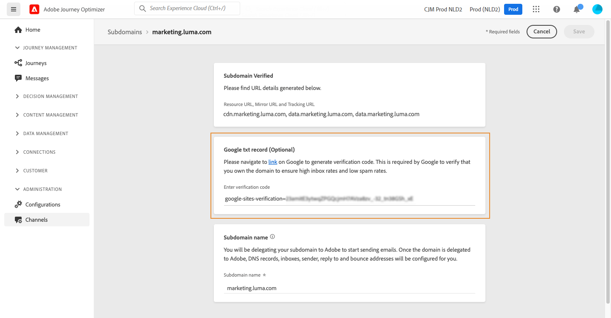

# Add a Google TXT record to a subdomain {#google-txt-record}

>[!CONTEXTUALHELP]
>id="ajo_admin_subdomain_google"
>title="Google TXT records"
>abstract="To ensure successful delivery of emails to Gmail addresses, you can add special Google site verification TXT records to your subdomain to make sure that it is verified."

TXT records are a type of DNS record used to provide text information about a domain, that can be read by external sources.

In order to ensure optimal deliverability and successful delivery of emails to Gmail addresses, [!DNL Journey Optimizer] allows you to add special Google site verification TXT records to your subdomain to make sure that it is verified.

>[!CAUTION]
>
> This operation can only be performed once a subdomain has the **[!UICONTROL Success]** status. For more on subdomains' statuses, refer to [this section](delegate-subdomain.md#access-delegated-subdomains).

## Add a Google TXT record {#add-google-txt-record}

To add a Google TXT record to your subdomain, follow these steps:

1. Open the subdomain from the **[!UICONTROL Channels]** > **[!UICONTROL Email settings]** > **[!UICONTROL Subdomains]** menu.

1. In the **[!UICONTROL Google txt record]** section, enter the verification code generated from [Google Workspace](https://support.google.com/a/answer/183895){target="_blank"}<!--G Suite Admin tools-->, then click **[!UICONTROL Save]**.

    
    
1. Once the TXT record is added, you need to have it verified by Google. To do this, navigate to [Google Workspace](https://support.google.com/a/answer/183895){target="_blank"}<!--G Suite Admin tools-->, then launch the verification step.

## Update a Google TXT record {#update-google-txt-record}

To update an existing Google TXT record, follow these steps:

1. Open the subdomain from the **[!UICONTROL Subdomains]** menu.

1. Clear the existing value in the **[!UICONTROL Google txt record]** field and click **[!UICONTROL Save]**. This step replaces the previous Google TXT record value with an empty string.

1. Now reopen the same subdomain and enter the new verification code.

1. Click **[!UICONTROL Save]** again.

1. Verify the updated record through [Google Workspace](https://support.google.com/a/answer/183895){target="_blank"}.
