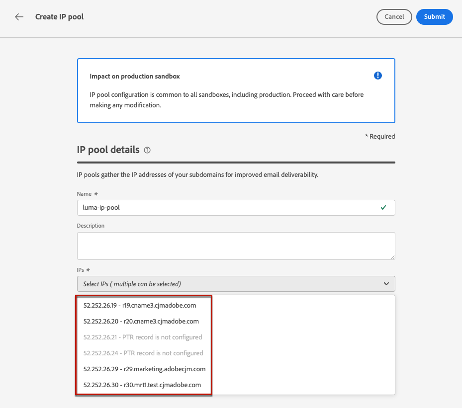

# Create IP pools {#create-ip-pools}

>[!CONTEXTUALHELP]
>id="ajo_admin_ip_pool_header"
>title="Set up an IP pool"
>abstract="IP pools gather the IP addresses of your subdomains for improved email deliverability."

>[!CONTEXTUALHELP]
>id="ajo_admin_ip_pool"
>title="Set up an IP pool"
>abstract="With Journey Optimizer, you can create IP pools to group together the IP addresses of your subdomains. This may significantly improve your email deliverability, because by doing so, you can prevent the reputation of a subdomain from impacting your other subdomains."

## About IP pools {#about-ip-pools}

With [!DNL Journey Optimizer], you can create IP pools to group together the IP addresses of your subdomains.

Creating IP pools is strongly recommended for email deliverability. By doing so, you can prevent the reputation of a subdomain from impacting your other subdomains.

For example, one best practice is to have one IP pool for your marketing messages, and another one for your transactional messages. This way, if one of your marketing messages performs badly and is declared as spam by a customer, this will not affect the transactional messages sent to this same customer, who will still receive transactional messages (purchase confirmations, password recovery messages, etc.).

>[!CAUTION]
>
>IP pool configuration is common to all environments. Therefore any IP pool creation or edition will also impact the production sandboxes.

## Create an IP pool {#create-ip-pool}

To create an IP pool, follow these steps:

1. Access the **[!UICONTROL Administration]** > **[!UICONTROL Channels]** > **[!UICONTROL IP pools]** menu, then click **[!UICONTROL Create IP Pool]**.

    

1. Provide a name and a description (optional) for the IP pool.

    >[!NOTE]
    >
    >The name must begin with a letter (A-Z) and include only alpha-numeric characters or special characters ( _, ., - ).

1. Select the IP addresses to include in the pool from the drop-down list, then click **[!UICONTROL Submit]**.

     

    >[!NOTE]
    >
    >All the IP addresses provisioned with your instance are available in the list.

When selecting IPs, you can see from the list the PTR records associated with the IPs. This allows you to verify the branding information for each IP when creating an IP pool, and to select IPs with the same branding information for example. [Learn more on PTR records](ptr-records.md)

>[!NOTE]
>
>If no PTR record is configured for an IP, you cannot select that IP. Reach out to your Adobe representative for configuring the PTR record of that IP.

After an IP pool has been created, PTR information is visible when hovering over the IP addresses displayed below the IP pool drop-down list.

  
The IP pool is now created and displays in the list. You can select it to access its properties and display the associated channel surface (i.e. message preset). For more on how to associate a channel surface with an IP pool, refer to [this section](channel-surfaces.md).

## Edit an IP pool {#edit-ip-pool}

To edit an IP pool, follow the steps below.

1. From the list, click the IP pool name to open it.

    

1. Edit its properties as desired. You can modify the description, and add or remove IP addresses.

    >[!NOTE]
    >
    >The IP pool name is not editable. If you want to modify it, you need to delete the IP pool and create another one with the name of your choice.

    

    >[!CAUTION]
    >
    >Proceed with extra care when considering deleting an IP, as this will put additionnal load on the other IPs and may have severe impacts on your deliverability. In case of any doubt, contact a deliverability expert.

1. Save your changes.

The update is effective immediately or asynchronously, depending on the IP pool being associated to a [channel surface](channel-surfaces.md) or not:

* If the IP pool is **not** associated with any channel surface, the update is instantaneous (**[!UICONTROL Success]** status).
* If the IP pool **is** associated with a channel surface, the update can take up to 3 hours (**[!UICONTROL Processing]** status).

>[!NOTE]
>
>When [creating a channel surface](channel-surfaces.md#create-channel-surface), if you select an IP pool which is under edition (**[!UICONTROL Processing]** status) and has never been associated with the subdomain selected for that surface, you cannot proceed with surface creation. [Learn more](channel-surfaces.md#subdomains-and-ip-pools)

To check the IP pool update status, click the **[!UICONTROL More actions]** button and select **[!UICONTROL Recent updates]**.

>[!NOTE]
>
>Once an IP Pool is updated successfully, you may have to wait:
>* a few minutes before it is consumed by the unitary messages,
>* until the next batch for the IP pool to be effective in batch messages.

You can also use the **[!UICONTROL Delete]** button to delete an IP pool. Note that you cannot delete an IP pool that has been associated to a channel surface.

