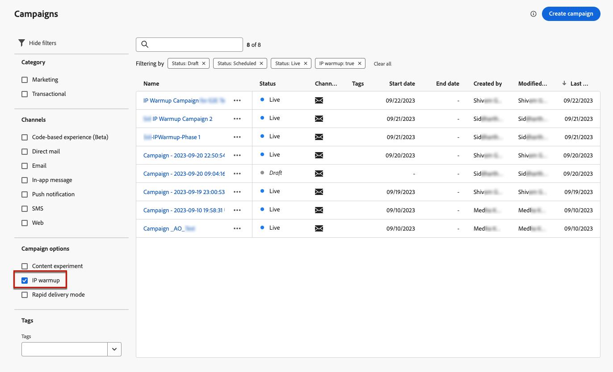

# Create IP warmup campaigns {#create-ip-warmup-campaign}

>[!CONTEXTUALHELP]
>id="ajo_campaign_ip_warmup"
>title="Activate the IP warmup plan option"
>abstract="When you select this option, the campaign can be used in an IP warmup plan. The campaign schedule will then be driven by the IP warmup plan it is associated with."

Before creating the IP warmup plan itself in [!DNL Journey Optimizer], you first need to create one or more campaigns specifically designed for use in an IP warmup plan<!--through a dedicated option-->.

To create an IP warmup campaign, follow the steps below.

1. Create an email channel [configuration](channel-surfaces.md) for the domain and the IPs that you have identified for your warmup plan.
    
    Work with your deliverability consultant to identify the domain and IPs to be used. Learn how to select them in an email configuration in [this section](../email/email-settings.md#subdomains-and-ip-pools).

1. Create a scheduled marketing [campaign](../campaigns/create-campaign.md) and select the [Email](../email/create-email.md#create-email-journey-campaign) action.

    <!--Select the Marketing category. The IP warmup plan activation option is only available for  marketing-type campaigns.-->

1. Select the configuration that you created for IP warmup.

    

    <!--You must use the same configuration as the one that will be used for the asociated IP warmup plan. [Learn how to create an IP warmup plan](#create-ip-warmup-plan)-->

1. Click **[!UICONTROL Create]**.

1. From the **[!UICONTROL Schedule]** section, select **[!UICONTROL IP warmup plan activation]**.

    

    The campaign [schedule](../campaigns/create-campaign.md#schedule) will be driven by the IP warmup plan it will be associated with, meaning that the schedule is not defined anymore in the campaign itself.

1. Complete the steps to create an email campaign, such as defining the campaign properties, [audience](../audience/about-audiences.md)<!--best practices for IP warmup in terms of audience?-->, and [content](../email/get-started-email-design.md#key-steps).

    >[!IMPORTANT]
    >
    >Audiences allowed in an IP warmup campaign must be [segment-based](../audience/creating-a-segment-definition.md) and created using the [default merge policy](https://experienceleague.adobe.com/en/docs/experience-platform/profile/merge-policies/overview#default-merge-policy){target="_blank"}.

    For more information on how to configure a campaign, refer to [this page](../campaigns/get-started-with-campaigns.md).

1. [Activate](../campaigns/review-activate-campaign.md) the campaign. Its status changes to **[!UICONTROL Live]**.

    >[!NOTE]
    >
    >[Business rules](rule-sets.md#apply-frequency-rule) should not be used on IP warmup plans. Applying these rules could hinder reaching the desired number of targeted profiles for campaigns.
    
    For a live campaign with IP warmup plan activated, the **[!UICONTROL Delete]** button is available until it is associated with an IP warmup plan. Once used in a plan, the campaign cannot be deleted anymore.

1. The campaign is displayed in the **[!UICONTROL Campaigns]** list. To easily retrieve all the IP warmup campaigns created on the current sandbox, you can filter on the **[!UICONTROL IP warmup]** campaign option.

    

Once live, the campaign is ready for use in an IP warmup plan. [Learn more](ip-warmup-plan.md)

An IP warmup campaign can only be used in one IP warmup plan. However, the same campaign can be used in one or more phases of the same IP warmup plan. [Learn more](ip-warmup-plan.md#define-phases)

>[!NOTE]
>
>When a live campaign is used in an IP warmup plan, after the plan is [marked as completed](ip-warmup-execution.md#mark-as-completed), the status of that campaign changes to **[!UICONTROL Stopped]**.

