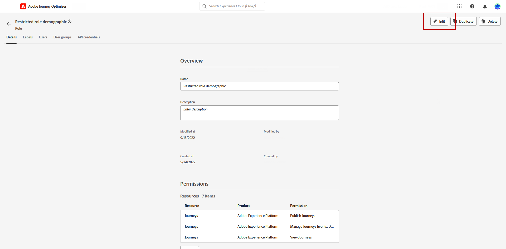
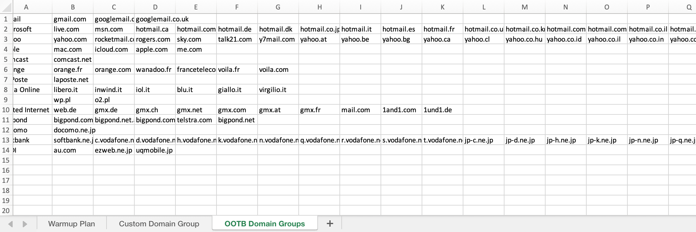

# Create an IP warmup plan {#ip-warmup}

Once you created one or more [IP warmup campaigns](ip-warmup-campaign.md) with a dedicated configuration and the corresponding option enabled, you can start creating your IP warmup plan.

To access, create, edit and delete the IP warmup plans, you must have the **[!UICONTROL Deliverability Consultant]** role or IP warmup plans related permissions. 

+++Learn how to assign the Deliverability Consultant role or IP warmup plans related permissions

Object level access control allows you to protect data and grant specific access to view and manage your plans. If no label is assigned to your IP warmup plan, it will be open for viewing and editing by all users.

Granting the **[!UICONTROL View IP warmup plans]** permission restricts access to viewing and publishing only, while assigning the **[!UICONTROL Manage IP warmup plans]** permission allows users to both view and edit the plan.

To assign the corresponding permission to a specific **[!UICONTROL Role]**:

1. From the [!DNL Permissions] product, navigate to the **[!UICONTROL Roles]** menu and select the role that you want to update with the new **[!UICONTROL IP Warmup Configurations]** permissions.

1. From your **[!UICONTROL Role]** dashboard, click **[!UICONTROL Edit]**.

    

1. Drag and drop the **[!UICONTROL IP Warmup Configurations]** resource to assign permission.

1. From the **[!UICONTROL IP Warmup Configurations]** resource drop-down, select which permission(s) your user needs: **[!UICONTROL View IP Warmup Plans]**, **[!UICONTROL Manage IP Warmup Plans]**, and/or **[!UICONTROL View IP Warmup Reports]**. You can select them all at once if needed. 

    

1. Click **[!UICONTROL Save]**.

To assign the corresponding role to a **[!UICONTROL User]**:

1. From the [!DNL Permissions] product, navigate to the **[!UICONTROL Roles]** menu and select the **[!UICONTROL Deliverability Consultant]** built-in role.

1. From your **[!UICONTROL Role]** dashboard, access the **[!UICONTROL Users]** tab.

    
       
1. Click **[!UICONTROL Add user]** to assign the **[!UICONTROL Deliverability Consultant]** built-in role.

    

1. Select your **[!UICONTROL User]** and click **[!UICONTROL Save]**.

    

+++

## Prepare the IP warmup plan file {#prepare-file}

IP warmup is an activity which consists in gradually increasing the volume of emails going out from your IPs and domain to the main Internet service providers (ISPs) - in order to establish your reputation as a legitimate sender.

This activity is typically performed with the help of a deliverability expert who helps to prepare a well thought-out plan based on the industry domains, use cases, regions, ISPs and various other factors.

<!--When working with the [!DNL Journey Optimizer] IP warmup feature, this plan takes the form of an Excel file that must contain a number of predefined columns.-->

Before being able to create an IP warmup plan in the [!DNL Journey Optimizer] interface, you need to fill in an Excel template with all the data that will feed your plan.

* From the user interface you can download the blank Excel [IP warmup plan template](assets/IPWarmupPlan-Template.xlsx) to fill in.

* You can also download a [sample IP warmup plan](assets/IPWarmupPlan-Sample.xlsx) already filled in with some data that you can use as an example.

<!--
* From the user interface you can download the blank Excel IP warmup plan template to fill in.

* You can also download a sample IP warmup plan already filled in with some data you can use as an example.
-->

>[!CAUTION]
>
>Work with your deliverability consultant to make sure your IP warmup plan file is correctly set up.
>
>Make sure to use the format provided in the template.

Below is an example of a file containing an IP warmup plan.

### Warmup Plan tab {#ip-warmup-plan-tab}

To create your IP warmup plan, fill in the first tab with the data you need to feed your plan.

* In the example above, a plan has been prepared spanning over 17 days (called '**runs**') to reach a target volume of over one million profiles.

* This planned is executed through six **phases**, each of them containing at least one run.

* You can have up to 6 columns (4 columns for domain groups, one for the **Others** column and one for **Engagement Days** column). In this example, the plan is divided into six columns:

    * Three of which correspond to **out-of-the-box domain groups** to use in your plan (Gmail, Yahoo, and Microsoft). The out-of-the-box domain groups are all listed in the [OOTB Domain Groups](#ootb-domain-groups-tab) tab.
    * One column corresponds to a custom domain group (that you need to add using the [Custom Domain Group](#custom-domain-group-tab) tab).
    * The fifth column, **Others**, contains all the remaining addresses from other domains which are not covered explicitly in the plan. This column is optional: if omitted, emails will go to the specified domains only.
    * The last column, **Engagement Days**, allows you to specify the number of days over which engagement should be tracked or assessed.

The idea is to progressively increase the number of targeted addresses in each run, while reducing the number of runs for each phase.

### Custom Domain Group tab {#custom-domain-group-tab}

You can also add more columns to your plan by including custom domain groups. 

Use the **[!UICONTROL Custom Domain Group]** tab to define a new domain group. For each domain, you can add all the subdomains it covers.

>[!IMPORTANT]
>
>Ensure that each domain is unique to its domain group and does not overlap with other domain groups or [out-of-the-box domain groups](#ootb-domain-groups-tab).

For example, if you add the custom domain Roadrunner, you want the following subdomains to be included - such as in the example below: roadrunner.com, nc.rr.com, tampabay.rr.com, rochester.rr.com, etc.

>[!NOTE]
>
>If you do not need custom domains, leave the **[!UICONTROL Custom Domain Group]** tab empty.

### OOTB Domain Groups tab {#ootb-domain-groups-tab}

The **OOTB Domain Groups** tab of the IP Warmup plan template contains all the out-of-the-box main domain groups you can add to your plan.

>[!NOTE]
>
>If a domain group is not listed in this tab, you need to create a custom domain group in the corresponding tab. [Learn more](#custom-domain-group-tab)

The out-of-the-box main domain groups are also listed below:

+++ Gmail
gmail.com;google.com;googlemail.com;googlemail.co.uk
+++

+++Microsoft
hotmail.com.tr;live.de;live.ru;live.nl;windowslive.com;live.jp;mts.net;xbox.com;hotmail.fr;hotmail.cl;hotmail.jp;live.cl;live.at;live.com.au;hotmail.co.th;live.hk;hotmail.com.au;hotmail.com;live.com.my;hotmail.co.kr;live.ie;outlook.com.br;hotmail.co.il;hotmail.dk;live.co.kr;live.co.uk;live.com.mx;outlook.ie;live.cn;hotmail.co.uk;live.com.sg;hotmail.es;live.fr;live.no;live.dk;hotmail.it;msn.com;live.se;hotmail.co.jp;live.be;live.co.za;live.in;hotmail.se;live.com.pt;hotmail.ch;outlook.com;live.com;hotmail.gr;live.it;live.com.ar;hotmail.ca;hotmail.com.br;hotmail.com.ar;live.ca;hotmail.de
+++

+++Yahoo
aol.fi;games.com;cs.com;yahoo.com.in;y7mail.com;yahoo.co.uk;yahoo.hu;yahoo.co.hu;yahoo.cn;yahoogroups.com.sg;yahoogroups.com.au;aol.es;yahoo.com.au;yahoo.com.vn;yahoo.ca;aol.hk;aol.co.nz;yahoo.com.br;aolpoland.pl;aolnorge.no;yahoo.ne.jp;yahoo.fi;ymail.com;netscape.com;yahoo.com.pe;yahoo.hr;aol.cz;yahoo.ee;aol.be;aolcom.tr;yahoo.si;yahoo.co.id;aol.it;citlink.net;wmconnect.com;yahoo.es;yahoo.dk;yahoogroups.ca;yahoo.com.jp;yahoo.com.hk;aol.kr;yahoo.ie;aol.jp;aol.com.br;yahoo.lt;yahoo.co.kr;aol.nl;yahoo.com.ar;yahoo.bg;ygm.com;yahoo.co.nz;aol.se;aol.com;yahoo.de;goowy.com;rocketmail.com;frontiernet.net;aim.com;yahoo.nl;yahoogroups.co.in;aol.dk;netscape.net;aol.cl;luckymail.com;yahoo.no;yahoo.co.jp;yahoo.com.kr;yahoo.cz;yahoo.co.za;yahoo.sk;verizon.net;yahoogroups.de;yahoo.gr;aol.com.ve;aol.com.ar;yahoo.ro;aol.com.co;wild4music.com;yahoo.at;yahoogroups.com.cn;yahoo.com.co;wow.com;aol.fr;yahoo.in;aol.in;yahoo.com;yahoo.rs;aol.de;yahooxtra.co.nz;yahoo.com.mx;yahoo.com.ph;sky.com;aol.com.mx;aol.com.au;yahoo.se;myaol.jp;aolchina.com;yahoo.pt;yahoo.com.net;yahoo.com.tw;yahoogrupper.dk;yahoo.fr;talk21.com;compuserve.com;aol.pl;yahoo.com.sg;yahoogroups.com.tw;aol.ch;yahoo.it;frontier.com;yahoo.co.in;aolpolcka.pl;yahoo.co.il;verizon.net.in;yahoogruppi.it;yahoo.com.tr;yahoo.cl;yahoogroups.com.hk;yahoogroups.co.uk;yahoo.com.biz;yahoo.com.hr;yahoo.be;aol.co.uk;ybb.ne.jp;aol.tw;yahoogroups.co.kr;yahoo.com.my;rogers.com;gte.net;yahoogroups.com;yahoo.co.th;yahoo.com.cn;love.com;bellatlantic.net;aol.ru;yahoo.com.ve;yahoo.com.ua;yahoo.lv;aolpolska.pl;aol.at;yahoo.pl
+++

+++Apple
mac.com;icloud.com;apple.com;me.com
+++

+++Comcast
comcast.net
+++

+++Orange
voila.com;francetelecom.com;orange.com;orange.fr;wanadoo.fr;voila.fr
+++

+++La Poste
laposte.net
+++

+++Italia Online
inwind.it;blu.it;virgilio.it;giallo.it;iol.it;libero.it
+++

+++WP
wp.pl;o2.pl
+++

+++United Internet
gmx.de;1and1.com;gmx.fr;mail.com;1und1.de;gmx.com;gmx.net;gmx.at;web.de;gmx.ch
+++

+++Bigpond
bigpond.com;bigpond.com.au;bigpond.net;telstra.com;bigpond.net.au
+++

+++Docomo
docomo.ne.jp
+++

+++Softbank
c.vodafone.ne.jp;jp-h.ne.jp;k.vodafone.ne.jp;jp-d.ne.jp;jp-c.ne.jp;t.vodafone.ne.jp;h.vodafone.ne.jp;r.vodafone.ne.jp;q.vodafone.ne.jp;jp-t.ne.jp;jp-q.ne.jp;s.vodafone.ne.jp;jp-s.ne.jp;jp-r.ne.jp;jp-k.ne.jp;n.vodafone.ne.jp;d.vodafone.ne.jp;softbank.ne.jp;jp-n.ne.jp
+++

+++KDDI
au.com;ezweb.ne.jp;uqmobile.jp
+++

### Example {#example}

Let's say you want to have two custom domain groups:

* One for Hotmail domains only.
* One for all other domains from the domain group Microsoft (thus excluding all Hotmail domains).

Domains outside Hotmail and from the domain group Microsoft will be gathered into the **[!UICONTROL Others]** column.

1. In the **[!UICONTROL Custom Domain Group]** tab, create the **Hotmail** domain group.

1. Add all the the Hotmail domains on the same row.

    You can [copy and paste](#copy-paste) all the Hotmail domains listed in the [OOTB Domain Groups tab](#ootb-domain-groups-tab) section.

1. Add another row.

1. Create the **Microsoft_X** domain group.

1. Add all the the Microsoft domains that are not Hotmail on the same row. Similarly, you can [copy and paste](#copy-paste) them from the list above.

1. Go back to the **[!UICONTROL IP Warmup Plan]** tab.

1. Create three columns: one for **Hotmail**, one for **Microsoft_X** and one for **Others**.

1. Fill in the columns according to your needs.

<!--Only the domain groups listed in the **[!UICONTROL IP Warmup Plan]** tab will be taken into account.-->

### Copy-paste default domains {#copy-paste}

If you want to create a custom domain group containing all the Hotmail domains for example, you can copy and paste the domains from the **OOTB Domain Groups** tab of the [IP warmup plan template](assets/IPWarmupPlan-Template.xlsx), or from the list provided [above](#ip-warmup-plan-tab).

Then use the Excel conversion tool to convert text to columns:

1. Select **[!UICONTROL Data]** > **[!UICONTROL Text to columns...]**, choose **[!UICONTROL Delimited]** and select **[!UICONTROL Next]**.

1. Select **[!UICONTROL Semicolon]**, click **[!UICONTROL Next]** and **[!UICONTROL Finish]**.

Each domain now displays in a different column on the same row.

## Access and manage IP warmup plans {#manage-ip-warmup-plans}

1. Access the **[!UICONTROL Administration]** > **[!UICONTROL Channels]** > **[!UICONTROL Email settings]** > **[!UICONTROL IP warmup plans]** menu. All the IP warmup plans created so far are displayed.

    

1. You can filter on the status. The different statuses are:

    * **Not started**: no run has been activated yet. [Learn more](ip-warmup-execution.md#define-runs)
    * **Live**: the plan changes to this status as soon as the first run in the first phase has been successfully activated. [Learn more](ip-warmup-execution.md#define-runs)
    * **Completed**: the plan has been marked as completed. <!--This option is only available if all the runs in the plan are in **[!UICONTROL Completed]** or **[!UICONTROL Draft]** status (no run can be **[!UICONTROL Live]**).--> [Learn more](ip-warmup-execution.md#mark-as-completed)
    <!--* **Paused**: to check (user action)-->

1. To delete an IP warmup plan, select the **[!UICONTROL Delete]** icon next to the name of a plan and confirm deletion.

    >[!NOTE]
    >
    >Only plans with the **Not started** status can be deleted.

    

    >[!CAUTION]
    >
    >The selected IP warmup plan will be permanently deleted.

## Create an IP warmup plan {#create-ip-warmup-plan}

>[!CONTEXTUALHELP]
>id="ajo_admin_ip_warmup_upload"
>title="Specify your IP warmup plan"
>abstract="Fill in the Excel template with all the data that will feed your plan, such as IP warmup phases and target number of profiles, and upload it here."
>additional-url="https://experienceleague.adobe.com/docs/journey-optimizer/using/configuration/implement-ip-warmup-plan/ip-warmup-plan.html#prepare-file" text="Prepare the IP warmup plan file"

>[!CONTEXTUALHELP]
>id="ajo_admin_ip_warmup_surface"
>title="Select a marketing configuration"
>abstract="You must select the same configuration as the one selected in the campaign you want to associate with your IP warmup plan."
>additional-url="https://experienceleague.adobe.com/docs/journey-optimizer/using/configuration/channel-surfaces.html" text="Set up channel configurations"
>additional-url="https://experienceleague.adobe.com/docs/journey-optimizer/using/configuration/channel-surfaces.html" text="Create IP warmup campaigns"

To create an IP warmup plan, follow the steps below.

1. Access the **[!UICONTROL Administration]** > **[!UICONTROL Channels]** > **[!UICONTROL Email settings]**> **[!UICONTROL IP warmup plans]** menu, then click **[!UICONTROL Create IP warmup plan]**.

    

1. Fill in the IP warmup plan details: give it a name and a description.

    

1. Select the [configuration](channel-surfaces.md) that you want to warm up. Only marketing configurations are available for selection. [Learn more on email type](../email/email-settings.md#email-type)

    >[!NOTE]
    >
    >The campaigns you want to associate with your IP warmup plan must use the same configuration. [Learn how to create an IP warmup campaign](ip-warmup-campaign.md)

1. Upload the Excel file containing your IP warmup plan. [Learn more](#prepare-file)
    
    <!--
    You can also download the Excel template from the [!DNL Journey Optimizer] user interface and upload it after filling it with the IP warmup details.-->

    

    >[!NOTE]
    >
    >In case the upload fails, make sure you are using the correct formatting and file format (.xls or .xlsx). Use the [template](assets/IPWarmupPlan-Template.xlsx) provided to you by Adobe.

1. Click **[!UICONTROL Create]**. All the phases, runs, columns and their content defined in the file you uploaded are automatically displayed in the [!DNL Journey Optimizer] interface.

    

    >[!NOTE]
    >
    >The **[!UICONTROL Targeted]** column shows the sum of all the profiles targeted for each run, meaning all the profiles from each domain groups that you defined, including the **Others** column if any. 

You are now ready to execute your IP warmup plan. [Learn more](ip-warmup-execution.md)
