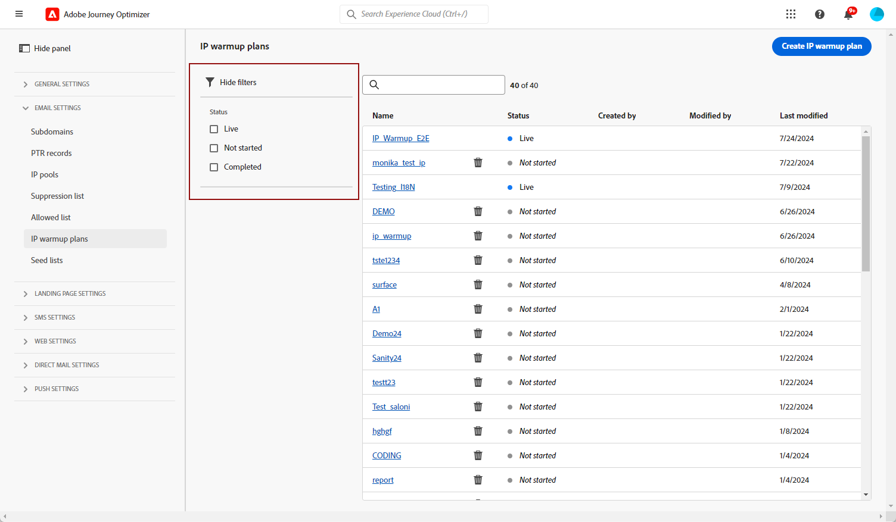

# Create an IP warmup plan {#ip-warmup}

>[!BEGINSHADEBOX]

What you'll find in this documentation guide:

* [Get started with IP warmup](ip-warmup-gs.md)
* [Create IP warmup campaigns](ip-warmup-campaign.md)
* **[Create an IP warmup plan](ip-warmup-plan.md)**
* [Execute the IP warmup plan](ip-warmup-execution.md)

>[!ENDSHADEBOX]

Once you created one or more [IP warmup campaigns](ip-warmup-campaign.md) with a dedicated surface and the corresponding option enabled, you can start creating your IP warmup plan.

## Prepare the IP warmup plan file {#prepare-file}

IP warmup is an activity which consists in gradually increasing the volume of emails going out from your IPs and domain to the main Internet service providers (ISPs) - in order to establish your reputation as a legitimate sender.

This activity is tipically performed with the help of a deliverability expert who helps to prepare a well thought-out plan based on the industry domains, use cases, regions, ISPs and various other factors.

When working with the [!DNL Journey Optimizer] IP warmup feature, this plan takes the form of an Excel file that must contain a number of predefined columns. Before being able to create an IP warmup plan in the [!DNL Journey Optimizer] interface, you need to fill in this template with all the data that will feed your plan.

>[!CAUTION]
>
>Work with your deliverability consultant to make sure your IP warmup plan file is correctly set up.

Below is an example of a file containing an IP warmup plan.

### IP Warmup Plan tab

* In this example, a plan has been prepared spanning over 17 days (called "**runs**") to reach a target volume of over 1 million profiles.

* This planned is executed through 6 **phases**, each of them containing at least one run.

* You can have as many columns as you want for the domains you want to deliver to. In this example, the plan is divided into 6 columns: 5 of which correspond to the **main domain groups** to use in your plan (Gmail, Microsoft, Yahoo, Orange and Apple) and the sixth column, **Others**, contains all the remaining addresses from other domains.
* The **Engagement Days** column shows that only the profiles engaged with your brand over the last 30 days are targeted.

The idea is to progressively increase the number of targeted addresses in each run, while reducing the number of runs for each phase.

The out-of-the-box main domain groups you can add to your plan are listed below:

* Gmail
* Adobe
* WP
* Comcast
* Yahoo
* Bigpond
* Orange
* Softbank
* Docomo
* United Internet
* Microsoft
* KDDI
* Italia Online
* La Poste
* Apple

### Custom Domain Group tab

You can also add more columns to your plan by including custom domain groups. 

Use the **[!UICONTROL Custom Domain Group]** tab to define a new domain group. For each domain, you can add all the subdomains it covers.<!--TBC-->

For example, if you add the custom domain Luma, you want the following subdomains to be included: luma.com, luma.co.uk, luma.it, luma.fr, luma.de, etc.

## Access and manage IP warmup plans {#manage-ip-warmup-plans}

1. Access the **[!UICONTROL Administration]** > **[!UICONTROL Channels]** > **[!UICONTROL IP warmup plans]** menu. All the IP warmup plans created so far are displayed.

    

1. You can filter on the status. The different statuses are:

    * **Not started**: no run has been activated yet. [Learn more](ip-warmup-execution.md#define-runs)
    * **Live**: the plan changes to this status as soon as the first run in the first phase has been successfully activated. [Learn more](ip-warmup-execution.md#define-runs)
    * **Completed**: the plan has been marked as completed. This option is only available if all the runs in the plan are in **[!UICONTROL Completed]** or **[!UICONTROL Draft]** status (no run can be **[!UICONTROL Live]**). [Learn more](ip-warmup-execution.md#mark-as-completed)
    <!--* **Paused**: to check (user action)-->

1. To delete an IP warmup plan, select the **[!UICONTROL Delete]** icon next to the name of a plan and confirm deletion.

    

    >[!CAUTION]
    >
    >The selected IP warmup plan will be permanently deleted.

## Create an IP warmup plan {#create-ip-warmup-plan}

>[!CONTEXTUALHELP]
>id="ajo_admin_ip_warmup_upload"
>title="Specify your IP warmup plan"
>abstract="Download the CSV template and fill it with data for IP warmup phases and target number of profiles."

>[!CONTEXTUALHELP]
>id="ajo_admin_ip_warmup_surface"
>title="Select a marketing surface"
>abstract="You must select the same surface as the one selected in the campaign you want to associate with your IP warmup plan."
>additional-url="https://experienceleague.adobe.com/docs/journey-optimizer/using/configuration/channel-surfaces.html" text="Set up channel surfaces"
>additional-url="https://experienceleague.adobe.com/docs/journey-optimizer/using/configuration/channel-surfaces.html" text="Create IP warmup campaigns"

When one or more live campaigns with the **[!UICONTROL IP warmup plan activation]** option enabled are activated, you can associate them with an IP warmup plan.

>[!CAUTION]
>
>To create, edit and delete the IP warmup plans, you must have the **[!UICONTROL Deliverability Consultant]** permission. <!--Learn more on managing [!DNL Journey Optimizer] users' access rights in [this section](../administration/permissions-overview.md).-->

1. Access the **[!UICONTROL Administration]** > **[!UICONTROL Channels]** > **[!UICONTROL IP warmup plans]** menu, then click **[!UICONTROL Create IP warmup plan]**.

    

1. Fill in the IP warmup plan details: give it a name and a description.

    

1. Select a [surface](channel-surfaces.md). Only marketing surfaces are available for selection. [Learn more on email type](../email/email-settings.md#email-type)

    >[!CAUTION]
    >
    >You must select the same surface as the one selected in the campaign you want to associate with your IP warmup plan. [Learn how to create an IP warmup campaign](ip-warmup-campaign.md)

1. Upload the Excel file containing your IP warmup plan. [Learn more](#prepare-file)
    
    <!--
    You can also download the Excel template from the [!DNL Journey Optimizer] user interface and upload it after filling it with the IP warmup details.-->

    

1. Click **[!UICONTROL Create]**. All the phases, runs, columns and their content defined in the file you uploaded are automatically displayed in the [!DNL Journey Optimizer] interface. [Learn more](ip-warmup-execution.md)

    
