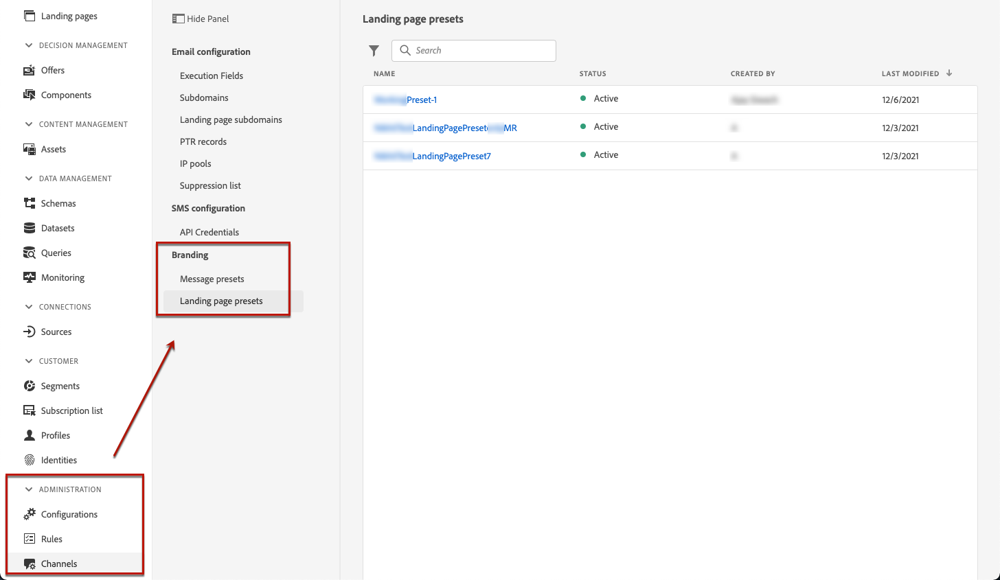
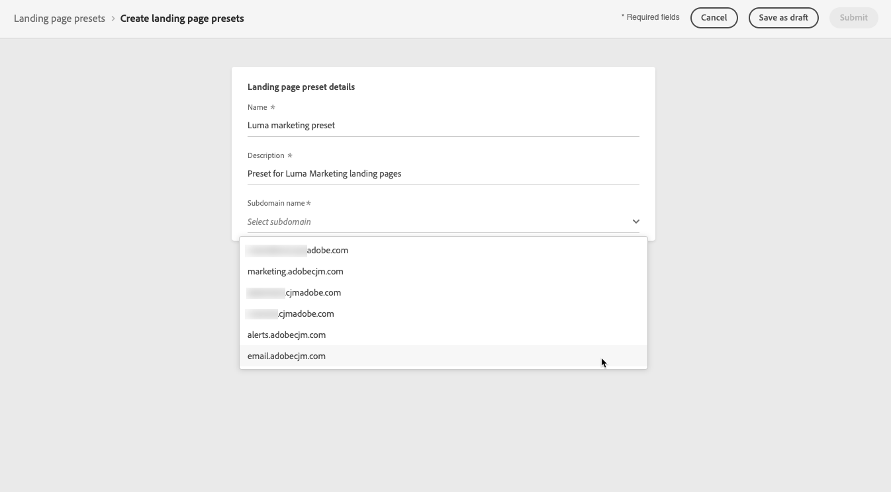
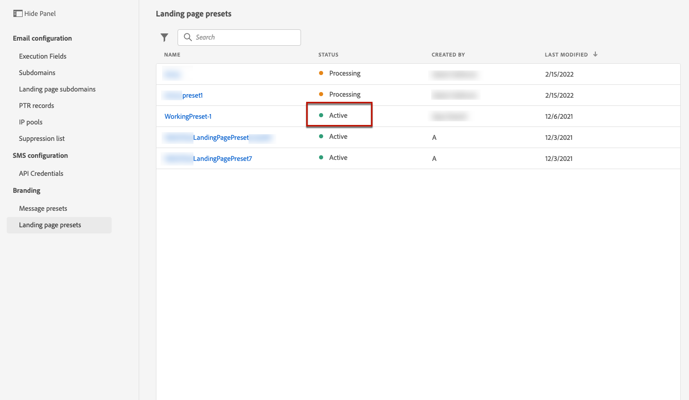

# Configure landing page channel {#lp-configuration}

## Access landing page presets {#lp-presets}

When [creating a landing page](../landing-pages/create-lp.md#create-a-lp), you need to select a landing page preset to be able to build the landing page and leverage it through **[!DNL Journey Optimizer]**.

<!--
To define landing page presets, contact your Adobe account representative or the [Adobe Customer Care Support Team](https://helpx.adobe.com/enterprise/admin-guide.html/enterprise/using/support-for-experience-cloud.ug.html){target="_blank"}.
-->

To access landing page presets, follow the steps below.

1. Access the **[!UICONTROL Administration]** > **[!UICONTROL Channels]** menu.

1. Select **[!UICONTROL Branding]** > **[!UICONTROL Landing page presets]**.

    

1. Click any preset label to access the landing page preset details.

    

## Create a landing page preset {#lp-create-preset}

1. Access the **[!UICONTROL Administration]** > **[!UICONTROL Channels]** menu, then select **[!UICONTROL Branding]** > **[!UICONTROL Landing page presets]**.

1. Select **[!UICONTROL Create landing page preset]**.

    <!---->

1. Enter a name and a description (optional) for the preset.

    <!---->

    >[!NOTE]
    >
    > Names must begin with a letter (A-Z). It can only contain alpha-numeric characters. You can also use underscore `_`, dot`.` and hyphen `-` characters.

1. Select a landing page subdomain. Learn how to configure landing page subdomains in [this section](#lp-subdomains).

    <!---->

    The settings corresponding to the selected subdomain display. <!-- default behavior? TBC -->

1. If you want to define your own subdomain settings, uncheck the **[!UICONTROL Same as subdomain]** option and fill in the **[!UICONTROL Landing page URL]**, **[!UICONTROL Tracking URL]** and **[!UICONTROL Image delivery URL]** fields. <!--TBC ?-->

1. Once all the parameters have been configured, click **[!UICONTROL Submit]** to confirm. You can also save the message preset as draft and resume its configuration later on.

    <!---->

1. Once the landing page preset has been created, it displays in the list with the **[!UICONTROL Processing]** status. <!-- to check but apparently goes through processing status first >

    >[!NOTE]
    >
    >If the checks are not successful, learn more on the possible failure reasons in [this section](#monitor-message-presets).  <!--Are they the same as in messages?-->

1. Once the checks are successful, the preset gets the **[!UICONTROL Active]** status. It is ready to be used in your landing pages.

    

You are now ready to [create landing pages](../landing-pages/create-lp.md) in [!DNL Journey Optimizer].

>[!NOTE]
>
>Learn how to create message presets for push notifications and emails in [this section](message-presets.md).

## Configure landing page subdomains {#lp-subdomains}

You need to set up the subdomains you will use for your landing pages.

You can use a subdomain that is already delegated to Adobe, or you can configure another subdomain. Learn more on delegating subdomains to Adobe in [this section](delegate-subdomain.md).

<!--
>[!NOTE]
>
>To define landing page subdomains, contact your Adobe account representative or the [Adobe Customer Care Support Team](https://helpx.adobe.com/enterprise/admin-guide.html/enterprise/using/support-for-experience-cloud.ug.html){target="_blank"}.
-->

### Use an existing subdomain {#lp-use-existing-subdomain}

To use a subdomain that is already delegated to Adobe, follow the steps below.

1. Access the **[!UICONTROL Administration]** > **[!UICONTROL Channels]** menu, then select **[!UICONTROL Email configuration]** > **[!UICONTROL Landing page subdomains]**.

1. Click **[!UICONTROL Set up subdomain]**.

1. Select **[!UICONTROL Use delegated domain]** from the **[!UICONTROL Configuration type]** section.

1. Select a delegated subdomain from the corresponding list and enter a prefix for your landing pages.

1. The record to be placed in your DNS servers displays. Copy this record, then navigate to your domain hosting solution to generate the matching DNS record.

1. Make sure that DNS record has been generated into your domain hosting solution. If everything is configured properly, check the box "I confirm...", then click **[!UICONTROL Submit]**.

1. Once the subdomain delegation has been submitted, the subdomain displays in the list with the **[!UICONTROL Processing]** status. For more on subdomains' statuses, refer to [this section](access-subdomains.md). <!-- same statuses? to check -->

    Before being able to use that subdomain to send messages, you need to wait until Adobe performs the required checks, which can take up to 3 hours. Learn more in [this section](#subdomain-validation). <!-- same checks email subdomains? To check -->

1. Once the checks are successful, the subdomain gets the **[!UICONTROL Success]** status. It is ready to be used to create your landing pages.

    >[!NOTE]
    >
    >The subdomain will be marked as **[!UICONTROL Failed]** if you fail to create the validation record on your hosting solution.

Once a subdomain is delegated to Adobe in [!DNL Journey Optimizer], a PTR record is automatically created and associated with this subdomain. [Learn more](ptr-records.md) <!-- Not sure! TBC? -->

### Configure a new subdomain

To configure a new subdomain, follow the steps below.

1. Access the **[!UICONTROL Administration]** > **[!UICONTROL Channels]** menu, then select **[!UICONTROL Email configuration]** > **[!UICONTROL Landing page subdomains]**.

1. Click **[!UICONTROL Set up subdomain]**.

1. Select **[!UICONTROL Add your own domain** from the **[!UICONTROL Configuration type]** section.

1. Specify the name of the subdomain to delegate.

    >[!CAUTION]
    >
    >Delegating an invalid subdomain to Adobe is not allowed. Make sure you enter a valid subdomain which is owned by your organization, such as marketing.yourcompany.com.
    >
    >Note that multi-level subdomains such as email.marketing.yourcompany.com are currently not supported.

1. The record to be placed in your DNS servers displays. Copy this record, then navigate to your domain hosting solution to generate the matching DNS record.

1. Make sure that DNS record has been generated into your domain hosting solution. If everything is configured properly, check the box "I confirm...", then click **[!UICONTROL Submit]**.

1. Once the subdomain delegation has been submitted, the subdomain displays in the list with the **[!UICONTROL Processing]** status. For more on subdomains' statuses, refer to [this section](access-subdomains.md).

    Before being able to use that subdomain to send messages, you need to wait until Adobe performs the required checks, which can take up to 3 hours. Learn more in [this section](#subdomain-validation).

1. Once the checks are successful, the subdomain gets the **[!UICONTROL Success]** status. It is ready to be used to create your landing pages.

    >[!NOTE]
    >
    >The subdomain will be marked as **[!UICONTROL Failed]** if you fail to create the validation record on your hosting solution.

Once a subdomain is delegated to Adobe in [!DNL Journey Optimizer], a PTR record is automatically created and associated with this subdomain. [Learn more](ptr-records.md)

**Related topics**

* [Get started with landing pages](../landing-pages/get-started-lp.md)
* [Create a landing page](../landing-pages/create-lp.md#create-a-lp)
