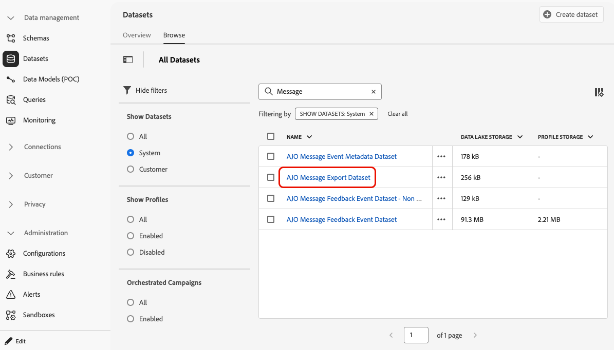
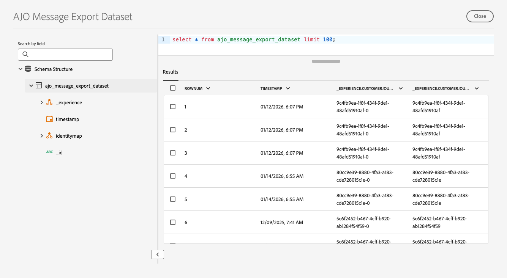

# Export message content {#message-export}

>[!BEGINSHADEBOX]

**On this page:** Learn how to enable Message Export on email and SMS channel configurations to write sent message content to an Adobe Experience Platform dataset and transfer it to your own storage.

>[!ENDSHADEBOX]

>[!CONTEXTUALHELP]
>id="ajo_admin_msg_export"
>title="Retain and export your sent content"
>abstract="Selecting this option allows you to write the content of the sent email or SMS messages using this configuration to an [!DNL Experience Platform] dataset. Records are retained for 7 calendar days from ingestion, during which you can export them to your own storage."

>[!AVAILABILITY]
>
>This capability is only available for the email and SMS channel, for organizations that have purchased the Message Export add-on offering. For more information, contact your Adobe representative.

**Message Export** lets you transfer sent email and SMS message content from [!DNL Journey Optimizer] to your own storage via [[!DNL Adobe Experience Platform] destinations](https://experienceleague.adobe.com/en/docs/experience-platform/destinations/home){target="_blank"}, which enable you to deliver data out of [!DNL Experience Platform] into external endpoints.

With this feature, the content of email and SMS messages sent via [!DNL Journey Optimizer] which have been marked for export are written to the [!DNL Experience Platform] [AJO Message Export Dataset](message-export-schema.md).

Records are then retained in the dataset for seven calendar days from ingestion, during which you can export them out to the external system of your choice.

➡️ For common questions and answers, see the [Message Export FAQ](#message-export-faq).

## Guardrails

* This feature only supports the **Email** and **SMS** channels.
* Records in the AJO Message Export Dataset are retained **for seven calendar days** from ingestion.
* Backfill is not supported for messages sent before enabling Message Export as described below.

## Enable message export {#enable-message-export}

The onboarding process for the Message Export feature consists of two steps:

1. [Set up the export dataflow](#set-up-export-dataflow) in [!DNL Experience Platform];
1. [Enable Message Export](#config-message-export) at the channel configuration in [!DNL Journey Optimizer].

>[!WARNING]
>
>Only new records after enabling exports and sending messages will appear. Backfills for content before setting up the export process and enabling the Export Message option are not supported.

### Set up the export dataflow {#set-up-export-dataflow}

Before being able to export your data, set up the export process by defining the [!DNL Experience Platform] destination and the dataset export flow.

For detailed steps, supported cloud destinations, required permissions, and more information, see [this section](../data/export-datasets.md#export-datasets).

>[!NOTE]
>
>This setup must be configured for each sandbox.

1. Choose an Experience Platform [destination type](https://experienceleague.adobe.com/en/docs/experience-platform/destinations/destination-types){target="_blank"}. A list of available destination platforms that are ready to receive data is available on [this page](https://experienceleague.adobe.com/en/docs/experience-platform/destinations/catalog/overview){target="_blank"}.

1. In [!DNL Experience Platform], configure your destination by defining credentials, bucket/container, path prefix, and security options. [Learn how](https://experienceleague.adobe.com/en/docs/experience-platform/destinations/ui/activate/export-datasets){target="_blank"}

1. Create a dataset export flow using the following data:

    * Source dataset: select **AJO Message Export Dataset**.
    * File format: select JSON or Parquet (choose one based on downstream tools).
    * Schedule: ensure it runs within the 7-day retention window.

### Enable message export in the channel configuration {#config-message-export}

To apply Message Export to your campaigns and journeys, you must enable the dedicated option at the channel configuration level. Follow the steps below.

1. In [!DNL Journey Optimizer], edit or create the desired Email or SMS [channel configuration](channel-surfaces.md#create-channel-surface).

1. Select the **[!UICONTROL Enable Message Export]** option.

    

1. Save your changes and submit your channel configuration.

Once you have sent messages via campaigns or journeys using this channel configuration, email and SMS messages are written to the **AJO Message Export Dataset**. You can then [access the records](#access-exported-data) in the dataset and export them to your selected storage destination based on the export dataflow that you defined.

>[!NOTE]
>
>Disabling the **[!UICONTROL Enable Message Export]** toggle stops new records for this channel configuration from being ingested into the dataset. Existing records remain until retention expires.

## Access exported message data {#access-exported-data}

After messages have been sent using a channel configuration with Message Export enabled, you can access and review the exported data in the **AJO Message Export Dataset**.

To view the exported message data:

1. In [!DNL Journey Optimizer], navigate to **[!UICONTROL Data management]** > **[!UICONTROL Datasets]** in the left navigation. [Learn more about datasets](../data/get-started-datasets.md)

1. Make sure you are displaying system-generated datasets.

1. Select the **AJO Message Export Dataset** from the list.

    

1. On the dataset details page, click **[!UICONTROL Preview dataset]** to view the most recent records.

    

The dataset contains comprehensive information for each message sent via the channel configuration with Message Export enabled, including: subject line, message body, recipient email address or phone number, sender address or phone number, date and time sent, personalization data, and more.

➡️ For a full view of the dataset structure and all available fields, see the [AJO Message Export schema](message-export-schema.md).

All records in the dataset are retained for **seven calendar days** from ingestion. During this retention period, you can access the data for compliance audits, legal inquiries, or export it to your own storage system via the configured Experience Platform destination.

## Sample exported JSON {#sample-exported-json}

The examples below show the overall shape of records written to the AJO Message Export Dataset for SMS and email. Values such as identifiers, schema references, timestamps, and content are illustrative; your exports reflect your sandbox, schema, and sent messages.

Expand each section to view the full sample JSON.

+++ SMS export example

```json
{
  "header": {
    "msgId": "f06d2a6d-65c3-472b-9ca7-cc4224af2df4",
    "xactionId": "9ccd6e76-9ee5-4a12-bff3-fea240228121",
    "msgType": "xdmEntityCreate",
    "imsOrgId": "906E3A095DC834230A495FD6@AdobeOrg",
    "sandboxId": "db3adc95-dcf6-49c3-badc-95dcf639c345",
    "sandboxName": "ajo-e2e",
    "createdAt": 1773591102107,
    "datasetId": "689653509dd3432b92f6323f",
    "schemaRef": {
      "id": "https://ns.adobe.com/aemonacpprodcampaign/schemas/64cb5d9d26c2aae6b08bdc9b7882deb90202439ec53836e7",
      "contentType": "application/vnd.adobe.xed-full+json;version=1"
    },
    "source": {
      "name": "message-execution-service"
    },
    "originalTimestamp": 1773591102107,
    "tags": [
      "ups:segmentation=false"
    ]
  },
  "body": {
    "xdmEntity": {
      "_experience": {
        "customerJourneyManagement": {
          "messageExecution": {
            "messageExecutionID": "CSM-09561055",
            "messageID": "15fe77c8-ab73-49e4-abbb-c25b859162ff-0",
            "messageType": "marketing",
            "campaignID": "5638ce57-5264-4a96-995f-5ae34eddafd7",
            "campaignVersionID": "f9019155-3d6a-44a1-9b6f-5f9cd49e7cf5",
            "campaignActionID": "dfa7f59f-477c-42ec-9db2-831d294b5779",
            "batchInstanceID": "5e23a286fb72411f1cdf1443a81ad2eb",
            "messagePublicationID": "15fe77c8-ab73-49e4-abbb-c25b859162ff",
            "audience": {
              "id": "4c339f63-b66e-4e72-8d56-db624b5277f2",
              "type": "targeted"
            }
          },
          "messageProfile": {
            "channel": {
              "_id": "https://ns.adobe.com/xdm/channels/sms",
              "_type": "https://ns.adobe.com/xdm/channel-types/sms"
            },
            "messageProfileID": "7ff5aefb-7583-38c4-8c32-b63cced94aa7",
            "variant": "5c1092da-5ba2-4bcc-b591-713ee7999f7d"
          },
          "messageRenderedContent": {
            "smsContent": {
              "message": "AJO Campaigns - Prod - E2E Test Text VA7"
            }
          },
          "messageDeliveryMetadata": {
            "smsMetadata": {
              "recipient": {
                "number": "+19256260201"
              },
              "sender": {
                "numbers": [
                  "12345678"
                ]
              }
            }
          }
        }
      },
      "identityMap": {
        "email": [
          {
            "id": "rlyajoqa+messageExport1@adobe.com",
            "primary": true
          }
        ]
      },
      "_id": "b0001846-cafa-379a-be96-1d8ee973e047",
      "timestamp": "2026-03-15T16:11:42.184Z"
    }
  }
}
```

+++

+++ Email export example

```json
{
  "header": {
    "msgId": "1e64d2c4-7887-4f80-8b28-5c20d3da8baf",
    "xactionId": "5yfSV2Gs7VJM5TKo1uEkbiDd4iuakgzQ",
    "msgType": "xdmEntityCreate",
    "imsOrgId": "745F37C35E4B776E0A49421B@AdobeOrg",
    "sandboxId": "068abf40-575e-11ea-8512-9b1bfdb82603",
    "sandboxName": "prod",
    "createdAt": 1754489661211,
    "datasetId": "68912b8881572a2b267380c1",
    "schemaRef": {
      "id": "https://ns.adobe.com/cjmstage/schemas/1684477c0160376b8bb6975a80b5e5bd384696329faa1c42",
      "contentType": "application/vnd.adobe.xed-full+json;version=1"
    },
    "source": {
      "name": "message-execution-service"
    },
    "originalTimestamp": 1754489659000,
    "tags": [
      "ups:segmentation=false"
    ]
  },
  "body": {
    "xdmEntity": {
      "_experience": {
        "customerJourneyManagement": {
          "messageExecution": {
            "messageExecutionID": "HUMA-62208933",
            "messageID": "d0d02f68-afea-42fc-b898-6819cee643e6-0",
            "messageType": "transactional",
            "campaignID": "ce2331c2-c259-47ff-a1dd-f6d1eae08801",
            "campaignVersionID": "4272bb9f-e154-44e9-89f1-6548c77d1455",
            "batchInstanceID": "03587190-72cf-11f0-938b-31e7c9f96d89",
            "messagePublicationID": "d0d02f68-afea-42fc-b898-6819cee643e6",
            "audience": {
              "type": "all"
            }
          },
          "messageProfile": {
            "channel": {
              "_id": "https://ns.adobe.com/xdm/channels/email",
              "_type": "https://ns.adobe.com/xdm/channel-types/email"
            },
            "messageProfileID": "5yfSV2Gs7VJM5TKo1uEkbiDd4iuakgzQ",
            "variant": "11cc5796-8017-4738-aa66-ca5db967dfcc"
          },
          "messageRenderedContent": {
            "emailContent": {
              "subject": "test",
              "html": "xxx"
            }
          },
          "messageDeliveryMetadata": {
            "emailMetadata": {
              "recipient": {
                "email": "himanshig@adobe.com"
              },
              "sender": {
                "email": "cjm-team@e2e-personalisation.test.cjmadobe.com",
                "name": "CJM team",
                "replyToEmail": "replyto@marketing.adobecjm.com",
                "replyToName": "replyto",
                "errorEmail": "replyto@e2e-personalisation.test.cjmadobe.com"
              }
            }
          }
        }
      },
      "identityMap": {
        "email": [
          {
            "id": "chijain@adobe.com",
            "primary": true
          }
        ]
      },
      "_id": "ea48ce1b-80c9-3c6a-b05f-d1c998989e02",
      "timestamp": "2025-08-06T14:14:22.814Z"
    }
  }
}
```

+++

## Message Export FAQ {#message-export-faq}

+++ What is Message Export?

Message Export enables customers to export fully rendered messages (Email and SMS) that were sent to end users. The exported data can be delivered to external destinations using standard [!DNL Adobe Experience Platform] (AEP) export capabilities and used for purposes such as archival, compliance review, analytics, or downstream integrations.

+++

+++ Which channels are supported?

Message Export supports:

* Email
* SMS

+++

+++ What data does Message Export generate?

Message Export creates a system-generated dataset in [!DNL Adobe Experience Platform] that contains a snapshot of the message at send time. This dataset can then be exported to supported destinations (for example, cloud storage or third-party systems).

Message Export is designed as an enablement mechanism for customers to move message data out of Adobe systems—customers are responsible for transforming, storing, and managing the data in their own archival or compliance solutions.

+++

+++ Does Message Export capture fully personalized messages?

Yes. Message Export captures the fully rendered message that was sent to each recipient, including personalization and dynamic content as rendered at send time.

+++

+++ Can Message Export be used to reproduce the original message?

Yes. The exported HTML can be used to reproduce the original sent message in a browser.

However, reproduction depends on the availability of externally hosted assets (such as images). Message Export does not embed media files directly in the export.

+++

+++ Are images and media included in the export?

Message Export includes HTML content with references (URLs) to images and other media. Media assets are not embedded in the export.

If an image or asset URL becomes invalid, restricted, or unpublished after send time, Message Export cannot recover that asset.

+++

+++ How are links handled in Message Export?

Exported messages contain encrypted tracked links, consistent with how links are handled at send time. These encrypted links are preserved in the export and can be resolved as designed by the platform.

+++

+++ How is PII and personalization data handled?

Data is stored exactly as it appears in the rendered message:

* Personalization values rendered into the message (for example, first name) appear as text.
* Encrypted elements (such as tracked links) remain encrypted.
* Message Export does not automatically anonymize or redact rendered message content.

+++

+++ What is the retention period for Message Export data?

Message Export data follows a 7-day retention window within [!DNL Adobe Experience Platform].

Customers should export the data within this period and store it in their own systems if longer retention is required.

+++

+++ Can customers test Message Export before purchasing?

There is no trial or "try-before-you-buy" option for Message Export.

Customers may validate their downstream systems using sample export files, since Message Export relies on standard AEP dataset and destination functionality.

+++

+++ Is the Message Export schema available before purchase?

No. The Message Export dataset and schema become available in the product only after the Message Export add-on is purchased and enabled.

+++

+++ Is Message Export a full archival or compliance solution?

No. Message Export is an enabler, not a full archival or compliance product.

Customers are expected to:

* Export message data from Adobe
* Transform or enrich as needed
* Store and manage the data in their own archival or compliance systems

+++

+++ What are common use cases?

Customers typically use Message Export for:

* Regulatory or compliance review
* Message archival
* Integration with third-party systems
* Internal audit or support workflows
* Analytics beyond Adobe applications

+++

+++ What Message Export does not do

Message Export does not:

* Embed external images or media assets
* Provide unlimited or long-term data retention in Adobe systems
* Offer a trial environment
* Automatically archive messages outside Adobe

+++

