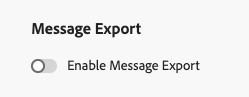

# Export message content {#message-export}

>[!CONTEXTUALHELP]
>id="ajo_admin_msg_export"
>title="Retain and export your sent content"
>abstract="Selecting this option alllows you to write the content of the sent email or SMS messages using this configuration to an [!DNL Experience Platform] dataset. Records are retained for 7 calendar days from ingestion, during which you can export them to your own storage."

>[!AVAILABILITY]
>
>This capability is only available for the email and SMS channel, for organizations that have purchased the Message Export add-on offering. For more information, contact your Adobe representative.

**Message Export** lets you transfer sent email and SMS message content from [!DNL Journey Optimizer] to your own storage via [!DNL Adobe Experience Platform] destinations, which enable to deliver data out of [!DNL Experience Platform] into external endpoints. [Learn more](https://experienceleague.adobe.com/en/docs/experience-platform/destinations/home){target="_blank"}

With this feature, the content of email and SMS messages sent via [!DNL Journey Optimizer] which have been marked for export are written to the [!DNL Experience Platform] **AJO Message Export Dataset**.

Records are then retained in the **AJO Message Export Dataset** for seven calendar days from ingestion, during which you can export them out to the external system of your choice.
<!--
## Terminology

* **[!DNL Experience Platform] destinations** - Framework to deliver data out of Experience Platform into external endpoints. [Learn more](https://experienceleague.adobe.com/en/docs/experience-platform/destinations/home){target="_blank"}
* **AJO Message Export Dataset** - An [!DNL Experience Platform] dataset which stores the message content of email and SMS messages sent via [!DNL Journey Optimizer] which have been marked for export.
* **Retention**: Records in the AJO Message Export Dataset are retained for 3 calendar days from ingestion.-->

## Guardrails

* This feature only supports the Email and SMS channels.
* Records in the AJO Message Export Dataset are retained for seven calendar days from ingestion.
* Backfill is not supported for messages sent before enabling Message Export as described below.

## Enable Message Export {#enable-message-export}

The onboarding process for the Message Export feature consists of two steps:

1. [Set up the export dataflow](#set-up-export-dataflow) in [!DNL Experience Platform];
1. [Enable Message Export](#config-message-export) at the channel configuration in [!DNL Journey Optimizer].

>[!WARNING]
>
>Only new records after enabling exports and sending messages will appear. Backfills for content before setting up the export process and enabling the Export Message option are not supported.

### Set up the export dataflow {#set-up-export-dataflow}

Before being able to export your data, you must set up the export process by defining the [!DNL Experience Platform] destination and the dataset that will be used. Follow the steps below.

>[!NOTE]
>
>This setup must be configured for each sandbox.

1. Choose an Experience Platform [destination type](https://experienceleague.adobe.com/en/docs/experience-platform/destinations/destination-types){target="_blank"}. A list of available destination platforms that are ready to receive data is available on [this page](https://experienceleague.adobe.com/en/docs/experience-platform/destinations/catalog/overview){target="_blank"}.

1. In [!DNL Experience Platform], configure your destination by defining credentials, bucket/container, path prefix, and security options. [Learn how](https://experienceleague.adobe.com/en/docs/experience-platform/destinations/ui/activate/export-datasets){target="_blank"}

1. Create a dataset export flow using the following data:

    * Source dataset: select **AJO Message Export Dataset**.
    * File format: select JSON or Parquet (choose one based on downstream tools).
    * Schedule: ensure it runs within the 7-day retention window.

### Enable Message Export in the channel configuration {#config-message-export}

To apply Message Export to your campaigns and journeys, you must enable the dedicated option at the channel configuration level. Follow the steps below.

1. In [!DNL Journey Optimizer], edit or create the desired Email or SMS [channel configuration](channel-surfaces.md#create-channel-surface).

1. Select the **[!UICONTROL Enable Message Export]** option.

    

1. Save your changes and submit your channel configuration.

Email and SMS messages sent via campaigns or journeys using this channel configuration are written to the **AJO Message Export Dataset**. The records are then exported to the selected storage destination based on the export dataflow that you defined.

Disabling the **[!UICONTROL Enable Message Export]** toggle stops new records for this channel configuration from being ingested into the dataset. Existing records remain until retention expires.
