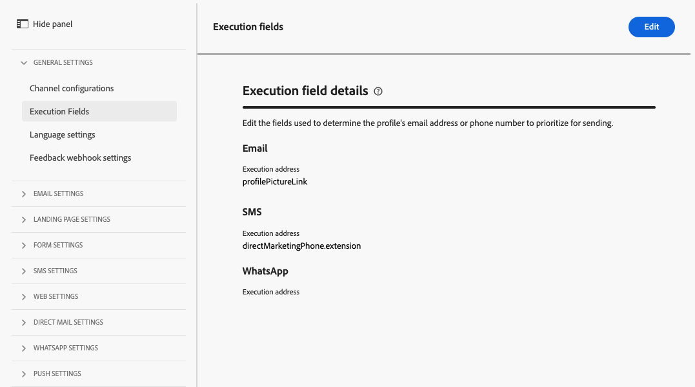
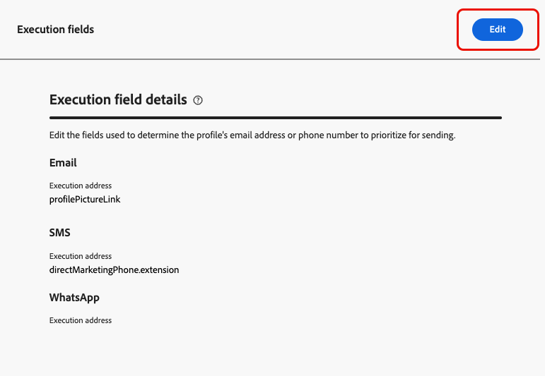
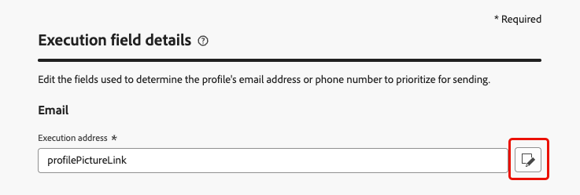
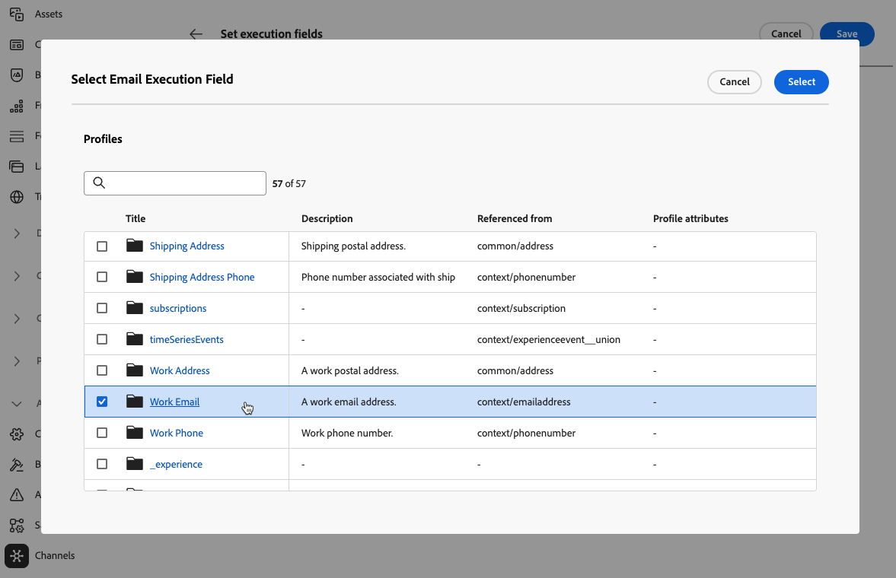
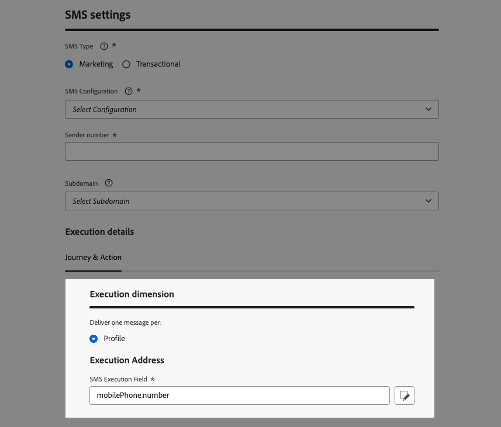
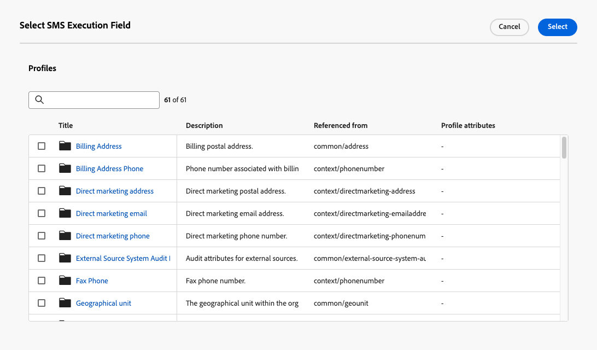

# Change the execution addresses {#change-primary-email}

>[!CONTEXTUALHELP]
>id="ajo_admin_execution_address"
>title="Define which address to use"
>abstract="When several email addresses or phone numbers are available in the database (personal, professional, etc.), you can choose which one to prioritize for sending."

>[!CONTEXTUALHELP]
>id="ajo_admin_execution_address_header"
>title="Define which address to use"
>abstract="Edit the fields used to determine the profile's email address or phone number to prioritize for sending."

When you target a profile, several email addresses or phone numbers may be available in the database (professional email address, personal phone number, etc.).

In that case, [!DNL Journey Optimizer] uses **[!UICONTROL Execution fields]** to determine which email address or phone number to use from the profile service in priority.

To check the fields that are currently used by default, access the **[!UICONTROL Administration]** > **[!UICONTROL Channels]** > **[!UICONTROL General settings]** > **[!UICONTROL Executions fields]** menu.

{width=90%}

>[!NOTE]
>
>Execution fields are available for the Email, SMS and WhatsApp channels.

The current values are used for all deliveries at the sandbox level. You can update these fields if needed.

In most cases, you will change an execution field globally and define a value that should be used for all email, SMS or WhatsApp messages.

## Update the Administration settings {#admin-settings}

To change the execution fields globally at the sandbox level, follow the steps below.

1. Access the  **[!UICONTROL Channels]** > **[!UICONTROL General settings]** > **[!UICONTROL Executions fields]** menu.

1. Click **[!UICONTROL Edit]** to change the default values.

    {width=70%}

1. Click the current field of your choice or the edit icon to select a new field.

    {width=70%}

1. The list of available email-type XDM fields displays. Select the field to use.

    {width=90%}

1. Click **[!UICONTROL Save]** to confirm your choice.

The execution field is updated and will now be used as the primary address.
    
<!--1. You can also select an additional field to use as secondary email address. This allows you to determine which field to use if the primary field is empty for a profile. -->

## Override the default execution field in the journey parameters {#override-execution-address-journey}

>[!CONTEXTUALHELP]
>id="ajo_journey_execution_address"
>title="Define a custom value"
>abstract="In some specific cases, you can override the default execution address. Use the **Enable parameter override** icon to the right of the field to define a custom primary address."
>additional-url="https://experienceleague.adobe.com/en/docs/journey-optimizer/using/configuration/primary-email-addresses#journey-parameters" text="About the execution address"

For specific use cases, you can override the execution field set globally and define a different value at the journey level.

Overriding this value may be useful for example to:

* Test your delivery. You can add your own email address or phone number: after you publish the journey, the email, SMS or WhatsApp message is sent to you.
* Send a message to the subscribers of a list. Learn more in [this use case](../building-journeys/message-to-subscribers-uc.md).

When adding an **[!UICONTROL Email]**, **[!UICONTROL SMS]** or **[!UICONTROL WhatsApp]** action to a [journey](../email/create-email.md#create-email-journey-campaign), the primary email address or phone number is displayed under the journey advanced parameters.

Override this value using the **[!UICONTROL Enable parameter override]** icon to the right of the field.

{width=85%}

>[!CAUTION]
>
>Email address or phone number override should only be used for specific use cases. Most of the time, you do not need to change it, because the value defined as the primary address in the **[!UICONTROL Execution fields]** at the sandbox level is the one that should be used.

## Override the default execution field in the channel configuration {#override-execution-address-channel-config}

>[!CONTEXTUALHELP]
>id="ajo_email_config_execution_address"
>title="Override the default execution address to use"
>abstract="When several email addresses or phone numbers are available in the database (personal, professional, etc.), you can choose which one to prioritize for sending. The primary address is defined at the sandbox level, but here you can override the default setting for this specific channel configuration."

You can change the default execution address for a specific email, SMS or WhatsApp [channel configuration](channel-surfaces.md).

To do this, go to the **[!UICONTROL Execution dimension]** section, and edit the dedicated field under **[!UICONTROL Execution Address]**.

>[!NOTE]
>
>For the [WhatsApp channel](../whatsapp/whatsapp-configuration.md#whatsapp-configuration), the **[!UICONTROL WhatsApp Execution Field]** is under the **[!UICONTROL WhatsApp Settings]** section.

{width=85%}

Then select an item from the list of available email-type XDM fields.

The execution field is updated and is then used as the primary address for the campaigns or journeys using this channel configuration. It overrides the [general setting](#admin-settings) defined at the sandbox level. 

<!--[Learn more on the execution address in the email configuration ](../email/email-settings.md#execution-address)-->
