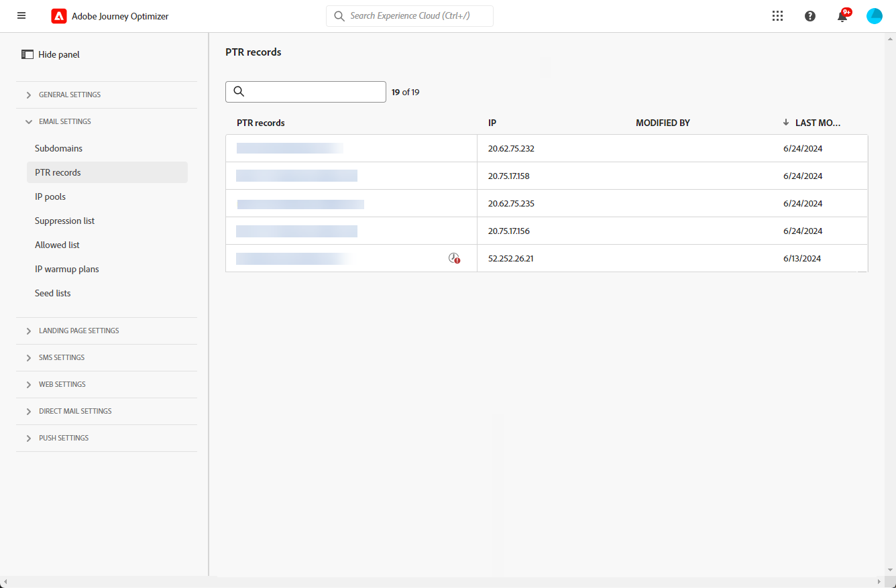

# PTR records {#ptr-records}

>[!CONTEXTUALHELP]
>id="ajo_admin_ptr_record"
>title="Subdomains' PTR records"
>abstract="A pointer record (PTR) is a type of DNS record that provides the domain name linked to an IP address, which helps the receiving mail servers to verify the senders' IP addresses. Only edit a PTR record after due considerations and discussion with your deliverability expert."

>[!CONTEXTUALHELP]
>id="ajo_admin_ptr_record_header"
>title="Subdomains' PTR records"
>abstract="Once the first subdomain is delegated to Adobe in Journey Optimizer, PTR records are automatically created."

## About PTR records {#about-ptr-records}

A pointer record (PTR) is a type of Domain Name System (DNS) record that provides the domain name linked to an IP address.

With PTR records, receiving mail servers can check the authenticity of sending mail servers by identifying whether their IP addresses correspond to the names that the servers connect to.

## Access your subdomains' PTR records {#access-ptr-records}

Once you [delegate](delegate-subdomain.md) your first subdomain to Adobe in [!DNL Journey Optimizer], PTR records are automatically created for your IPs. You can access them from the **[!UICONTROL Administration]** > **[!UICONTROL Channels]** > **[!UICONTROL Email configuration]** > **[!UICONTROL PTR records]** menu.

The list shows the PTR records generated using the syntax below:

* "r" for record,
* "xx" for the two last figures of the IP address,
* subdomain name.

You can open a PTR record from the list to display the associated subdomain name and IP address.

## Edit a PTR record {#edit-ptr-record}

In [!DNL Journey Optimizer], you cannot manually create PTR records. Instead, once you [delegate](delegate-subdomain.md) your first subdomain to Adobe, PTR records are automatically created for your IPs.

Each of your IPs receives a single PTR record. All PTR records have the following format: 'rxx.subdomain', where 'subdomain' is the first subdomain you delegated in [!DNL Journey Optimizer].

When you create additional subdomains, you need to modify one or more of the PTR records and assign that new subdomains to them. To do so, follow the steps below.

>[!CAUTION]
>
>PTR records are common to all environments. Therefore any modification to an PTR record will also impact the production sandboxes.
>
>Proceed with extra care when editing PTR records. In case of any doubt, contact a deliverability expert.

### Fully delegated subdomains {#fully-delegated-subdomains}

To edit a PTR record with a subdomain that is [fully delegated](delegate-subdomain.md#full-subdomain-delegation) to Adobe, follow the steps below.

1. From the list, click a PTR record name to open it.

    

1. Select a subdomain [fully delegated](delegate-subdomain.md#full-subdomain-delegation) to Adobe from the list.

    

1. Click **[!UICONTROL Save]** to confirm your changes.

>[!NOTE]
>
>You cannot modify the **[!UICONTROL IP]** and **[!UICONTROL PTR record]** fields.

### Delegated subdomains using the CNAME method {#edit-ptr-subdomains-cname}

To edit a PTR record with a subdomain that is delegated to Adobe using the [CNAME method](delegate-subdomain.md#cname-subdomain-delegation), follow the steps below.

1. From the list, click a PTR record name to open it.

    

1. Select a subdomain delegated to Adobe using the [CNAME method](delegate-subdomain.md#cname-subdomain-delegation) from the list.

    

1. You need to create a new forward DNS record on your hosting platform. To do this, copy the record generated by Adobe. Once done, check the box "I confirm...".

    

    >[!NOTE]
    >
    >If you get this message: "Please create forward DNS first and then try again", follow the steps below:
    >   * Check on the DNS provider if the forward DNS record was successfully created.
    >   * Records across the DNS may not synchronize immediately. Wait for a few minutes, and try again.

1. Click **[!UICONTROL Save]** to confirm your changes.

>[!NOTE]
>
>You cannot modify the **[!UICONTROL IP]** and **[!UICONTROL PTR record]** fields.

## Check PTR record update details {#check-ptr-record-update}

Once you confirmed the PTR record edit, the **[!UICONTROL Processing]** icon displays next to the name of the PTR record in the list.

>[!NOTE]
>
>The [update processing](#processing) can take up to 3 hours.

To check the PTR record update details, click the icon next to it. Learn more on the statuses associated with the different icons in [this section](#ptr-record-update-statuses).

You can see information such as the update status, and the requested changes.

## PTR record update statuses {#ptr-record-update-statuses}

A PTR record update can have the following statuses:

*  **[!UICONTROL Processing]**: The PTR record update has been submitted and is going through a verification process.
*  **[!UICONTROL Success]**: The updated PTR record has been verified and the new subdomain is now associated with the IP address.
*  **[!UICONTROL Failed]**: One or several checks have failed during the PTR record update verification.

### Processing {#processing}

Several deliverability checks will be performed to verify that the new subdomain to associate with the IP address is valid. This can take up to 3 hours.

>[!NOTE]
>
>You cannot modify a PTR record while update is in progress. You can still click its name, but the **[!UICONTROL Subdomain]** field is greyed out. The changes will not be reflected until the update is successful.

During the validation process, the old subdomain is still associated with the IP address.

### Success {#success}

Once the validation process is successful, the new subdomain is automatically associated with the IP address.

### Failed {#failes}

If the validation process fails, the older PTR record is displayed. The valid subdomain that was previously associated with the IP address remains unchanged.

The possible update error types are as follows:
* Failure to create a new forward DNS for the PTR record
* Failure to update the record
* Failure to re-onboard the affinities

Upon update failing, the PTR record becomes editable again. You can click its name and update the subdomain again.
