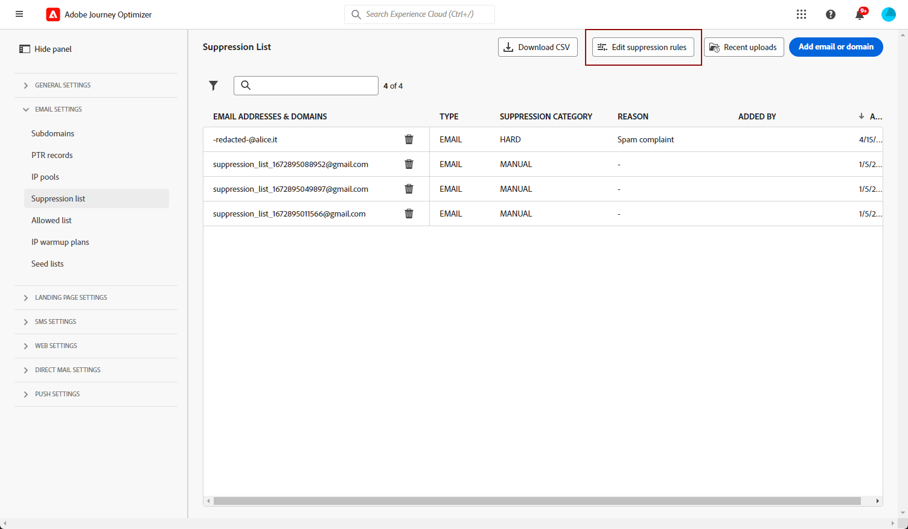

# Retries {#retries}

When an email message fails due to a temporary **Soft bounce** error, several retries are performed. Each error increments an error counter. When this counter reaches the limit threshold, the address is added to the suppression list.

>[!NOTE]
>
>Learn more on the types of errors in the [Delivery failure types](../reports/suppression-list.md#delivery-failures) section.

In the default configuration, the threshold is set to 5 errors.

* For the same delivery, at the fifth encountered error within the [retry time period](#retry-duration), the address is suppressed.

* If there are different deliveries and two errors occur at least 24 hours apart, the error counter is incremented upon each error and the address is also suppressed at the fifth attempt.

If a delivery is successful after a retry, the error counter of the address is reinitialized.

## Retry threshold edition {#edit-retry-threshold}

>[!CONTEXTUALHELP]
>id="ajo_admin_suppression_list_bounces"
>title="Update the retry threshold"
>abstract="If the default value does not suit your needs, you can modify the allowed number of consecutive soft bounces. When the retry counter reaches the error threshold for a specific email address, this address is added to the suppression list."
>additional-url="https://experienceleague.adobe.com/docs/journey-optimizer/using/reporting/deliverability/suppression-list.html" text="Understand the suppresion list"

In case the default value of 5 does not suit your needs, you can modify the error threshold following the steps below.

1. Go to **[!UICONTROL Channels]** > **[!UICONTROL Email configuration]** > **[!UICONTROL Suppression list]**.

1. Select the **[!UICONTROL Edit suppression rules]** button.

    

1. Edit the allowed number of consecutive soft bounces according to your needs.

    

    You must enter an integer value between 1 and 20, meaning that the minimum number of retries is 1 and the maximum number is 20.

    >[!CAUTION]
    >
    >Any value higher than 10 may cause deliverability reputation issues, as well as IP throttling or blocklisting by ISPs. [Learn more on deliverability](../reports/deliverability.md)

## Retry time period {#retry-duration}

The **retry time period** is the timeframe in which any email message of the delivery that encountered a temporary error or soft bounce will be retried.

By default, retries will be performed for **3.5 days** (or **84 hours**) from the time the message was added to the email queue.

However, to ensure that retry attempts are not performed anymore when no longer needed, you can change this setting according to your needs when creating or editing a [channel surface](channel-surfaces.md) (i.e. message preset) applying to the email channel.

For example, you may set the retry period to 24 hours for a transactional email relating to password reset and containing a link valid for only a day. Similarly, for a midnight sale, you may want to define a retry period of 6 hours.

>[!NOTE]
>
>The retry period cannot exceed 84 hours. The minimum retry period is 6 hours for marketing emails and 10 minutes for transactional emails.

Learn how to adjust the email retry parameters when creating a channel surface in [this section](channel-surfaces.md#create-channel-surface).

