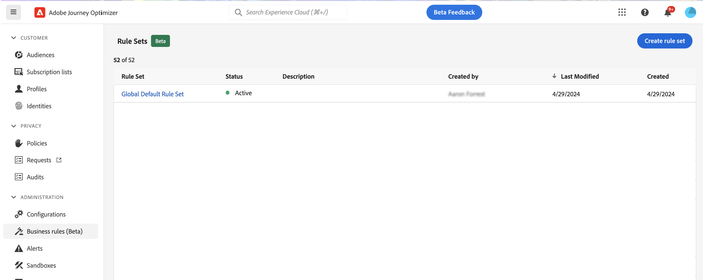
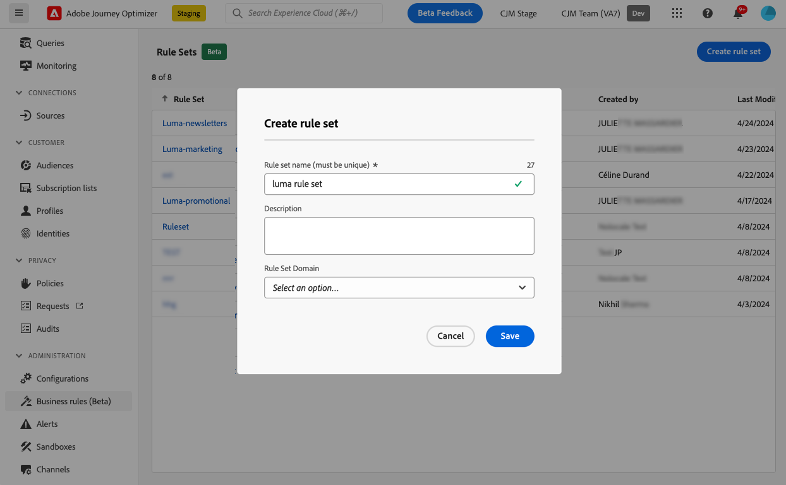
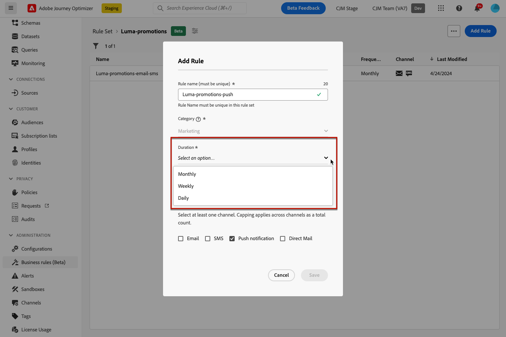
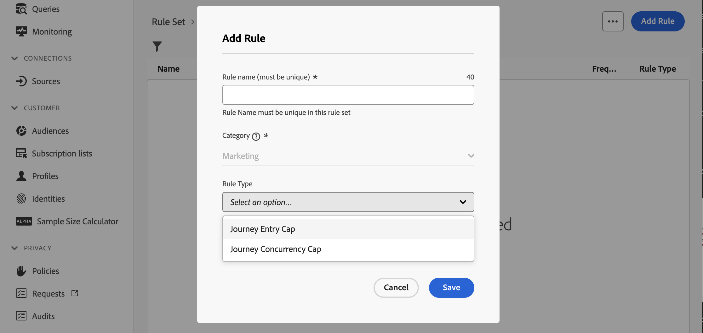
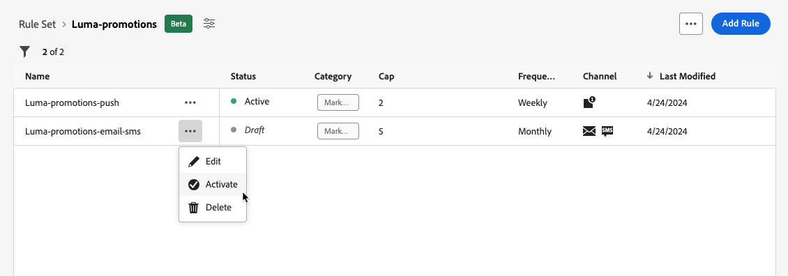
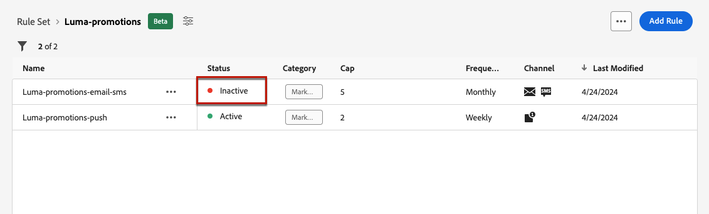

# Work with rule sets {#rule-sets}

>[!CONTEXTUALHELP]
>id="ajo_business_rules_rule_sets"
>title="Rule Sets"
>abstract="Use rule sets to apply frequency capping to different types of marketing communications. You can also create rule sets to exclude journeys to part of your audience based on frequency capping rules."

## Get started with rule sets {#gs}

### What are rule sets? {#what}

In addition to global business rules that restrict the number of times users receive messages across one or multiple channels, rule sets allow you to **group together multiple rules into rule sets** and apply them to the campaigns of your choice. This provides improved granularity to control how often users will receive a message depending on the type of communication. 

For example, you can create a rule set to limit the number of **promotional communications** sent to your customers and another rule set to limit the number of **newsletters** sent to them. Depending on the type of campaign that you are creating, you can then choose to apply either the promotional communication or the newsletters rule set.

➡️ [Discover this feature in video](#video)

### Permissions {#permissions-frequency-rules}

To work with business rules, you need the following permissions:

* **[!UICONTROL View Frequency Rules]**: Access and view business rules.
* **[!UICONTROL Manage Frequency Rules]**: Create, edit or delete business rules.

Learn more about permissions in [this section](../administration/high-low-permissions.md).

### Global & custom rule sets {#global-custom}

When accessing rule sets for the first time from the **[!UICONTROL Administration]** > **[!UICONTROL Business rules]** menu, a default rule set is pre-created and active: **Global Default Rule Set**.

This rule set contains global rules that you can apply to control how often users  receive message across one or multiple channels, similar to how current business rules operate. All the rules defined in this rule set apply to all selected channels, whether communications are sent from a journey or a campaign. [Learn how to work with business rules](../configuration/rule-sets.md) 

In addition to this "Global Default Rule Set" rule set, you can create **custom rule sets** that you can apply to any campaign to restrict the number of messages sent within that campaign. [Learn how to create custom rule sets](#create)

### Channel & journeys capping rules {#domain}

>[!CONTEXTUALHELP]
>id="ajo_rule_set_domain"
>title="Rule Set Domain"
>abstract="When creating a rule set, you need to specify if the rules within the rule set will enforce capping rules that are specific to communication channels, or to journeys."

When creating a rule set, you need to specify if the rules within the rule set will enforce capping rules that are specific to communication channels, or to journeys. This is done by selecting a Channel or Journey domain for the rule set when creating it. [Learn how to create a rule set](#create)

* **Channel** domain: apply capping rules for communication channels. For example, do not send more than 1 email or SMS communication per day.
* **Journey** domain: apply entry and concurrency capping rules to a journey. For example, do not enter profiles into more than one journey simultaneously.

>[!AVAILABILITY]
>
>While **Channel** domain rule sets are available to all users, **Journey** domain rule sets are available only to a limited set of users (Limited Availability). To gain access, contact your Adobe representative.

## Create your first custom rule set {#create-rule-set}

### Create the rule set and select its domain {#create}

To create a rule set, follow the steps below.

>[!NOTE]
>
>You can create up to 3 local rule sets of channel domain and up to 5 local rule sets of journey domain.

1. Access the **[!UICONTROL Rules sets]** list, then click **[!UICONTROL Create rule set]**.

    

1. Define a unique name for the rule set and add a description.

1. Select the rule set's domain. The domain allows you to specify if the rule set will contain capping rules that are specific to communication channels or to journeys. [Learn more on channel and journey capping rules](#domain)

   

   >[!AVAILABILITY]
   >
   >While **Channel** domain rule sets are available to all users, **Journey** domain rule sets are available only to a limited set of users (Limited Availability). To gain access, contact your Adobe representative.

1. Click **[!UICONTROL Save]**.

1. Now you can [define the rules](#create-new-rule) you want to add to this rule set.

### Add rules to the rule set {#create-new-rule}

>[!CONTEXTUALHELP]
>id="ajo_rule_sets_category"
>title="Select the message rule category"
>abstract="When activated and applied to a message, all the frequency rules matching the selected category will be automatically applied to this message. Currently only the Marketing category is available."

<!--NOT USED?
[!CONTEXTUALHELP]
>id="ajo_rule_sets_capping"
>title="Set the capping for your rule"
>abstract="Specify the maximum number of messages sent to a customer profile within the chosen time frame. The frequency cap will be based on the selected calendar period and will be reset at the beginning of the corresponding time frame."-->

>[!CONTEXTUALHELP]
>id="ajo_rule_sets_channel"
>title="Define the channel(s) the rule applies to"
>abstract="Select at least one channel. Capping applies across channels as a total count."

>[!CONTEXTUALHELP]
>id="ajo_rule_sets_duration"
>title="Select the message rule category"
>abstract="When activated and applied to a message, all the frequency rules matching the selected category will be automatically applied to this message. Currently only the Marketing category is available."

>[!CONTEXTUALHELP]
>id="ajo_rule_set_rule_capping"
>title="Rule capping"
>abstract="Set the capping for your rule. Depending on the rule set domain and the sleection in the Rule Type field, this field can define the maximum number of messages that can be sent to a profile, or the maximum number of journeys the profile can enter or be enrolled in simultaneously."

To add a rule to a rule set, access the rule set and click **[!UICONTROL Add rule]**.

The parameters available for the rule depend on the rule set domain selected at its creation.

+++Configure channel capping rules (**Channel** domain)

1. Define a unique name for the rule.

1. The **Category** field specifies the category of message the rule applies to. For now, this field is read-only as only the **[!UICONTROL Marketing]** category is available.

1. From the **[!UICONTROL Duration]** drop-down list, select if you want the capping to be applied monthly, weekly or daily. Frequency cap is based on the selected calendar period. It is reset at the beginning of the corresponding time frame.

   

   >[!AVAILABILITY]
   >
   >The "Daily" duration is available on-demand only. To gain access, To gain access, contact your Adobe representative.

   The expiry of the counter for each period is as follows:

   * **[!UICONTROL Monthly]**: The frequency cap is valid until the last day of the month at 23:59:59 UTC. For example, the monthly expiration for January is 01-31 23:59:59 UTC.

   * **[!UICONTROL Weekly]**: The frequency cap is valid until Saturday 23:59:59 UTC of that week as the calendar week starts on Sunday. The expiry is irrespective of the rule creation. For example, if the rule is created on Thursday, this rule is valid until Saturday at 23:59:59.

   * **[!UICONTROL Daily]**: The daily frequency cap is valid for the day until 23:59:59 UTC and resets to 0 at the start of the next day.

      >[!CAUTION]
      >
      >To ensure accuracy for daily frequency capping rules, the use of [streaming segmentation](https://experienceleague.adobe.com/docs/experience-platform/segmentation/ui/streaming-segmentation.html){target="_blank"} is mandatory. Learn more on audience evaluation methods in [this section](../audience/about-audiences.md#evaluation-method-in-journey-optimizer).

   Please note that the profile counter value updates once the communication is delivered. Please be cognizant of this when you are sending large volumes of communications as the throughput could result in the recipient getting the email minutes or even hours after the initiation of the communication (in the case that you are sending millions of communications simultaneously).
   
   This matters in the case that a recipient receives two communications close together. We suggest spacing communications apart by at least two hour where possible to give sufficient time for the recipient to receive the communication and the counter value to update accordingly.

1. Set the capping for your rule, meaning the maximum number of messages that can be sent to an individual user profile each month, week or day - according to your selection above.

1. Select the channel you want to use for this rule: **[!UICONTROL Email]**, **[!UICONTROL SMS]**, **[!UICONTROL Push notification]** or **[!UICONTROL Direct mail]**.

   >[!NOTE]
   >
   >You must select at least one channel to be able to create the rule.

1. Select several channels if you want to apply capping across all selected channels as a total count.

   For example, set capping to 5, and select both the email and sms channels. If a profile has already received 3 marketing emails and 2 marketing sms for the selected period, this profile will be excluded from the very next delivery of any marketing email or sms.

+++

+++Configure journey capping rules (**Journey** domain)

1. Provide a unique name for the rule.

1. In the **[!UICONTROL Rule Type]** drop-down list, specify the type of capping for the rule.

   * **[!UICONTROL Journey Entry Cap]**: Limits the number of entries into the journey over a given period for a profile.
   * **[!UICONTROL Journey Concurrency Cap]**: Limits how many journeys a profile can be enrolled in simultaneously.

1. Detailed information on how to configure journey capping rules is available in the [Journey capping & arbitration](../conflict-prioritization/journey-capping.md) section. 

+++

1. Click **[!UICONTROL Save]** to confirm the rule creation. Your message is added to the rule set, with the **[!UICONTROL Draft]** status.

   

1. Repeat the steps above to add as many rules as needed to the rule set.

Now you need to activate each rule before it can be applied to any messages. [Learn more](#activate-rule)

### Activate the rules & the rule set {#activate-rule}

When created, a rule has the **[!UICONTROL Draft]** status and is not yet impacting any message. To enable it, click the **[!UICONTROL More actions]** button next to the rule and select **[!UICONTROL Activate]**.

   

You must also activate the rule set to be able to access it in campaigns/journeys and apply it to your messages.

   

>[!NOTE]
>
>It can take up to 20 minutes for a rule or rule set to be fully activated. You do not need to modify messages or republish journeys for a rule to take effect.

<!--Currently, once a rule set is activated, no more rules can be added to that rule set.-->

To deactivate a rule or a rule set, click the **[!UICONTROL More actions]** button next to the desired item and select **[!UICONTROL Deactivate]**.

   
Its status will change to **[!UICONTROL Inactive]** and the rule will not apply to future message executions. Any messages currently in execution will not be affected.

>[!NOTE]
>
>Deactivating a rule or rule set does not affect or reset any counts on individual profiles.

## Access & manage rule sets {#access-rule-sets}

All created rule sets display in the **[!UICONTROL Administration]** > **[!UICONTROL Business rules]** menu. They are sorted by last modification date.

Click a rule set name to view and edit its content. All rules included in that rule set are listed. The contextual menu on top right enables you to:

* Edit the name and description of the rule set
* Activate the rule set - [learn more](#activate-rule)
* Delete the rule set

For each rule in the rule set, the **[!UICONTROL More actions]** button enables you to:

* Edit the rule
* Activate the rule [learn more](#activate-rule)
* Delete the rule

## Apply rule sets to a message or journey {#apply-frequency-rule}

You can apply a rule set to a message or a journey, depending on the domain selected when creating the rule set. Expand the sections below for more information.

+++ Apply a rule set to a message

1. When creating a [campaign](../campaigns/create-campaign.md), select one of the channels you defined for your rule set and edit the content of your message.

1. In the content edition screen, click the **[!UICONTROL Add Business Rule]** button.

1. Select the [rule set you created](#create-rule-set).

   

   >[!NOTE]
   >
   >Only [activated](#activate-rule) rule sets display in the list.

   <!--Messages where the category selected is **[!UICONTROL Transactional]** will not be evaluated against business rules.-->

1. Before activating your campaign, make sure you schedule its execution at least 20 minutes into the future.

   This allows for sufficient time to populate the counter values on the profile for the business rule you selected. If you activate the campaign immediately, the rule set counter values will not populate on the profiles of the recipients, and the message will not be counted toward their frequency capping rules for the custom rule sets. 

   

1. You can view the number of profiles excluded from delivery in the [Customer Journey Analytics report](../reports/report-gs-cja.md), and in the [Live report](../reports/live-report.md), where frequency rules will be listed as a possible reason for users excluded from delivery.

>[!NOTE]
>
>Several rules can apply to the same channel, but once the lower cap is reached, the profile will be excluded from the next deliveries.

<!--
## Example: combine several rules {#frequency-rule-example}

You can combine several message frequency rules, such as described in the example below.

1. [Create a rule](#create-new-rule) called *Overall Marketing Capping*:

   * Select all channels.
   * Set capping to 12 monthly.

   

1. To further restrict the number of marketing-based push notifications that a user is sent, create a second rule called *Push Marketing Cap*:

   * Select Push channel.
   * Set capping to 4 monthly.

   

1. Save and [activate](#activate-rule) the rule.

1. [Create a message](../building-journeys/journeys-message.md) for every channel you want to communicate through and select the **[!UICONTROL Marketing]** category for each message. [Learn how to apply a frequency rule](#apply-frequency-rule)

   

In this scenario, an individual profile:
* can receive up to 12 marketing messages per month;
* but will be excluded from marketing push notifications after they have received 4 push notifications.-->

When testing frequency rules, it is recommended to use a newly created [test profile](../audience/creating-test-profiles.md), because once a profile's frequency cap is reached, there is no way to reset the counter until the next period. Deactivating a rule will allow capped profiles to receive messages, but it will not remove or delete any counter increments.

+++

+++ Apply a rule set to a journey

To apply a capping rule to a journey, access the journey and open its properties. In the **[!UICONTROL Capping rules]** drop-down, select the relevant rule set.

>[!IMPORTANT]
>
>If a journey is activated immediately, it can take up to 20 minutes for the system to begin suppressing customers. You can schedule your journey to begin at least 20 minutes into the future to prevent this possibility.

+++

## How-to video {#video}

>[!VIDEO](https://video.tv.adobe.com/v/3435531?quality=12)
