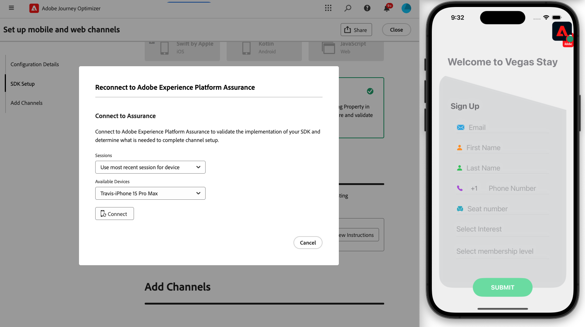

# Set up iOS mobile configuration {#set-mobile-ios}

>[!IMPORTANT]
>
>To ensure compatibility and optimal performance, please make sure to use the following SDK versions:
>
> * Core SDK: 5.2.0 or later
> * Messaging SDK: 5.1.1 or later

This iOS setup simplifies the rapid configuration of marketing channels, making all essential resources readily available in the Experience Platform, Journey Optimizer, and Data Collection apps. This allows your marketing team to quickly start creating campaigns and journeys.

## Create a new iOS set up {#new-setup-ios}

1. From Journey Optimizer homepage, click **[!UICONTROL Begin]** from the **[!UICONTROL Set up mobile and web channels]** card.

    

1. Create a **[!UICONTROL New]** configuration.

    If you already have existing configurations, you can choose to select one, or create a new configuration.

    

1. Enter a **[!UICONTROL Name]** for your new configuration and select or create your **[!UICONTROL Datastream]**. This **[!UICONTROL Name]** will be used for every auto-created resources.

1. If your organization has multiple datastreams, please select one from the existing options. If you do not have a Datastream, one will be auto-created for you.

1. Select the iOS platform and click **[!UICONTROL Auto-create resources]**.

    

1. To streamline the setup process, the necessary resources are automatically created to help you get started. This includes the creation of a new **[!UICONTROL Mobile Tag Property]** and installation of extensions.

    Below is a comprehensive list of all the resources that are auto generated:

    +++ Created resources

    <table>
    <thead>
    <tr>
    <th><strong>Solution</strong></th>
    <th><strong>Auto-created resources</strong></th>
    </tr>
    </thead>
    <tbody>
    <tr>
    <td>
    <p>Journey Optimizer</p>
    </td>
    <td>
    <ul>
    <li>Channel Configuration</li>
    <li>Push Credential (mobile push message only)</li>
    </ul>
    </td>
    </tr>
    <tr>
    <td>
    <p>Tags</p>
    </td>
    <td>
    <ul>
    <li>Mobile Tag Property</li>
    <li>Rules</li>
    <li>Data Elements</li>
    <li>Library</li>
    <li>Environments (staging, production, development)</li>
    </ul>
    </td>
    </tr>
    <tr>
    <td>
    <p>Tags Extensions</p>
    </td>
    <td>
    <ul>
    <li>Adobe Experience Platform Edge Network</li>
    <li>Adobe Journey Optimizer</li>
    <li>AEP Assurance</li>
    <li>Consent (with default consent policies enabled)</li>
    <li>Identity (with default ECID, with default stitching rules)</li>
    <li>Mobile Core</li>
    </ul>
    </td>
    </tr>
    <tr>
    <td>
    <p>Assurance</p>
    </td>
    <td>
    <p>Assurance Session</p>
    </td>
    </tr>
    <tr>
    <td>
    <p>Datastreams</p>
    </td>
    <td>
    <p>Datastream with Services</p>
    </td>
    </tr>
    <tr>
    <td>
    <p>Experience Platform</p>
    </td>
    <td>
    <ul>
    <li>Dataset</li>
    <li>Schema</li>
    </ul>
    </td>
    </tr>
    </tbody>
    </table>

    +++

1. Once resources generation is done, click **[!UICONTROL Set up]** to start configuring your SDK.

    

1. You first need to add and import dependencies as described in the user interface. [Learn more](https://experienceleague.adobe.com/en/docs/platform-learn/implement-mobile-sdk/app-implementation/install-sdks).

1. Insert the initialization code into your application's `onCreate()` method. This test code allows you to connect to Assurance and validate your app setup before moving to production.

    {zoomable="yes"}

1. To validate your SDK directly on your mobile application, simply open your mobile application and allow access to [Adobe Assurance](https://experienceleague.adobe.com/en/docs/experience-platform/assurance/home). Assurance is a powerful tool that allows you to thoroughly test and validate your implementation, ensuring that everything is working correctly. 

    Once connected, your device will be automatically detected and listed in the **[!UICONTROL Available Device]** drop-down menu, allowing you to seamlessly monitor and troubleshoot your setup in real time.

    {zoomable="yes"}

1. Click **[!UICONTROL Connect]**.

    {zoomable="yes"}

1. You can now configure your [In-app](#inapp-channel) and/or [Push](#push-channel) channels.

1. After completing the configuration, share the auto-generated **[!UICONTROL Channel Configuration]** with the team members responsible for creating Journeys and Campaigns. 

    The **[!UICONTROL Channel Configuration]** should be referenced in the Campaigns or Journeys interface, enabling a seamless connection between your setup and the execution of targeted journeys and campaigns for your audience.

    {zoomable="yes"}

## Modify an existing configuration {#reconnect}

After creating your configuration, you can easily revisit it at any time to add additional channels or make further adjustments to suit your needs

1. From Journey Optimizer homepage, click **[!UICONTROL Begin]** from the **[!UICONTROL Set up mobile and web channels]** card.

    

1. Select **[!UICONTROL Existing]** and choose your existing **[!UICONTROL Tag property]** from the drop-down.

    

1. When accessing your existing configuration, you need to reconnect with Adobe Assurance. From the SDK Setup menu, click **[!UICONTROL Reconnect]**.

    

1. Select your device from the **[!UICONTROL Available devices]** drop-down and click **[!UICONTROL Connect]**.

    {zoomable="yes"}

1. You can now update your configuration as needed.

## Set up In-app channel {#inapp-channel}

The In-app channel requires no additional setup. To verify that your configuration is accurate, you can effortlessly send a test message using the Assurance feature. This will provide immediate feedback on the system's readiness to deliver In-app messages effectively.

To do this, simply click **[!UICONTROL Display In-app message]**.

{zoomable="yes"}

To streamline the setup process, the necessary resources are automatically created to help you get started. This includes the creation of a Channel Configuration.

You can now send In-app messages using the previously configured **[!UICONTROL Channel Configuration]**. [Learn how to create In-app messages](../in-app/create-in-app.md)

## Set up Push channel {#push-channel}

>[!CONTEXTUALHELP]
>id="ajo_mobile_web_setup_push_certificate"
>title="Provide a push certificate"
>abstract="The .p8 key file contains a private key used to authenticate your app with Apple's servers for secure push notifications. You can acquire this key from the Certificates, Identifiers, and Profiles page in your developer account."

>[!CONTEXTUALHELP]
>id="ajo_mobile_web_setup_push_key_id"
>title="Key ID"
>abstract="The Key ID, a 10-character string assigned during the creation of the p8 authentication key, can be found under the **Keys** tab on the Certificates, Identifiers, and Profiles page in your developer account."

>[!CONTEXTUALHELP]
>id="ajo_mobile_web_setup_push_team_id"
>title="Team ID"
>abstract="The Team ID, a string value used to identify your team, can be located under the **Membership** tab in your developer account."

1. Once your mobile SDK has been configured, click **[!UICONTROL Add]** from the Push notification card.

1. First, within the `didRegisterForRemoteNotificationsWithDeviceToken` method of your `AppDelegate`, add the following code to synchronize the device's push token with your Adobe Experience Platform profile.

    ```
    MobileCore.setPushIdentifier(deviceToken)
    ```
    
1. Drag and drop your .p8 Apple Push Notification Authentication Key file. This key can be acquired from the Certificates, Identifiers and Profiles page.

1. Provide the following information:

    * Key ID: a 10 character string assigned during the creation of p8 auth key. It can be found under Keys tab in Certificates, Identifiers and Profiles page.

    * Team ID: a string value which can be found under the Membership tab.

    {zoomable="yes"}

1. To verify that your configuration is accurate, you can effortlessly send a test message using the Assurance feature. This will provide immediate feedback on the system's readiness to deliver push notifications effectively.

    To do this, simply click **[!UICONTROL Send push message]**.

    {zoomable="yes"}

To streamline the setup process, the necessary resources are automatically created to help you get started. This includes the creation of a **[!UICONTROL Channel Configuration]** and **[!UICONTROL Push Credential]**.

You can now send push notifications using the previously configured **[!UICONTROL Channel Configuration]**. [Learn how to create push notification](../push/create-push.md)
