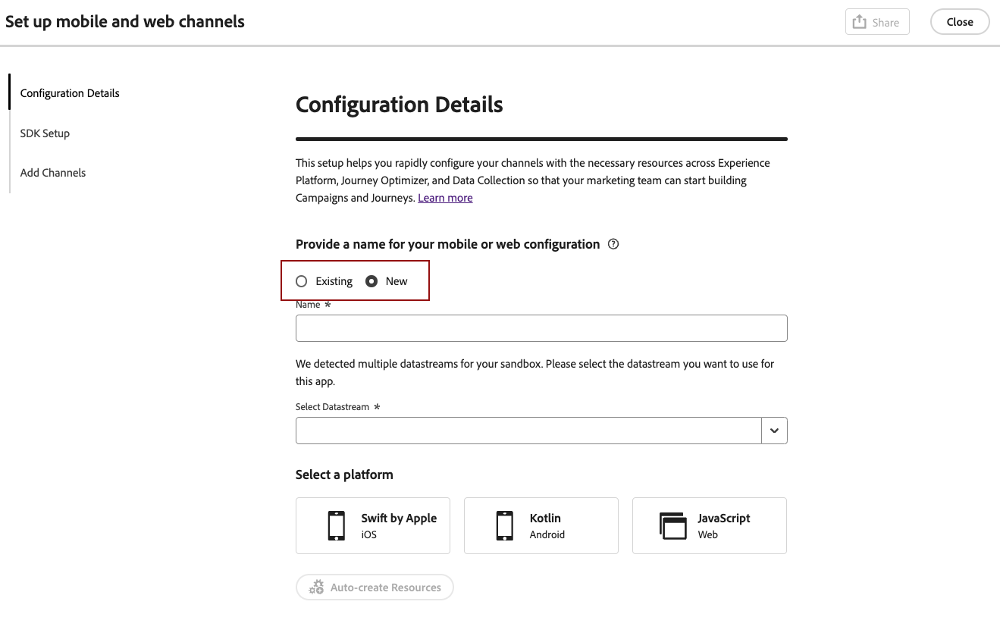

# Set up web configuration {#set-mobile-web}

>[!CONTEXTUALHELP]
>id="ajo_mobile_web_setup_javascript_code"
>title="Javascript code"
>abstract="TBC"

>[!CONTEXTUALHELP]
>id="ajo_mobile_web_setup_javascript_site"
>title="Launch site and validate"
>abstract="TBC"

This set up facilitates the expeditious configuration of marketing channels, ensuring all required resources are readily available within Experience Platform, Journey Optimizer, and Data Collection. This enables your marketing team to immediately start with campaign and journey creation.

## Create a new Web set up {#new-setup}

1. From Journey Optimizer homepage, click **[!UICONTROL Begin]** from the **[!UICONTROL Set up mobile and web channels]** card.

    

1. Create a **[!UICONTROL New]** configuration.

    If you already have existing configurations, you can choose to select one, or create a new configuration.

    

1. Enter a **[!UICONTROL Name]** for your new configuration and select or create your **[!UICONTROL Datastream]**. This **[!UICONTROL Name]** will be used for every auto-created resources.

1. If your organization has multiple datastreams, please select one from the existing options. If you do not have a Datastream, one will be auto-created for you.

1. Select the Web platform and click **[!UICONTROL Auto-create resources]**.

    

1. To streamline the setup process, the necessary resources are automatically created to help you get started.

    Below is a comprehensive list of all the resources that are auto generated:

    +++ Created resources

    <table>
    <thead>
    <tr>
    <th><strong>Solution</strong></th>
    <th><strong>Auto-created resources</strong></th>
    </tr>
    </thead>
    <tbody>
    <tr>
    </tr>
    <tr>
    <td>
    
Tags

    </td>
    <td>
    <ul>
    <li>Mobile Tag Property</li>
    <li>Rules</li>
    <li>Data Elements</li>
    <li>Library</li>
    <li>Environments (staging, production, development)</li>
    </ul>
    </td>
    </tr>
    <tr>
    <td>
    
Tags Extensions

    </td>
    <td>
    <ul>
    <li>Adobe Experience Platform Edge Network</li>
    <li>Adobe Journey Optimizer</li>
    <li>AEP Assurance</li>
    <li>Consent (with default consent policies enabled)</li>
    <li>Identity (with default ECID, with default stitching rules)</li>
    <li>Mobile Core</li>
    </ul>
    </td>
    </tr>
    <tr>
    <td>
    
Assurance

    </td>
    <td>
    
Assurance Session

    </td>
    </tr>
    <tr>
    <td>
    
Datastreams

    </td>
    <td>
    
Datastream with Services

    </td>
    </tr>
    <tr>
    <td>
    
Experience Platform

    </td>
    <td>
    <ul>
    <li>Dataset</li>
    <li>Schema</li>
    </ul>
    </td>
    </tr>
    </tbody>
    </table>

    +++

1. Once resources generation is done, click **[!UICONTROL Set up]** to start configuring your SDK.

    

1. Paste the code displayed on screen in the `<head>` tag of your document.

    {zoomable="yes"}

1. To validate your SDK directly on your mobile application, simply paste your base URL.

    {zoomable="yes"}

1. Select **[!UICONTROL Launch site & validate]** to connect your site.

    {zoomable="yes"}

1. After completing the configuration, share the auto-generated **[!UICONTROL Mobile Web Property]** with the team members responsible for creating Journeys and Campaigns. 

    The **[!UICONTROL Mobile Web Property]** should be referenced in the Campaigns or Journeys interface, enabling a seamless connection between your setup and the execution of targeted journeys and campaigns for your audience.

    

You can now create Web pages using the previously configured **[!UICONTROL Mobile Web Property]**. [Learn how to create Web page](../web/create-web.md)

## Modify an existing configuration {#reconnect}

After creating your configuration, you can easily revisit it at any time to add additional channels or make further adjustments to suit your needs

1. From Journey Optimizer homepage, click **[!UICONTROL Begin]** from the **[!UICONTROL Set up mobile and web channels]** card.

    

1. Select **[!UICONTROL Existing]** and choose your existing **[!UICONTROL Tag property]** from the drop-down.

    

1. You can now update your configuration as needed.
