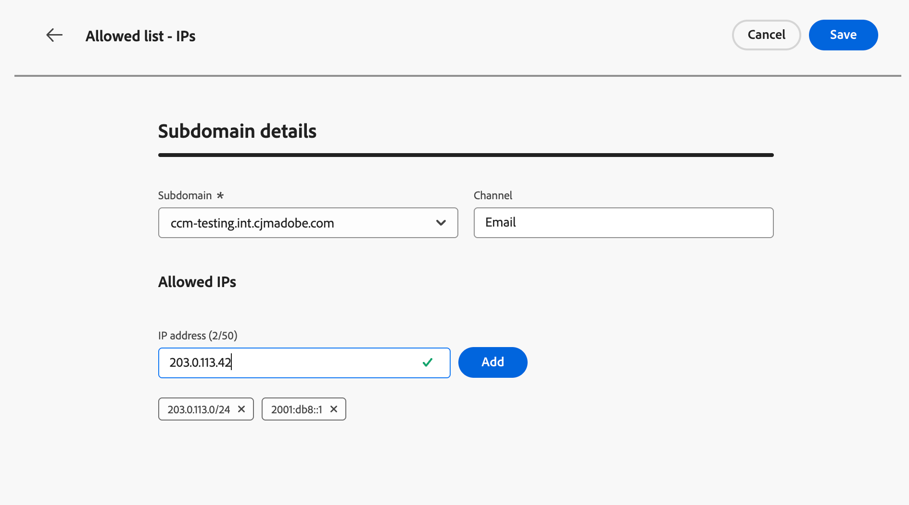

# Manage allowed IPs {#waf-ip-allowlist}

>[!BEGINSHADEBOX]

**On this page:** Add and manage your Web Application Firewall (WAF) egress IPs per delegated subdomain directly in [!DNL Journey Optimizer], so that only traffic routed through your firewall can reach your [!DNL Journey Optimizer]-hosted links.

>[!ENDSHADEBOX]

Organizations with strict network security requirements — such as those in the financial sector — can mandate that all requests to links hosted by [!DNL Adobe Journey Optimizer] must flow through a customer-managed **Web Application Firewall** (WAF) before reaching the Adobe network. Any request that bypasses the firewall must be rejected.

[!DNL Journey Optimizer] lets administrators configure, per delegated subdomain, the public egress IPs of their WAF. Once set, only traffic originating from those IPs can reach the corresponding subdomain. All other inbound requests — including direct requests that bypass the firewall — are rejected.

## How it works {#waf-ip-allowlist-how-it-works}

Enabling WAF-only routing for a subdomain requires two steps as detailed below.

1. **DNS re-pointing**: the subdomain's DNS records must be updated to route traffic to your organization's WAF instead of directly to Adobe's network edge.
1. **WAF egress IP declaration**: your organization provides the public egress IPs of your WAF in [!DNL Journey Optimizer]. These are the IPs from which the firewall sends requests onward to Adobe.

Once both are in place, the traffic flow works as follows:

1. A recipient clicks a link in an [!DNL Adobe Journey Optimizer] communication.
1. The request reaches your organization's WAF, which inspects and filters it according to your security policies.
1. The WAF forwards the request to Adobe's network edge, from one of its declared egress IPs.
1. [!DNL Journey Optimizer] checks the source IP of the incoming request against the subdomain's allowed list.
   - **IP matches** → the request went through the WAF → processed normally.
   - **IP does not match** → the request bypassed the WAF → **rejected with a 403 Forbidden error**. The recipient sees a broken link.

Requests for subdomains without allowed IPs configured are not affected and continue to work as before.

## Guardrails and constraints {#waf-ip-allowlist-guardrails}

| Control | Detail |
| --- | --- |
| **IP format** | IPv4, IPv6, and CIDR ranges accepted. Malformed values are rejected inline before save. |
| **Duplicate prevention** | No duplicate IPs within the same subdomain. The same IP can be used across different subdomains. |
| **Reserved-range warning** | A non-blocking warning is shown when private/reserved ranges are entered (WAF egress IPs are normally public). |
| **Delegated subdomains only** | Only delegated and verified subdomains are selectable. |
| **Per-subdomain cap** | Maximum **50 IP entries** per subdomain. |
| **Lock-out safeguards** | Type-to-confirm on full removal; explicit warnings whenever an action would reopen a subdomain to all traffic. |

>[!CAUTION]
>
>Misconfiguration immediately breaks all links on the affected subdomain.

If incorrect WAF egress IPs are saved, [!DNL Journey Optimizer] will reject every incoming request for that subdomain — including legitimate ones from real recipients clicking links in communications, who will receive a 403 error page.

Always confirm the exact egress IPs with your security team before saving, and test on a non-production subdomain first if possible.

## Access and manage allowed IPs {#waf-ip-allowlist-access}

>[!NOTE]
>
>To access and manage the IP allowed list, you must have the **[!UICONTROL View Allowed IPs]** and **[!UICONTROL Manage Allowed IPs]** permission. [Learn more](../administration/ootb-permissions.md)

To access the list of subdomains for which you have allowed IPs for your Web Application Firewall, go to **[!UICONTROL Administration]** > **[!UICONTROL Channels]** > **[!UICONTROL General Settings]**, and select **[!UICONTROL Allowed list - IPs]**.

The inventory page lists all subdomains that have at least one WAF IP allowed, across all channel types (Email, Landing page, SMS, Web). Learn more on subdomains in [this section](about-subdomain-delegation.md).

The list shows the number of allowed IPs per subdomain, and the author of the last modification.

You can filter the inventory by channel type, and search by subdomain name.

## Add IPs to the allowed list {#waf-ip-allowlist-add}

>[!CONTEXTUALHELP]
>id="ajo_waf_allowed_ips"
>title="Enter WAF allowed IPs for the selected subdomain"
>abstract="Select a delegated subdomain and enter the public egress IPs of your Web Application Firewall. Once saved, [!DNL Journey Optimizer] will reject any inbound request to that subdomain that does not originate from one of the declared IPs. Always confirm the exact egress IPs with your security team before saving."

To add  Web Application Firewall IPs to the allowed list for a given subdomain, follow the steps below.

1. From the **[!UICONTROL Allowed list - IPs]** inventory, click the **[!UICONTROL Add allowed IPs]** button.

1. Select the target subdomain from the **[!UICONTROL Subdomain]** drop-down list. Only [delegated subdomains](delegate-subdomain.md) are listed, across all supported channel types: Email, Landing page, SMS, and Web.

1. In the **[!UICONTROL IP address]** field, enter the public egress IPs of your WAF. IPv4, IPv6, and CIDR ranges are supported (for example, `203.0.113.42`, `2001:db8::1`, `203.0.113.0/24`).

   Each valid, non-duplicate entry is validated inline before being added. You can add up to **50 IP entries per subdomain**.

   

   >[!IMPORTANT]
   >
   >A warning is displayed when private or reserved IP ranges (RFC 1918, loopback, link-local) are entered. WAF egress IPs are normally public addresses.

1. If needed, you can remove an IP from the list by clicking the **✕** icon on its chip.

1. Click **[!UICONTROL Save]**. The allowed list is applied and propagated to the edge. The subdomain appears in the inventory and its IPs are enforced immediately.

Now any requests to this subdomain from any IP not on this list will be rejected.

>[!CAUTION]
>
>Make sure you confirmed these IPs with your security team — incorrect values will break all links on this subdomain.

## Edit allowed IPs {#waf-ip-allowlist-edit}

To update the allowed IPs for an existing subdomain, click the subdomain name in the inventory.

The **Subdomain** field is read-only <!--as well as the Channel field--> — it cannot be changed after creation.

Add new IPs using the input field, or remove existing IPs by clicking the **✕** icon on each chip.

>[!IMPORTANT]
>
>Removing the last IP from a subdomain reopens it to all inbound traffic.

<!--

## Remove allowed IPs {#waf-ip-allowlist-remove}

*TBC as I cannot see the Delete icon on stage.*

To remove all IPs from the allowed list for a subdomain, use the Delete icon from the row menu in the inventory. This fully lifts the WAF restriction for that subdomain.

A confirmation pop-up opens. Type the exact subdomain name to confirm, then click **[!UICONTROL Remove]**.

>[!WARNING]
>
>Upon confirming, this action removes all allowed list IPs for the subdomain you entered. Inbound traffic will once again be accepted from any source, including requests that bypass your Web Application Firewall. This cannot be undone — IPs must be re-entered to restore the restriction.

After removing all IPs, the subdomain no longer appears in the inventory. You can reconfigure it at any time by adding IPs again for this subdomain.

-->