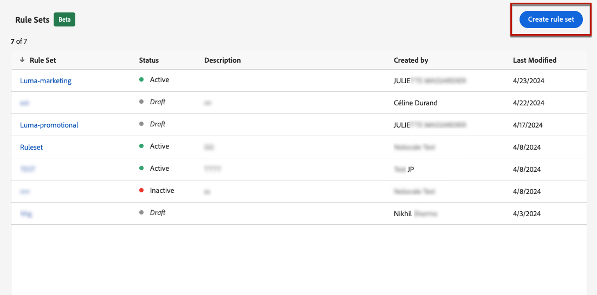
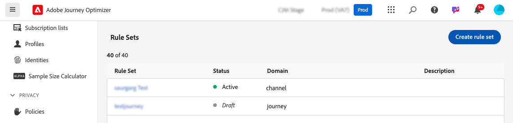
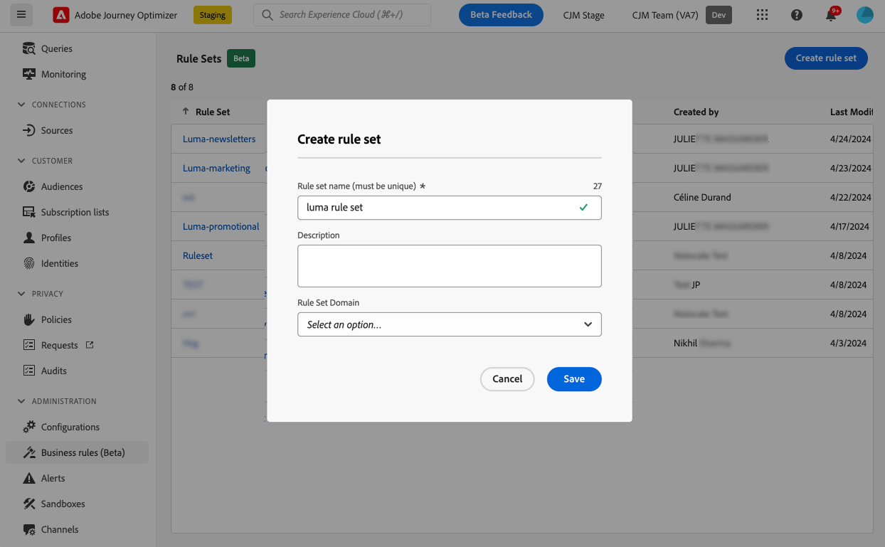
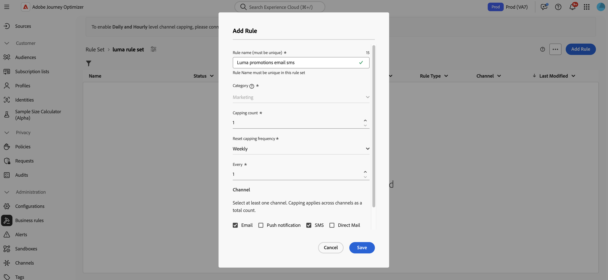
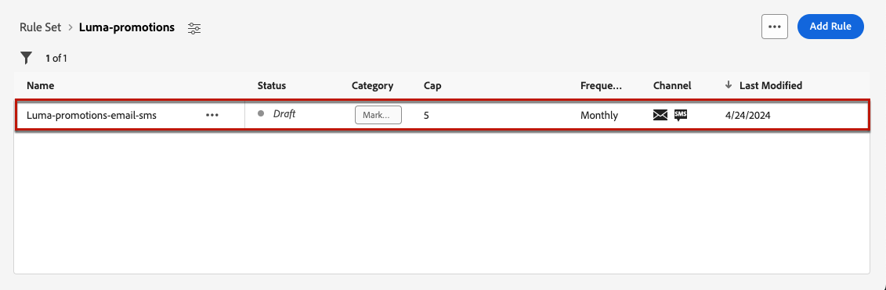
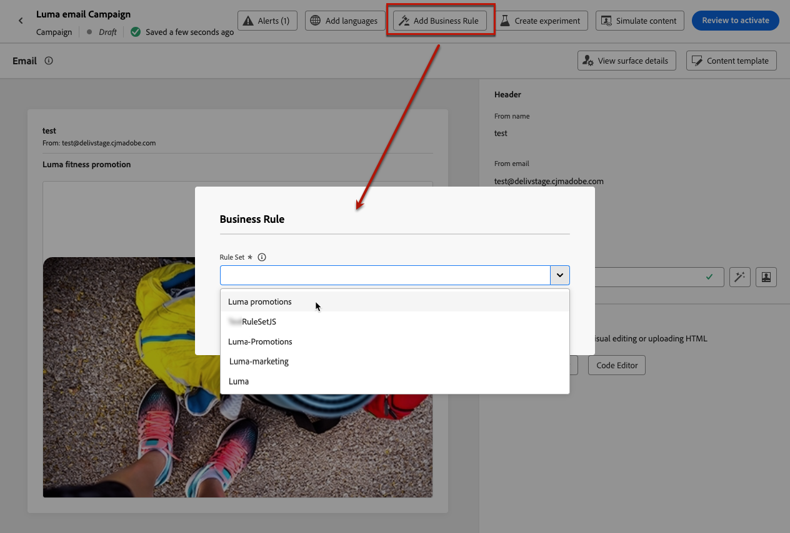
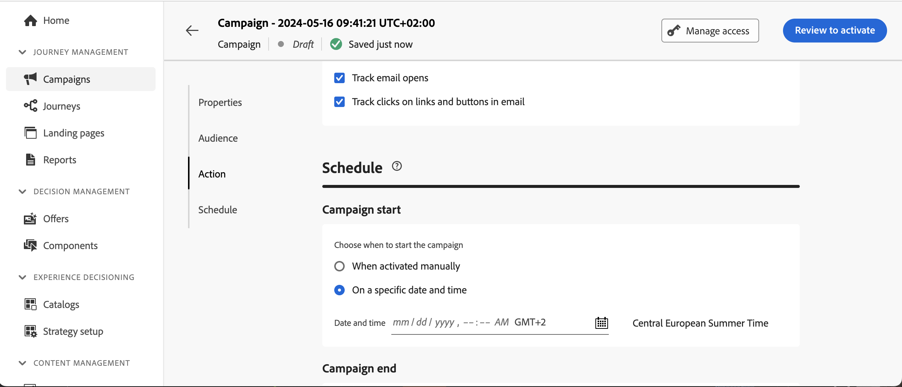

# Frequency capping by channel and communication type {#rule-sets}

**Channel** rule sets apply capping rules to communication channels. For example, do not send more than 1 email or SMS communication per day.

Leveraging channel rule sets allows you you to set frequency capping by communication type to prevent overloading customers with similar messages. For example, you can create a rule set to limit the number of **promotional communications** sent to your customers and another rule set to limit the number of **newsletters** sent to them. Depending on the type of campaign that you are creating, you can then choose to apply either the promotional communication or the newsletters rule set.

## Create a channel capping rule

>[!CONTEXTUALHELP]
>id="ajo_rule_sets_channel"
>title="Define the channel(s) the rule applies to"
>abstract="Select at least one channel. Capping applies across channels as a total count."

To create a channel rule set, follow these steps :

>[!NOTE]
>
>You can create up to 10 active local rule sets for channel domain and for the journey domain.

1. Access the **[!UICONTROL Rules sets]** list, then click **[!UICONTROL Create rule set]**.

    

1. Select the rule set where you want to add the capping rule, or create a new rule set:

    * To use an existing rule set, select it from the list. Chhanel capping rules can only be added to rule sets with the "channel" domain. You can check this information in the rule sets lists, in the **[!UICONTROL Domain]** column.

        

    * To create the capping rule inside a new rule set, click **[!UICONTROL Create rule set]**, specify a unique name for the rule set and select "Channel" from the **[!UICONTROL Rule Set Domain]** drop-down, then click **[!UICONTROL Save]**.

      

1. In the rule set screen, click the **[!UICONTROL Add Rule]** button and define a unique name for the rule.

1. The **Category** field specifies the category of message the rule applies to. For now, this field is read-only as only the **[!UICONTROL Marketing]** category is available.

   

1. From the **[!UICONTROL Duration]** drop-down list, select if you want the capping to be applied monthly, weekly or daily. Frequency cap is based on the selected calendar period. It is reset at the beginning of the corresponding time frame.

   The expiry of the counter for each period is as follows:

   * **[!UICONTROL Monthly]**: The frequency cap is valid until the last day of the month at 23:59:59 UTC. For example, the monthly expiration for January is 01-31 23:59:59 UTC.

   * **[!UICONTROL Weekly]**: The frequency cap is valid until Saturday 23:59:59 UTC of that week as the calendar week starts on Sunday. The expiry date applies regardless of when the rule was created. For example, if the rule is created on Thursday, this rule is valid until Saturday at 23:59:59.

   * **[!UICONTROL Daily]**: The daily frequency cap is valid for the day until 23:59:59 UTC and resets to 0 at the start of the next day.

      >[!CAUTION]
      > 
      >To ensure accuracy for daily frequency capping rules, make sure you choose the highest priority namespace while authoring a campaign or journey. Learn more about namespace priority in the [Platform Identity Service guide](https://experienceleague.adobe.com/en/docs/experience-platform/identity/features/identity-graph-linking-rules/namespace-priority){target="_blank"}

   Please note that the profile counter value updates once the communication is delivered. Please be cognizant of this when you are sending large volumes of communications as the throughput could result in the recipient getting the email minutes or even hours after the initiation of the communication (in the case that you are sending millions of communications simultaneously).
   
   This matters in the case that a recipient receives two communications close together. We suggest spacing communications apart by at least two hours where possible to give sufficient time for the recipient to receive the communication and the counter value to update accordingly.

1. Set the capping for your rule, meaning the maximum number of messages that can be sent to an individual user profile each month, week or day - according to your selection above.

1. Select the channel you want to use for this rule: **[!UICONTROL Email]**, **[!UICONTROL SMS]**, **[!UICONTROL Push notification]** or **[!UICONTROL Direct mail]**.

1. Select several channels if you want to apply capping across all selected channels as a total count.

   For example, set capping to 5, and select both the email and sms channels. If a profile has already received 3 marketing emails and 2 marketing sms for the selected period, this profile will be excluded from the very next delivery of any marketing email or sms.

1. Click **[!UICONTROL Save]** to confirm the rule creation. Your message is added to the rule set, with the **[!UICONTROL Draft]** status.

   

1. Repeat the steps above to add as many rules as needed to the rule set.

1. When the capping rule is ready to be applied to messages, activate the rule set and the rule where it has been added. [Learn how to activate rule sets](../conflict-prioritization/rule-sets.md#create)

## Apply rule sets to a message {#apply-frequency-rule}

To apply a rule set to a message, follow these steps:

1. When creating a journey or campaign message, select one of the channels you defined for your rule set and edit the content of your message

1. In the content edition screen, click the **[!UICONTROL Add Business Rule]** button.

1. Select the rule set you created.

   

   >[!NOTE]
   >
   >Only [activated](#activate-rule) rule sets display in the list.

   <!--Messages where the category selected is **[!UICONTROL Transactional]** will not be evaluated against business rules.-->

1. Before activating your journey or campaign, make sure you schedule its execution at least 20 minutes into the future.

   This allows for sufficient time to populate the counter values on the profile for the business rule you selected. If you activate the campaign immediately, the rule set counter values will not populate on the profiles of the recipients, and the message will not be counted toward their frequency capping rules for the custom rule sets. 

   

1. You can view the number of profiles excluded from delivery in the [Customer Journey Analytics report](../reports/report-gs-cja.md), and in the [Live report](../reports/live-report.md), where frequency rules will be listed as a possible reason for users excluded from delivery.

>[!NOTE]
>
>Several rules can apply to the same channel, but once the lower cap is reached, the profile will be excluded from the next deliveries.

When testing frequency rules, it is recommended to use a newly created [test profile](../audience/creating-test-profiles.md), because once a profile's frequency cap is reached, there is no way to reset the counter until the next period. Deactivating a rule will allow capped profiles to receive messages, but it will not remove or delete any counter increments.

<!--
## Example: combine several rules {#frequency-rule-example}

You can combine several message frequency rules, such as described in the example below.

1. [Create a rule](#create-new-rule) called *Overall Marketing Capping*:

   * Select all channels.
   * Set capping to 12 monthly.

   

1. To further restrict the number of marketing-based push notifications that a user is sent, create a second rule called *Push Marketing Cap*:

   * Select Push channel.
   * Set capping to 4 monthly.

   

1. Save and [activate](#activate-rule) the rule.

1. [Create a message](../building-journeys/journeys-message.md) for every channel you want to communicate through and select the **[!UICONTROL Marketing]** category for each message. [Learn how to apply a frequency rule](#apply-frequency-rule)

   

In this scenario, an individual profile:
* can receive up to 12 marketing messages per month;
* but will be excluded from marketing push notifications after they have received 4 push notifications.-->

## How-to video {#video}

>[!VIDEO](https://video.tv.adobe.com/v/3435531?quality=12)
