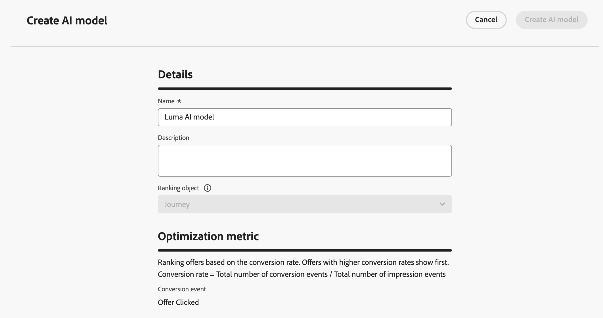
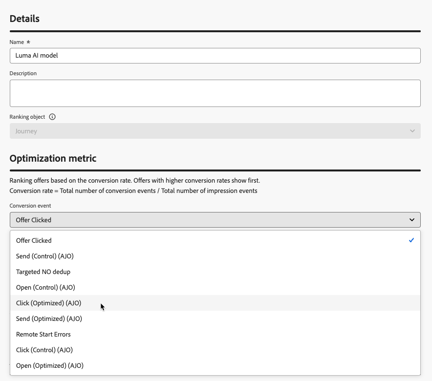
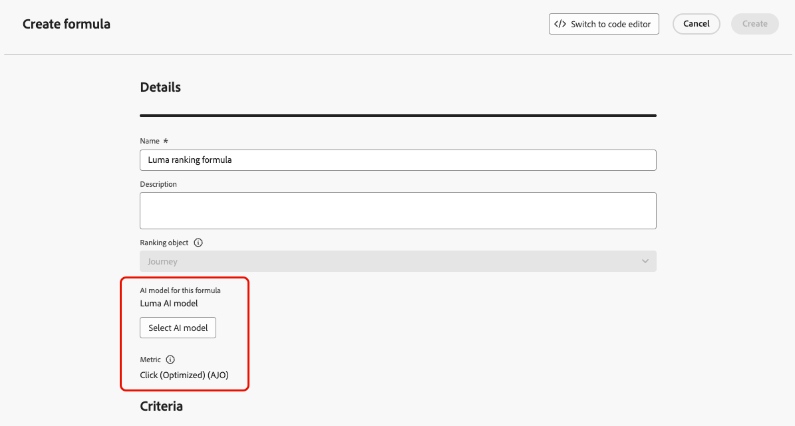

# Use AI models to rank journeys {#journey-ai-models}

>[!AVAILABILITY]
>
>This feature is currently in Limited Availability. Contact your Adobe representative to gain access.

[!DNL Adobe Journey Optimizer] helps you control which journeys a profile can enter when they qualify for more than the system allows. To do so, you can use [rule sets](rule-sets.md) to define caps on journey entry or concurrency. When a profile is eligible for more journeys than the cap allows, the priority assigned to each journey determines which journeys are selected.

Instead of using priority, you can also use **AI models** in your ranking formulas to dynamically rank journeys based on trained model scores. 

## Create an AI model {#create-ai-model}

<!--Do you need specific permissions to create AI models?
>[!CAUTION]
>
>To create, edit, or delete AI models, you must have the **Manage Ranking Strategies** permission. [Learn more](../administration/high-low-permissions.md#manage-ranking-strategies)-->

To create an AI model for journey ranking, follow the steps below.

1. Create a dataset where conversion events will be collected. [Learn how](../experience-decisioning/data-collection/create-dataset.md)

1. Access the **[!UICONTROL Orchestration ranking]** section, then select the **[!UICONTROL AI models]** tab. The list of previously created AI models is displayed.

1. Click **[!UICONTROL Create AI model]**.

1. Specify a unique name and, if needed, a description for the AI model.

    {width="85%"}

    >[!NOTE]
    >
    >The ranking object is the entity that the ranking formula will apply to. By default, the ranking object is set to **[!UICONTROL Journey]**.

<!--
1. Select the type of AI model you want to create:

    * **[!UICONTROL Auto-optimization]** optimizes based on past performance. [Learn more](../experience-decisioning/ranking/auto-optimization-model.md)
    * **[!UICONTROL Personalized optimization]** optimizes and personalizes based on audiences and performance. [Learn more](../experience-decisioning/ranking/personalized-optimization-model.md)-->

1. In the **[!UICONTROL Optimization metric]** section, all metrics from your default [!DNL Customer Journey Analytics] [data view](https://experienceleague.adobe.com/en/docs/analytics-platform/using/cja-dataviews/data-views){target="_blank"} display in the list. Select the metric that you want to optimize your model on.

    {width="70%"}

    [!DNL Journey Optimizer] ranks based on the **conversion rate** (Conversion rate = Total number of conversion events / Total number of impression events). The conversion rate is calculated using:

    * **Impression events** (items that are displayed)
    * **Conversion events** (items that result in clicks or conversions)

    These events are automatically captured using the Web SDK or the Mobile SDK. Learn more in the [Adobe Experience Platform Web SDK](https://experienceleague.adobe.com/docs/experience-platform/edge/home.html) overview.

1. Select the dataset(s) where the conversion and impression events are collected. Learn how to create such datasets in [this section](../experience-decisioning/data-collection/create-dataset.md).

    {width="85%"}

    >[!CAUTION]
    >
    >Only the datasets created from schemas associated with the **[!UICONTROL Experience Event - Proposition Interactions]** field group are displayed in the drop-down list. You can select up to 5 datasets.

1. <!--If you are creating a **[!UICONTROL Personalized optimization]** AI model, -->Select the segment(s) to use to train the AI model.

    >[!NOTE]
    >
    >You can select up to 50 audiences.

1. Save and activate the AI model.

The AI model is now available for selection when you create a ranking formula.

## Reference the AI model in a formula to rank journeys {#reference-ai-model}

You can now set the AI model as a reference to build a ranking formula, then assign the formula to a rule set and apply the rule set to your journeys. To do so, follow the steps below.

1. Create a ranking formula. [Learn how](journey-ranking-formulas.md#create-journey-ranking-formula)

1. Use the **[!UICONTROL Select AI model]** button to select the AI model you want to use in the formula.

    {width="80%"}

1. In at least one of the **[!UICONTROL Criterion]** sections, define a condition and select **[!UICONTROL AI model score]** as the ranking method. For example, if the journey has a "Promo" tag, the ranking score is the AI model score.

    {width="60%"}

1. Click **[!UICONTROL Create]** to complete your ranking formula.

1. Now create a rule set and select the formula that you created as the ranking method. [Learn how](journey-ranking-formulas.md#assign-formula-to-ruleset)

1. Create the journey capping rules and save the rule set.

1. Apply the rule set to the desired journeys and save them. [Learn how](journey-ranking-formulas.md#assign-rule-set-to-journey)

    >[!NOTE]
    >
    >Only one rule set can be applied to a journey at a time.

All journeys that use this rule set will be ranked with the formula referencing the selected AI model when the cap is applied.
