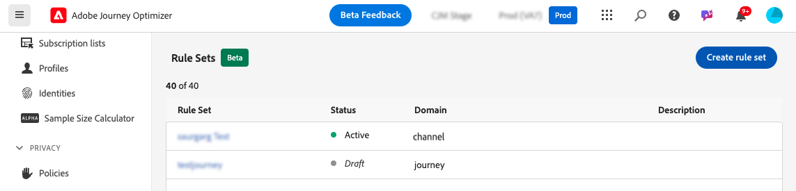
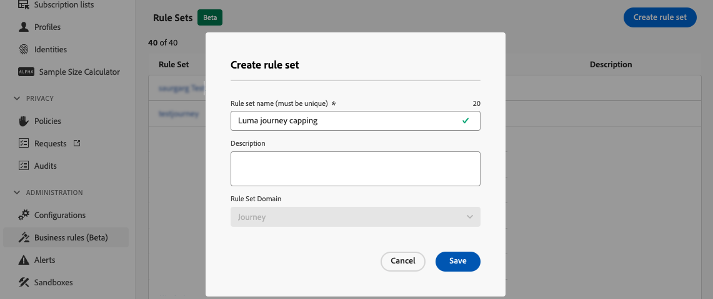
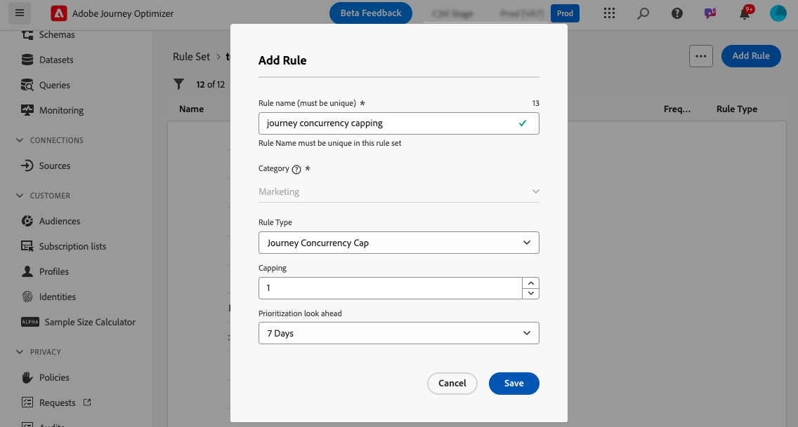
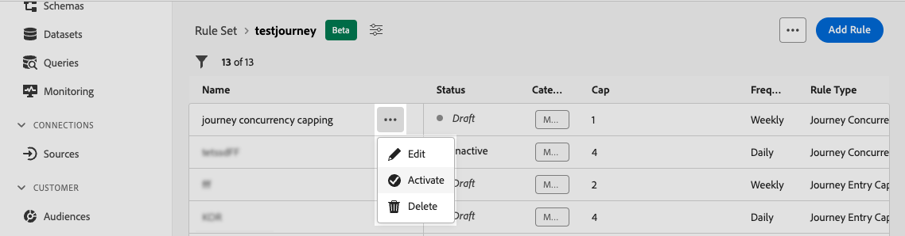
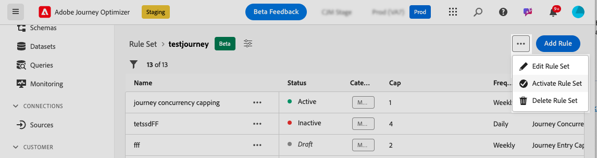

# Journey capping & arbitration {#journey-capping}

>[!AVAILABILITY]
>
>Conflict & prioritization capabilities are currently available in Limited Availability to a select group of customers. Please note that these features will be gradually rolled out to more users in the future. Reach out to your account team if interested in being added to the waitlist for these features.

Journey capping helps you limit the number of journeys a profile can be enrolled in, preventing communication overload. In Journey Optimizer, you can set two types of capping rules:

* **Entry capping** limits the number of journey entries over a given period for a profile.
* **Concurrency capping** limits how many journeys a profile can be enrolled in simultaneously.

Both types of journey capping leverage priority scores to arbitrate entries.

➡️ [Discover this feature in video](#video)

## Create a journey capping rule {#create-rule}

>[!CONTEXTUALHELP]
>id="ajo_rule_set_concurrency_prioritization"
>title="Prioritization look ahead"
>abstract=" If a higher priority journey is scheduled within the time period specified here, then the customer will be suppressed from entering this journey. For situations where you want journeys to be entered into on a first come, first serve basis we suggest choosing the Daily look ahead period and ensuring that the priority score of any other journeys on that day is less than the priority score for the journey. Providing a priority score of 100 to a journey also would ensure that it is entered into."

>[!CONTEXTUALHELP]
>id="ajo_rule_set_rule_type"
>title="Rule type"
>abstract="Specify the type of capping for the rule. **[!UICONTROL Journey Entry Cap]** limits the number of entries into the journey over a given period for a profile, while **[!UICONTROL Journey Concurrency Cap]** limits how many journeys a profile can be enrolled in simultaneously."

To create a journey capping rule, follow these steps:

1. Navigate to the **[!UICONTROL Business rules (Beta)]** menu to access the rule sets inventory.

1. Select the rule set where you want to add the capping rule, or create a new rule set:

    * To use an existing rule set, select it from the list. Journey capping rules can only be added to rule sets with the "journey" domain. You can check this information in the rule sets lists, in the **[!UICONTROL Domain]** column.

        

    * To create the capping rule inside a new rule set, click **[!UICONTROL Create rule set]**, specify a unique name for the rule set and select "Journey" from the **[!UICONTROL Rule Set Domain]** drop-down, then click **[!UICONTROL Save]**.

        

1. In the rule set screen, click the **[!UICONTROL Add Rule]** button then configure the rule to suit your needs:

    

    * Provide a unique name for the rule.

    * In the **[!UICONTROL Rule Type]** drop-down list, specify the type of capping for the rule.

        * **[!UICONTROL Journey Entry Cap]**: Limits the number of entries into the journey over a given period for a profile.
        * **[!UICONTROL Journey Concurrency Cap]**: Limits how many journeys a profile can be enrolled in simultaneously.

    * Expand the sections below to learn how to configure each type of capping:

        +++Configure a journey entry capping rule

        1. In the **[!UICONTROL Capping]** field, set the maximum number of journeys a profile can enter.
        1. In the **[!UICONTROL Duration]** field, define the time period to consider. Please note, that the duration is based on the UTC time zone. For example, the Daily cap will reset at midnight UTC.
        
        In this example, we want to restrict profiles from entering more than “5” journeys in a month.

        

        >[!NOTE]
        >
        >The system will take into consideration the priority of upcoming scheduled journeys that have this same rule applied to it.
        >
        >In this example, if the marketer has already entered 4 journeys and there is another upcoming scheduled journey this month with a higher priority, then the customers will be suppressed from entering into the lower priority journey.

        +++

        +++Configure a journey concurrency capping rule 

        1. In the **[!UICONTROL Capping]** field, set the maximum number of journeys a profile can be enrolled in simultaneously.

        1. Use the **[!UICONTROL Prioritization look ahead]** field to arbitrate journey entries based on priority scores over a chose period (e.G., 1 day, 7 days, 30 days). This helps prioritize entry into higher-value journeys if a profile is eligible to multiple journeys.

        In this example, we want to restrict profiles from entering the journey if they are already enrolled into another journey containing the same rule set. If another journey within the next 7 days has a higher priority score, the profile will not enter this journey.

        {width="50%" zommable="yes"}

        +++

1. When the capping rule is ready to be applied to journeys, activate it by clicking the ellipsis button next its name. 

    

1. Activate the entire rule set by clicking the ellipsis button next to the Add Rule button in the upper-right corner of the screen.

    

## Apply capping rules to journeys {#apply-capping}

>[!CONTEXTUALHELP]
>id="ajo_journey_capping_rule"
>title="Apply rule set to journeys"
>abstract="Apply a Rule Set to exclude this journey to part of your audience based on frequency capping rules."

To apply a capping rule to a journey, access the journey and open its properties. In the **[!UICONTROL Capping rules]** drop-down, select the relevant rule set. Once the journey is activated, the capping rules defined in the rule set will take effect. 

>[!IMPORTANT]
>
>If a journey is activated immediately, it can take up to 15 minutes for the system to begin suppressing customers. You can schedule your journey to begin at least 15 minutes into the future to prevent this possibility.

Once the journey is live, you can check in the journey report if the rule set has led to any exclusion from the journey, in the **[!UICONTROL Journey Exclusions]** table. [Learn how to work with journey reports](../reports/journey-global-report-cja.md)

## How-to video {#video}

>[!VIDEO](https://video.tv.adobe.com/v/3435530?quality=12)
