# Use formulas to rank journeys {#journey-ranking-formulas}

>[!AVAILABILITY]
>
>This feature is currently in Limited Availability. Contact your Adobe representative to gain access.

[!DNL Adobe Journey Optimizer] helps you control which journeys a profile can enter when they qualify for more than the system allows. To do so, you can use [rule sets](rule-sets.md) to define caps on journey entry or concurrency. When a profile is eligible for more journeys than the cap allows, the priority assigned to each journey determines which journeys are selected.

Instead of using priority, you can also use **ranking formulas** to dynamically adjust the ranking of journeys based on journey attributes, profile attributes, or AI model scores.

Formulas give you more flexibility than static priority. For example, you can boost a journey for gold loyalty members.

<!--
>[!NOTE]
>
>Journey ranking formulas follow the same guardrails as decisioning ranking formulas (nesting depth, rule string size). [Learn more about Decisioning guardrails & limitations](../experience-decisioning/decisioning-guardrails.md#ranking-formulas).-->

## Create a ranking formula {#create-journey-ranking-formula}

To create a ranking formula for your journeys, follow the steps below.

1. Access the **[!UICONTROL Orchestration ranking]** section, then select the **[!UICONTROL Ranking formulas]** tab. The list of previously created formulas is displayed.

1. Click **[!UICONTROL Create formula]**.

1. Specify the formula name and add a description if desired.

    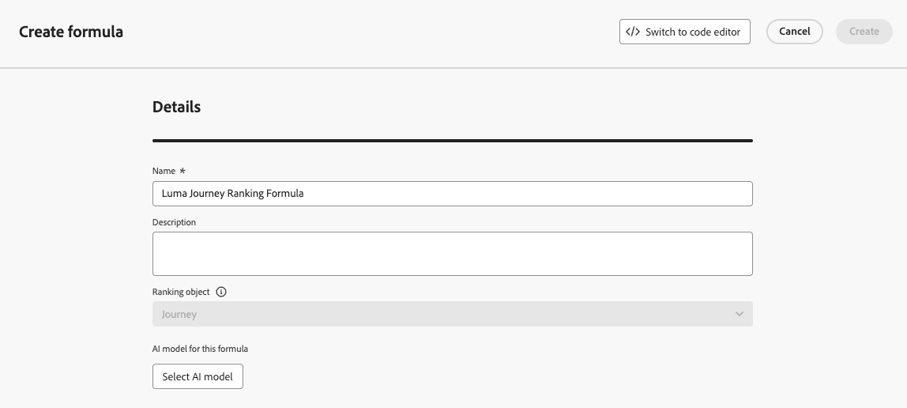{width="80%"}

    >[!NOTE]
    >
    >The ranking object is the entity that the ranking formula will apply to. By default, the ranking object is set to **[!UICONTROL Journey]**.

    <!--
    Selecting a formula entity specifies which type of item—such as journeys or other entities—the ranking formula will apply to. This determines the context in which the formula operates, allowing you to define rules that influence how those items are ranked.-->

1. Optionally, click **[!UICONTROL Select AI model]** to set the model that will be used as a reference to build your ranking formula.

<!--
    >[!NOTE]
    >
    >[Personalized optimization models](../experience-decisioning/ranking/personalized-optimization-model.md) using continuous metrics are not supported with the AI formula builder.

    Every time you refer to a model score when defining your formula below, the AI model that you selected will be used. [Learn more on AI models](../experience-decisioning/ranking/ai-models.md)-->

1. In the **[!UICONTROL Criterion 1]** section, specify which journeys you want to apply a ranking score to by doing the following:

    * select a [journey attribute](../building-journeys/journey-properties.md) (such as journey name, tags, priority, or other journey properties);
    * select a logical operator;
    * add a matching condition - you can either type/select a value, or choose a profile attribute.

    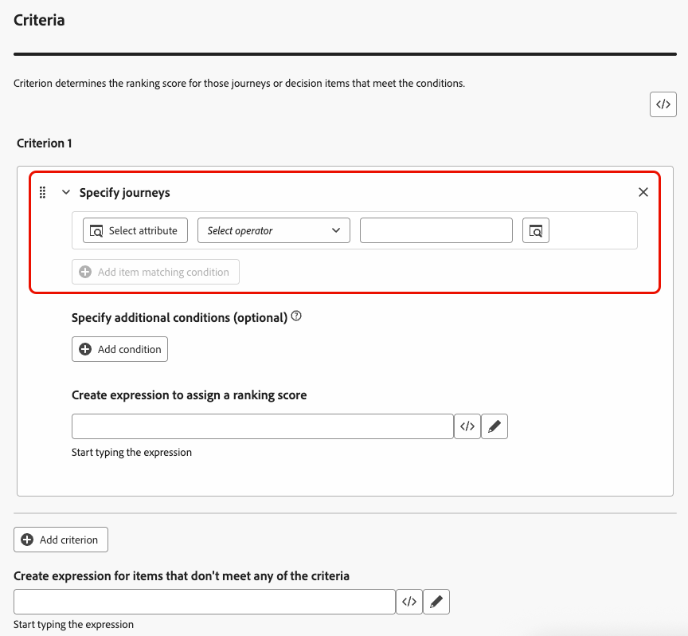{width="70%"}

1. Optionally, you can specify additional elements to refine the matching conditions for your criteria to be true.

    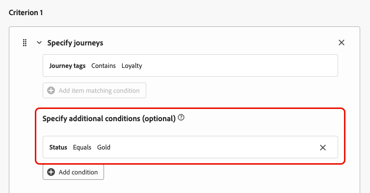{width="70%"}

    For example, you defined *Criterion 1* such as *Journey tags* contain *Loyalty*. Additionally, you can add another condition such as if the *Loyalty status* equals *Gold*, then *Criterion 1* is true.

1. Create an expression that will assign a ranking score to the journeys that meet the condition defined above. You can reference any of the following:
    * a variable:
        * the journey priority, which is a manual value assigned to the journey when [creating a journey](../building-journeys/journey-gs.md);
        * the score that came out of the AI model that you optionally selected above;
    * an attribute:
        * any attribute that might live on the profile, such as any externally derived propensity score;
        * a journey attribute;
    * a static value that you can assign in a free format;
    * a combination of all the above.

    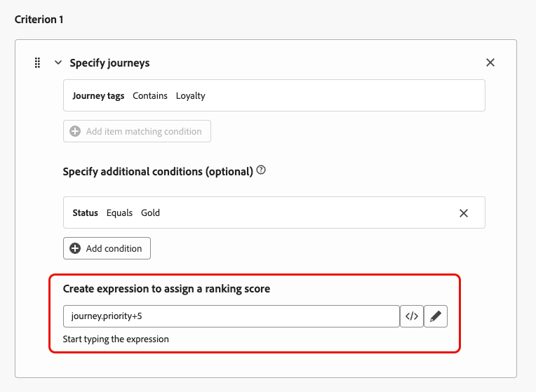{width="70%"}

1. Click **[!UICONTROL Add criterion]** to add one or more criteria as many times as needed. The logic is as follows:
    * If the first criterion is true for a given decision item, it takes precedence over the next ones.
    * If not true, the decisioning engine moves on to the second criterion, and so on.

1. Once you defined all your criteria, in the last field, you can build an expression that will be assigned to all journeys that do not meet the above criteria.

    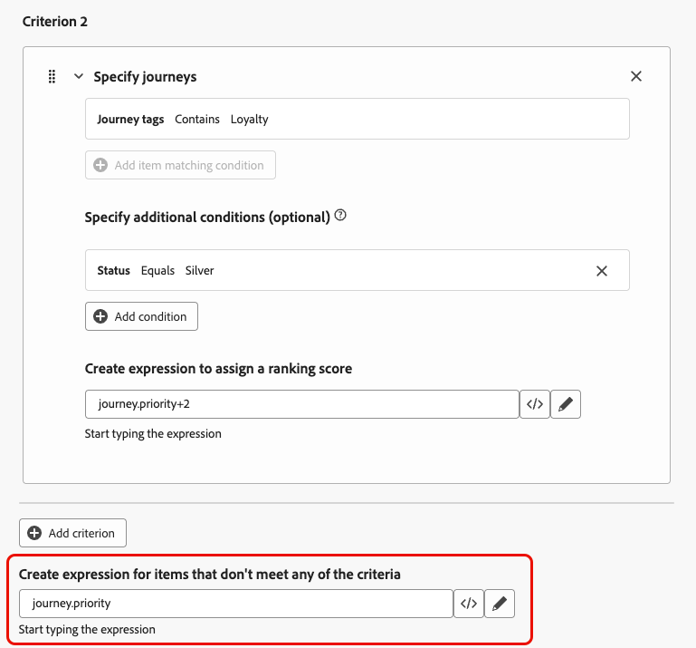{width="70%"}

1. Click **[!UICONTROL Create]** to complete your ranking formula.

You can now select this formula from the list to view its details, and edit or delete it. It is then available when you configure a rule set. [Learn how](#assign-formula-to-ruleset)

### Ranking formula examples {#journey-ranking-formula-example}

Consider the examples below.

+++Example 1: Use journey priority or AI score based on journey tags

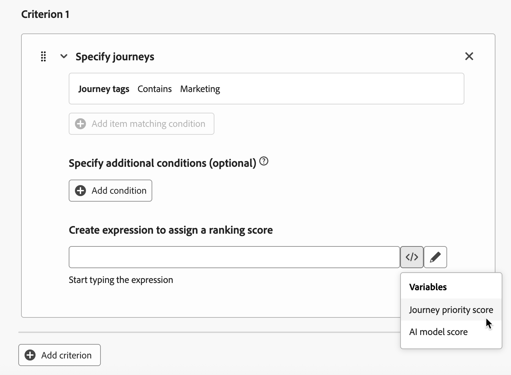{width="60%"}

If the journey has a "Marketing" tag, the ranking score is the journey priority.

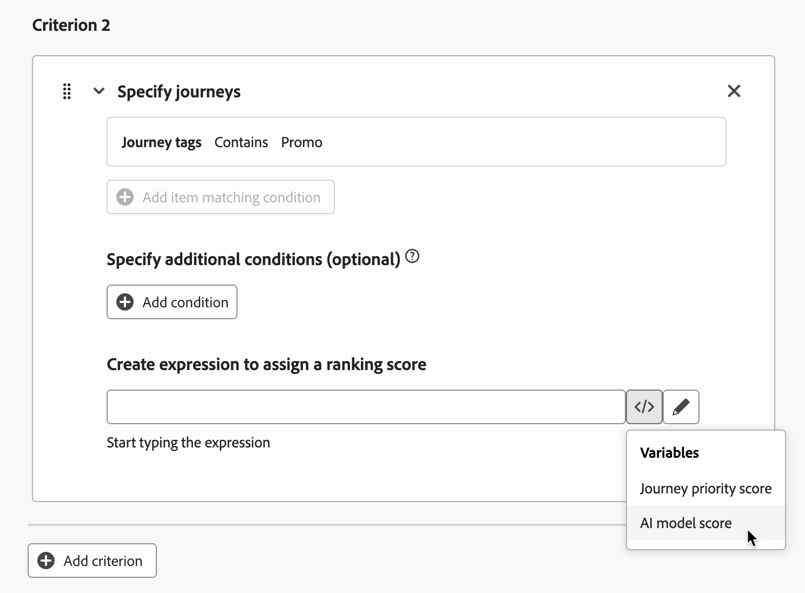{width="60%"}

If the journey has a "Promo" tag, the ranking score is the AI model score.

+++

+++Example 2: Boost loyalty journeys by profile status

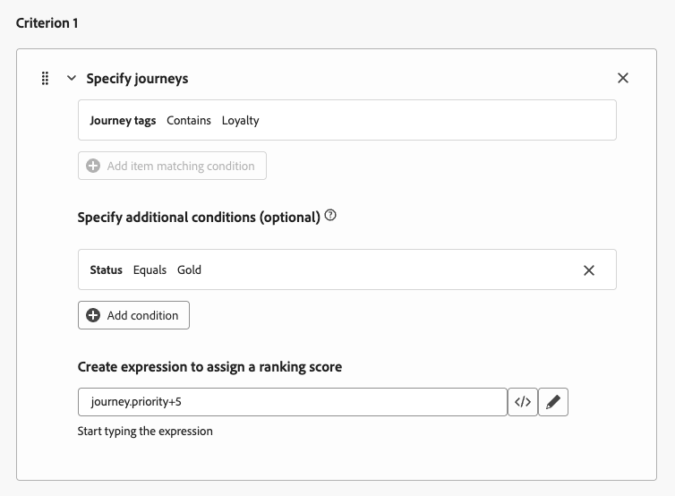{width="60%"}

If the journey has a "Loyalty" tag and the profile's loyalty status is Gold, the ranking score that is used is the journey priority plus 5.

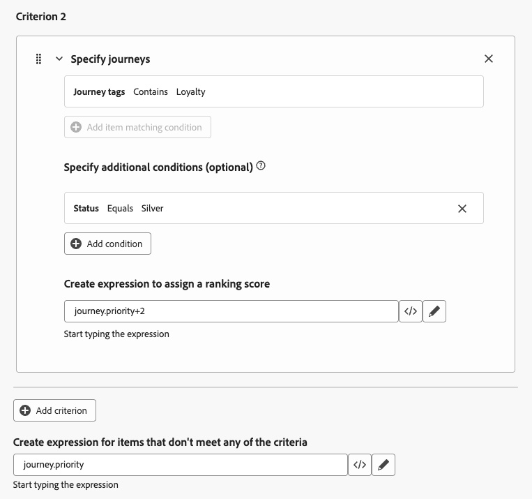{width="60%"}

If the journey has a "Loyalty" tag and the profile's loyalty status is Silver, the ranking score is the journey priority plus 2.

If none of the above conditions are met, the ranking score that is used is the journey priority.

+++

### Use the code editor {#journey-ranking-formula-code-editor}

To express ranking formulas in **PQL syntax**, switch to the code editor using the dedicated button on top right of the screen. For more on how to use the PQL syntax, refer to the [dedicated documentation](https://experienceleague.adobe.com/docs/experience-platform/segmentation/pql/overview.html).

>[!CAUTION]
>
>This action will prevent you from reverting back to the default builder view for this formula.

You can then leverage journey attributes, profile attributes, and static values to build your ranking formula.

<!--The code editor is similar to the one used in Decisioning ranking formulas. [Learn more](../experience-decisioning/ranking/ranking-formulas.md#ranking-code-editor)-->

## Assign the formula to a rule set {#assign-formula-to-ruleset}

To use a formula to rank your journeys, you need to assign it to a rule set.

>[!NOTE]
>
>Formulas are assigned at the rule set level, not on individual journeys.

1. From the **[!UICONTROL Business rules]** menu, create a rule set you want to use for journey arbitration. [Learn how](rule-sets.md#Create)

1. Make sure you select the **[!UICONTROL Journey]** domain.

     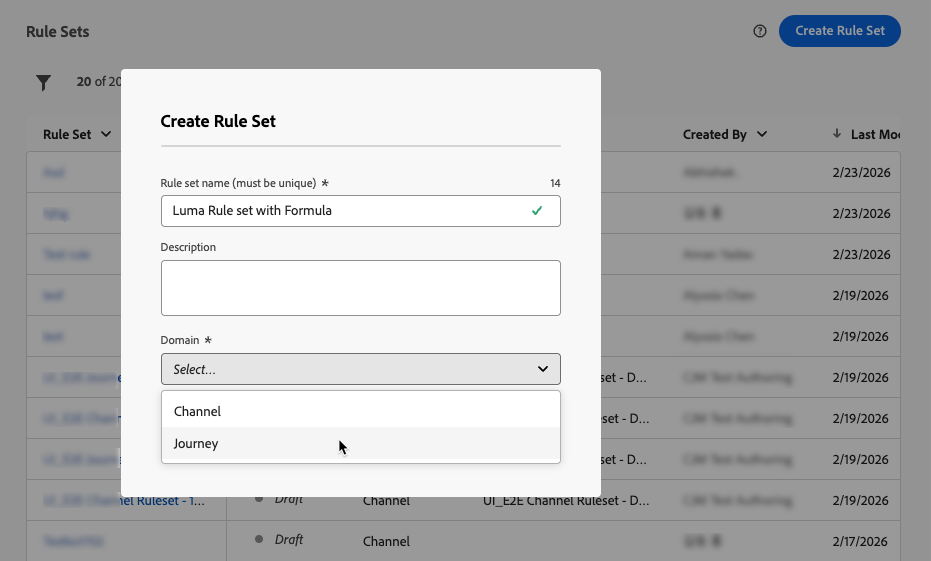{width="60%"}

1. In the rule set properties, set the **[!UICONTROL Ranking method]** to **[!UICONTROL Formula]** (instead of the default **[!UICONTROL Priority]**).

1. Select the ranking formula that you created from the drop-down list.

    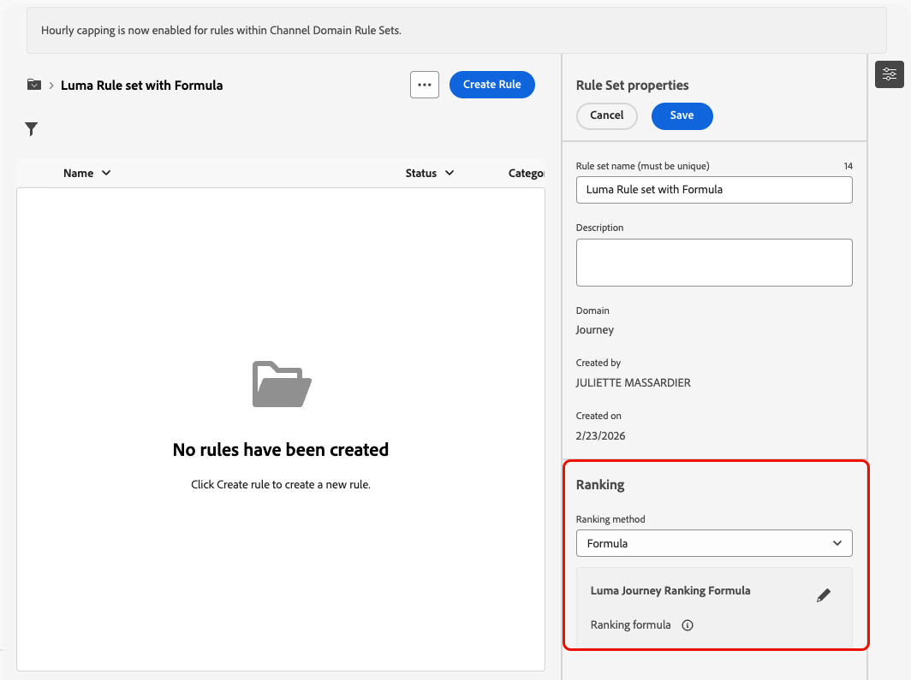{width="60%"}

1. Create the journey capping rules you want to add to the rule set. [Learn how](journey-capping.md#create-rule)

1. Save the rule set.

Now the formula is assigned to the rule set. You can then apply that rule set to your journeys.

## Apply the rule set to a journey {#assign-rule-set-to-journey}

To assign the rule set to a journey, follow the steps below.

1. Create or open the journey you want to assign the rule set to. [Learn how to create a journey](../building-journeys/journey-gs.md)

1. In the journey properties, select the rule set from the drop-down list.  [Learn how](journey-capping.md#apply-capping).

    >[!NOTE]
    >
    >Only one rule set can be applied to a journey at a time.

1. Save the journey.

All journeys that use this rule set will be ranked with the selected formula when the cap is applied.

To monitor how your rule sets and ranking formulas perform, see the [Journey Capping and Conflicts](../reports/channel-report-cja.md#rule-sets) section in the Overview report.

<!--
## Reporting {#reporting}

Reporting for journey arbitration helps you understand how rule sets and ranking formulas perform:

* **Exclusions** – Whether journeys were excluded from users and which rule set (and reason) prevented entry.
* **Rule set performance** – For each rule set, metrics such as journey enters, journey exclusions, journey engagement, and other optimization metrics.
* **Cross-journey view** – Time-based view of profiles across journeys (e.g. journey enters, failures, exclusions) to see the impact of capping and ranking.

Use these reports to validate that your formulas and caps are behaving as intended and to tune ranking logic over time.-->

