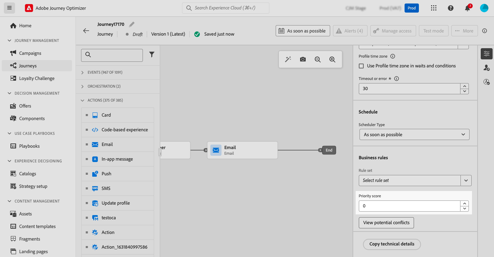
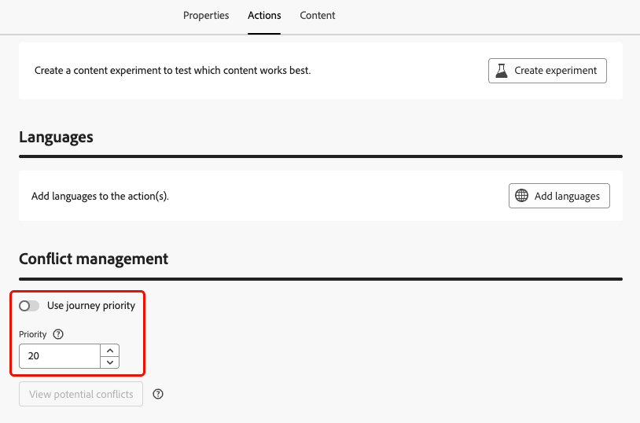

# Assign priority scores {#priority}

Journey Optimizer allows you to assign a priority score to a journey, a campaign or to an inbound channel action within the journey **[!UICONTROL Action]** activity.

Priority is essential to prioritize a journey, campaign, or action when there is an imposed constraint (such as a frequency cap).

In situations where a customer qualifies for many journeys, campaigns, or communications and you want to be selective as to which they should enter and receive, you should utilize this field.

## Assign priority scores to journeys & campaigns {#priority-journey-campaign}

>[!CONTEXTUALHELP]
>id="ajo_campaigns_campaign_priority"
>title="Priority"
>abstract="Assign a priority score to the campaign. Priority is essential to prioritize a campaign when there is an imposed constraint such as a frequency cap. Enter a numeric value (from 0-100). Please note, the higher the number, the higher the priority. For situations where two campaigns have the same priority score, the campaign which was activated first will be shown."

>[!CONTEXTUALHELP]
>id="ajo_journey_priority"
>title="Priority"
>abstract="Assign a priority score to the journey. Priority is essential to prioritize a journey when there is an imposed constraint such as a frequency cap. Enter a numeric value (from 0-100). Please note, the higher the number, the higher the priority. For situations where two journeys have the same priority score, the journey which was activated first will be shown."

➡️ [Discover this feature in video](#video)

Assigning a priority score is crucial for inbound communication such as Web, Mobile, & In-App. If you have multiple campaigns using the same channel configuration (e.g. a banner on the top of your web page), this could be problematic as only content from one campaign can feasibly be shown. The priority score is where you will insert your preference for which campaign should be shown when the recipient may qualify for more than one campaign.

>[!NOTE]
>
>In campaigns, priority score is available for the web, in-app, and code-based inbound channels only.

To assign a priority score to a journey or campaign, enter a numeric value (from 0-100) in the **[!UICONTROL Priority score]** field located in the journey or campaign properties. The higher the number, the higher the priority.

If you were authoring this campaign and wanted to make sure that this campaign content is shown, you would give it a score of 100.  

>[!IMPORTANT]
>
>If two journeys or campaigns have the same priority score, the system does not have a tie-breaking mechanism. Ensure priority scores are unique to avoid conflicts.

## Assign priority scores to inbound channel actions {#priority-action}

>[!CONTEXTUALHELP]
>id="ajo_journey_action_priority"
>title="Priority"
>abstract="Assign a priority score to the journey action. Priority is essential to prioritize an inbound action when there are multiple journey actions or campaigns using the same channel configuration. Enter a numeric value (from 0-100). Please note, the higher the number, the higher the priority. By default, the priority score for the action is inherited from the overall priority score for the journey."

Journey Optimizer also allows you to assign a priority score to inbound channel actions within the [Action](../building-journeys/journey-action.md) activity.

This allows you to prioritize an inbound action when there are multiple journey actions or campaigns using the same channel configuration.

>[!NOTE]
>
>In the **[!UICONTROL Action]** activity, priority score is available for the web, in-app, and code-based inbound channels only.

In the **[!UICONTROL Conflict management]** section, the **[!UICONTROL Use journey priority]** option is selected by default, meaning the priority score for the action is inherited from the overall priority score for the journey.

To assign a priority score to the inbound actions defined in the **[!UICONTROL Action]** activity, unselect the **[!UICONTROL Use journey priority]** option and enter a numeric value (from 0-100) in the **[!UICONTROL Priority]** field. The higher the number, the higher the priority. 

{width=70%}

## How-to video {#video}

>[!VIDEO](https://video.tv.adobe.com/v/3435529?quality=12)
